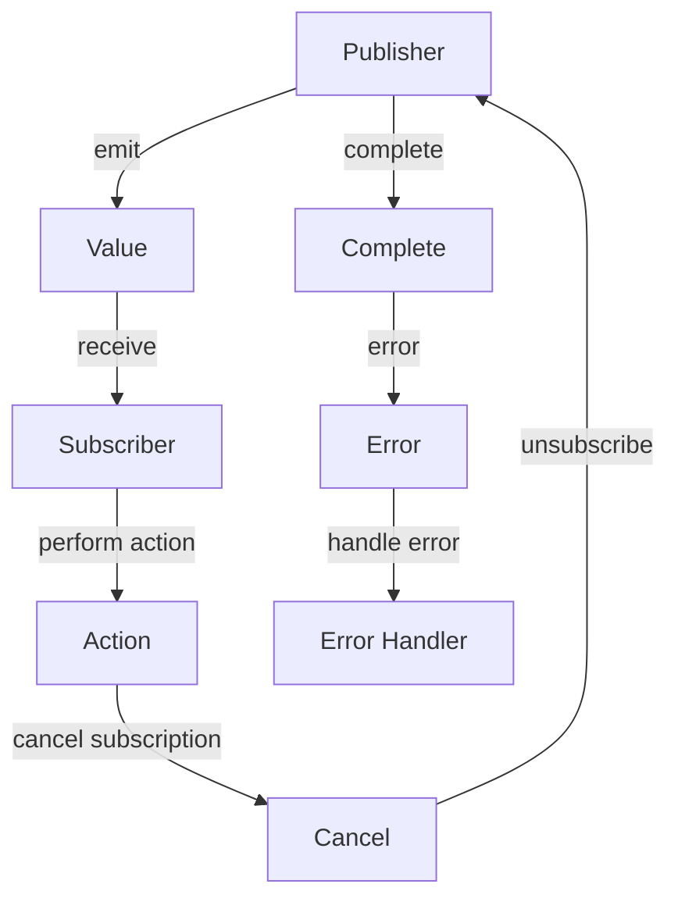

## Introduction
The **Combine** framework is a **reactive programming** framework developed by Apple for building asynchronous, event-driven systems in **Swift**. It allows developers to write more efficient, scalable, and maintainable code by handling asynchronous data streams and events in a more declarative way. With Combine, you can easily manage complex workflows, handle errors, and write more concise code.

In real-world applications, Combine is used extensively in **SwiftUI** and **Swift** projects to handle asynchronous data, such as networking requests, database queries, and user interactions. Companies like **Apple**, **Uber**, and **Airbnb** use Combine to build scalable and maintainable systems.

Every engineer should know how to use Combine to build robust, asynchronous systems. It's an essential skill for any **Swift** developer, and it's a key aspect of building modern, reactive systems.

## Core Concepts
Combine is built around several core concepts:
* **Publishers**: These are the sources of asynchronous data. They can be thought of as asynchronous sequences that emit values over time.
* **Subscribers**: These are the consumers of asynchronous data. They receive values from publishers and perform actions accordingly.
* **Operators**: These are used to transform, filter, and combine publishers. They allow you to manipulate the asynchronous data streams in various ways.
* **Schedulers**: These are used to schedule the execution of asynchronous code. They allow you to specify when and where the code should be executed.

> **Tip:** When working with Combine, it's essential to understand the concept of **backpressure**. Backpressure occurs when a subscriber is unable to keep up with the publisher's pace. Combine provides several operators, such as `sink` and `assign`, to help manage backpressure.

## How It Works Internally
When you create a publisher in Combine, you're essentially creating a asynchronous sequence that emits values over time. The publisher is responsible for managing the asynchronous data stream, and it provides a way for subscribers to receive the values.

Here's a step-by-step breakdown of how Combine works internally:
1. A publisher is created, and it starts emitting values.
2. A subscriber is created, and it subscribes to the publisher.
3. The publisher sends values to the subscriber.
4. The subscriber receives the values and performs actions accordingly.
5. The subscriber can cancel the subscription at any time.

> **Warning:** When working with Combine, it's essential to avoid **memory leaks**. Memory leaks can occur when a subscriber is not properly cancelled, and it continues to receive values from the publisher even after it's no longer needed. Combine provides several operators, such as `sink` and `assign`, to help manage memory leaks.

## Code Examples
### Example 1: Basic Usage
```swift
import Combine

// Create a publisher that emits numbers from 1 to 5
let publisher = (1...5).publisher

// Create a subscriber that prints the numbers
var cancellable: AnyCancellable?

cancellable = publisher
    .sink { number in
        print(number)
    }

// Cancel the subscription
cancellable?.cancel()
```
This example demonstrates the basic usage of Combine. It creates a publisher that emits numbers from 1 to 5 and a subscriber that prints the numbers.

### Example 2: Real-World Pattern
```swift
import Combine
import Foundation

// Create a publisher that fetches data from a URL
let url = URL(string: "https://api.github.com/users/apple")!
let publisher = URLSession.shared.dataTaskPublisher(for: url)

// Create a subscriber that prints the data
var cancellable: AnyCancellable?

cancellable = publisher
    .map(\.data)
    .decode(type: [String].self, decoder: JSONDecoder())
    .sink { data in
        print(data)
    }

// Cancel the subscription
cancellable?.cancel()
```
This example demonstrates a real-world pattern using Combine. It creates a publisher that fetches data from a URL and a subscriber that prints the data.

### Example 3: Advanced Usage
```swift
import Combine
import Foundation

// Create a publisher that emits numbers from 1 to 5
let publisher = (1...5).publisher

// Create a subscriber that prints the numbers and handles errors
var cancellable: AnyCancellable?

cancellable = publisher
    .sink { number in
        print(number)
    } onFailure: { error in
        print(error)
    }

// Cancel the subscription
cancellable?.cancel()
```
This example demonstrates an advanced usage of Combine. It creates a publisher that emits numbers from 1 to 5 and a subscriber that prints the numbers and handles errors.

## Visual Diagram

This diagram illustrates the core concept of Combine. It shows how a publisher emits values, a subscriber receives the values, and performs actions accordingly.

## Comparison
| Approach | Time Complexity | Space Complexity | Pros | Cons | Best For |
| --- | --- | --- | --- | --- | --- |
| Combine | O(n) | O(n) | Declarative, efficient, scalable | Steep learning curve | Building asynchronous, event-driven systems |
| RxSwift | O(n) | O(n) | Declarative, efficient, scalable | Steep learning curve | Building asynchronous, event-driven systems |
| Async/Await | O(n) | O(n) | Imperative, easy to learn | Less efficient, less scalable | Building simple asynchronous systems |
| Completion Handlers | O(n) | O(n) | Imperative, easy to learn | Less efficient, less scalable | Building simple asynchronous systems |

> **Interview:** When asked about the differences between Combine and RxSwift, you should mention that both are reactive programming frameworks, but Combine is specifically designed for **Swift** and **SwiftUI**, while RxSwift is a more general-purpose framework. You should also mention that Combine is more efficient and scalable than RxSwift.

## Real-world Use Cases
* **Apple**: Apple uses Combine extensively in **SwiftUI** and **Swift** projects to handle asynchronous data and build scalable systems.
* **Uber**: Uber uses Combine to build scalable and maintainable systems for handling asynchronous data and events.
* **Airbnb**: Airbnb uses Combine to build scalable and maintainable systems for handling asynchronous data and events.

## Common Pitfalls
* **Memory Leaks**: Memory leaks can occur when a subscriber is not properly cancelled, and it continues to receive values from the publisher even after it's no longer needed.
* **Backpressure**: Backpressure can occur when a subscriber is unable to keep up with the publisher's pace. This can lead to performance issues and even crashes.
* **Error Handling**: Error handling is essential when working with Combine. You should always handle errors properly to avoid crashes and unexpected behavior.
* **Subscription Management**: Subscription management is essential when working with Combine. You should always cancel subscriptions when they're no longer needed to avoid memory leaks and performance issues.

> **Warning:** When working with Combine, it's essential to avoid **common pitfalls**. You should always handle errors properly, manage subscriptions correctly, and avoid memory leaks and backpressure.

## Interview Tips
* **What is Combine?**: Combine is a reactive programming framework developed by Apple for building asynchronous, event-driven systems in **Swift**.
* **How does Combine work?**: Combine works by creating publishers that emit asynchronous data streams, and subscribers that receive the data streams and perform actions accordingly.
* **What are the benefits of using Combine?**: The benefits of using Combine include declarative, efficient, and scalable code, as well as improved error handling and subscription management.

> **Tip:** When answering interview questions about Combine, you should always mention the benefits of using Combine, such as declarative, efficient, and scalable code, as well as improved error handling and subscription management.

## Key Takeaways
* **Combine is a reactive programming framework**: Combine is a framework for building asynchronous, event-driven systems in **Swift**.
* **Publishers emit asynchronous data streams**: Publishers are the sources of asynchronous data in Combine.
* **Subscribers receive asynchronous data streams**: Subscribers are the consumers of asynchronous data in Combine.
* **Error handling is essential**: Error handling is essential when working with Combine to avoid crashes and unexpected behavior.
* **Subscription management is essential**: Subscription management is essential when working with Combine to avoid memory leaks and performance issues.
* **Combine is declarative, efficient, and scalable**: Combine is a declarative, efficient, and scalable framework for building asynchronous systems.
* **Combine is specifically designed for Swift and SwiftUI**: Combine is specifically designed for **Swift** and **SwiftUI**, making it a great choice for building modern, reactive systems.