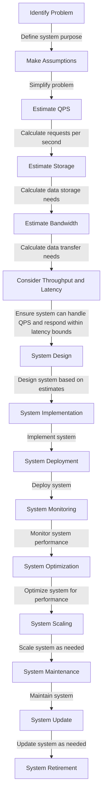

## Introduction
**Back-of-the-envelope estimation** is a crucial skill for system designers and engineers. It involves making rough estimates of system requirements, such as **QPS (Queries Per Second)**, **storage**, and **bandwidth**, based on high-level assumptions and simplifications. This skill is essential for designing and scaling systems that meet performance and capacity requirements. In this section, we will explore the importance of back-of-the-envelope estimation, its real-world relevance, and why every engineer needs to know this.

> **Note:** Back-of-the-envelope estimation is not about making precise calculations, but rather about making informed decisions based on rough estimates.

## Core Concepts
To understand back-of-the-envelope estimation, we need to define some key terms:
* **QPS (Queries Per Second)**: the number of requests or queries a system receives per second.
* **Storage**: the amount of data a system needs to store.
* **Bandwidth**: the amount of data a system can transfer per unit of time.
* **Throughput**: the number of requests a system can process per unit of time.
* **Latency**: the time it takes for a system to respond to a request.

> **Warning:** Failing to consider these factors can lead to system overload, performance issues, and even crashes.

## How It Works Internally
When estimating system requirements, we need to consider the following steps:
1. **Identify the problem**: define the system's purpose and functionality.
2. **Make assumptions**: simplify the problem by making assumptions about user behavior, data distribution, and system usage.
3. **Estimate QPS**: calculate the number of requests the system will receive per second.
4. **Estimate storage**: calculate the amount of data the system needs to store.
5. **Estimate bandwidth**: calculate the amount of data the system can transfer per unit of time.
6. **Consider throughput and latency**: ensure the system can handle the estimated QPS and respond within acceptable latency bounds.

## Code Examples
### Example 1: Basic QPS Estimation
```python
def estimate_qps(users, requests_per_user, time_interval):
    """
    Estimate QPS based on user count, requests per user, and time interval.
    """
    qps = (users * requests_per_user) / time_interval
    return qps

users = 1000
requests_per_user = 10
time_interval = 60  # seconds

qps = estimate_qps(users, requests_per_user, time_interval)
print(f"Estimated QPS: {qps:.2f}")
```
### Example 2: Storage Estimation
```python
def estimate_storage(data_size, data_retention_period):
    """
    Estimate storage requirements based on data size and retention period.
    """
    storage = data_size * data_retention_period
    return storage

data_size = 100  # GB
data_retention_period = 30  # days

storage = estimate_storage(data_size, data_retention_period)
print(f"Estimated storage: {storage:.2f} GB")
```
### Example 3: Bandwidth Estimation
```python
def estimate_bandwidth(data_size, transfer_time):
    """
    Estimate bandwidth requirements based on data size and transfer time.
    """
    bandwidth = data_size / transfer_time
    return bandwidth

data_size = 1000  # GB
transfer_time = 60  # minutes

bandwidth = estimate_bandwidth(data_size, transfer_time)
print(f"Estimated bandwidth: {bandwidth:.2f} GB/min")
```

## Visual Diagram

The diagram illustrates the system design process, from problem identification to system retirement, highlighting the importance of back-of-the-envelope estimation in each stage.

## Comparison
| Approach | Time Complexity | Space Complexity | Pros | Cons | Best For |
| --- | --- | --- | --- | --- | --- |
| **Detailed Estimation** | O(n) | O(n) | Accurate estimates, considers all factors | Time-consuming, complex | Large-scale systems, critical applications |
| **Back-of-the-Envelope Estimation** | O(1) | O(1) | Quick estimates, simple to calculate | Less accurate, assumes simplifications | Small-scale systems, rough estimates |
| **Rule-of-Thumb Estimation** | O(1) | O(1) | Quick estimates, based on experience | Less accurate, may not consider all factors | Small-scale systems, rough estimates |
| **Simulation-Based Estimation** | O(n) | O(n) | Accurate estimates, considers all factors | Computationally intensive, requires simulation tools | Large-scale systems, critical applications |

## Real-world Use Cases
1. **Google's Search Engine**: Google uses back-of-the-envelope estimation to estimate the number of searches per second and design their search engine accordingly.
2. **Amazon's E-commerce Platform**: Amazon uses back-of-the-envelope estimation to estimate the number of orders per second and design their e-commerce platform to handle the load.
3. **Facebook's Social Network**: Facebook uses back-of-the-envelope estimation to estimate the number of user interactions per second and design their social network to handle the load.

## Common Pitfalls
1. **Underestimating QPS**: failing to consider peak usage periods or sudden spikes in traffic.
2. **Overestimating Storage**: failing to consider data compression or deduplication.
3. **Ignoring Throughput and Latency**: failing to consider the impact of QPS and storage on system performance.
4. **Not Considering Scalability**: failing to design the system to scale with increasing demand.

## Interview Tips
1. **QPS Estimation**: be prepared to estimate QPS based on user count, requests per user, and time interval.
2. **Storage Estimation**: be prepared to estimate storage requirements based on data size and retention period.
3. **Bandwidth Estimation**: be prepared to estimate bandwidth requirements based on data size and transfer time.

> **Interview:** When asked to estimate QPS, storage, or bandwidth, remember to make assumptions, simplify the problem, and calculate the estimates based on the given parameters.

## Key Takeaways
* **Back-of-the-envelope estimation** is a crucial skill for system designers and engineers.
* **QPS**, **storage**, and **bandwidth** are key factors to consider when designing a system.
* **Throughput and latency** are essential considerations for system performance.
* **Scalability** is critical for systems with increasing demand.
* **Assumptions and simplifications** are necessary for back-of-the-envelope estimation.
* **Simulation-based estimation** can provide more accurate estimates, but is computationally intensive.
* **Rule-of-thumb estimation** can provide quick estimates, but may not consider all factors.
* **Detailed estimation** can provide accurate estimates, but is time-consuming and complex.