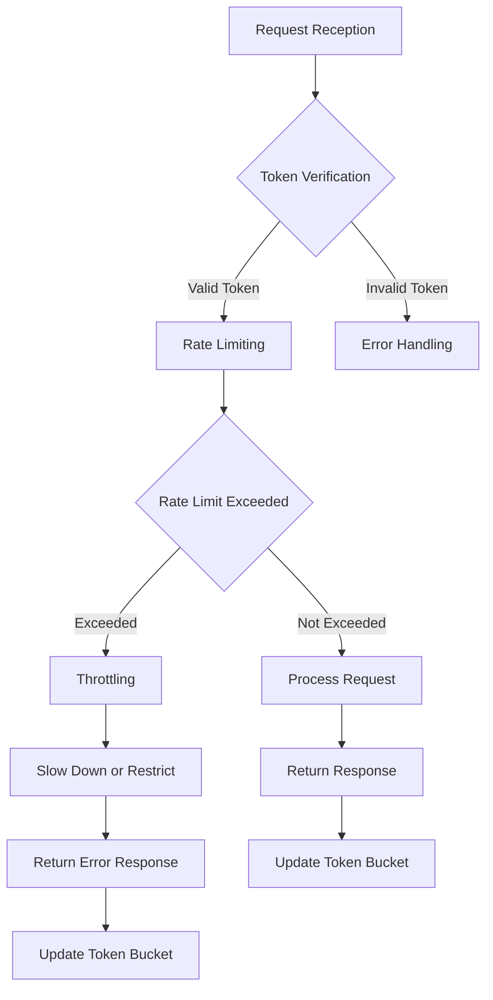

## Introduction
**Rate Limiting** and **Throttling** are essential techniques used to control the amount of traffic or requests that a system can handle. They help prevent abuse, denial-of-service (DoS) attacks, and ensure that the system remains stable and responsive under heavy loads. In this section, we will explore the importance of rate limiting and throttling, and how they are used in real-world applications.

> **Note:** Rate limiting and throttling are often used interchangeably, but they have slightly different meanings. Rate limiting refers to the process of limiting the number of requests that can be made within a certain time frame, while throttling refers to the process of slowing down or restricting the rate at which requests are processed.

## Core Concepts
To understand rate limiting and throttling, it's essential to grasp the following core concepts:

* **Request**: A request is a single unit of work that is sent to a system, such as an HTTP request or a database query.
* **Rate**: The rate at which requests are made, typically measured in requests per second (RPS) or requests per minute (RPM).
* **Limit**: The maximum number of requests that can be made within a certain time frame.
* **Window**: The time frame over which the rate is measured, such as a second, minute, or hour.
* **Token Bucket**: A data structure used to implement rate limiting, where tokens are added to a bucket at a constant rate, and each request consumes one token.

> **Tip:** When designing a rate limiting system, it's essential to consider the trade-off between security and usability. A system that is too restrictive may prevent legitimate users from accessing the system, while a system that is too permissive may be vulnerable to abuse.

## How It Works Internally
The internal mechanics of rate limiting and throttling involve the following steps:

1. **Request Reception**: The system receives a request and checks if it has a valid token.
2. **Token Verification**: The system verifies the token by checking if it is valid and if the request is within the allowed rate limit.
3. **Rate Limiting**: If the request is within the allowed rate limit, the system processes the request and updates the token bucket.
4. **Throttling**: If the request exceeds the allowed rate limit, the system slows down or restricts the processing of the request.
5. **Error Handling**: If the request is invalid or exceeds the allowed rate limit, the system returns an error response.

> **Warning:** Implementing rate limiting and throttling can be complex, and incorrect implementations can lead to security vulnerabilities or performance issues. It's essential to carefully consider the design and implementation of these techniques.

## Code Examples
### Example 1: Basic Token Bucket Implementation (Python)
```python
import time

class TokenBucket:
    def __init__(self, rate, capacity):
        self.rate = rate
        self.capacity = capacity
        self.tokens = capacity
        self.last_update = time.time()

    def consume(self, amount=1):
        current_time = time.time()
        elapsed_time = current_time - self.last_update
        self.last_update = current_time
        self.tokens = min(self.capacity, self.tokens + elapsed_time * self.rate)
        if self.tokens >= amount:
            self.tokens -= amount
            return True
        return False

# Create a token bucket with a rate of 5 tokens per second and a capacity of 10 tokens
token_bucket = TokenBucket(5, 10)

# Consume 1 token
print(token_bucket.consume())  # Output: True

# Consume 10 tokens
print(token_bucket.consume(10))  # Output: False
```
### Example 2: Real-World Rate Limiting Example (Node.js)
```javascript
const express = require('express');
const app = express();

const rateLimit = require('express-rate-limit');

const limiter = rateLimit({
    windowMs: 15 * 60 * 1000, // 15 minutes
    max: 100 // limit each IP to 100 requests per windowMs
});

app.use(limiter);

app.get('/api/data', (req, res) => {
    res.send('Hello World!');
});

app.listen(3000, () => {
    console.log('Server listening on port 3000');
});
```
### Example 3: Advanced Throttling Example (Go)
```go
package main

import (
    "fmt"
    "time"
)

type Throttler struct {
    rate    int
    tokens  int
    lastUpdate time.Time
}

func NewThrottler(rate int) *Throttler {
    return &Throttler{
        rate:    rate,
        tokens:  rate,
        lastUpdate: time.Now(),
    }
}

func (t *Throttler) Allow() bool {
    current := time.Now()
    elapsed := current.Sub(t.lastUpdate)
    t.lastUpdate = current
    t.tokens = min(t.rate, t.tokens+int(elapsed.Seconds()*float64(t.rate)))
    if t.tokens >= 1 {
        t.tokens--
        return true
    }
    return false
}

func main() {
    throttler := NewThrottler(5)

    for i := 0; i < 10; i++ {
        if throttler.Allow() {
            fmt.Println("Allowed")
        } else {
            fmt.Println("Not Allowed")
        }
        time.Sleep(100 * time.Millisecond)
    }
}
```
## Visual Diagram

The diagram illustrates the rate limiting and throttling process, from request reception to token verification, rate limiting, and throttling.

## Comparison
| Approach | Time Complexity | Space Complexity | Pros | Cons | Best For |
|----------|----------------|-----------------|------|------|----------|
| Token Bucket | O(1) | O(1) | Simple, efficient | Limited flexibility | Real-time systems |
| Leaky Bucket | O(1) | O(1) | Simple, efficient | Limited flexibility | Real-time systems |
| Fixed Window | O(n) | O(n) | Simple, easy to implement | Inflexible, prone to bursts | Simple systems |
| Sliding Window | O(n) | O(n) | Flexible, efficient | Complex, prone to errors | Complex systems |

## Real-world Use Cases
* **Google**: Google uses rate limiting to prevent abuse of its APIs and services.
* **Amazon Web Services (AWS)**: AWS uses throttling to limit the number of requests that can be made to its services.
* **Twitter**: Twitter uses rate limiting to prevent spam and abuse of its platform.

## Common Pitfalls
* **Incorrect Token Bucket Implementation**: Implementing a token bucket algorithm incorrectly can lead to security vulnerabilities or performance issues.
* **Insufficient Rate Limiting**: Insufficient rate limiting can lead to abuse or denial-of-service (DoS) attacks.
* **Inflexible Throttling**: Inflexible throttling can lead to performance issues or user frustration.
* **Lack of Monitoring**: Lack of monitoring can lead to undetected security vulnerabilities or performance issues.

## Interview Tips
* **What is rate limiting, and how does it differ from throttling?**: A strong answer should explain the difference between rate limiting and throttling, and provide examples of how they are used in real-world applications.
* **How would you implement a token bucket algorithm?**: A strong answer should provide a detailed explanation of the token bucket algorithm, including the data structures and algorithms used.
* **What are some common pitfalls when implementing rate limiting and throttling?**: A strong answer should identify common pitfalls, such as incorrect token bucket implementation, insufficient rate limiting, and inflexible throttling.

## Key Takeaways
* **Rate limiting and throttling are essential techniques for controlling traffic and preventing abuse**: Rate limiting and throttling are used to prevent abuse, denial-of-service (DoS) attacks, and ensure that the system remains stable and responsive under heavy loads.
* **Token bucket algorithm is a simple and efficient way to implement rate limiting**: The token bucket algorithm is a simple and efficient way to implement rate limiting, but it requires careful consideration of the data structures and algorithms used.
* **Throttling can be used to slow down or restrict the processing of requests**: Throttling can be used to slow down or restrict the processing of requests, but it requires careful consideration of the trade-off between security and usability.
* **Monitoring and logging are essential for detecting security vulnerabilities and performance issues**: Monitoring and logging are essential for detecting security vulnerabilities and performance issues, and for ensuring that the system remains stable and responsive under heavy loads.
* **Rate limiting and throttling should be flexible and adaptable to changing system conditions**: Rate limiting and throttling should be flexible and adaptable to changing system conditions, such as changes in traffic patterns or system resources.