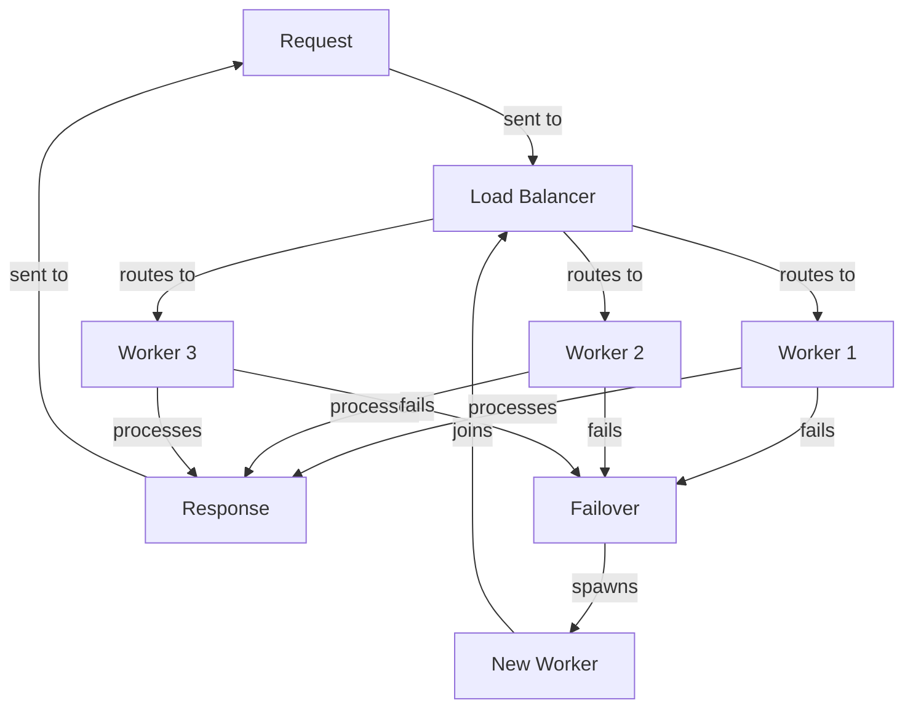

## Introduction
Reliability in systems design refers to the ability of a system to perform its intended functions correctly, even when faced with failures, errors, or unexpected conditions. This is a critical aspect of system design, as it directly impacts the user experience, system uptime, and overall business success. In real-world scenarios, reliability is crucial in systems such as e-commerce platforms, financial transactions, and critical infrastructure. For instance, a reliable payment processing system ensures that transactions are processed correctly, even in the event of network failures or server crashes. Every engineer should understand the principles of reliability, as it is essential for designing and building robust, fault-tolerant systems.

## Core Concepts
To understand reliability, we need to grasp some key concepts:
- **Fault Tolerance**: The ability of a system to continue functioning even when one or more components fail.
- **High Availability**: The ability of a system to maintain a high level of uptime and responsiveness, even in the presence of failures.
- **Redundancy**: The use of duplicate components or systems to ensure that if one fails, the other can take over.
- **Failover**: The process of automatically switching to a redundant system or component in the event of a failure.
- **Error Detection and Correction**: Mechanisms for detecting and correcting errors, such as checksums, error-correcting codes, and retries.

> **Note:** Reliability is not just about preventing failures, but also about detecting and recovering from them quickly and efficiently.

## How It Works Internally
Reliability in systems is achieved through a combination of design principles, mechanisms, and techniques. Here's a step-by-step breakdown:
1. **Design for Failure**: Anticipate potential failure points and design the system to handle them.
2. **Implement Redundancy**: Use duplicate components or systems to ensure that if one fails, the other can take over.
3. **Detect Errors**: Use mechanisms such as checksums, error-correcting codes, and retries to detect errors.
4. **Correct Errors**: Use mechanisms such as error-correcting codes, retries, and failover to correct errors.
5. **Test and Validate**: Thoroughly test and validate the system to ensure that it works correctly even in the presence of failures.

## Code Examples
### Example 1: Basic Retry Mechanism (Python)
```python
import time
import random

def retry(func, max_attempts=3, delay=1):
    attempts = 0
    while attempts < max_attempts:
        try:
            return func()
        except Exception as e:
            print(f"Attempt {attempts+1} failed: {e}")
            attempts += 1
            time.sleep(delay)
    raise Exception("All attempts failed")

def simulate_failure():
    if random.random() < 0.5:
        raise Exception("Simulated failure")
    return "Success"

print(retry(simulate_failure))
```
This example demonstrates a basic retry mechanism, where the `retry` function calls the `simulate_failure` function up to 3 times, with a 1-second delay between attempts.

### Example 2: Load Balancing with Failover (Node.js)
```javascript
const http = require('http');
const cluster = require('cluster');

const workers = [];
const numWorkers = 4;

for (let i = 0; i < numWorkers; i++) {
    const worker = cluster.fork();
    workers.push(worker);
}

http.createServer((req, res) => {
    const worker = workers.shift();
    worker.send({ request: req, response: res });
    workers.push(worker);
}).listen(3000, () => {
    console.log('Server listening on port 3000');
});

cluster.on('exit', (worker) => {
    console.log(`Worker ${worker.id} died`);
    const newWorker = cluster.fork();
    workers.push(newWorker);
});
```
This example demonstrates load balancing with failover, where multiple worker processes handle incoming requests. If a worker dies, a new one is spawned to replace it.

### Example 3: Distributed Locking with Redundancy (Go)
```go
package main

import (
    "context"
    "fmt"
    "log"
    "sync"

    "github.com/etcd-io/etcd/clientv3"
)

type distributedLock struct {
    client *clientv3.Client
    mutex  sync.Mutex
}

func (dl *distributedLock) lock(ctx context.Context, key string) error {
    dl.mutex.Lock()
    defer dl.mutex.Unlock()
    return dl.client.Put(ctx, key, "locked")
}

func (dl *distributedLock) unlock(ctx context.Context, key string) error {
    dl.mutex.Lock()
    defer dl.mutex.Unlock()
    return dl.client.Delete(ctx, key)
}

func main() {
    client, err := clientv3.New(clientv3.Config{
        Endpoints: []string{"http://localhost:2379"},
    })
    if err != nil {
        log.Fatal(err)
    }
    dl := &distributedLock{client: client}
    ctx := context.Background()
    if err := dl.lock(ctx, "my_lock"); err != nil {
        log.Fatal(err)
    }
    fmt.Println("Acquired lock")
    if err := dl.unlock(ctx, "my_lock"); err != nil {
        log.Fatal(err)
    }
    fmt.Println("Released lock")
}
```
This example demonstrates distributed locking with redundancy, where a distributed lock is used to synchronize access to a shared resource.

## Visual Diagram

This diagram illustrates a load balancing system with failover, where incoming requests are routed to available workers. If a worker fails, a new one is spawned to replace it.

## Comparison
| Approach | Time Complexity | Space Complexity | Pros | Cons | Best For |
| --- | --- | --- | --- | --- | --- |
| Retry Mechanism | O(n) | O(1) | Simple to implement, effective for transient failures | May not work for persistent failures | I/O-bound operations |
| Load Balancing | O(1) | O(n) | Scalable, fault-tolerant | Complex to implement, requires multiple servers | High-traffic web applications |
| Distributed Locking | O(log n) | O(n) | Provides strong consistency, suitable for distributed systems | May have high overhead, requires careful configuration | Distributed databases, file systems |

## Real-world Use Cases
1. **Netflix**: Uses a combination of load balancing, caching, and content delivery networks to ensure high availability and low latency for its streaming services.
2. **Amazon Web Services**: Provides a range of reliability features, including load balancing, auto-scaling, and failover, to ensure high availability and fault tolerance for its cloud-based services.
3. **Google**: Uses a distributed locking system to synchronize access to its distributed databases and file systems.

> **Tip:** When designing a reliability system, consider using a combination of approaches to achieve high availability and fault tolerance.

## Common Pitfalls
1. **Insufficient Testing**: Failing to thoroughly test a system for reliability can lead to unexpected failures and downtime.
2. **Inadequate Monitoring**: Not monitoring a system for performance and errors can make it difficult to detect and respond to failures.
3. **Lack of Redundancy**: Not providing sufficient redundancy can lead to single points of failure and increased downtime.
4. **Inadequate Error Handling**: Not handling errors correctly can lead to cascading failures and increased downtime.

> **Warning:** Failing to consider reliability when designing a system can lead to significant downtime and revenue loss.

## Interview Tips
1. **What is the difference between fault tolerance and high availability?**: A weak answer might confuse the two concepts, while a strong answer would clearly explain the difference and provide examples.
2. **How would you design a reliability system for a web application?**: A weak answer might focus on a single approach, while a strong answer would discuss a combination of load balancing, caching, and content delivery networks.
3. **What are some common pitfalls when designing a reliability system?**: A weak answer might not consider the importance of testing, monitoring, and redundancy, while a strong answer would discuss these factors and provide examples.

## Key Takeaways
* Reliability is critical for system design, as it directly impacts user experience and business success.
* A combination of approaches, including retry mechanisms, load balancing, and distributed locking, can achieve high availability and fault tolerance.
* Insufficient testing, inadequate monitoring, lack of redundancy, and inadequate error handling are common pitfalls when designing a reliability system.
* Time complexity and space complexity are important considerations when evaluating reliability approaches.
* Real-world examples, such as Netflix and Amazon Web Services, demonstrate the importance of reliability in system design.
* When designing a reliability system, consider using a combination of approaches and carefully evaluate the trade-offs between different options.