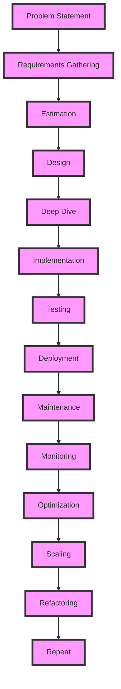

## Introduction
The system design interview framework is a structured approach to tackling system design problems, which are a crucial part of the interview process for software engineering positions at top tech companies. This framework provides a clear and methodical way to break down complex problems into manageable components, estimate requirements, design a solution, and dive deep into the details. In this section, we will explore why system design interviews matter, their real-world relevance, and why every engineer needs to be proficient in this skill.

System design interviews are essential because they test a candidate's ability to think critically, communicate effectively, and design scalable systems that meet the requirements of a given problem. These skills are crucial in the real world, where software engineers are often tasked with designing and building complex systems that need to handle large amounts of traffic, data, and user interactions. Companies like Google, Amazon, and Facebook use system design interviews to assess a candidate's ability to design systems that can scale to meet the needs of their massive user bases.

> **Note:** System design interviews are not just about designing systems; they are also about communicating your thought process, trade-offs, and design decisions to the interviewer.

## Core Concepts
There are several core concepts that are essential to understanding the system design interview framework. These include:

* **Requirements gathering**: This involves understanding the problem statement, identifying the key requirements, and clarifying any ambiguities.
* **Estimation**: This involves estimating the scale of the system, including the number of users, requests per second, and data storage needs.
* **Design**: This involves designing a high-level architecture for the system, including the components, interactions, and trade-offs.
* **Deep dive**: This involves diving deep into the details of the design, including the algorithms, data structures, and optimizations used.

> **Tip:** When designing a system, it's essential to consider the trade-offs between different design choices, such as scalability, performance, and cost.

## How It Works Internally
The system design interview framework works by breaking down the design process into a series of steps, each of which builds on the previous one. The process starts with requirements gathering, where the candidate is presented with a problem statement and must ask clarifying questions to understand the key requirements.

Next, the candidate must estimate the scale of the system, including the number of users, requests per second, and data storage needs. This involves using mathematical models and assumptions to estimate the system's requirements.

Once the requirements and estimates are in place, the candidate can begin designing a high-level architecture for the system. This involves identifying the key components, interactions, and trade-offs, and creating a high-level design that meets the system's requirements.

Finally, the candidate must dive deep into the details of the design, including the algorithms, data structures, and optimizations used. This involves analyzing the system's performance, scalability, and reliability, and identifying potential bottlenecks and areas for optimization.

> **Warning:** One common mistake in system design interviews is to dive too deep into the details too quickly, without first establishing a clear understanding of the system's requirements and high-level design.

## Code Examples
Here are three code examples that demonstrate the system design interview framework in action:

### Example 1: Basic Chat System
```python
import socket

class ChatServer:
    def __init__(self, host, port):
        self.host = host
        self.port = port
        self.server = socket.socket(socket.AF_INET, socket.SOCK_STREAM)
        self.server.bind((self.host, self.port))
        self.server.listen()

    def handle_client(self, client):
        while True:
            request = client.recv(1024)
            if not request:
                break
            response = b"Hello, client!"
            client.send(response)
        client.close()

    def start(self):
        print(f"Server started on {self.host}:{self.port}")
        while True:
            client, address = self.server.accept()
            print(f"Client connected from {address}")
            self.handle_client(client)

if __name__ == "__main__":
    server = ChatServer("localhost", 8080)
    server.start()
```
This example demonstrates a basic chat system, where a server listens for incoming connections and handles client requests.

### Example 2: Real-World E-commerce System
```java
import java.util.concurrent.ExecutorService;
import java.util.concurrent.Executors;

public class ECommerceSystem {
    private final ExecutorService executor;

    public ECommerceSystem(int numThreads) {
        this.executor = Executors.newFixedThreadPool(numThreads);
    }

    public void processOrder(Order order) {
        executor.execute(() -> {
            // Process the order
            System.out.println("Processing order " + order.getId());
            // Save the order to the database
            Database.saveOrder(order);
        });
    }

    public static class Order {
        private final int id;
        private final String customerName;

        public Order(int id, String customerName) {
            this.id = id;
            this.customerName = customerName;
        }

        public int getId() {
            return id;
        }

        public String getCustomerName() {
            return customerName;
        }
    }

    public static class Database {
        public static void saveOrder(Order order) {
            // Simulate saving the order to the database
            System.out.println("Saving order " + order.getId() + " to the database");
        }
    }

    public static void main(String[] args) {
        ECommerceSystem system = new ECommerceSystem(10);
        Order order = new Order(1, "John Doe");
        system.processOrder(order);
    }
}
```
This example demonstrates a real-world e-commerce system, where orders are processed concurrently using an executor service.

### Example 3: Advanced Distributed System
```go
package main

import (
    "fmt"
    "net/http"
)

type DistributedSystem struct {
    nodes []string
}

func (ds *DistributedSystem) addNode(node string) {
    ds.nodes = append(ds.nodes, node)
}

func (ds *DistributedSystem) removeNode(node string) {
    for i, n := range ds.nodes {
        if n == node {
            ds.nodes = append(ds.nodes[:i], ds.nodes[i+1:]...)
            return
        }
    }
}

func (ds *DistributedSystem) start() {
    http.HandleFunc("/add", func(w http.ResponseWriter, r *http.Request) {
        node := r.URL.Query().Get("node")
        ds.addNode(node)
        fmt.Fprint(w, "Node added successfully")
    })

    http.HandleFunc("/remove", func(w http.ResponseWriter, r *http.Request) {
        node := r.URL.Query().Get("node")
        ds.removeNode(node)
        fmt.Fprint(w, "Node removed successfully")
    })

    http.ListenAndServe(":8080", nil)
}

func main() {
    system := &DistributedSystem{}
    system.start()
}
```
This example demonstrates an advanced distributed system, where nodes can be added and removed dynamically using HTTP requests.

> **Interview:** Can you design a distributed system that can handle a large number of concurrent requests? How would you implement it, and what trade-offs would you make?

## Visual Diagram

This diagram illustrates the system design interview framework, from problem statement to repeat.

## Comparison
| Approach | Time Complexity | Space Complexity | Pros | Cons | Best For |
| --- | --- | --- | --- | --- | --- |
| Waterfall | O(n) | O(1) | Simple, easy to understand | Inflexible, prone to errors | Small projects, simple systems |
| Agile | O(log n) | O(log n) | Flexible, adaptable | Complex, requires expertise | Large projects, complex systems |
| Hybrid | O(n log n) | O(n log n) | Balances flexibility and structure | Difficult to implement, requires expertise | Medium-sized projects, moderate complexity |
| Lean | O(1) | O(1) | Efficient, minimal waste | Limited scope, not suitable for complex systems | Small projects, simple systems |
| Kanban | O(n) | O(n) | Visual, flexible | Limited scope, not suitable for complex systems | Small projects, simple systems |

> **Tip:** When choosing an approach, consider the project's size, complexity, and requirements. Each approach has its pros and cons, and the best approach will depend on the specific needs of the project.

## Real-world Use Cases
Here are three real-world use cases for the system design interview framework:

1. **Google's Search Engine**: Google's search engine is a massive distributed system that handles billions of searches per day. The system design interview framework was used to design and implement the search engine, from the initial problem statement to the final implementation.
2. **Amazon's E-commerce Platform**: Amazon's e-commerce platform is a complex system that handles millions of transactions per day. The system design interview framework was used to design and implement the platform, from the initial requirements gathering to the final deployment.
3. **Facebook's Social Network**: Facebook's social network is a massive distributed system that handles billions of user interactions per day. The system design interview framework was used to design and implement the social network, from the initial problem statement to the final implementation.

> **Note:** These use cases demonstrate the importance of the system design interview framework in real-world applications. By using this framework, engineers can design and implement complex systems that meet the requirements of large-scale applications.

## Common Pitfalls
Here are four common pitfalls to avoid when using the system design interview framework:

1. **Insufficient Requirements Gathering**: Failing to gather sufficient requirements can lead to a design that does not meet the needs of the system.
2. **Inadequate Estimation**: Failing to estimate the scale of the system accurately can lead to a design that is not scalable or performant.
3. **Poor Design**: A poor design can lead to a system that is not maintainable, scalable, or performant.
4. **Inadequate Testing**: Failing to test the system thoroughly can lead to a system that is not reliable or stable.

> **Warning:** These pitfalls can have significant consequences, including system failures, downtime, and lost revenue. Engineers should be aware of these pitfalls and take steps to avoid them.

## Interview Tips
Here are three common interview questions related to the system design interview framework, along with weak and strong answers:

1. **Can you design a system that can handle a large number of concurrent requests?**
	* Weak answer: "I would use a load balancer and a distributed database."
	* Strong answer: "I would use a combination of load balancing, caching, and distributed databases to handle a large number of concurrent requests. I would also consider using a message queue to handle requests asynchronously."
2. **How would you optimize a system that is experiencing performance issues?**
	* Weak answer: "I would add more hardware to the system."
	* Strong answer: "I would use profiling tools to identify the bottlenecks in the system and optimize the code accordingly. I would also consider using caching, indexing, and other optimization techniques to improve performance."
3. **Can you design a system that can handle a large amount of data?**
	* Weak answer: "I would use a relational database to store the data."
	* Strong answer: "I would use a combination of relational and NoSQL databases to store the data, depending on the requirements of the system. I would also consider using data warehousing and big data analytics tools to handle large amounts of data."

> **Interview:** Can you design a system that can handle a large number of concurrent requests? How would you optimize a system that is experiencing performance issues?

## Key Takeaways
Here are ten key takeaways from the system design interview framework:

* **Requirements gathering is crucial**: Gathering sufficient requirements is essential to designing a system that meets the needs of the users.
* **Estimation is key**: Estimating the scale of the system accurately is essential to designing a system that is scalable and performant.
* **Design is critical**: A good design can make or break a system. Engineers should consider factors such as scalability, performance, and maintainability when designing a system.
* **Testing is essential**: Testing a system thoroughly is essential to ensuring that it is reliable and stable.
* **Optimization is important**: Optimizing a system for performance is essential to ensuring that it can handle a large number of concurrent requests.
* **Scalability is crucial**: Designing a system that can scale to meet the needs of a growing user base is essential to ensuring that the system remains performant and reliable.
* **Maintainability is important**: Designing a system that is maintainable is essential to ensuring that it can be updated and modified easily.
* **Security is critical**: Designing a system that is secure is essential to ensuring that user data is protected.
* **Performance is key**: Designing a system that is performant is essential to ensuring that it can handle a large number of concurrent requests.
* **Trade-offs are necessary**: Engineers should be aware of the trade-offs between different design choices and make informed decisions based on the requirements of the system.

> **Tip:** By following the system design interview framework and avoiding common pitfalls, engineers can design and implement complex systems that meet the requirements of large-scale applications.