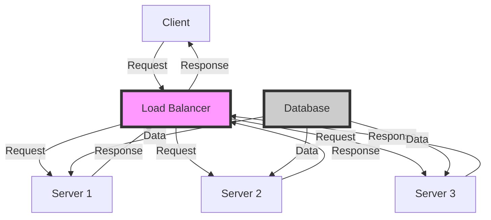

## Introduction
System design is the process of defining the architecture, components, and interactions of a system to meet specific requirements and constraints. It involves a deep understanding of the problem domain, the stakeholders' needs, and the technical capabilities of the system. System design is crucial in software development as it enables the creation of scalable, reliable, and maintainable systems that can adapt to changing requirements and user needs. In real-world scenarios, system design is applied in various domains, such as e-commerce, finance, healthcare, and social media, where complex systems are built to handle large volumes of data, traffic, and user interactions.

## Core Concepts
System design involves several core concepts, including:
* **Scalability**: the ability of a system to handle increased load and traffic without compromising performance.
* **Reliability**: the ability of a system to maintain its functionality and performance over time, even in the presence of failures or errors.
* **Maintainability**: the ability of a system to be easily modified, updated, or repaired without affecting its overall functionality.
* **Availability**: the ability of a system to be accessible and usable by users at all times.
* **Performance**: the ability of a system to respond quickly and efficiently to user requests.

> **Tip:** When designing a system, it's essential to consider the trade-offs between these core concepts, as optimizing one aspect may compromise another.

## How It Works Internally
System design involves a step-by-step process that includes:
1. **Requirements gathering**: identifying the functional and non-functional requirements of the system.
2. **System architecture**: defining the overall structure and organization of the system.
3. **Component design**: designing the individual components of the system, such as databases, APIs, and user interfaces.
4. **Integration**: integrating the components to form a cohesive system.
5. **Testing and validation**: testing the system to ensure it meets the requirements and works as expected.

> **Warning:** A common mistake in system design is to overlook the importance of testing and validation, which can lead to systems that are prone to errors and failures.

## Code Examples
### Example 1: Basic System Design
```python
import os
import time

class System:
    def __init__(self):
        self.load = 0
        self.response_time = 0

    def handle_request(self):
        # Simulate request handling
        time.sleep(0.1)
        self.load += 1
        self.response_time += 0.1

    def get_load(self):
        return self.load

    def get_response_time(self):
        return self.response_time

system = System()
for i in range(10):
    system.handle_request()
print(f"Load: {system.get_load()}")
print(f"Response Time: {system.get_response_time()}")
```
This example demonstrates a basic system design that handles requests and tracks the load and response time.

### Example 2: Scalable System Design
```java
import java.util.concurrent.ExecutorService;
import java.util.concurrent.Executors;

public class ScalableSystem {
    private ExecutorService executor;

    public ScalableSystem(int numThreads) {
        executor = Executors.newFixedThreadPool(numThreads);
    }

    public void handleRequest() {
        // Simulate request handling
        Runnable task = () -> {
            try {
                Thread.sleep(100);
            } catch (InterruptedException e) {
                Thread.currentThread().interrupt();
            }
        };
        executor.execute(task);
    }

    public void shutdown() {
        executor.shutdown();
    }

    public static void main(String[] args) {
        ScalableSystem system = new ScalableSystem(5);
        for (int i = 0; i < 10; i++) {
            system.handleRequest();
        }
        system.shutdown();
    }
}
```
This example demonstrates a scalable system design that uses a thread pool to handle requests concurrently.

### Example 3: Distributed System Design
```python
import socket
import threading

class DistributedSystem:
    def __init__(self, num_nodes):
        self.nodes = []
        for i in range(num_nodes):
            node = socket.socket(socket.AF_INET, socket.SOCK_STREAM)
            node.connect(("localhost", 8080 + i))
            self.nodes.append(node)

    def handle_request(self, node_index):
        # Simulate request handling
        request = b"Hello, world!"
        self.nodes[node_index].sendall(request)
        response = self.nodes[node_index].recv(1024)
        print(f"Response from node {node_index}: {response}")

    def start(self):
        threads = []
        for i in range(len(self.nodes)):
            thread = threading.Thread(target=self.handle_request, args=(i,))
            threads.append(thread)
            thread.start()
        for thread in threads:
            thread.join()

    def shutdown(self):
        for node in self.nodes:
            node.close()

distributed_system = DistributedSystem(3)
distributed_system.start()
distributed_system.shutdown()
```
This example demonstrates a distributed system design that uses multiple nodes to handle requests concurrently.

## Visual Diagram

This diagram illustrates a distributed system design with a load balancer, multiple servers, and a database.

> **Note:** The load balancer distributes incoming requests across multiple servers to ensure scalability and reliability.

## Comparison
| Approach | Time Complexity | Space Complexity | Pros | Cons | Best For |
| --- | --- | --- | --- | --- | --- |
| Monolithic Architecture | O(1) | O(1) | Simple, easy to develop | Limited scalability, tight coupling | Small-scale applications |
| Microservices Architecture | O(n) | O(n) | Scalable, flexible, loose coupling | Complex, difficult to manage | Large-scale applications |
| Event-Driven Architecture | O(1) | O(1) | Scalable, flexible, decoupled | Complex, difficult to debug | Real-time systems |
| Service-Oriented Architecture | O(n) | O(n) | Scalable, flexible, reusable | Complex, difficult to integrate | Enterprise systems |

> **Interview:** What are the trade-offs between monolithic and microservices architectures?

## Real-world Use Cases
1. **Netflix**: uses a microservices architecture to handle large volumes of user traffic and provide personalized recommendations.
2. **Amazon**: uses a service-oriented architecture to integrate its various services, such as product search, order management, and payment processing.
3. **Google**: uses an event-driven architecture to handle real-time search queries and provide instant results.

> **Tip:** When designing a system, consider the specific requirements and constraints of the problem domain and choose the most suitable architecture.

## Common Pitfalls
1. **Tight coupling**: when components are too closely tied together, making it difficult to modify or replace one component without affecting others.
2. **Inadequate testing**: when the system is not thoroughly tested, leading to errors and failures in production.
3. **Insufficient scalability**: when the system is not designed to handle increased load or traffic, leading to performance issues.
4. **Poor maintainability**: when the system is not designed to be easily modified or updated, leading to technical debt.

> **Warning:** Avoiding these common pitfalls requires careful planning, design, and testing to ensure a scalable, reliable, and maintainable system.

## Interview Tips
1. **System design interview**: be prepared to design a system from scratch, considering scalability, reliability, and maintainability.
2. **Behavioral interview**: be prepared to answer behavioral questions, such as "Tell me about a time when you had to design a system under tight deadlines."
3. **Technical interview**: be prepared to answer technical questions, such as "What is the difference between a monolithic and microservices architecture?"

> **Note:** Practice whiteboarding exercises to improve your system design skills and prepare for technical interviews.

## Key Takeaways
* System design is a crucial aspect of software development that involves defining the architecture, components, and interactions of a system.
* Scalability, reliability, and maintainability are key considerations in system design.
* Different architectures, such as monolithic, microservices, event-driven, and service-oriented, have their pros and cons and are suited for different problem domains.
* Avoid common pitfalls, such as tight coupling, inadequate testing, insufficient scalability, and poor maintainability.
* Practice system design and prepare for technical interviews to improve your skills and knowledge.