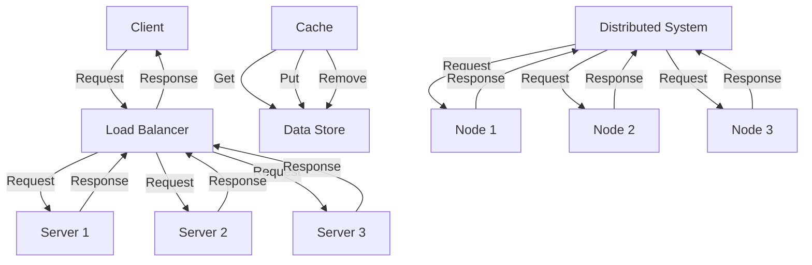

## Introduction
**System design** is the process of defining the architecture, components, and interactions of a complex system to meet specific requirements and constraints. It involves a deep understanding of the problem domain, the ability to analyze trade-offs, and the skill to make informed decisions about the system's structure and behavior. In the real world, system design is crucial for building scalable, maintainable, and efficient systems that can handle large volumes of data and user traffic. Every engineer needs to know about system design because it is a critical aspect of software development, and poor design decisions can lead to performance issues, reliability problems, and increased maintenance costs.

## Core Concepts
At its core, system design is about making deliberate decisions about the system's **architecture**, **components**, and **interactions**. Key terminology includes:
* **Scalability**: the ability of a system to handle increased load without compromising performance
* **Availability**: the ability of a system to be operational and accessible when needed
* **Latency**: the time it takes for a system to respond to a request
* **Throughput**: the rate at which a system can process requests
Mental models for system design include thinking about the system as a **pipeline**, where data flows through a series of stages, and considering the **bottlenecks** that can limit the system's performance.

## How It Works Internally
When designing a system, engineers need to consider the **underlying infrastructure**, including the **network**, **storage**, and **compute resources**. The system's **components** need to be designed to work together seamlessly, using **interfaces** and **protocols** to communicate with each other. The system's **data flow** needs to be carefully managed, using **queues**, **caches**, and **databases** to store and retrieve data. The system's **control flow** needs to be designed to handle **errors**, **exceptions**, and **failures**, using **retry mechanisms**, **fallbacks**, and **rollbacks**.

## Code Examples
### Example 1: Basic Load Balancer
```python
import socket
import threading

class LoadBalancer:
    def __init__(self, servers):
        self.servers = servers
        self.current_server = 0

    def get_server(self):
        server = self.servers[self.current_server]
        self.current_server = (self.current_server + 1) % len(self.servers)
        return server

# Create a load balancer with 3 servers
load_balancer = LoadBalancer(["server1", "server2", "server3"])

# Create a client that sends requests to the load balancer
def client(load_balancer):
    while True:
        server = load_balancer.get_server()
        # Send a request to the selected server
        print(f"Sending request to {server}")

# Create 10 client threads
threads = []
for _ in range(10):
    thread = threading.Thread(target=client, args=(load_balancer,))
    threads.append(thread)
    thread.start()

# Wait for all threads to finish
for thread in threads:
    thread.join()
```
This example demonstrates a basic load balancer that distributes incoming requests across a pool of servers.

### Example 2: Real-world Cache Implementation
```java
import java.util.concurrent.ConcurrentHashMap;
import java.util.concurrent.ConcurrentMap;

public class Cache {
    private final ConcurrentMap<String, String> cache;

    public Cache() {
        this.cache = new ConcurrentHashMap<>();
    }

    public void put(String key, String value) {
        cache.put(key, value);
    }

    public String get(String key) {
        return cache.get(key);
    }

    public void remove(String key) {
        cache.remove(key);
    }
}

// Create a cache instance
Cache cache = new Cache();

// Put some data into the cache
cache.put("key1", "value1");
cache.put("key2", "value2");

// Get data from the cache
String value = cache.get("key1");
System.out.println(value); // prints "value1"
```
This example demonstrates a real-world cache implementation using a concurrent hash map.

### Example 3: Advanced Distributed System
```go
package main

import (
    "fmt"
    "net/http"
)

// Define a struct to represent a node in the distributed system
type Node struct {
    ID   string
    Port int
}

// Define a function to handle incoming requests
func handleRequest(w http.ResponseWriter, r *http.Request) {
    // Get the node ID from the request
    nodeID := r.Header.Get("Node-ID")

    // Find the node with the matching ID
    node := findNode(nodeID)

    // If the node is found, forward the request to it
    if node != nil {
        // Create a new request to the node
        req, err := http.NewRequest("GET", fmt.Sprintf("http://%s:%d", node.ID, node.Port), nil)
        if err != nil {
            http.Error(w, err.Error(), http.StatusInternalServerError)
            return
        }

        // Forward the request to the node
        resp, err := http.DefaultClient.Do(req)
        if err != nil {
            http.Error(w, err.Error(), http.StatusInternalServerError)
            return
        }

        // Return the response to the client
        w.WriteHeader(resp.StatusCode)
        w.Write([]byte(resp.Status))
    } else {
        http.Error(w, "Node not found", http.StatusNotFound)
    }
}

func main() {
    http.HandleFunc("/", handleRequest)
    http.ListenAndServe(":8080", nil)
}
```
This example demonstrates an advanced distributed system where incoming requests are forwarded to a node in the system based on the node ID.

## Visual Diagram

This diagram illustrates the flow of requests and responses in a load balancer, cache, and distributed system.

## Comparison
| Approach | Time Complexity | Space Complexity | Pros | Cons | Best For |
| --- | --- | --- | --- | --- | --- |
| Load Balancer | O(1) | O(n) | Scalable, fault-tolerant | Complex to implement | Large-scale web applications |
| Cache | O(1) | O(n) | Fast, reduces latency | Can be expensive | Real-time systems, high-traffic websites |
| Distributed System | O(n) | O(n) | Scalable, fault-tolerant | Complex to implement, high overhead | Large-scale data processing, machine learning |

## Real-world Use Cases
* **Netflix**: uses a distributed system to stream videos to millions of users worldwide
* **Google**: uses a load balancer to distribute incoming search requests across a large cluster of servers
* **Amazon**: uses a cache to improve the performance of its e-commerce platform

## Common Pitfalls
* **Not considering scalability**: designing a system that cannot handle increased load can lead to performance issues and downtime
* **Not implementing fault tolerance**: designing a system that cannot recover from failures can lead to data loss and downtime
* **Not optimizing for latency**: designing a system that has high latency can lead to poor user experience and decreased engagement
* **Not considering security**: designing a system that is not secure can lead to data breaches and other security vulnerabilities

## Interview Tips
* **Be prepared to design a system from scratch**: interviewers want to see your thought process and ability to think critically about system design
* **Know your trade-offs**: be able to explain the pros and cons of different design decisions and trade-offs
* **Use diagrams and visual aids**: use diagrams to help explain your design decisions and make it easier for the interviewer to understand your thought process
* **Practice, practice, practice**: practice designing systems and explaining your design decisions to improve your communication skills and confidence

## Key Takeaways
* **System design is a critical aspect of software development**: poor design decisions can lead to performance issues, reliability problems, and increased maintenance costs
* **Scalability, availability, and latency are key considerations**: designing a system that can handle increased load, is operational and accessible when needed, and has low latency is crucial for a good user experience
* **Trade-offs are inevitable**: designers need to be able to weigh the pros and cons of different design decisions and make informed trade-offs
* **Security and fault tolerance are essential**: designing a system that is secure and can recover from failures is critical for protecting user data and preventing downtime
* **Diagrams and visual aids are essential**: using diagrams to explain design decisions and make it easier for others to understand your thought process is crucial for effective communication
* **Practice and experience are key**: practicing system design and gaining experience with different design decisions and trade-offs is essential for improving your skills and confidence.