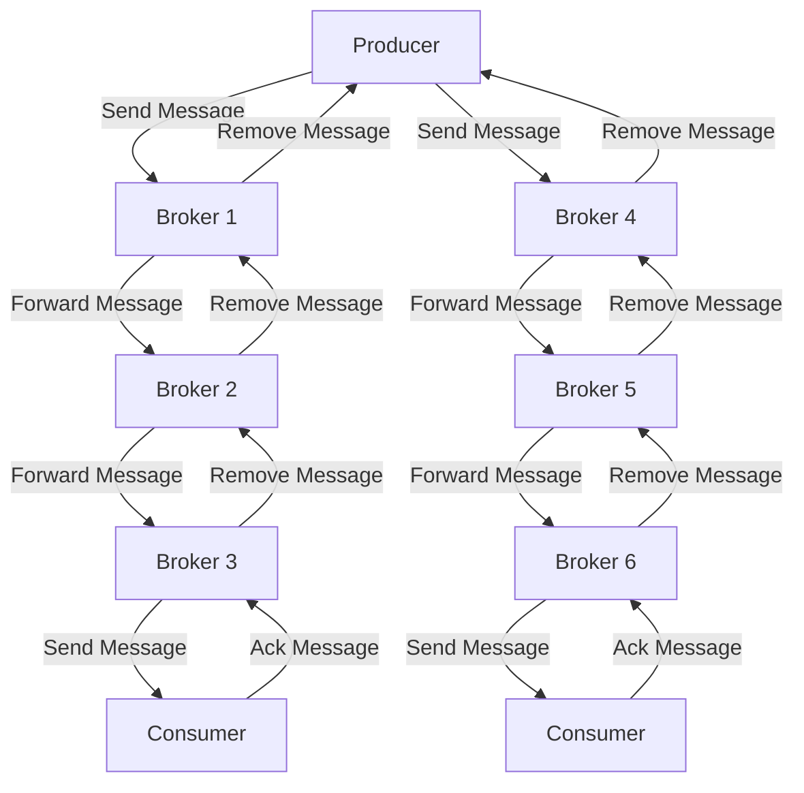

## Introduction
A **Distributed Message Queue** is a system that enables asynchronous communication between different components of a distributed system. It allows producers to send messages to a queue, and consumers to receive these messages from the queue, without the need for direct communication between them. This decoupling of producers and consumers provides a number of benefits, including scalability, fault tolerance, and flexibility. In this section, we will explore the importance of distributed message queues, their real-world relevance, and why every engineer should understand how to design and implement them.

> **Note:** Distributed message queues are a crucial component of modern distributed systems, and are used in a wide range of applications, from social media platforms to financial trading systems.

## Core Concepts
Before diving into the design of a distributed message queue, it's essential to understand some key concepts:

* **Message**: A message is a unit of data that is sent from a producer to a consumer through the message queue.
* **Producer**: A producer is a component that sends messages to the message queue.
* **Consumer**: A consumer is a component that receives messages from the message queue.
* **Queue**: A queue is a data structure that stores messages in a First-In-First-Out (FIFO) order.
* **Broker**: A broker is a component that manages the message queue and handles communication between producers and consumers.

> **Warning:** A common mistake when designing a distributed message queue is to assume that the queue will always be available and responsive. However, in a distributed system, queues can fail or become unresponsive due to network partitions or other issues.

## How It Works Internally
A distributed message queue typically consists of multiple brokers, each of which manages a portion of the message queue. Producers send messages to a broker, which stores the message in its local queue. The broker then forwards the message to other brokers, which store the message in their local queues. Consumers receive messages from a broker, which removes the message from its local queue.

Here is a high-level overview of the steps involved in sending a message from a producer to a consumer:

1. The producer sends a message to a broker.
2. The broker stores the message in its local queue.
3. The broker forwards the message to other brokers.
4. The message is stored in the local queues of the other brokers.
5. A consumer requests a message from a broker.
6. The broker removes the message from its local queue and sends it to the consumer.

> **Tip:** To improve the performance of a distributed message queue, it's essential to use a efficient data structure, such as a **lock-free queue**, to store messages in the broker's local queue.

## Code Examples
Here are three complete and runnable code examples that demonstrate the design of a distributed message queue:

### Example 1: Basic Message Queue
```python
import threading
import queue

class MessageQueue:
    def __init__(self):
        self.queue = queue.Queue()

    def put(self, message):
        self.queue.put(message)

    def get(self):
        return self.queue.get()

# Create a message queue
mq = MessageQueue()

# Create a producer thread
def producer():
    for i in range(10):
        mq.put(f"Message {i}")

# Create a consumer thread
def consumer():
    for i in range(10):
        print(mq.get())

# Start the producer and consumer threads
producer_thread = threading.Thread(target=producer)
consumer_thread = threading.Thread(target=consumer)

producer_thread.start()
consumer_thread.start()

producer_thread.join()
consumer_thread.join()
```

### Example 2: Distributed Message Queue with Multiple Brokers
```java
import java.util.concurrent.ConcurrentLinkedQueue;
import java.util.concurrent.ExecutorService;
import java.util.concurrent.Executors;

class Broker {
    private ConcurrentLinkedQueue<String> queue;
    private ExecutorService executor;

    public Broker() {
        queue = new ConcurrentLinkedQueue<>();
        executor = Executors.newSingleThreadExecutor();
    }

    public void put(String message) {
        queue.add(message);
    }

    public String get() {
        return queue.poll();
    }

    public void start() {
        executor.submit(() -> {
            while (true) {
                String message = queue.poll();
                if (message != null) {
                    System.out.println("Received message: " + message);
                }
            }
        });
    }
}

public class DistributedMessageQueue {
    public static void main(String[] args) {
        // Create multiple brokers
        Broker broker1 = new Broker();
        Broker broker2 = new Broker();

        // Start the brokers
        broker1.start();
        broker2.start();

        // Create a producer thread
        Thread producerThread = new Thread(() -> {
            for (int i = 0; i < 10; i++) {
                broker1.put("Message " + i);
            }
        });

        // Create a consumer thread
        Thread consumerThread = new Thread(() -> {
            for (int i = 0; i < 10; i++) {
                System.out.println(broker2.get());
            }
        });

        // Start the producer and consumer threads
        producerThread.start();
        consumerThread.start();

        // Wait for the producer and consumer threads to finish
        producerThread.join();
        consumerThread.join();
    }
}
```

### Example 3: Advanced Message Queue with Message Acknowledgment
```go
package main

import (
    "fmt"
    "sync"
)

type MessageQueue struct {
    queue chan string
    acks  map[string]bool
    mu    sync.RWMutex
}

func NewMessageQueue() *MessageQueue {
    return &MessageQueue{
        queue: make(chan string),
        acks:  make(map[string]bool),
    }
}

func (mq *MessageQueue) Put(message string) {
    mq.queue <- message
}

func (mq *MessageQueue) Get() string {
    return <-mq.queue
}

func (mq *MessageQueue) Ack(message string) {
    mq.mu.Lock()
    mq.acks[message] = true
    mq.mu.Unlock()
}

func main() {
    // Create a message queue
    mq := NewMessageQueue()

    // Create a producer goroutine
    go func() {
        for i := 0; i < 10; i++ {
            mq.Put(fmt.Sprintf("Message %d", i))
        }
    }()

    // Create a consumer goroutine
    go func() {
        for i := 0; i < 10; i++ {
            message := mq.Get()
            fmt.Println(message)
            mq.Ack(message)
        }
    }()

    // Wait for the producer and consumer goroutines to finish
    select {}
}
```

## Visual Diagram

This diagram illustrates the flow of messages through a distributed message queue with multiple brokers and consumers.

> **Interview:** Can you explain the difference between a **push-based** and a **pull-based** message queue?

## Comparison
| Approach | Time Complexity | Space Complexity | Pros | Cons | Best For |
| --- | --- | --- | --- | --- | --- |
| Centralized Message Queue | O(1) | O(n) | Easy to implement, low latency | Single point of failure, limited scalability | Small-scale applications |
| Distributed Message Queue | O(log n) | O(n) | Highly scalable, fault tolerant | Complex to implement, higher latency | Large-scale applications |
| Pub/Sub Message Queue | O(1) | O(n) | Easy to implement, low latency | Limited scalability, no message ordering | Real-time applications |
| Transactional Message Queue | O(log n) | O(n) | Highly reliable, transactional consistency | Complex to implement, higher latency | Financial applications |

## Real-world Use Cases
Here are three real-world examples of distributed message queues in use:

* **Apache Kafka**: A distributed message queue used by companies like LinkedIn, Twitter, and Netflix to handle large volumes of data.
* **Amazon SQS**: A fully managed distributed message queue service used by companies like Airbnb, Uber, and Pinterest to decouple applications and services.
* **RabbitMQ**: A popular open-source distributed message queue used by companies like Mozilla, VMware, and Cisco to handle message queuing and routing.

> **Tip:** When designing a distributed message queue, it's essential to consider the **trade-offs** between **latency**, **throughput**, and **reliability**.

## Common Pitfalls
Here are four common mistakes to avoid when designing a distributed message queue:

* **Incorrect queue configuration**: Failing to configure the queue correctly can lead to poor performance, data loss, or incorrect message ordering.
* **Insufficient broker replication**: Failing to replicate brokers can lead to single points of failure, data loss, or poor performance.
* **Inadequate message acknowledgment**: Failing to implement message acknowledgment can lead to message duplication, data loss, or incorrect message ordering.
* **Poor consumer implementation**: Failing to implement consumers correctly can lead to poor performance, data loss, or incorrect message ordering.

> **Warning:** A common mistake when implementing a distributed message queue is to assume that the queue will always be available and responsive. However, in a distributed system, queues can fail or become unresponsive due to network partitions or other issues.

## Interview Tips
Here are three common interview questions related to distributed message queues, along with sample answers:

* **What is the difference between a push-based and a pull-based message queue?**
	+ Weak answer: "A push-based message queue pushes messages to consumers, while a pull-based message queue pulls messages from producers."
	+ Strong answer: "A push-based message queue uses a **push** model, where the broker pushes messages to consumers, while a pull-based message queue uses a **pull** model, where consumers pull messages from the broker. The choice between the two models depends on the use case and the trade-offs between latency, throughput, and reliability."
* **How do you handle message ordering in a distributed message queue?**
	+ Weak answer: "You can use a **timestamp** to order messages."
	+ Strong answer: "To handle message ordering in a distributed message queue, you can use a combination of **timestamps**, **sequence numbers**, and **message IDs**. The broker can assign a unique sequence number to each message, and the consumer can use this sequence number to order the messages. Additionally, the broker can use a timestamp to ensure that messages are ordered correctly in case of failures or network partitions."
* **What is the purpose of message acknowledgment in a distributed message queue?**
	+ Weak answer: "Message acknowledgment is used to confirm that a message has been received by the consumer."
	+ Strong answer: "Message acknowledgment is used to confirm that a message has been **processed** by the consumer, and to ensure that the message is not lost or duplicated. The consumer sends an acknowledgment to the broker, which removes the message from the queue. This ensures that the message is not sent to another consumer, and that the consumer can process the message correctly."

## Key Takeaways
Here are ten key takeaways to remember when designing and implementing a distributed message queue:

* **Distributed message queues** are used to decouple producers and consumers in a distributed system.
* **Brokers** manage the message queue and handle communication between producers and consumers.
* **Message ordering** is critical in a distributed message queue, and can be achieved using **timestamps**, **sequence numbers**, and **message IDs**.
* **Message acknowledgment** is used to confirm that a message has been **processed** by the consumer.
* **Queue configuration** is critical to ensure good performance, reliability, and scalability.
* **Broker replication** is essential to ensure high availability and fault tolerance.
* **Consumer implementation** is critical to ensure correct message processing and ordering.
* **Trade-offs** between **latency**, **throughput**, and **reliability** must be considered when designing a distributed message queue.
* **Real-world examples** of distributed message queues include **Apache Kafka**, **Amazon SQS**, and **RabbitMQ**.
* **Common pitfalls** include incorrect queue configuration, insufficient broker replication, inadequate message acknowledgment, and poor consumer implementation.