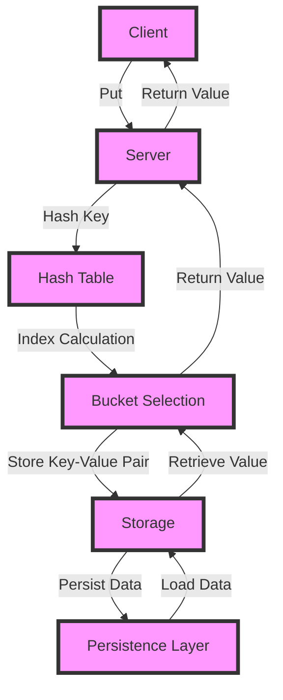

## Introduction
A **Key-Value Store** is a type of NoSQL database that stores data as a collection of key-value pairs. It is a simple yet powerful data storage system that allows for efficient retrieval and manipulation of data. Key-Value Stores are widely used in various applications, including caching, session management, and real-time analytics. Every engineer needs to know about Key-Value Stores because they provide a fundamental building block for designing scalable and high-performance systems.

> **Note:** Key-Value Stores are often used as a caching layer in front of a relational database to improve performance and reduce latency.

In real-world scenarios, Key-Value Stores are used in various applications, such as:
* **Caching:** Key-Value Stores can be used as a caching layer to store frequently accessed data, reducing the load on the underlying database.
* **Session Management:** Key-Value Stores can be used to store user session data, such as user IDs, preferences, and other metadata.
* **Real-time Analytics:** Key-Value Stores can be used to store and process real-time data, such as clickstream data, log data, and sensor data.

## Core Concepts
The core concepts of a Key-Value Store include:
* **Key:** A unique identifier for a piece of data.
* **Value:** The data associated with a key.
* **Put:** The operation of storing a key-value pair in the store.
* **Get:** The operation of retrieving a value associated with a key.
* **Delete:** The operation of removing a key-value pair from the store.

> **Tip:** When designing a Key-Value Store, it's essential to consider the data model, including the key and value formats, to ensure efficient storage and retrieval.

Key terminology includes:
* **Hash Table:** A data structure used to store key-value pairs, where each key is mapped to a unique index in the table.
* **Bucket:** A container that stores a group of key-value pairs.
* **Collision:** When two or more keys hash to the same index in the table.

## How It Works Internally
A Key-Value Store typically consists of the following components:
* **Client:** The application that interacts with the Key-Value Store.
* **Server:** The component that stores and manages the key-value pairs.
* **Storage:** The underlying storage system, such as a disk or memory.

The internal workflow of a Key-Value Store involves the following steps:
1. **Key Hashing:** The client hashes the key to determine the index in the hash table.
2. **Index Calculation:** The server calculates the index in the hash table based on the hashed key.
3. **Bucket Selection:** The server selects the bucket that corresponds to the calculated index.
4. **Key-Value Pair Storage:** The server stores the key-value pair in the selected bucket.
5. **Value Retrieval:** The server retrieves the value associated with a key by hashing the key and searching for the corresponding bucket.

> **Warning:** Poorly designed Key-Value Stores can lead to performance issues, such as slow lookup times and high memory usage.

## Code Examples
### Example 1: Basic Key-Value Store
```python
class KeyValueStore:
    def __init__(self):
        self.storage = {}

    def put(self, key, value):
        self.storage[key] = value

    def get(self, key):
        return self.storage.get(key)

    def delete(self, key):
        if key in self.storage:
            del self.storage[key]

# Create a Key-Value Store
store = KeyValueStore()

# Put a key-value pair
store.put("name", "John")

# Get the value associated with a key
print(store.get("name"))  # Output: John

# Delete a key-value pair
store.delete("name")
```
### Example 2: Distributed Key-Value Store
```java
import java.util.HashMap;
import java.util.Map;

public class DistributedKeyValueStore {
    private Map<String, String> storage;
    private String[] nodes;

    public DistributedKeyValueStore(String[] nodes) {
        this.nodes = nodes;
        this.storage = new HashMap<>();
    }

    public void put(String key, String value) {
        // Calculate the node index based on the hashed key
        int nodeIndex = hash(key) % nodes.length;
        // Store the key-value pair in the selected node
        storage.put(key, value);
    }

    public String get(String key) {
        // Calculate the node index based on the hashed key
        int nodeIndex = hash(key) % nodes.length;
        // Retrieve the value associated with the key from the selected node
        return storage.get(key);
    }

    private int hash(String key) {
        // Simple hash function
        return key.hashCode();
    }

    public static void main(String[] args) {
        String[] nodes = {"node1", "node2", "node3"};
        DistributedKeyValueStore store = new DistributedKeyValueStore(nodes);
        store.put("name", "John");
        System.out.println(store.get("name"));  // Output: John
    }
}
```
### Example 3: Advanced Key-Value Store with Cache and Persistence
```typescript
class AdvancedKeyValueStore {
    private storage: Map<string, string>;
    private cache: Map<string, string>;
    private persistence: string;

    constructor(persistence: string) {
        this.storage = new Map();
        this.cache = new Map();
        this.persistence = persistence;
    }

    put(key: string, value: string) {
        // Store the key-value pair in the cache and storage
        this.cache.set(key, value);
        this.storage.set(key, value);
        // Persist the data to disk
        this.persistData();
    }

    get(key: string) {
        // Check the cache first
        if (this.cache.has(key)) {
            return this.cache.get(key);
        }
        // If not in cache, retrieve from storage
        return this.storage.get(key);
    }

    delete(key: string) {
        // Remove the key-value pair from the cache and storage
        this.cache.delete(key);
        this.storage.delete(key);
        // Persist the updated data to disk
        this.persistData();
    }

    private persistData() {
        // Write the data to disk
        const data = JSON.stringify(Array.from(this.storage.entries()));
        fs.writeFileSync(this.persistence, data);
    }

    private loadData() {
        // Read the data from disk
        const data = fs.readFileSync(this.persistence, 'utf8');
        const entries = JSON.parse(data);
        // Populate the storage and cache
        entries.forEach(([key, value]) => {
            this.storage.set(key, value);
            this.cache.set(key, value);
        });
    }
}
```
## Visual Diagram

The diagram illustrates the workflow of a Key-Value Store, including the client, server, hash table, bucket selection, storage, and persistence layer.

## Comparison
| Approach | Time Complexity | Space Complexity | Pros | Cons | Best For |
| --- | --- | --- | --- | --- | --- |
| Hash Table | O(1) | O(n) | Fast lookup, efficient storage | Collision resolution required | Caching, real-time analytics |
| Distributed Hash Table | O(log n) | O(n) | Scalable, fault-tolerant | Complex implementation, high latency | Large-scale distributed systems |
| Key-Value Store with Cache | O(1) | O(n) | Fast lookup, efficient storage | Cache invalidation required | Caching, session management |
| Relational Database | O(n) | O(n) | ACID compliance, transactional support | Slow lookup, complex queries | Complex transactions, data consistency |

> **Interview:** When designing a Key-Value Store, what are the key considerations for optimizing performance and scalability?

## Real-world Use Cases
* **Amazon DynamoDB:** A fully managed NoSQL database service that provides a Key-Value Store interface.
* **Google Cloud Bigtable:** A fully managed NoSQL database service that provides a Key-Value Store interface.
* **Apache Cassandra:** An open-source, distributed NoSQL database that provides a Key-Value Store interface.

## Common Pitfalls
* **Poor Hash Function:** A poorly designed hash function can lead to collisions, reducing the performance of the Key-Value Store.
* **Inadequate Cache Management:** Failing to implement cache invalidation and expiration can lead to stale data and reduced performance.
* **Insufficient Persistence:** Failing to persist data to disk can lead to data loss in the event of a failure.
* **Inadequate Error Handling:** Failing to handle errors and exceptions can lead to data corruption and reduced performance.

> **Warning:** Poorly designed Key-Value Stores can lead to performance issues, data corruption, and reduced scalability.

## Interview Tips
* **Design a Key-Value Store:** When asked to design a Key-Value Store, focus on the key considerations, such as hash function design, cache management, and persistence.
* **Optimize Performance:** When asked to optimize the performance of a Key-Value Store, focus on the cache hit ratio, hash table size, and persistence frequency.
* **Scalability:** When asked to scale a Key-Value Store, focus on distributed architecture, load balancing, and fault tolerance.

## Key Takeaways
* **Key-Value Store:** A simple yet powerful data storage system that provides efficient retrieval and manipulation of data.
* **Hash Function:** A critical component of a Key-Value Store that determines the index in the hash table.
* **Cache Management:** A critical component of a Key-Value Store that determines the performance and scalability.
* **Persistence:** A critical component of a Key-Value Store that determines the data durability and consistency.
* **Scalability:** A critical consideration when designing a Key-Value Store to ensure high performance and fault tolerance.
* **Distributed Architecture:** A critical consideration when scaling a Key-Value Store to ensure high performance and fault tolerance.
* **Load Balancing:** A critical consideration when scaling a Key-Value Store to ensure high performance and fault tolerance.
* **Fault Tolerance:** A critical consideration when scaling a Key-Value Store to ensure high availability and data durability.