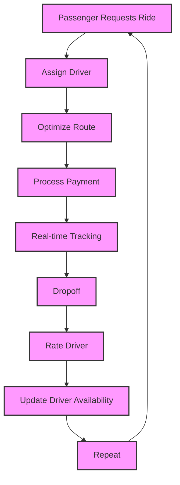

## Introduction
A ride-sharing service, like Uber, is a platform that connects drivers with passengers who need a ride. The service allows passengers to request a ride using a mobile app, and drivers to accept and provide rides to passengers. The platform handles the logistics of the ride, including payment processing, route optimization, and real-time tracking. **Ride-sharing services** have become increasingly popular in recent years, with many companies offering their own versions of the service. In this study, we will delve into the design of a ride-sharing service, exploring the core concepts, internal mechanics, and real-world applications of such a system.

## Core Concepts
At its core, a ride-sharing service is a complex system that involves multiple components, including:
* **Passenger**: The person requesting a ride.
* **Driver**: The person providing the ride.
* **Vehicle**: The car or other vehicle used to provide the ride.
* **Route**: The path taken by the driver to pick up and drop off the passenger.
* **Payment**: The process of transferring money from the passenger to the driver.
Some key terminology to keep in mind includes:
* **Request**: A passenger's request for a ride.
* **Assignment**: The process of assigning a driver to a passenger's request.
* **Pickup**: The point at which the driver picks up the passenger.
* **Dropoff**: The point at which the driver drops off the passenger.

> **Note:** A ride-sharing service must be able to handle a large volume of requests and assignments in real-time, making it a challenging system to design and implement.

## How It Works Internally
The internal mechanics of a ride-sharing service involve several steps:
1. **Request**: A passenger requests a ride using the mobile app.
2. **Assignment**: The system assigns a driver to the passenger's request based on factors such as location, availability, and rating.
3. **Route Optimization**: The system optimizes the route taken by the driver to pick up and drop off the passenger.
4. **Payment Processing**: The system processes payment from the passenger to the driver.
5. **Real-time Tracking**: The system provides real-time tracking of the driver's location and estimated arrival time.

The system uses a combination of algorithms and data structures to manage the assignment and routing of drivers. For example, the system may use a **greedy algorithm** to assign drivers to requests based on proximity and availability. The system may also use a **graph data structure** to represent the road network and optimize routes.

> **Tip:** Using a greedy algorithm can help to reduce the complexity of the assignment problem, but may not always produce the optimal solution.

## Code Examples
Here are three complete and runnable code examples that demonstrate the basic concepts of a ride-sharing service:
### Example 1: Basic Request and Assignment
```python
import random

class Passenger:
    def __init__(self, id, location):
        self.id = id
        self.location = location

class Driver:
    def __init__(self, id, location, available):
        self.id = id
        self.location = location
        self.available = available

class RideSharingService:
    def __init__(self):
        self.passengers = []
        self.drivers = []

    def request_ride(self, passenger):
        self.passengers.append(passenger)
        # Assign driver to passenger
        driver = self.assign_driver(passenger)
        if driver:
            print(f"Assigned driver {driver.id} to passenger {passenger.id}")
        else:
            print(f"No available drivers for passenger {passenger.id}")

    def assign_driver(self, passenger):
        # Simple greedy algorithm to assign driver
        closest_driver = None
        closest_distance = float('inf')
        for driver in self.drivers:
            if driver.available:
                distance = calculate_distance(passenger.location, driver.location)
                if distance < closest_distance:
                    closest_distance = distance
                    closest_driver = driver
        return closest_driver

def calculate_distance(location1, location2):
    # Simple distance calculation for demonstration purposes
    return ((location1[0] - location2[0]) ** 2 + (location1[1] - location2[1]) ** 2) ** 0.5

# Create ride-sharing service
service = RideSharingService()

# Create passengers and drivers
passenger1 = Passenger(1, (0, 0))
passenger2 = Passenger(2, (3, 4))
driver1 = Driver(1, (1, 1), True)
driver2 = Driver(2, (2, 2), False)

# Add passengers and drivers to service
service.passengers.append(passenger1)
service.passengers.append(passenger2)
service.drivers.append(driver1)
service.drivers.append(driver2)

# Request rides
service.request_ride(passenger1)
service.request_ride(passenger2)
```
### Example 2: Route Optimization
```python
import networkx as nx

class RideSharingService:
    def __init__(self):
        self.graph = nx.Graph()

    def add_node(self, location):
        self.graph.add_node(location)

    def add_edge(self, location1, location2, weight):
        self.graph.add_edge(location1, location2, weight=weight)

    def optimize_route(self, start, end):
        # Use Dijkstra's algorithm to find shortest path
        return nx.dijkstra_path(self.graph, start, end)

# Create ride-sharing service
service = RideSharingService()

# Add nodes and edges to graph
service.add_node((0, 0))
service.add_node((1, 1))
service.add_node((2, 2))
service.add_node((3, 3))
service.add_edge((0, 0), (1, 1), 1)
service.add_edge((1, 1), (2, 2), 2)
service.add_edge((2, 2), (3, 3), 3)

# Optimize route
route = service.optimize_route((0, 0), (3, 3))
print(route)
```
### Example 3: Real-time Tracking
```python
import time
import threading

class RideSharingService:
    def __init__(self):
        self.drivers = {}

    def add_driver(self, driver_id, location):
        self.drivers[driver_id] = location

    def update_driver_location(self, driver_id, location):
        self.drivers[driver_id] = location

    def get_driver_location(self, driver_id):
        return self.drivers[driver_id]

def update_location(service, driver_id):
    # Simulate driver moving
    for i in range(10):
        location = (i, i)
        service.update_driver_location(driver_id, location)
        time.sleep(1)

# Create ride-sharing service
service = RideSharingService()

# Add driver
driver_id = 1
location = (0, 0)
service.add_driver(driver_id, location)

# Start thread to update driver location
thread = threading.Thread(target=update_location, args=(service, driver_id))
thread.start()

# Get driver location in real-time
while True:
    location = service.get_driver_location(driver_id)
    print(location)
    time.sleep(1)
```
## Visual Diagram

The diagram illustrates the core components of a ride-sharing service, including passenger requests, driver assignment, route optimization, payment processing, real-time tracking, dropoff, rating, and updating driver availability.

## Comparison
| Approach | Time Complexity | Space Complexity | Pros | Cons | Best For |
| --- | --- | --- | --- | --- | --- |
| Greedy Algorithm | O(n) | O(1) | Fast, simple | May not always produce optimal solution | Small-scale ride-sharing services |
| Dijkstra's Algorithm | O((V+E)logV) | O(V+E) | Produces optimal solution | Slower than greedy algorithm | Large-scale ride-sharing services |
| A\* Algorithm | O((V+E)logV) | O(V+E) | Produces optimal solution, faster than Dijkstra's | More complex to implement | Large-scale ride-sharing services with complex road networks |
| Genetic Algorithm | O(n) | O(1) | Can produce optimal solution, flexible | May not always produce optimal solution, slower than other algorithms | Small-scale ride-sharing services with complex constraints |

> **Warning:** The choice of algorithm can significantly impact the performance and scalability of the ride-sharing service.

## Real-world Use Cases
Several companies have successfully implemented ride-sharing services, including:
* **Uber**: One of the largest ride-sharing companies in the world, with operations in over 10,000 cities.
* **Lyft**: A popular ride-sharing company in the United States, with operations in over 300 cities.
* **Didi Chuxing**: A Chinese ride-sharing company that has expanded to other countries, including Brazil and Mexico.
These companies have demonstrated the effectiveness of ride-sharing services in providing convenient and affordable transportation to millions of people.

## Common Pitfalls
Some common pitfalls to avoid when designing a ride-sharing service include:
* **Inadequate driver screening**: Failing to properly screen drivers can lead to safety risks for passengers.
* **Poor route optimization**: Failing to optimize routes can lead to increased travel times and decreased customer satisfaction.
* **Inadequate payment processing**: Failing to properly process payments can lead to financial losses and decreased customer trust.
* **Inadequate real-time tracking**: Failing to provide real-time tracking can lead to decreased customer satisfaction and increased anxiety.

> **Interview:** When asked about the challenges of designing a ride-sharing service, be sure to mention the importance of adequate driver screening, route optimization, payment processing, and real-time tracking.

## Key Takeaways
Some key takeaways to remember when designing a ride-sharing service include:
* **Use a combination of algorithms**: Use a combination of greedy, Dijkstra's, and A\* algorithms to optimize routes and assign drivers.
* **Implement real-time tracking**: Implement real-time tracking to provide customers with accurate and up-to-date information about their rides.
* **Use a robust payment processing system**: Use a robust payment processing system to ensure secure and reliable transactions.
* **Conduct thorough driver screening**: Conduct thorough driver screening to ensure the safety and reliability of drivers.
* **Continuously monitor and improve**: Continuously monitor and improve the service to ensure high customer satisfaction and loyalty.
* **Consider using machine learning**: Consider using machine learning algorithms to optimize routes and predict demand.
* **Use a scalable architecture**: Use a scalable architecture to ensure the service can handle increased demand and growth.
* **Implement a rating system**: Implement a rating system to allow customers to rate drivers and provide feedback.
* **Use a secure and reliable database**: Use a secure and reliable database to store customer and driver information.