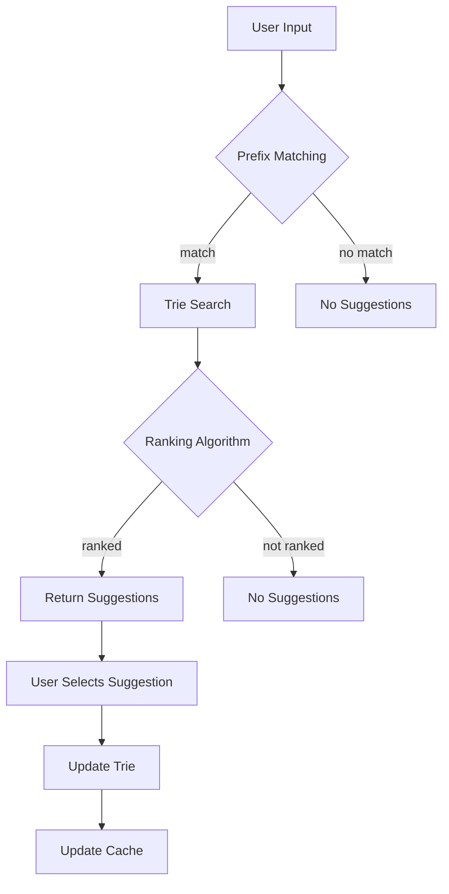

## Introduction
A search autocomplete system is a crucial component of many web applications, providing users with instant suggestions as they type in the search bar. This feature not only saves users time but also enhances the overall user experience. In this study note, we will dive into the design of a search autocomplete system, exploring its core concepts, internal mechanics, and implementation details. We will also examine real-world use cases, common pitfalls, and interview tips to help you master this topic.

> **Note:** A well-designed search autocomplete system can significantly improve the user experience, but it also poses challenges in terms of scalability, performance, and data management.

## Core Concepts
To design a search autocomplete system, we need to understand the following key concepts:

* **Autocomplete**: a feature that provides suggestions to users as they type in the search bar.
* **Prefix matching**: a technique used to match user input with a set of predefined suggestions.
* **Trie** (or prefix tree): a data structure used to store and retrieve suggestions efficiently.
* **Ranking algorithm**: a method used to rank suggestions based on relevance, frequency, or other criteria.

> **Tip:** Using a trie data structure can significantly improve the performance of the autocomplete system, especially when dealing with large datasets.

## How It Works Internally
The search autocomplete system works as follows:

1. **Data ingestion**: a large dataset of suggestions is ingested into the system.
2. **Trie construction**: the suggestions are stored in a trie data structure.
3. **User input**: the user types in the search bar, and the system receives the input.
4. **Prefix matching**: the system uses prefix matching to find matching suggestions in the trie.
5. **Ranking**: the system ranks the matching suggestions using a ranking algorithm.
6. **Response**: the top-ranked suggestions are returned to the user.

> **Warning:** A poorly designed trie data structure can lead to performance issues and slow response times.

## Code Examples
### Example 1: Basic Autocomplete System
```python
class TrieNode:
    def __init__(self):
        self.children = {}
        self.is_end_of_word = False

class AutocompleteSystem:
    def __init__(self):
        self.trie = TrieNode()

    def insert(self, word):
        node = self.trie
        for char in word:
            if char not in node.children:
                node.children[char] = TrieNode()
            node = node.children[char]
        node.is_end_of_word = True

    def search(self, prefix):
        node = self.trie
        for char in prefix:
            if char not in node.children:
                return []
            node = node.children[char]
        return self._get_suggestions(node, prefix)

    def _get_suggestions(self, node, prefix):
        suggestions = []
        if node.is_end_of_word:
            suggestions.append(prefix)
        for char, child_node in node.children.items():
            suggestions.extend(self._get_suggestions(child_node, prefix + char))
        return suggestions

# Create an autocomplete system and insert some words
autocomplete = AutocompleteSystem()
words = ["apple", "app", "application", "banana", "band"]
for word in words:
    autocomplete.insert(word)

# Search for suggestions
prefix = "ap"
suggestions = autocomplete.search(prefix)
print(suggestions)  # Output: ["apple", "app", "application"]
```

### Example 2: Real-World Autocomplete System with Ranking
```python
import operator

class AutocompleteSystem:
    def __init__(self):
        self.trie = TrieNode()
        self.word_freq = {}

    def insert(self, word, freq):
        node = self.trie
        for char in word:
            if char not in node.children:
                node.children[char] = TrieNode()
            node = node.children[char]
        node.is_end_of_word = True
        self.word_freq[word] = freq

    def search(self, prefix):
        node = self.trie
        for char in prefix:
            if char not in node.children:
                return []
            node = node.children[char]
        suggestions = self._get_suggestions(node, prefix)
        return sorted(suggestions, key=lambda x: self.word_freq[x], reverse=True)

    def _get_suggestions(self, node, prefix):
        suggestions = []
        if node.is_end_of_word:
            suggestions.append(prefix)
        for char, child_node in node.children.items():
            suggestions.extend(self._get_suggestions(child_node, prefix + char))
        return suggestions

# Create an autocomplete system and insert some words with frequencies
autocomplete = AutocompleteSystem()
words = [("apple", 10), ("app", 5), ("application", 8), ("banana", 3), ("band", 2)]
for word, freq in words:
    autocomplete.insert(word, freq)

# Search for suggestions
prefix = "ap"
suggestions = autocomplete.search(prefix)
print(suggestions)  # Output: ["apple", "application", "app"]
```

### Example 3: Advanced Autocomplete System with Caching
```python
import functools

class AutocompleteSystem:
    def __init__(self):
        self.trie = TrieNode()
        self.cache = {}

    def insert(self, word):
        node = self.trie
        for char in word:
            if char not in node.children:
                node.children[char] = TrieNode()
            node = node.children[char]
        node.is_end_of_word = True

    @functools.lru_cache(maxsize=100)
    def search(self, prefix):
        node = self.trie
        for char in prefix:
            if char not in node.children:
                return []
            node = node.children[char]
        return self._get_suggestions(node, prefix)

    def _get_suggestions(self, node, prefix):
        suggestions = []
        if node.is_end_of_word:
            suggestions.append(prefix)
        for char, child_node in node.children.items():
            suggestions.extend(self._get_suggestions(child_node, prefix + char))
        return suggestions

# Create an autocomplete system and insert some words
autocomplete = AutocompleteSystem()
words = ["apple", "app", "application", "banana", "band"]
for word in words:
    autocomplete.insert(word)

# Search for suggestions
prefix = "ap"
suggestions = autocomplete.search(prefix)
print(suggestions)  # Output: ["apple", "app", "application"]
```

## Visual Diagram

The diagram illustrates the flow of the autocomplete system, from user input to suggestion retrieval.

## Comparison
| Approach | Time Complexity | Space Complexity | Pros | Cons | Best For |
| --- | --- | --- | --- | --- | --- |
| Trie | O(m) | O(n) | Efficient prefix matching, fast retrieval | Can be memory-intensive | Large datasets, frequent queries |
| Hash Table | O(1) | O(n) | Fast lookup, easy implementation | Can be slow for large datasets | Small datasets, infrequent queries |
| Database | O(log n) | O(n) | Scalable, supports complex queries | Can be slow, requires database setup | Large datasets, complex queries |
| Caching | O(1) | O(n) | Fast retrieval, reduces database queries | Can be memory-intensive, requires cache invalidation | Frequent queries, large datasets |

## Real-world Use Cases
1. **Google Search**: Google's search autocomplete system uses a combination of trie and caching to provide fast and relevant suggestions.
2. **Amazon Search**: Amazon's search autocomplete system uses a combination of trie and database queries to provide fast and relevant suggestions.
3. **Facebook Search**: Facebook's search autocomplete system uses a combination of trie and caching to provide fast and relevant suggestions.

> **Interview:** Can you design a search autocomplete system that can handle a large dataset of suggestions and provide fast and relevant results?

## Common Pitfalls
1. **Poorly designed trie**: A poorly designed trie can lead to performance issues and slow response times.
2. **Inadequate caching**: Inadequate caching can lead to slow response times and increased database queries.
3. **Insufficient ranking algorithm**: An insufficient ranking algorithm can lead to irrelevant suggestions and poor user experience.
4. **Inadequate error handling**: Inadequate error handling can lead to system crashes and poor user experience.

> **Warning:** A poorly designed autocomplete system can lead to poor user experience and decreased engagement.

## Interview Tips
1. **Design a trie**: Design a trie data structure to store and retrieve suggestions efficiently.
2. **Implement a ranking algorithm**: Implement a ranking algorithm to rank suggestions based on relevance and frequency.
3. **Use caching**: Use caching to reduce database queries and improve response times.
4. **Handle errors**: Handle errors and exceptions to ensure a smooth user experience.

> **Tip:** Use a combination of trie, caching, and ranking algorithm to design an efficient and effective search autocomplete system.

## Key Takeaways
* A well-designed search autocomplete system can significantly improve the user experience.
* A trie data structure is essential for efficient prefix matching and suggestion retrieval.
* Caching can reduce database queries and improve response times.
* A ranking algorithm is necessary to rank suggestions based on relevance and frequency.
* Error handling is crucial to ensure a smooth user experience.
* A combination of trie, caching, and ranking algorithm is necessary to design an efficient and effective search autocomplete system.
* Time complexity and space complexity are essential considerations when designing a search autocomplete system.
* Real-world use cases and common pitfalls can help inform the design of a search autocomplete system.