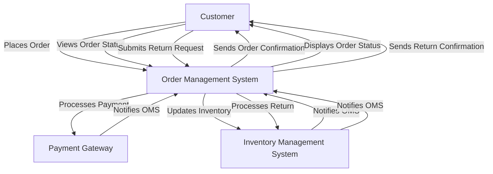

## Introduction
Designing an e-commerce platform is a complex task that requires careful consideration of various factors such as scalability, security, and user experience. An e-commerce platform is a software application that enables businesses to sell their products or services online. It provides a digital storefront where customers can browse and purchase products, and it also manages the backend operations such as inventory management, order processing, and payment processing. In this section, we will discuss the importance of designing an e-commerce platform and its real-world relevance.

> **Note:** E-commerce platforms are used by millions of businesses worldwide, and they play a crucial role in the digital economy. According to a report by the US Census Bureau, e-commerce sales in the United States alone accounted for over $861 billion in 2020.

## Core Concepts
To design an e-commerce platform, we need to understand some core concepts such as **microservices architecture**, **service-oriented architecture**, and **event-driven architecture**. These architectures enable us to build scalable and flexible systems that can handle high traffic and large volumes of data.

* **Microservices Architecture:** This architecture involves breaking down a large application into smaller, independent services that communicate with each other using APIs. Each service is responsible for a specific business capability, and they can be developed, deployed, and scaled independently.
* **Service-Oriented Architecture:** This architecture involves designing systems as a collection of services that communicate with each other using standardized protocols. Each service provides a specific business capability, and they can be combined to create new services.
* **Event-Driven Architecture:** This architecture involves designing systems around events that occur in the business domain. Events are used to trigger actions, and they can be used to integrate different services and systems.

> **Warning:** When designing an e-commerce platform, it's essential to avoid monolithic architecture, which can lead to scalability and maintenance issues.

## How It Works Internally
An e-commerce platform typically consists of several components, including:

1. **Product Information Management (PIM) System:** This system manages product information such as product descriptions, prices, and images.
2. **Order Management System (OMS):** This system manages orders, including processing payments, managing inventory, and shipping products.
3. **Customer Relationship Management (CRM) System:** This system manages customer information, including contact details, order history, and loyalty programs.
4. **Payment Gateway:** This system processes payments and integrates with various payment providers.
5. **Content Delivery Network (CDN):** This system delivers static content such as images, videos, and CSS files to users.

> **Tip:** When designing an e-commerce platform, it's essential to use a **load balancer** to distribute traffic across multiple servers and ensure high availability.

## Code Examples
Here are three code examples that demonstrate how to build an e-commerce platform using different programming languages:

### Example 1: Basic E-commerce Platform using Python
```python
from flask import Flask, request, jsonify
from flask_sqlalchemy import SQLAlchemy

app = Flask(__name__)
app.config["SQLALCHEMY_DATABASE_URI"] = "sqlite:///ecommerce.db"
db = SQLAlchemy(app)

class Product(db.Model):
    id = db.Column(db.Integer, primary_key=True)
    name = db.Column(db.String(100), nullable=False)
    price = db.Column(db.Float, nullable=False)

@app.route("/products", methods=["GET"])
def get_products():
    products = Product.query.all()
    return jsonify([{"id": product.id, "name": product.name, "price": product.price} for product in products])

if __name__ == "__main__":
    app.run(debug=True)
```

### Example 2: E-commerce Platform using Node.js and Express.js
```javascript
const express = require("express");
const app = express();
const mongoose = require("mongoose");

mongoose.connect("mongodb://localhost/ecommerce", { useNewUrlParser: true, useUnifiedTopology: true });

const productSchema = new mongoose.Schema({
    name: String,
    price: Number
});

const Product = mongoose.model("Product", productSchema);

app.get("/products", (req, res) => {
    Product.find().then(products => {
        res.json(products);
    });
});

app.listen(3000, () => {
    console.log("Server started on port 3000");
});
```

### Example 3: Advanced E-commerce Platform using Java and Spring Boot
```java
import org.springframework.boot.SpringApplication;
import org.springframework.boot.autoconfigure.SpringBootApplication;
import org.springframework.web.bind.annotation.GetMapping;
import org.springframework.web.bind.annotation.RestController;

import java.util.List;

@SpringBootApplication
@RestController
public class EcommerceApplication {

    @GetMapping("/products")
    public List<Product> getProducts() {
        // Retrieve products from database
        List<Product> products = productService.getProducts();
        return products;
    }

    public static void main(String[] args) {
        SpringApplication.run(EcommerceApplication.class, args);
    }
}
```

## Visual Diagram

This diagram illustrates the high-level workflow of an e-commerce platform, including order management, payment processing, inventory management, and return processing.

> **Interview:** When interviewing for a position as an e-commerce platform developer, be prepared to answer questions about your experience with microservices architecture, service-oriented architecture, and event-driven architecture.

## Comparison
| Architecture | Time Complexity | Space Complexity | Pros | Cons | Best For |
| --- | --- | --- | --- | --- | --- |
| Monolithic | O(n) | O(n) | Easy to develop and deploy, low overhead | Scalability issues, tight coupling | Small applications, prototyping |
| Microservices | O(n log n) | O(n) | Scalable, flexible, fault-tolerant | Complex to develop and deploy, high overhead | Large applications, high traffic |
| Service-Oriented | O(n) | O(n) | Flexible, reusable, scalable | Complex to develop and deploy, high overhead | Large applications, high traffic |
| Event-Driven | O(n log n) | O(n) | Scalable, flexible, fault-tolerant | Complex to develop and deploy, high overhead | Large applications, high traffic |

## Real-world Use Cases
Here are three real-world use cases of e-commerce platforms:

1. **Amazon:** Amazon is one of the largest e-commerce platforms in the world, with over 300 million active customers. It uses a microservices architecture to provide a scalable and flexible platform for its customers.
2. **eBay:** eBay is another popular e-commerce platform that uses a service-oriented architecture to provide a flexible and reusable platform for its customers.
3. **Shopify:** Shopify is a cloud-based e-commerce platform that uses an event-driven architecture to provide a scalable and fault-tolerant platform for its customers.

> **Tip:** When designing an e-commerce platform, it's essential to use a **content delivery network (CDN)** to deliver static content to users and improve page load times.

## Common Pitfalls
Here are four common pitfalls to avoid when designing an e-commerce platform:

1. **Monolithic Architecture:** Using a monolithic architecture can lead to scalability issues and tight coupling.
2. **Insufficient Testing:** Insufficient testing can lead to bugs and errors in the platform.
3. **Poor Security:** Poor security can lead to data breaches and cyber attacks.
4. **Inadequate Scalability:** Inadequate scalability can lead to performance issues and downtime.

> **Warning:** When designing an e-commerce platform, it's essential to avoid using **deprecated APIs** and **outdated libraries**, as they can lead to security vulnerabilities and compatibility issues.

## Interview Tips
Here are three common interview questions and answers for an e-commerce platform developer position:

1. **What is your experience with microservices architecture?**
	* Weak answer: "I've heard of it, but I don't have much experience with it."
	* Strong answer: "I've worked on several projects that use microservices architecture, and I understand its benefits and challenges."
2. **How do you handle scalability issues in an e-commerce platform?**
	* Weak answer: "I'm not sure, but I think it's a complex issue."
	* Strong answer: "I've used various techniques such as load balancing, caching, and content delivery networks to handle scalability issues in e-commerce platforms."
3. **What is your experience with payment gateways and payment processing?**
	* Weak answer: "I've never worked with payment gateways before."
	* Strong answer: "I've worked with several payment gateways such as PayPal, Stripe, and Authorize.net, and I understand their APIs and integration requirements."

## Key Takeaways
Here are ten key takeaways from this article:

* E-commerce platforms are complex systems that require careful consideration of scalability, security, and user experience.
* Microservices architecture, service-oriented architecture, and event-driven architecture are popular architectures for e-commerce platforms.
* Load balancing, caching, and content delivery networks are essential techniques for handling scalability issues.
* Payment gateways and payment processing are critical components of e-commerce platforms.
* Security is a top priority for e-commerce platforms, and it requires careful consideration of data breaches, cyber attacks, and compliance with regulations.
* Testing and debugging are essential steps in the development process of e-commerce platforms.
* E-commerce platforms require continuous monitoring and maintenance to ensure high availability and performance.
* Cloud-based e-commerce platforms are becoming increasingly popular due to their scalability, flexibility, and cost-effectiveness.
* E-commerce platforms require a deep understanding of business requirements, customer needs, and technical challenges.
* E-commerce platform developers should have a strong foundation in programming languages, software engineering, and computer science.