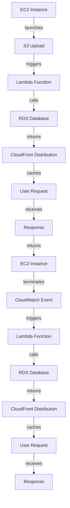

## Introduction
**Amazon Web Services (AWS)** is a comprehensive cloud computing platform provided by Amazon that offers a wide range of services for computing, storage, databases, analytics, machine learning, and more. Among these services, **EC2**, **S3**, **RDS**, **Lambda**, and **CloudFront** are considered core services, as they provide the foundation for building scalable, secure, and efficient cloud-based systems. In this section, we will explore what each of these services is, why they matter, and their real-world relevance.

> **Note:** Understanding these core services is crucial for any cloud-based system design, as they provide the building blocks for scalability, reliability, and performance.

## Core Concepts
Let's dive into the precise definitions, mental models, and key terminology for each of these core services:

* **EC2 (Elastic Compute Cloud)**: a virtual server service that provides resizable compute capacity in the cloud. You can think of it as a virtual machine that you can launch, configure, and manage.
* **S3 (Simple Storage Service)**: an object storage service that allows you to store and retrieve large amounts of data in the form of objects. It's like a massive file system in the cloud.
* **RDS (Relational Database Service)**: a managed relational database service that makes it easy to set up, manage, and scale a relational database in the cloud. It supports popular database engines like MySQL, PostgreSQL, and Oracle.
* **Lambda**: a serverless compute service that allows you to run code without provisioning or managing servers. It's like a function-as-a-service that can be triggered by various events.
* **CloudFront**: a content delivery network (CDN) service that accelerates the delivery of web content, such as videos, images, and static websites. It's like a caching layer that reduces latency and improves performance.

> **Warning:** When designing a cloud-based system, it's essential to consider the trade-offs between these services, as they have different pricing models, scalability limits, and performance characteristics.

## How It Works Internally
Let's take a step-by-step look at how each of these services works internally:

* **EC2**: when you launch an EC2 instance, AWS creates a virtual machine with the specified configuration, including the operating system, instance type, and storage. The instance is then provisioned with a unique IP address and can be accessed via SSH or RDP.
* **S3**: when you upload an object to S3, it is stored in a distributed storage system that spans multiple availability zones. S3 uses a combination of replication and redundancy to ensure that your data is durable and available.
* **RDS**: when you create an RDS instance, AWS provisions a managed relational database with the specified engine, instance type, and storage. RDS handles the underlying database administration tasks, such as backups, patching, and scaling.
* **Lambda**: when you deploy a Lambda function, AWS creates a containerized environment that runs your code. Lambda functions can be triggered by various events, such as API Gateway requests, S3 uploads, or CloudWatch events.
* **CloudFront**: when you configure a CloudFront distribution, AWS creates a caching layer that sits between your origin server and your users. CloudFront caches your content at edge locations around the world, reducing latency and improving performance.

> **Tip:** When designing a cloud-based system, it's essential to consider the internal workings of each service and how they interact with each other.

## Code Examples
Here are three complete and runnable code examples that demonstrate the usage of these core services:

### Example 1: Launching an EC2 Instance
```python
import boto3

ec2 = boto3.client('ec2')

# Create a new EC2 instance
response = ec2.run_instances(
    ImageId='ami-abc123',
    InstanceType='t2.micro',
    MinCount=1,
    MaxCount=1
)

# Print the instance ID
print(response['Instances'][0]['InstanceId'])
```

### Example 2: Uploading an Object to S3
```java
import software.amazon.awssdk.services.s3.S3Client;
import software.amazon.awssdk.services.s3.model.PutObjectRequest;

public class S3Upload {
    public static void main(String[] args) {
        S3Client s3 = S3Client.create();

        // Create a new S3 object
        PutObjectRequest request = PutObjectRequest.builder()
            .bucket("my-bucket")
            .key("my-object")
            .build();

        // Upload the object
        s3.putObject(request, "Hello, World!".getBytes());
    }
}
```

### Example 3: Deploying a Lambda Function
```typescript
import * as AWS from 'aws-sdk';

const lambda = new AWS.Lambda({ region: 'us-west-2' });

// Define the Lambda function code
const code = {
    zipFile: Buffer.from('exports.handler = async (event) => { return { statusCode: 200 }; }', 'utf8')
};

// Create a new Lambda function
lambda.createFunction({
    FunctionName: 'my-function',
    Runtime: 'nodejs14.x',
    Role: 'arn:aws:iam::123456789012:role/my-role',
    Handler: 'index.handler',
    Code: code
}, (err, data) => {
    if (err) {
        console.log(err);
    } else {
        console.log(data);
    }
});
```

> **Interview:** When interviewing for a cloud-based system design position, be prepared to answer questions about the internal workings of these core services and how they interact with each other.

## Visual Diagram

This diagram illustrates the interaction between the core services, including EC2, S3, Lambda, RDS, and CloudFront.

> **Note:** This diagram is a simplified representation of the interactions between these services and is not exhaustive.

## Comparison
| Service | Time Complexity | Space Complexity | Pros | Cons | Best For |
| --- | --- | --- | --- | --- | --- |
| EC2 | O(1) | O(n) | scalable, flexible | expensive, complex | web servers, batch processing |
| S3 | O(1) | O(n) | durable, available | expensive, limited query capabilities | object storage, data lakes |
| RDS | O(log n) | O(n) | managed, scalable | expensive, limited control | relational databases, OLTP |
| Lambda | O(1) | O(n) | serverless, scalable | limited control, cold starts | event-driven processing, real-time analytics |
| CloudFront | O(1) | O(n) | fast, scalable | expensive, limited control | content delivery, caching |

> **Tip:** When choosing a service, consider the trade-offs between time complexity, space complexity, pros, and cons.

## Real-world Use Cases
Here are three real-world use cases that demonstrate the usage of these core services:

* **Netflix**: uses EC2 and S3 to store and process large amounts of video content, and uses Lambda and CloudFront to deliver content to users.
* **Amazon**: uses RDS and EC2 to power its e-commerce platform, and uses S3 and CloudFront to store and deliver product images and videos.
* **Dropbox**: uses S3 and Lambda to store and process user files, and uses CloudFront to deliver files to users.

> **Warning:** When designing a cloud-based system, it's essential to consider the scalability and performance requirements of your use case.

## Common Pitfalls
Here are four common pitfalls to watch out for when using these core services:

* **Insufficient security**: failing to secure your EC2 instances, S3 buckets, or RDS databases can lead to data breaches and security vulnerabilities.
* **Inefficient resource allocation**: failing to allocate resources efficiently can lead to waste and increased costs.
* **Inadequate monitoring and logging**: failing to monitor and log your services can lead to debugging and troubleshooting issues.
* **Inconsistent deployment**: failing to deploy services consistently can lead to versioning and compatibility issues.

> **Note:** When designing a cloud-based system, it's essential to consider these common pitfalls and take steps to mitigate them.

## Interview Tips
Here are three common interview questions and tips for answering them:

* **What is the difference between EC2 and Lambda?**: answer by explaining the differences in scalability, control, and cost.
* **How do you optimize the performance of an S3 bucket?**: answer by explaining the use of caching, compression, and parallel uploads.
* **What is the best way to deploy a CloudFront distribution?**: answer by explaining the use of versioning, aliasing, and caching.

> **Interview:** When interviewing for a cloud-based system design position, be prepared to answer questions about the core services and how they interact with each other.

## Key Takeaways
Here are ten key takeaways to remember:

* **EC2 instances are scalable and flexible**: but can be expensive and complex to manage.
* **S3 buckets are durable and available**: but can be expensive and limited in query capabilities.
* **RDS databases are managed and scalable**: but can be expensive and limited in control.
* **Lambda functions are serverless and scalable**: but can be limited in control and have cold starts.
* **CloudFront distributions are fast and scalable**: but can be expensive and limited in control.
* **Security is essential**: when designing a cloud-based system, it's essential to consider security and take steps to mitigate risks.
* **Monitoring and logging are critical**: when designing a cloud-based system, it's essential to consider monitoring and logging to ensure debugging and troubleshooting.
* **Versioning and compatibility are important**: when designing a cloud-based system, it's essential to consider versioning and compatibility to ensure consistent deployment.
* **Cost optimization is key**: when designing a cloud-based system, it's essential to consider cost optimization to ensure efficient resource allocation.
* **Scalability and performance are critical**: when designing a cloud-based system, it's essential to consider scalability and performance to ensure efficient and reliable operation.

> **Tip:** When designing a cloud-based system, it's essential to consider these key takeaways and take steps to mitigate risks and optimize performance.