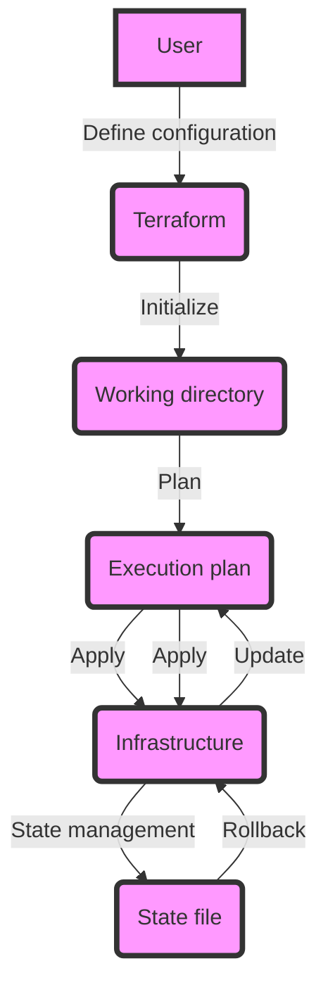

## Introduction
**Infrastructure as Code (IaC)** is the practice of managing and provisioning infrastructure through code instead of through a graphical user interface. This approach allows for version control, reuse, and automation of infrastructure configurations. IaC tools like Terraform and Pulumi have gained popularity in recent years due to their ability to simplify infrastructure management and improve collaboration between developers and operations teams. In this section, we will explore the world of IaC, its benefits, and why it matters in modern software development.

> **Note:** IaC is not just about writing code; it's about creating a repeatable and automated process for managing infrastructure.

## Core Concepts
To understand IaC, we need to grasp some core concepts:

* **Infrastructure**: This refers to the underlying systems and resources that support the deployment and operation of software applications.
* **Configuration**: This is the process of defining the desired state of infrastructure components, such as networks, servers, and databases.
* **Provisioning**: This is the process of creating and configuring infrastructure components based on the defined configuration.
* **Version control**: This is the practice of tracking changes to infrastructure configurations over time, allowing for rollbacks and auditing.

> **Tip:** Use a consistent naming convention for your infrastructure components to simplify management and debugging.

## How It Works Internally
Let's take a closer look at how Terraform works internally:

1. **Initialization**: The user runs `terraform init`, which creates a Terraform working directory and downloads the required plugins.
2. **Configuration**: The user defines the desired infrastructure configuration using Terraform's HCL (HashiCorp Configuration Language) syntax.
3. **Planning**: Terraform runs `terraform plan`, which generates an execution plan based on the defined configuration.
4. **Apply**: The user runs `terraform apply`, which applies the execution plan to the target infrastructure.
5. **State management**: Terraform maintains a state file that tracks the current state of the infrastructure, allowing for future updates and rollbacks.

> **Warning:** Be careful when using Terraform's `apply` command, as it can make irreversible changes to your infrastructure.

## Code Examples
Here are three complete and runnable examples of using Terraform to manage infrastructure:

### Example 1: Basic AWS EC2 Instance
```terraform
# Configure the AWS provider
provider "aws" {
  region = "us-west-2"
}

# Create a new EC2 instance
resource "aws_instance" "example" {
  ami           = "ami-abc123"
  instance_type = "t2.micro"
}

# Output the instance's public IP address
output "public_ip" {
  value = aws_instance.example.public_ip
}
```

### Example 2: Real-world Pattern - Load Balancer and Auto Scaling Group
```terraform
# Configure the AWS provider
provider "aws" {
  region = "us-west-2"
}

# Create a new load balancer
resource "aws_elb" "example" {
  name            = "example-elb"
  subnets         = [aws_subnet.example.id]
  security_groups = [aws_security_group.example.id]
}

# Create a new auto scaling group
resource "aws_autoscaling_group" "example" {
  name                = "example-asg"
  launch_configuration = aws_launch_configuration.example.name
  min_size            = 1
  max_size            = 5
}

# Output the load balancer's DNS name
output "dns_name" {
  value = aws_elb.example.dns_name
}
```

### Example 3: Advanced - Using Pulumi to Manage a Kubernetes Cluster
```typescript
// Import the Pulumi Kubernetes package
import * as k8s from "@pulumi/kubernetes";

// Create a new Kubernetes cluster
const cluster = new k8s.core.v1.Cluster("example");

// Create a new deployment
const deployment = new k8s.apps.v1.Deployment("example", {
  spec: {
    replicas: 3,
    selector: {
      matchLabels: {
        app: "example",
      },
    },
    template: {
      metadata: {
        labels: {
          app: "example",
        },
      },
      spec: {
        containers: [
          {
            name: "example",
            image: "nginx:latest",
          },
        ],
      },
    },
  },
});

// Export the cluster's name
export const clusterName = cluster.metadata.name;
```

## Visual Diagram

This diagram illustrates the Terraform workflow, from defining the configuration to applying the changes to the infrastructure.

## Comparison
| Tool | Time Complexity | Space Complexity | Pros | Cons | Best For |
| --- | --- | --- | --- | --- | --- |
| Terraform | O(n) | O(n) | Declarative syntax, large community | Steep learning curve | Large-scale infrastructure management |
| Pulumi | O(n) | O(n) | Imperative syntax, multi-language support | Smaller community | Small-scale infrastructure management |
| CloudFormation | O(n) | O(n) | Native AWS support, free | Limited to AWS | AWS-specific infrastructure management |
| Ansible | O(n) | O(n) | Agentless, large community | Complex syntax | Small-scale infrastructure management |

> **Interview:** Can you explain the difference between Terraform and Pulumi? How would you choose between the two for a given project?

## Real-world Use Cases
Here are three real-world examples of using IaC tools:

* **Netflix**: Uses Terraform to manage its large-scale infrastructure across multiple cloud providers.
* **Airbnb**: Uses Pulumi to manage its Kubernetes clusters and deploy applications.
* **Dropbox**: Uses CloudFormation to manage its AWS-specific infrastructure and deploy applications.

## Common Pitfalls
Here are four common mistakes to avoid when using IaC tools:

* **Insufficient testing**: Not testing infrastructure configurations before deploying them to production.
* **Inconsistent naming conventions**: Not using consistent naming conventions for infrastructure components, making it difficult to manage and debug.
* **Inadequate state management**: Not properly managing the state of infrastructure components, leading to inconsistencies and errors.
* **Lack of version control**: Not using version control to track changes to infrastructure configurations, making it difficult to roll back to previous versions.

> **Warning:** Be careful when using IaC tools, as they can make irreversible changes to your infrastructure.

## Interview Tips
Here are three common interview questions related to IaC:

* **What is the difference between Terraform and Pulumi?**: A strong answer would explain the differences in syntax, community support, and use cases for each tool.
* **How would you manage a large-scale infrastructure using Terraform?**: A strong answer would explain the use of Terraform's modular syntax, the importance of testing and validation, and the use of Terraform's built-in features for managing large-scale infrastructure.
* **What are some common pitfalls to avoid when using IaC tools?**: A strong answer would explain the importance of testing, consistent naming conventions, adequate state management, and version control when using IaC tools.

## Key Takeaways
Here are ten key takeaways to remember when using IaC tools:

* **Use consistent naming conventions**: Use consistent naming conventions for infrastructure components to simplify management and debugging.
* **Test infrastructure configurations**: Test infrastructure configurations before deploying them to production.
* **Use version control**: Use version control to track changes to infrastructure configurations.
* **Manage state properly**: Manage the state of infrastructure components properly to avoid inconsistencies and errors.
* **Choose the right tool**: Choose the right IaC tool for the job, considering factors such as syntax, community support, and use cases.
* **Use Terraform's modular syntax**: Use Terraform's modular syntax to manage large-scale infrastructure.
* **Use Pulumi's imperative syntax**: Use Pulumi's imperative syntax to manage small-scale infrastructure.
* **Avoid common pitfalls**: Avoid common pitfalls such as insufficient testing, inconsistent naming conventions, inadequate state management, and lack of version control.
* **Use IaC tools for automation**: Use IaC tools to automate infrastructure management and deployment.
* **Continuously monitor and improve**: Continuously monitor and improve infrastructure configurations to ensure they are up-to-date and secure.