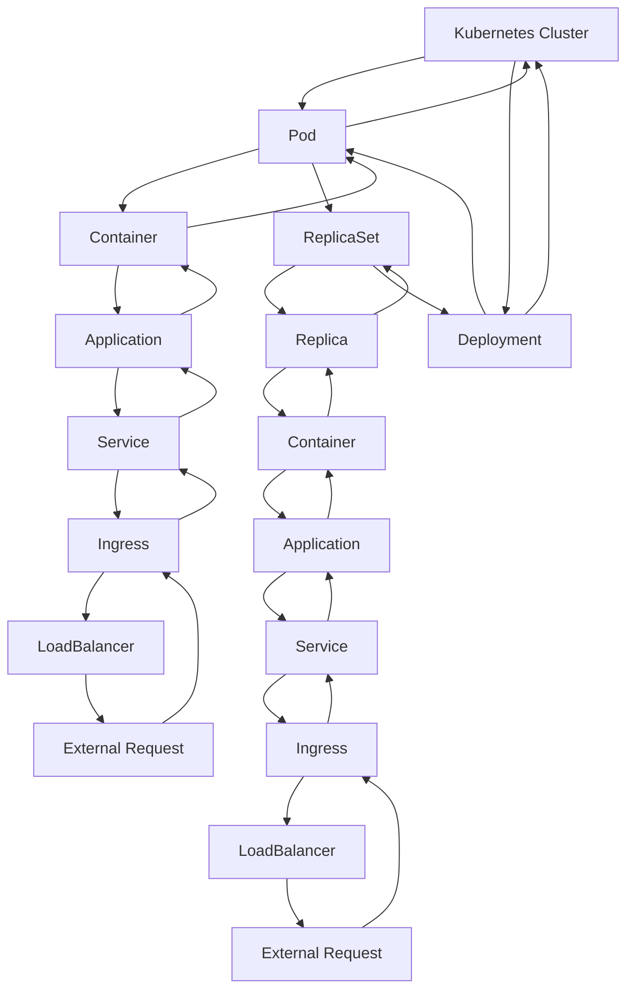

## Introduction
Kubernetes is an open-source container orchestration system that automates the deployment, scaling, and management of containerized applications. It was originally designed by Google, and is now maintained by the Cloud Native Computing Foundation (CNCF). Kubernetes provides a platform-agnostic way to deploy and manage applications, allowing developers to focus on writing code rather than managing infrastructure. In this section, we will explore the core concepts of Kubernetes, including Pods, Deployments, Services, and Ingress.

> **Note:** Kubernetes is a complex system, and mastering it requires a deep understanding of its core concepts and internal mechanics.

## Core Concepts
The following are the core concepts in Kubernetes:
* **Pods**: The basic execution unit in Kubernetes, comprising one or more containers.
* **Deployments**: A way to manage the rollout of new versions of an application.
* **Services**: An abstract way to expose an application to the outside world.
* **Ingress**: A way to manage incoming HTTP requests to an application.

> **Tip:** Understanding the relationship between these concepts is crucial to designing and deploying scalable applications on Kubernetes.

## How It Works Internally
Here's a high-level overview of how Kubernetes works internally:
1. A user creates a Deployment YAML file, specifying the application and its dependencies.
2. The user applies the YAML file to the Kubernetes cluster using the `kubectl` command.
3. The Kubernetes scheduler assigns the Pod to a worker node, taking into account factors such as resource availability and affinity.
4. The worker node pulls the required Docker images and starts the containers.
5. The Service is created, and the DNS name is registered with the cluster's DNS server.
6. Ingress is configured to route incoming HTTP requests to the Service.

> **Warning:** Misconfiguring the Ingress resource can lead to unexpected behavior and errors.

## Code Examples
### Example 1: Basic Pod
```yml
# pod.yaml
apiVersion: v1
kind: Pod
metadata:
  name: my-pod
spec:
  containers:
  - name: my-container
    image: nginx
    ports:
    - containerPort: 80
```
This YAML file defines a basic Pod with a single container running the `nginx` image.

### Example 2: Deployment with Service
```yml
# deployment.yaml
apiVersion: apps/v1
kind: Deployment
metadata:
  name: my-deployment
spec:
  replicas: 3
  selector:
    matchLabels:
      app: my-app
  template:
    metadata:
      labels:
        app: my-app
    spec:
      containers:
      - name: my-container
        image: nginx
        ports:
        - containerPort: 80
---
# service.yaml
apiVersion: v1
kind: Service
metadata:
  name: my-service
spec:
  selector:
    app: my-app
  ports:
  - name: http
    port: 80
    targetPort: 80
  type: LoadBalancer
```
This YAML file defines a Deployment with three replicas and a Service that exposes the application to the outside world.

### Example 3: Ingress with Path-Based Routing
```yml
# ingress.yaml
apiVersion: networking.k8s.io/v1
kind: Ingress
metadata:
  name: my-ingress
spec:
  rules:
  - host: my-app.com
    http:
      paths:
      - path: /api
        pathType: Prefix
        backend:
          service:
            name: my-service
            port:
              number: 80
      - path: /web
        pathType: Prefix
        backend:
          service:
            name: my-web-service
            port:
              number: 80
```
This YAML file defines an Ingress resource that routes incoming HTTP requests to the `my-service` Service based on the URL path.

## Visual Diagram

This diagram illustrates the relationship between the core concepts in Kubernetes.

> **Interview:** Can you explain the difference between a Pod and a Deployment?

## Comparison
| Approach | Time Complexity | Space Complexity | Pros | Cons | Best For |
| --- | --- | --- | --- | --- | --- |
| Pod | O(1) | O(1) | Simple, easy to manage | Limited scalability | Small applications |
| Deployment | O(log n) | O(n) | Scalable, easy to manage | Complex, resource-intensive | Large applications |
| Service | O(1) | O(1) | Abstract, easy to manage | Limited control | External applications |
| Ingress | O(log n) | O(n) | Flexible, easy to manage | Complex, resource-intensive | External applications |

## Real-world Use Cases
1. **Netflix**: Uses Kubernetes to manage its containerized applications, including the Netflix website and mobile apps.
2. **Airbnb**: Uses Kubernetes to manage its containerized applications, including the Airbnb website and mobile apps.
3. **Uber**: Uses Kubernetes to manage its containerized applications, including the Uber website and mobile apps.

> **Tip:** When designing a Kubernetes application, consider the trade-offs between scalability, manageability, and complexity.

## Common Pitfalls
1. **Insufficient resources**: Failing to allocate sufficient resources to the Pod can lead to performance issues and errors.
2. **Misconfigured Ingress**: Misconfiguring the Ingress resource can lead to unexpected behavior and errors.
3. **Unmanaged Deployments**: Failing to manage Deployments can lead to version conflicts and errors.
4. **Unsecured Services**: Failing to secure Services can lead to security vulnerabilities and errors.

> **Warning:** Misconfiguring the Kubernetes resources can lead to unexpected behavior and errors.

## Interview Tips
1. **What is the difference between a Pod and a Deployment?**: A Pod is a single instance of an application, while a Deployment is a way to manage multiple instances of an application.
2. **How do you configure Ingress in Kubernetes?**: Ingress is configured using the `Ingress` resource, which defines the routing rules for incoming HTTP requests.
3. **What is the purpose of a Service in Kubernetes?**: A Service provides an abstract way to expose an application to the outside world, allowing for load balancing and service discovery.

> **Note:** Understanding the core concepts and internal mechanics of Kubernetes is crucial to designing and deploying scalable applications.

## Key Takeaways
* **Pods are the basic execution unit in Kubernetes**: Pods comprise one or more containers and provide a way to manage the application lifecycle.
* **Deployments provide a way to manage multiple instances of an application**: Deployments allow for scalability, rolling updates, and self-healing.
* **Services provide an abstract way to expose an application**: Services allow for load balancing, service discovery, and external access to the application.
* **Ingress provides a way to manage incoming HTTP requests**: Ingress allows for flexible routing, SSL termination, and external access to the application.
* **Kubernetes provides a platform-agnostic way to deploy and manage applications**: Kubernetes allows for deployment on any infrastructure, including on-premises, cloud, and hybrid environments.
* **Understanding the core concepts and internal mechanics of Kubernetes is crucial to designing and deploying scalable applications**: Mastering Kubernetes requires a deep understanding of its core concepts, including Pods, Deployments, Services, and Ingress.