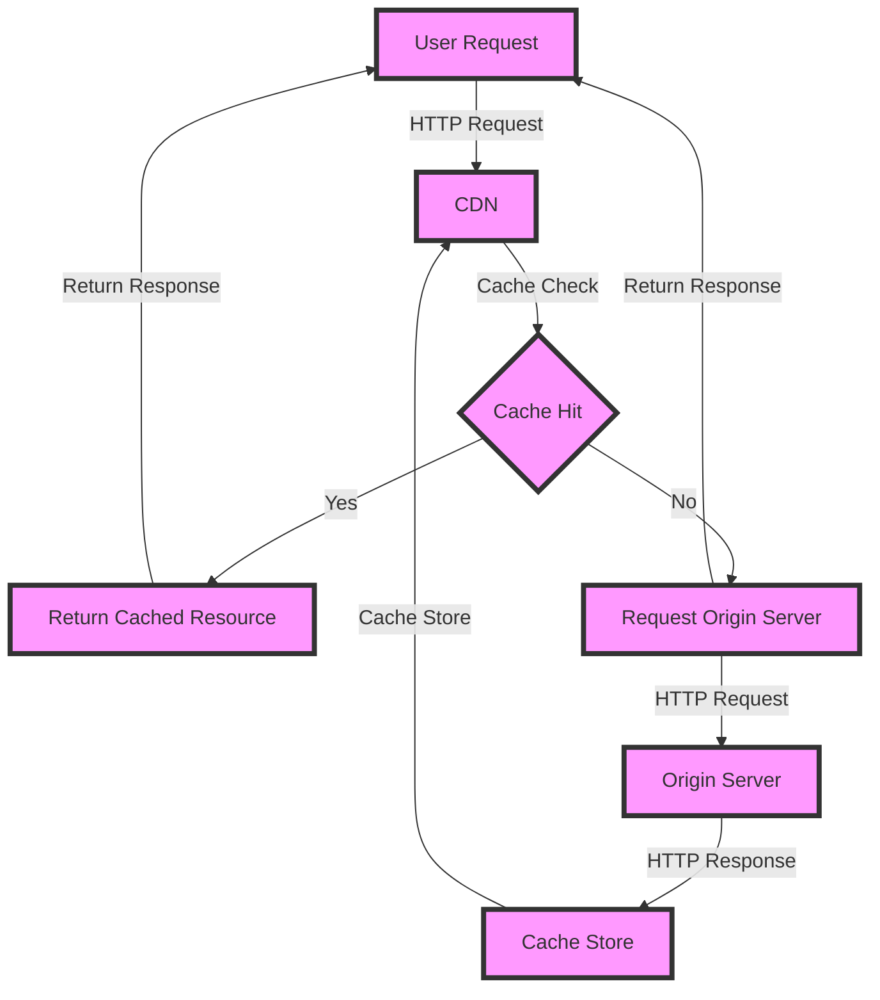

## Introduction
Stateless CDN caching is a technique used to improve the performance and scalability of web applications by caching frequently accessed resources at the edge of the network, closer to the users. This approach eliminates the need for servers to maintain session state, allowing for a more efficient and scalable caching mechanism. In this guide, we will explore the concepts, mechanics, and best practices of stateless CDN caching, and provide real-world examples of its application.

> **Note:** Stateless CDN caching is particularly useful for applications with high traffic and a large number of users, as it helps reduce the load on servers and improves page load times.

Stateless CDN caching is a crucial aspect of modern system design, as it enables developers to build scalable and performant applications that can handle a large number of users. By caching resources at the edge of the network, developers can reduce the latency and improve the overall user experience.

## Core Concepts
To understand stateless CDN caching, it's essential to grasp the following core concepts:

* **Cache**: A cache is a temporary storage location that stores frequently accessed resources, such as images, videos, and HTML files.
* **CDN (Content Delivery Network)**: A CDN is a network of distributed servers that cache and serve content at the edge of the network, closer to the users.
* **Stateless**: A stateless system is one that does not maintain any information about the user's session or state.
* **Cache invalidation**: Cache invalidation refers to the process of removing outdated or stale content from the cache.

> **Tip:** When designing a stateless CDN caching system, it's essential to consider the cache invalidation strategy to ensure that the cache remains up-to-date and accurate.

## How It Works Internally
Stateless CDN caching works by caching resources at the edge of the network, closer to the users. Here's a step-by-step breakdown of how it works:

1. **Request**: A user requests a resource, such as an image or HTML file, from the application.
2. **Cache check**: The CDN checks if the requested resource is cached at the edge of the network.
3. **Cache hit**: If the resource is cached, the CDN returns the cached resource to the user.
4. **Cache miss**: If the resource is not cached, the CDN requests the resource from the origin server.
5. **Cache store**: The CDN caches the resource at the edge of the network for future requests.

> **Warning:** If the cache invalidation strategy is not properly implemented, it can lead to stale content being served to users, resulting in a poor user experience.

## Code Examples
Here are three complete and runnable code examples that demonstrate the basics of stateless CDN caching:

### Example 1: Basic Cache Implementation
```python
import requests

class Cache:
    def __init__(self):
        self.cache = {}

    def get(self, url):
        if url in self.cache:
            return self.cache[url]
        else:
            response = requests.get(url)
            self.cache[url] = response.content
            return response.content

cache = Cache()
print(cache.get("https://example.com/image.jpg"))
```

### Example 2: Cache Invalidation using TTL
```java
import java.util.concurrent.TimeUnit;

public class Cache {
    private final long ttl; // time to live in seconds

    public Cache(long ttl) {
        this.ttl = ttl;
    }

    public String get(String url) {
        // check if the resource is cached
        if (isCached(url)) {
            // check if the cache is still valid
            if (isCacheValid(url)) {
                return getCacheContent(url);
            } else {
                // invalidate the cache and fetch the resource from the origin server
                invalidateCache(url);
                return fetchFromOriginServer(url);
            }
        } else {
            // cache the resource
            cacheResource(url);
            return getCacheContent(url);
        }
    }

    private boolean isCached(String url) {
        // implementation omitted
    }

    private boolean isCacheValid(String url) {
        // implementation omitted
    }

    private String getCacheContent(String url) {
        // implementation omitted
    }

    private void invalidateCache(String url) {
        // implementation omitted
    }

    private void cacheResource(String url) {
        // implementation omitted
    }

    private String fetchFromOriginServer(String url) {
        // implementation omitted
    }

    public static void main(String[] args) {
        Cache cache = new Cache(3600); // 1 hour TTL
        System.out.println(cache.get("https://example.com/image.jpg"));
    }
}
```

### Example 3: Advanced Cache Implementation using Redis
```javascript
const redis = require("redis");

class Cache {
    constructor() {
        this.client = redis.createClient();
    }

    async get(url) {
        const cacheKey = `cache:${url}`;
        const cachedValue = await this.client.get(cacheKey);
        if (cachedValue) {
            return cachedValue;
        } else {
            const response = await fetch(url);
            const cacheValue = await response.arrayBuffer();
            await this.client.set(cacheKey, cacheValue);
            return cacheValue;
        }
    }
}

const cache = new Cache();
cache.get("https://example.com/image.jpg").then((value) => {
    console.log(value);
});
```

## Visual Diagram

This diagram illustrates the flow of a user request through the CDN caching system.

## Comparison
| Approach | Time Complexity | Space Complexity | Pros | Cons | Best For |
| --- | --- | --- | --- | --- | --- |
| Basic Cache | O(1) | O(n) | Simple to implement, fast cache hits | Limited cache invalidation, prone to stale content | Small-scale applications |
| Cache Invalidation using TTL | O(1) | O(n) | Improves cache invalidation, reduces stale content | More complex to implement, requires careful TTL configuration | Medium-scale applications |
| Advanced Cache Implementation using Redis | O(1) | O(n) | Highly scalable, supports complex cache invalidation | Requires Redis expertise, adds additional infrastructure complexity | Large-scale applications |

> **Interview:** When asked about the trade-offs between different caching approaches, be sure to discuss the time and space complexities, as well as the pros and cons of each approach.

## Real-world Use Cases
Here are three real-world examples of stateless CDN caching in production:

1. **Netflix**: Netflix uses a combination of caching and content delivery networks (CDNs) to deliver high-quality video content to users worldwide.
2. **Amazon**: Amazon uses a stateless CDN caching system to cache product information and images, reducing the load on its origin servers and improving page load times.
3. **Google**: Google uses a stateless CDN caching system to cache search results and other dynamic content, improving the performance and scalability of its search engine.

## Common Pitfalls
Here are four common mistakes to avoid when implementing stateless CDN caching:

1. **Insufficient cache invalidation**: Failing to implement a proper cache invalidation strategy can lead to stale content being served to users.
2. **Inadequate cache sizing**: Failing to properly size the cache can lead to cache thrashing and poor performance.
3. **Incorrect cache key generation**: Using incorrect cache key generation can lead to cache collisions and poor performance.
4. **Inadequate monitoring and logging**: Failing to monitor and log cache performance can make it difficult to identify and troubleshoot issues.

> **Warning:** When implementing stateless CDN caching, be sure to carefully consider the cache invalidation strategy and cache sizing to avoid common pitfalls.

## Interview Tips
Here are three common interview questions related to stateless CDN caching, along with sample answers:

1. **What is the difference between a stateless and stateful caching system?**
	* Weak answer: "A stateless caching system doesn't store any information about the user's session, while a stateful caching system does."
	* Strong answer: "A stateless caching system is one that doesn't maintain any information about the user's session or state, whereas a stateful caching system maintains information about the user's session or state. This difference has significant implications for cache invalidation and cache sizing."
2. **How do you implement cache invalidation in a stateless CDN caching system?**
	* Weak answer: "I would use a TTL-based approach to implement cache invalidation."
	* Strong answer: "I would use a combination of TTL-based and event-based cache invalidation approaches to ensure that the cache remains up-to-date and accurate. This would involve implementing a cache invalidation strategy that takes into account the specific requirements of the application and the users."
3. **What are some common pitfalls to avoid when implementing stateless CDN caching?**
	* Weak answer: "I would avoid using a stateless caching system altogether, as it's too complex and prone to errors."
	* Strong answer: "I would avoid common pitfalls such as insufficient cache invalidation, inadequate cache sizing, incorrect cache key generation, and inadequate monitoring and logging. By carefully considering these factors and implementing a well-designed caching system, I can ensure that the application performs well and scales efficiently."

## Key Takeaways
Here are ten key takeaways to remember when implementing stateless CDN caching:

* **Use a stateless caching system to improve performance and scalability**.
* **Implement a proper cache invalidation strategy to ensure that the cache remains up-to-date and accurate**.
* **Use a combination of TTL-based and event-based cache invalidation approaches**.
* **Carefully consider cache sizing to avoid cache thrashing and poor performance**.
* **Use correct cache key generation to avoid cache collisions and poor performance**.
* **Monitor and log cache performance to identify and troubleshoot issues**.
* **Avoid common pitfalls such as insufficient cache invalidation and inadequate cache sizing**.
* **Use a caching system that supports complex cache invalidation and cache sizing**.
* **Consider using a CDN to deliver cached content to users worldwide**.
* **Carefully evaluate the trade-offs between different caching approaches and choose the best approach for the specific application and use case**.