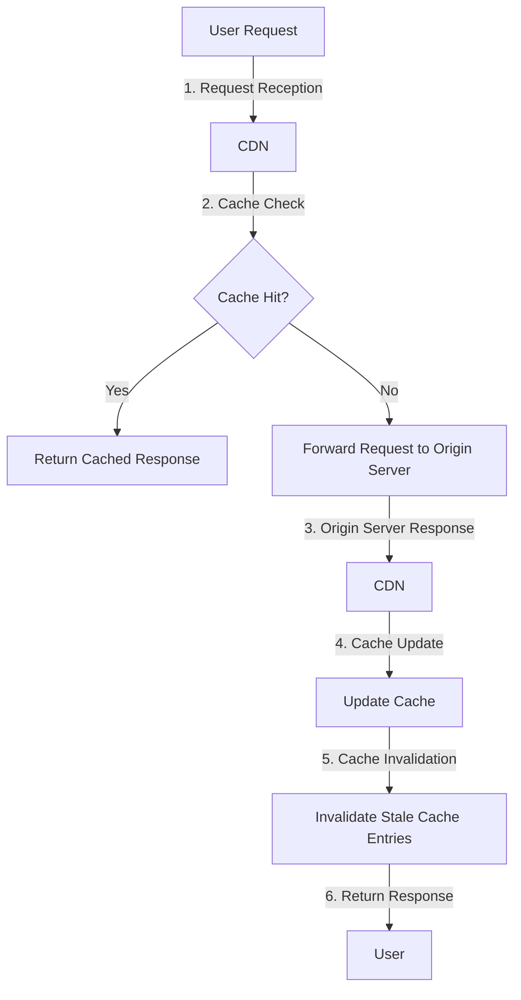

## Introduction
**CDN (Content Delivery Network) caching** is a technique used to reduce the latency of web applications by caching frequently accessed resources at edge locations closer to users. This approach helps to minimize the distance between users and the data they request, resulting in faster load times and improved user experience. In this study, we will explore the best practices for replicating decoupled CDN caching in production, including the core concepts, internal mechanics, and real-world examples.

> **Note:** Decoupled CDN caching refers to the separation of cache management from the application logic, allowing for more flexibility and scalability in cache deployment and management.

## Core Concepts
To understand CDN caching, it's essential to grasp the following key concepts:

* **Cache hit**: When a requested resource is found in the cache, it's considered a cache hit.
* **Cache miss**: When a requested resource is not found in the cache, it's considered a cache miss.
* **Time To Live (TTL)**: The time period during which a cached resource remains valid.
* **Cache invalidation**: The process of removing or updating cached resources when the underlying data changes.

> **Tip:** Using a cache with a high hit ratio can significantly reduce the load on the origin server and improve the overall performance of the application.

## How It Works Internally
Here's a step-by-step breakdown of how decoupled CDN caching works internally:

1. **Request reception**: The CDN receives a request for a resource from a user.
2. **Cache check**: The CDN checks if the requested resource is cached at the edge location.
3. **Cache hit**: If the resource is cached, the CDN returns the cached copy to the user.
4. **Cache miss**: If the resource is not cached, the CDN forwards the request to the origin server.
5. **Origin server response**: The origin server processes the request and returns the response to the CDN.
6. **Cache update**: The CDN updates the cache with the new response from the origin server.
7. **Cache invalidation**: The CDN invalidates any stale or outdated cache entries.

## Code Examples
Here are three complete and runnable code examples that demonstrate decoupled CDN caching:

### Example 1: Basic CDN Caching using Python
```python
import requests
from datetime import datetime, timedelta

class CDNCaching:
    def __init__(self, ttl=60):
        self.cache = {}
        self.ttl = ttl

    def get(self, url):
        if url in self.cache:
            cached_response = self.cache[url]
            if cached_response['expires'] > datetime.now():
                return cached_response['response']
        response = requests.get(url)
        self.cache[url] = {
            'response': response,
            'expires': datetime.now() + timedelta(seconds=self.ttl)
        }
        return response

cdn_caching = CDNCaching(ttl=300)
response = cdn_caching.get('https://example.com/resource')
print(response.text)
```

### Example 2: Real-World CDN Caching using Node.js and Redis
```javascript
const express = require('express');
const redis = require('redis');

const app = express();
const client = redis.createClient();

app.get('/resource', (req, res) => {
    client.get('resource', (err, reply) => {
        if (reply) {
            res.send(reply);
        } else {
            // fetch resource from origin server
            const originResponse = fetch('https://origin-server.com/resource');
            client.set('resource', originResponse, 'EX', 300);
            res.send(originResponse);
        }
    });
});

app.listen(3000, () => {
    console.log('CDN caching server listening on port 3000');
});
```

### Example 3: Advanced CDN Caching with Cache Invalidation using Go
```go
package main

import (
    "fmt"
    "net/http"
    "time"

    "github.com/go-redis/redis/v8"
)

var client *redis.Client

func main() {
    client = redis.NewClient(&redis.Options{
        Addr:     "localhost:6379",
        Password: "",
        DB:       0,
    })

    http.HandleFunc("/resource", func(w http.ResponseWriter, r *http.Request) {
        reply, err := client.Get("resource").Result()
        if err != redis.Nil {
            fmt.Fprint(w, reply)
        } else {
            // fetch resource from origin server
            originResponse := fetchOriginServer()
            client.Set("resource", originResponse, 300*time.Second)
            fmt.Fprint(w, originResponse)
        }
    })

    http.ListenAndServe(":3000", nil)
}

func fetchOriginServer() string {
    // implement origin server fetch logic
    return "origin server response"
}
```

## Visual Diagram

The diagram illustrates the steps involved in decoupled CDN caching, from request reception to cache update and invalidation.

## Comparison
| Approach | Time Complexity | Space Complexity | Pros | Cons | Best For |
| --- | --- | --- | --- | --- | --- |
| Basic CDN Caching | O(1) | O(n) | Simple to implement, reduces origin server load | Limited cache control, no cache invalidation | Small-scale applications |
| Real-World CDN Caching with Redis | O(1) | O(n) | Scalable, supports cache invalidation | Requires Redis setup and maintenance | Large-scale applications |
| Advanced CDN Caching with Cache Invalidation | O(1) | O(n) | Supports cache invalidation, reduces cache thrashing | Complex to implement, requires custom logic | High-traffic applications |

## Real-world Use Cases
Here are three real-world examples of decoupled CDN caching:

* **Netflix**: Uses a custom CDN caching solution to cache video content at edge locations, reducing latency and improving user experience.
* **Amazon**: Employs a CDN caching solution to cache static resources, such as images and CSS files, at edge locations, reducing the load on origin servers.
* **Google**: Uses a CDN caching solution to cache search results and other dynamic content, improving search performance and reducing latency.

## Common Pitfalls
Here are four common mistakes to avoid when implementing decoupled CDN caching:

* **Insufficient cache invalidation**: Failing to invalidate stale cache entries can lead to incorrect data being served to users.
* **Incorrect cache configuration**: Misconfiguring cache settings, such as TTL or cache size, can lead to poor cache performance or cache thrashing.
* **Inadequate cache monitoring**: Failing to monitor cache performance and health can lead to cache-related issues going undetected.
* **Incompatible cache solutions**: Using incompatible cache solutions, such as caching solutions that don't support cache invalidation, can lead to cache-related issues.

## Interview Tips
Here are three common interview questions related to decoupled CDN caching:

* **What is CDN caching, and how does it work?**: A strong answer should explain the basics of CDN caching, including cache hits, cache misses, and cache invalidation.
* **How would you implement CDN caching in a web application?**: A strong answer should provide a high-level overview of the implementation process, including cache configuration, cache invalidation, and cache monitoring.
* **What are some common pitfalls to avoid when implementing CDN caching?**: A strong answer should identify common pitfalls, such as insufficient cache invalidation or incorrect cache configuration, and provide strategies for avoiding them.

## Key Takeaways
Here are six key takeaways to remember when implementing decoupled CDN caching:

* **Use a scalable cache solution**: Choose a cache solution that can handle high traffic and large amounts of data.
* **Implement cache invalidation**: Use cache invalidation to remove stale cache entries and ensure data consistency.
* **Monitor cache performance**: Monitor cache performance and health to detect issues and optimize cache configuration.
* **Use a suitable cache configuration**: Choose a cache configuration that balances cache hits and cache misses.
* **Avoid common pitfalls**: Be aware of common pitfalls, such as insufficient cache invalidation or incorrect cache configuration, and take steps to avoid them.
* **Test and optimize**: Test and optimize cache configuration and implementation to ensure optimal performance and data consistency.