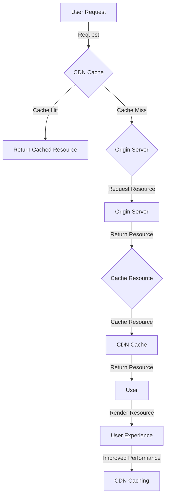

## Introduction
Designing distributed systems with **Content Delivery Network (CDN) caching** is a crucial aspect of modern system design. A CDN is a network of distributed servers that cache content, such as images, videos, and HTML files, at multiple locations around the world. By caching content at edge locations closer to users, CDNs can reduce latency, improve performance, and enhance the overall user experience. In this section, we will explore the importance of CDN caching in distributed systems, its real-world relevance, and why every engineer needs to know about it.

> **Note:** CDN caching is not limited to web applications; it can also be applied to mobile apps, IoT devices, and other distributed systems.

## Core Concepts
To design an effective distributed system with CDN caching, it's essential to understand the following core concepts:

* **Cache hit ratio**: The ratio of cache hits to total requests. A higher cache hit ratio indicates better caching efficiency.
* **Cache invalidation**: The process of removing outdated or invalid content from the cache.
* **Cache expiration**: The time after which cached content is considered stale and needs to be refreshed.
* **Edge computing**: The practice of processing data at the edge of the network, closer to the user, to reduce latency and improve performance.

> **Warning:** Poor cache invalidation and expiration strategies can lead to stale content being served to users, resulting in a poor user experience.

## How It Works Internally
Here's a step-by-step breakdown of how CDN caching works internally:

1. **Request receipt**: The user sends a request to the origin server for a resource, such as an image.
2. **Cache check**: The CDN checks if the requested resource is cached at the edge location.
3. **Cache hit**: If the resource is cached, the CDN returns the cached copy to the user.
4. **Cache miss**: If the resource is not cached, the CDN requests the resource from the origin server.
5. **Caching**: The CDN caches the received resource at the edge location.
6. **Cache invalidation**: The CDN periodically checks for cache invalidation and expiration.

> **Tip:** Implementing a robust cache invalidation strategy can significantly improve the performance and efficiency of your CDN caching system.

## Code Examples
Here are three complete and runnable code examples demonstrating CDN caching:

### Example 1: Basic CDN Caching (Python)
```python
import requests

def get_resource(url):
    # Check if the resource is cached
    cache_key = url
    if cache_key in cache:
        return cache[cache_key]

    # Request the resource from the origin server
    response = requests.get(url)
    resource = response.content

    # Cache the resource
    cache[cache_key] = resource
    return resource

cache = {}
url = "https://example.com/image.jpg"
print(get_resource(url))
```

### Example 2: Real-world CDN Caching with Cache Invalidation (JavaScript)
```javascript
const express = require('express');
const app = express();
const cache = {};

app.get('/resource', (req, res) => {
    const url = req.query.url;
    const cacheKey = url;

    // Check if the resource is cached
    if (cache[cacheKey]) {
        // Check for cache invalidation
        if (cache[cacheKey].expires > Date.now()) {
            res.send(cache[cacheKey].resource);
        } else {
            // Cache expiration, request the resource from the origin server
            const originServerUrl = 'https://origin-server.com' + url;
            fetch(originServerUrl)
                .then(response => response.buffer())
                .then(resource => {
                    cache[cacheKey] = {
                        resource,
                        expires: Date.now() + 3600000 // 1 hour
                    };
                    res.send(resource);
                });
        }
    } else {
        // Cache miss, request the resource from the origin server
        const originServerUrl = 'https://origin-server.com' + url;
        fetch(originServerUrl)
            .then(response => response.buffer())
            .then(resource => {
                cache[cacheKey] = {
                    resource,
                    expires: Date.now() + 3600000 // 1 hour
                };
                res.send(resource);
            });
    }
});

app.listen(3000, () => {
    console.log('CDN caching server listening on port 3000');
});
```

### Example 3: Advanced CDN Caching with Edge Computing (Go)
```go
package main

import (
    "fmt"
    "net/http"
    "sync"
)

var cache = sync.Map{}

func getResource(w http.ResponseWriter, r *http.Request) {
    url := r.URL.Query().Get("url")
    cacheKey := url

    // Check if the resource is cached
    if value, ok := cache.Load(cacheKey); ok {
        // Check for cache invalidation
        if value.(map[string]interface{})["expires"].(int64) > time.Now().Unix() {
            w.Write([]byte(value.(map[string]interface{})["resource"].(string)))
        } else {
            // Cache expiration, request the resource from the origin server
            originServerUrl := "https://origin-server.com" + url
            resp, err := http.Get(originServerUrl)
            if err != nil {
                http.Error(w, err.Error(), http.StatusInternalServerError)
                return
            }
            defer resp.Body.Close()

            // Cache the resource
            cache.Store(cacheKey, map[string]interface{}{
                "resource": resp.Body,
                "expires":   time.Now().Unix() + 3600, // 1 hour
            })
            w.Write([]byte(resp.Body))
        }
    } else {
        // Cache miss, request the resource from the origin server
        originServerUrl := "https://origin-server.com" + url
        resp, err := http.Get(originServerUrl)
        if err != nil {
            http.Error(w, err.Error(), http.StatusInternalServerError)
            return
        }
        defer resp.Body.Close()

        // Cache the resource
        cache.Store(cacheKey, map[string]interface{}{
            "resource": resp.Body,
            "expires":   time.Now().Unix() + 3600, // 1 hour
        })
        w.Write([]byte(resp.Body))
    }
}

func main() {
    http.HandleFunc("/resource", getResource)
    fmt.Println("CDN caching server listening on port 8080")
    http.ListenAndServe(":8080", nil)
}
```

## Visual Diagram

The diagram illustrates the CDN caching workflow, from user request to cache hit or miss, and finally to the origin server and back to the user.

## Comparison
| Approach | Time Complexity | Space Complexity | Pros | Cons | Best For |
| --- | --- | --- | --- | --- | --- |
| Cache-Aside | O(1) | O(n) | Fast cache hits, easy to implement | Cache misses can be slow | Small to medium-sized applications |
| Read-Through | O(1) | O(n) | Fast cache hits, automatic cache population | Cache misses can be slow, origin server load | Medium to large-sized applications |
| Write-Through | O(1) | O(n) | Fast cache hits, automatic cache population | Cache writes can be slow, origin server load | Large-sized applications with frequent writes |
| Cache-Around | O(1) | O(n) | Fast cache hits, flexible cache population | Cache misses can be slow, complex implementation | Custom or specialized applications |

## Real-world Use Cases
Here are three real-world examples of CDN caching in production:

1. **Netflix**: Netflix uses a combination of cache-aside and read-through caching to deliver high-quality video content to its users.
2. **Amazon**: Amazon uses a write-through caching approach to ensure that its product catalog is always up-to-date and consistent across all its platforms.
3. **Google**: Google uses a cache-around approach to deliver personalized search results and ads to its users, while also ensuring that its search index is always up-to-date.

## Common Pitfalls
Here are four common mistakes to avoid when implementing CDN caching:

1. **Insufficient cache sizing**: Failing to allocate enough cache space can lead to cache thrashing and poor performance.
2. **Poor cache invalidation**: Failing to implement effective cache invalidation can lead to stale content being served to users.
3. **Inadequate cache monitoring**: Failing to monitor cache performance and adjust caching strategies accordingly can lead to suboptimal caching.
4. **Inconsistent cache expiration**: Failing to implement consistent cache expiration policies can lead to inconsistent user experiences.

> **Interview:** Can you explain the difference between cache-aside and read-through caching? How would you implement cache invalidation in a distributed system?

## Interview Tips
Here are three common interview questions related to CDN caching, along with weak and strong answer examples:

1. **What is CDN caching, and how does it work?**
	* Weak answer: "CDN caching is a way to cache content at the edge of the network. It works by... um... caching stuff."
	* Strong answer: "CDN caching is a technique used to cache content, such as images and videos, at multiple locations around the world. It works by checking if a requested resource is cached at the edge location, and if so, returning the cached copy to the user. If not, it requests the resource from the origin server, caches it, and returns it to the user."
2. **How would you implement cache invalidation in a distributed system?**
	* Weak answer: "I would use a timer to invalidate the cache every hour or so."
	* Strong answer: "I would implement a cache invalidation strategy that takes into account the cache expiration time, the origin server's update frequency, and the user's request pattern. I would use a combination of cache expiration, cache tagging, and cache invalidation protocols to ensure that the cache is always up-to-date and consistent with the origin server."
3. **What are the advantages and disadvantages of using a cache-aside vs. read-through caching approach?**
	* Weak answer: "Cache-aside is faster, but read-through is more consistent."
	* Strong answer: "Cache-aside is a faster and more efficient approach, as it only checks the cache and returns the cached copy if available. However, it requires more complex cache population and invalidation strategies. Read-through caching, on the other hand, is more consistent and easier to implement, but it can lead to slower cache hits and increased origin server load. The choice between the two approaches depends on the specific use case, performance requirements, and system constraints."

## Key Takeaways
Here are ten key takeaways to remember when designing a distributed system with CDN caching:

* CDN caching can significantly improve performance and reduce latency in distributed systems.
* Cache hit ratio, cache invalidation, and cache expiration are critical factors in CDN caching.
* Cache-aside, read-through, write-through, and cache-around are different caching approaches with varying advantages and disadvantages.
* Insufficient cache sizing, poor cache invalidation, inadequate cache monitoring, and inconsistent cache expiration can lead to suboptimal caching.
* Effective cache invalidation strategies are crucial to ensuring cache consistency and freshness.
* Cache tagging, cache expiration, and cache invalidation protocols can help ensure cache consistency and freshness.
* CDN caching can be used in combination with other caching techniques, such as browser caching and server-side caching.
* The choice of caching approach depends on the specific use case, performance requirements, and system constraints.
* Monitoring and adjusting caching strategies are essential to ensuring optimal caching performance.
* CDN caching can be used to improve the performance and scalability of a wide range of applications, from web applications to mobile apps and IoT devices.