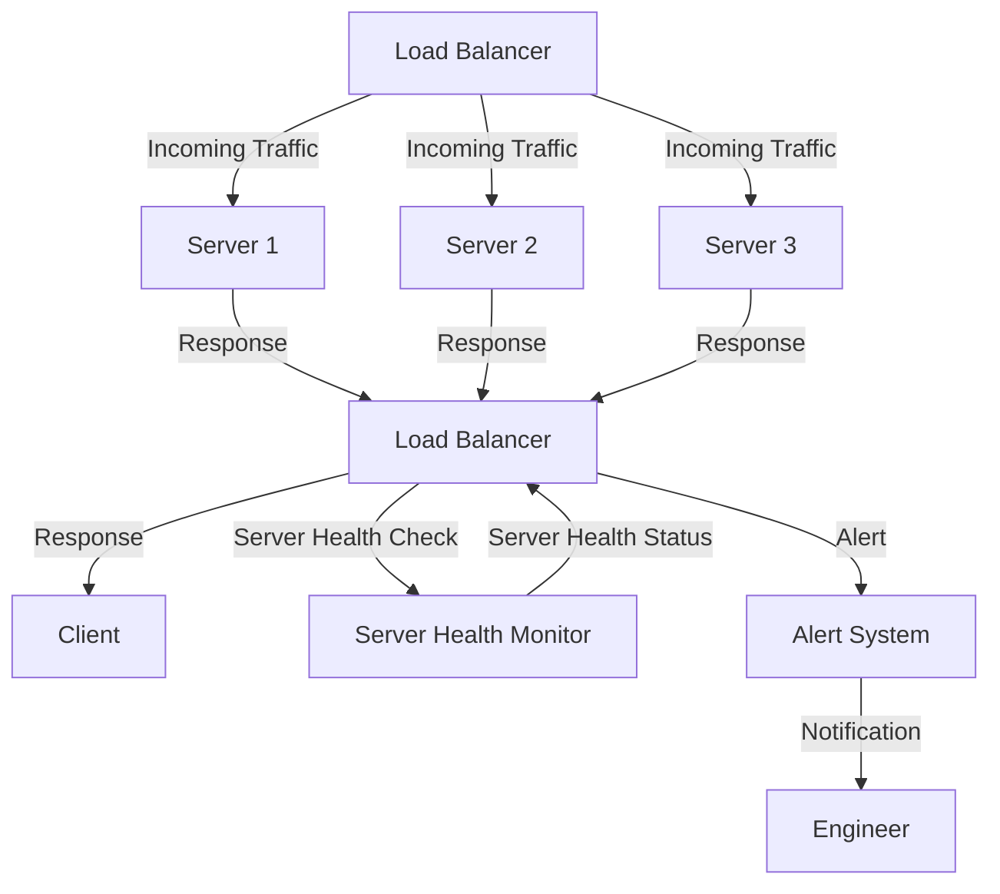

## Introduction
Monitoring load balancer routing is a critical component of high-performance applications, as it ensures that incoming traffic is distributed efficiently across multiple servers to prevent any single point of failure. **Load balancing** is a technique used to distribute workload across multiple servers to improve responsiveness, reliability, and scalability of applications. In this section, we will discuss the importance of monitoring load balancer routing, its real-world relevance, and why every engineer needs to know this.

> **Note:** Load balancer monitoring is not just about ensuring that traffic is distributed correctly, but also about identifying potential issues before they become critical. This includes monitoring server health, response times, and traffic patterns to ensure that the application is performing optimally.

Real-world relevance of load balancer monitoring can be seen in applications such as **Netflix**, **Amazon**, and **Google**, where thousands of servers are used to distribute traffic and ensure high availability. Every engineer needs to know about load balancer monitoring because it is a critical component of system design, and understanding how it works is essential for building scalable and reliable applications.

## Core Concepts
**Load balancer** is a device or software that distributes incoming network traffic across multiple servers to improve responsiveness, reliability, and scalability of applications. **Routing** refers to the process of directing traffic from one server to another based on predefined rules. **Monitoring** refers to the process of tracking and analyzing the performance of load balancers and servers to ensure that the application is performing optimally.

> **Tip:** When designing a load balancer monitoring system, it's essential to consider factors such as server health, response times, and traffic patterns to ensure that the application is performing optimally.

Key terminology in load balancer monitoring includes:

* **Server health**: refers to the status of a server, including its responsiveness, CPU usage, and memory usage.
* **Response time**: refers to the time it takes for a server to respond to a request.
* **Traffic pattern**: refers to the pattern of incoming traffic, including the number of requests, request size, and request type.

## How It Works Internally
Load balancer monitoring works by tracking and analyzing the performance of load balancers and servers in real-time. This includes monitoring server health, response times, and traffic patterns to ensure that the application is performing optimally.

Here's a step-by-step breakdown of how load balancer monitoring works internally:

1. **Data collection**: The load balancer monitoring system collects data from load balancers and servers, including server health, response times, and traffic patterns.
2. **Data analysis**: The collected data is analyzed in real-time to identify potential issues, such as server overload or network congestion.
3. **Alerting**: The monitoring system sends alerts to engineers and administrators when potential issues are detected, allowing them to take corrective action before the issue becomes critical.
4. **Reporting**: The monitoring system generates reports on the performance of load balancers and servers, providing insights into traffic patterns, server health, and response times.

> **Warning:** Failure to monitor load balancer routing can result in poor application performance, increased latency, and decreased user satisfaction.

## Code Examples
Here are three complete and runnable code examples that demonstrate load balancer monitoring:

### Example 1: Basic Load Balancer Monitoring
```python
import requests
import time

def monitor_load_balancer(load_balancer_url):
    while True:
        response = requests.get(load_balancer_url)
        if response.status_code != 200:
            print("Load balancer is down")
            break
        time.sleep(1)

monitor_load_balancer("https://example.com/load-balancer")
```
This example demonstrates a basic load balancer monitoring system that checks the status of a load balancer every second.

### Example 2: Advanced Load Balancer Monitoring
```java
import java.net.HttpURLConnection;
import java.net.URL;

public class LoadBalancerMonitor {
    public static void main(String[] args) {
        String loadBalancerUrl = "https://example.com/load-balancer";
        while (true) {
            try {
                URL url = new URL(loadBalancerUrl);
                HttpURLConnection connection = (HttpURLConnection) url.openConnection();
                connection.setRequestMethod("GET");
                int responseCode = connection.getResponseCode();
                if (responseCode != 200) {
                    System.out.println("Load balancer is down");
                    break;
                }
                Thread.sleep(1000);
            } catch (Exception e) {
                System.out.println("Error monitoring load balancer: " + e.getMessage());
            }
        }
    }
}
```
This example demonstrates an advanced load balancer monitoring system that checks the status of a load balancer every second and handles exceptions.

### Example 3: Load Balancer Monitoring with Server Health Checks
```javascript
const axios = require('axios');

async function monitorLoadBalancer(loadBalancerUrl) {
    while (true) {
        try {
            const response = await axios.get(loadBalancerUrl);
            if (response.status !== 200) {
                console.log("Load balancer is down");
                break;
            }
            const serverHealth = await axios.get(`${loadBalancerUrl}/server-health`);
            if (serverHealth.status !== 200) {
                console.log("Server health check failed");
                break;
            }
            await new Promise(resolve => setTimeout(resolve, 1000));
        } catch (error) {
            console.log("Error monitoring load balancer: " + error.message);
        }
    }
}

monitorLoadBalancer("https://example.com/load-balancer");
```
This example demonstrates a load balancer monitoring system that checks the status of a load balancer and performs server health checks every second.

## Visual Diagram

This diagram illustrates the flow of incoming traffic through a load balancer and servers, as well as the server health check and alerting mechanisms.

> **Tip:** When designing a load balancer monitoring system, it's essential to consider the flow of incoming traffic and the server health check mechanisms to ensure that the application is performing optimally.

## Comparison
| Load Balancer | Time Complexity | Space Complexity | Pros | Cons | Best For |
| --- | --- | --- | --- | --- | --- |
| Round-Robin | O(1) | O(1) | Simple to implement, efficient | May not handle varying server capacities | Small-scale applications |
| Least Connection | O(log n) | O(n) | Handles varying server capacities, efficient | More complex to implement | Medium-scale applications |
| IP Hash | O(1) | O(1) | Simple to implement, efficient | May not handle varying server capacities | Small-scale applications |
| Geographic | O(log n) | O(n) | Handles varying server capacities, efficient | More complex to implement | Large-scale applications |

> **Interview:** When asked about load balancer monitoring in an interview, be prepared to discuss the different types of load balancers, their time and space complexities, and their pros and cons. Also, be prepared to explain how load balancer monitoring works internally and how to design a load balancer monitoring system.

## Real-world Use Cases
Here are three real-world use cases of load balancer monitoring:

1. **Netflix**: Netflix uses a load balancer monitoring system to ensure that its streaming services are always available and responsive. The system monitors the health of servers and load balancers in real-time and sends alerts to engineers when potential issues are detected.
2. **Amazon**: Amazon uses a load balancer monitoring system to ensure that its e-commerce platform is always available and responsive. The system monitors the health of servers and load balancers in real-time and sends alerts to engineers when potential issues are detected.
3. **Google**: Google uses a load balancer monitoring system to ensure that its search engine is always available and responsive. The system monitors the health of servers and load balancers in real-time and sends alerts to engineers when potential issues are detected.

## Common Pitfalls
Here are four common pitfalls to watch out for when implementing load balancer monitoring:

1. **Not monitoring server health**: Failing to monitor server health can result in poor application performance and increased latency.
2. **Not handling varying server capacities**: Failing to handle varying server capacities can result in poor application performance and increased latency.
3. **Not implementing alerting mechanisms**: Failing to implement alerting mechanisms can result in delayed detection of potential issues.
4. **Not testing the monitoring system**: Failing to test the monitoring system can result in poor application performance and increased latency.

> **Warning:** Not monitoring load balancer routing can result in poor application performance, increased latency, and decreased user satisfaction.

## Interview Tips
Here are three common interview questions related to load balancer monitoring, along with weak and strong answers:

1. **What is load balancer monitoring?**
	* Weak answer: "Load balancer monitoring is just checking if the load balancer is up or down."
	* Strong answer: "Load balancer monitoring is the process of tracking and analyzing the performance of load balancers and servers in real-time to ensure that the application is performing optimally."
2. **How does load balancer monitoring work internally?**
	* Weak answer: "I'm not sure, but it probably involves some kind of scripting."
	* Strong answer: "Load balancer monitoring works by collecting data from load balancers and servers, analyzing the data in real-time, and sending alerts to engineers when potential issues are detected."
3. **What are some common pitfalls to watch out for when implementing load balancer monitoring?**
	* Weak answer: "I'm not sure, but probably something about not monitoring server health."
	* Strong answer: "Some common pitfalls to watch out for when implementing load balancer monitoring include not monitoring server health, not handling varying server capacities, not implementing alerting mechanisms, and not testing the monitoring system."

## Key Takeaways
Here are ten key takeaways to remember about load balancer monitoring:

* Load balancer monitoring is critical for ensuring high application performance and availability.
* Load balancer monitoring involves tracking and analyzing the performance of load balancers and servers in real-time.
* Load balancer monitoring can be done using various techniques, including round-robin, least connection, IP hash, and geographic.
* Load balancer monitoring should include server health checks and alerting mechanisms.
* Load balancer monitoring should be tested regularly to ensure that it is working correctly.
* Load balancer monitoring can be done using various tools and technologies, including scripting languages and monitoring software.
* Load balancer monitoring should be done in real-time to ensure that potential issues are detected quickly.
* Load balancer monitoring should include analysis of traffic patterns and server response times.
* Load balancer monitoring should be done in a way that is scalable and efficient.
* Load balancer monitoring should be done in a way that is secure and reliable.