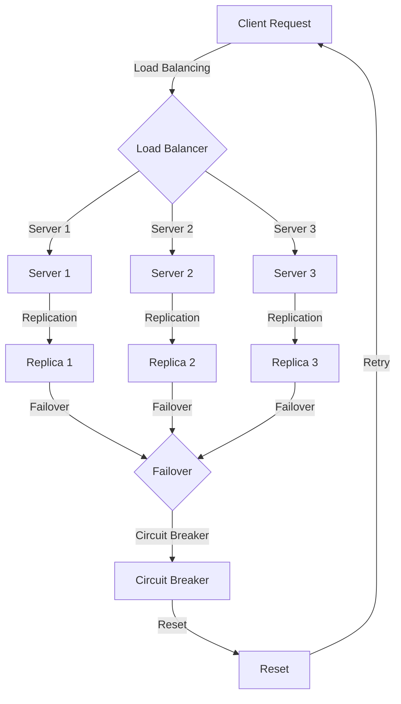

## Introduction
**Availability**, **Reliability**, and **Fault Tolerance** are three fundamental concepts in system design that ensure a system can operate continuously, recover from failures, and maintain its functionality even in the presence of errors. These concepts are crucial in designing high-availability systems, such as e-commerce platforms, online banking systems, and cloud services, where downtime can result in significant financial losses and damage to reputation. Every engineer needs to understand these concepts to design and build robust, scalable, and fault-tolerant systems.

> **Note:** Availability refers to the percentage of time a system is operational and accessible to users, while reliability refers to the probability of a system functioning correctly over a given period. Fault tolerance, on the other hand, refers to a system's ability to continue operating even when one or more components fail.

## Core Concepts
To understand availability, reliability, and fault tolerance, we need to grasp the following key concepts:

* **Mean Time Between Failures (MTBF)**: the average time a system operates before failing
* **Mean Time To Repair (MTTR)**: the average time it takes to repair a system after a failure
* **Mean Time To Failure (MTTF)**: the average time a system operates before failing, assuming it is not repaired
* **Single Point of Failure (SPOF)**: a component that, when failed, causes the entire system to fail
* **Redundancy**: the use of duplicate components to ensure system availability

> **Warning:** A single point of failure can bring down an entire system, resulting in significant downtime and financial losses.

## How It Works Internally
To achieve high availability, reliability, and fault tolerance, systems use various techniques, such as:

1. **Load Balancing**: distributing incoming traffic across multiple servers to prevent overload and ensure responsiveness
2. **Replication**: duplicating data or services to ensure availability in case of failure
3. **Failover**: automatically switching to a backup system or component in case of failure
4. **Error Detection and Correction**: detecting and correcting errors in real-time to prevent system failure

> **Tip:** Implementing load balancing and replication can significantly improve system availability and reliability.

## Code Examples
Here are three complete and runnable code examples demonstrating availability, reliability, and fault tolerance:

### Example 1: Basic Load Balancing
```python
import random

class LoadBalancer:
    def __init__(self, servers):
        self.servers = servers

    def get_server(self):
        return random.choice(self.servers)

# Create a load balancer with 3 servers
load_balancer = LoadBalancer(["Server 1", "Server 2", "Server 3"])

# Get a server
server = load_balancer.get_server()
print(server)
```

### Example 2: Replication with Redis
```python
import redis

# Create a Redis client
redis_client = redis.Redis(host='localhost', port=6379, db=0)

# Set a value
redis_client.set('key', 'value')

# Get the value from a replica
replica_client = redis.Redis(host='localhost', port=6380, db=0)
value = replica_client.get('key')
print(value)
```

### Example 3: Failover with a Circuit Breaker
```java
import java.util.concurrent.TimeUnit;

public class CircuitBreaker {
    private boolean isOpen;
    private long timeout;

    public CircuitBreaker(long timeout) {
        this.timeout = timeout;
    }

    public boolean isOpen() {
        return isOpen;
    }

    public void reset() {
        isOpen = false;
    }

    public boolean tryExecute(Runnable runnable) {
        if (isOpen) {
            return false;
        }

        try {
            runnable.run();
            return true;
        } catch (Exception e) {
            isOpen = true;
            // Schedule a reset after the timeout
            TimeUnit.SECONDS.sleep(timeout);
            reset();
            return false;
        }
    }
}
```

## Visual Diagram

This diagram illustrates a load-balanced system with replication and failover, using a circuit breaker to detect and prevent cascading failures.

> **Note:** The circuit breaker pattern is used to detect when a service is not responding and prevent further requests from being sent to it, allowing the system to recover and preventing cascading failures.

## Comparison
Here is a comparison of different availability, reliability, and fault tolerance strategies:

| Approach | Time Complexity | Space Complexity | Pros | Cons | Best For |
| --- | --- | --- | --- | --- | --- |
| Load Balancing | O(1) | O(n) | Improves responsiveness, reduces overload | Requires additional hardware | Web servers, databases |
| Replication | O(n) | O(n) | Ensures data availability, improves reliability | Increases storage requirements | Databases, file systems |
| Failover | O(1) | O(1) | Automatically switches to backup system | Requires additional hardware, may introduce downtime | Critical systems, high-availability environments |
| Circuit Breaker | O(1) | O(1) | Detects and prevents cascading failures | May introduce additional latency | Microservices, distributed systems |

## Real-world Use Cases
Here are three real-world examples of availability, reliability, and fault tolerance in production systems:

* **Netflix**: uses a combination of load balancing, replication, and failover to ensure high availability and reliability of its streaming service
* **Amazon Web Services (AWS)**: provides a range of availability, reliability, and fault tolerance features, including load balancing, replication, and failover, to its customers
* **Google Cloud Platform (GCP)**: uses a combination of load balancing, replication, and failover to ensure high availability and reliability of its cloud services

> **Tip:** Implementing availability, reliability, and fault tolerance strategies can significantly improve the overall quality and reliability of a system.

## Common Pitfalls
Here are four common mistakes to avoid when implementing availability, reliability, and fault tolerance:

* **Not testing for failures**: failing to test a system for failures can result in unexpected behavior and downtime
* **Not implementing load balancing**: failing to implement load balancing can result in overload and downtime
* **Not replicating data**: failing to replicate data can result in data loss and downtime
* **Not implementing failover**: failing to implement failover can result in downtime and data loss

> **Warning:** Not testing for failures can result in significant downtime and financial losses.

## Interview Tips
Here are three common interview questions related to availability, reliability, and fault tolerance, along with weak and strong answers:

* **Question:** What is the difference between availability and reliability?
* **Weak answer:** Availability is when a system is up and running, while reliability is when a system is working correctly.
* **Strong answer:** Availability refers to the percentage of time a system is operational and accessible to users, while reliability refers to the probability of a system functioning correctly over a given period.
* **Question:** How would you implement load balancing in a system?
* **Weak answer:** I would use a load balancer to distribute traffic across multiple servers.
* **Strong answer:** I would use a load balancer to distribute traffic across multiple servers, and also implement replication and failover to ensure high availability and reliability.
* **Question:** What is the circuit breaker pattern, and how does it improve system reliability?
* **Weak answer:** The circuit breaker pattern is used to detect when a service is not responding and prevent further requests from being sent to it.
* **Strong answer:** The circuit breaker pattern is used to detect when a service is not responding and prevent further requests from being sent to it, allowing the system to recover and preventing cascading failures.

## Key Takeaways
Here are ten key takeaways to remember:

* Availability refers to the percentage of time a system is operational and accessible to users
* Reliability refers to the probability of a system functioning correctly over a given period
* Fault tolerance refers to a system's ability to continue operating even when one or more components fail
* Load balancing can improve responsiveness and reduce overload
* Replication can ensure data availability and improve reliability
* Failover can automatically switch to a backup system in case of failure
* The circuit breaker pattern can detect and prevent cascading failures
* Implementing availability, reliability, and fault tolerance strategies can significantly improve the overall quality and reliability of a system
* Not testing for failures can result in significant downtime and financial losses
* Implementing load balancing, replication, and failover can ensure high availability and reliability of a system

> **Interview:** Be prepared to answer questions about availability, reliability, and fault tolerance, and be able to provide examples of how you would implement these strategies in a system.