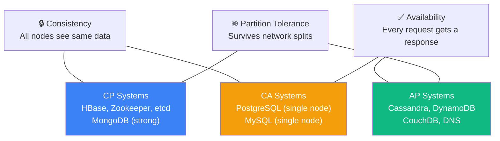

## Introduction

The CAP Theorem, formulated by Eric Brewer in 2000 and formally proven by Gilbert and Lynch in 2002, states that a distributed data store can only guarantee **two of three** properties simultaneously: **Consistency**, **Availability**, and **Partition Tolerance**. Understanding CAP is essential for making informed database and architecture decisions in distributed systems.

> **Note:** CAP is often misunderstood. In practice, network partitions are unavoidable in any distributed system, so the real choice is between **Consistency** and **Availability** during a partition event.

## Core Concepts

### The Three Properties

**Consistency (C)**
Every read receives the most recent write or an error. All nodes see the same data at the same time. This is linearizability — the system behaves as if there's a single copy of the data.

**Availability (A)**
Every request receives a (non-error) response, but it might not contain the most recent data. The system is always operational.

**Partition Tolerance (P)**
The system continues to operate even when network messages between nodes are dropped or delayed. In real distributed systems, this is non-negotiable.

### The Real Trade-off: CP vs AP

Since P is required in any real distributed system, the choice is:

| Choice | Behavior During Partition | Examples |
|--------|--------------------------|---------|
| **CP** | Returns error or timeout rather than stale data | HBase, Zookeeper, etcd, MongoDB (strong mode) |
| **AP** | Returns potentially stale data rather than error | Cassandra, CouchDB, DynamoDB, DNS |
| **CA** | Only possible without partitions (single node) | Traditional RDBMS (PostgreSQL, MySQL) on single node |

## CAP Triangle



## Code Examples

### Example 1: CP System — Zookeeper Leader Election

```java
// Zookeeper ensures consistency — if a partition occurs,
// the minority partition becomes unavailable rather than serving stale data
CuratorFramework client = CuratorFrameworkFactory.newClient(
    "zk-host:2181",
    new ExponentialBackoffRetry(1000, 3)
);
client.start();

LeaderSelector leaderSelector = new LeaderSelector(client, "/leader", new LeaderSelectorListenerAdapter() {
    @Override
    public void takeLeadership(CuratorFramework client) throws Exception {
        System.out.println("I am the leader!");
        // Only one node is leader at a time — CP guarantee
        Thread.sleep(Long.MAX_VALUE);
    }
});
leaderSelector.autoRequeue();
leaderSelector.start();
```

### Example 2: AP System — Cassandra Eventual Consistency

```sql
-- Cassandra: choose consistency level per query
-- QUORUM = majority of replicas must respond (more consistent, less available)
-- ONE = only one replica must respond (more available, less consistent)
-- ALL = all replicas must respond (most consistent, least available)

-- Write with QUORUM consistency
INSERT INTO users (id, name, email)
VALUES (uuid(), 'Alice', 'alice@example.com')
USING CONSISTENCY QUORUM;

-- Read with eventual consistency (fastest, may return stale data)
SELECT * FROM users WHERE id = ? USING CONSISTENCY ONE;

-- Read with strong consistency (slower, always fresh)
SELECT * FROM users WHERE id = ? USING CONSISTENCY QUORUM;
```

### Example 3: Handling Partition in Application Code

```typescript
// Application-level CAP decision: prefer availability
async function getUserProfile(userId: string): Promise<UserProfile> {
  try {
    // Try primary (consistent) source first
    return await primaryDB.getUser(userId)
  } catch (error) {
    if (isNetworkPartition(error)) {
      // AP choice: return potentially stale data from cache
      const cached = await cache.get(`user:${userId}`)
      if (cached) {
        return { ...cached, stale: true } // flag as potentially stale
      }
      // CP choice would be: throw error instead
    }
    throw error
  }
}

// Application-level CAP decision: prefer consistency
async function processPayment(payment: Payment): Promise<void> {
  // CP choice: fail rather than risk double-charging
  // No fallback to stale data — money operations must be consistent
  await transactionDB.insert(payment) // throws if partition detected
}
```

## PACELC — The Extended Model

CAP only describes behavior during partitions. PACELC extends it to normal operation:

> **If Partition (P):** choose between Availability (A) and Consistency (C)
> **Else (E) — normal operation:** choose between Latency (L) and Consistency (C)

| System | Partition | Normal |
|--------|-----------|--------|
| DynamoDB | AP | EL (low latency) |
| Cassandra | AP | EL |
| MongoDB | CP | EC |
| PostgreSQL | CP | EC |
| Spanner (Google) | CP | EC (but globally consistent) |

## Real-world Use Cases

- **Banking/payments** — CP required. A stale balance read could allow overdrafts.
- **Social media feeds** — AP acceptable. Seeing a post 2 seconds late is fine.
- **Shopping cart** — AP preferred. Better to show a slightly stale cart than error out.
- **Inventory management** — CP required. Overselling is worse than a brief outage.
- **DNS** — AP by design. Propagation delay is acceptable; availability is critical.

## Common Pitfalls & How to Avoid Them

- **Treating CAP as a permanent choice** — modern systems like DynamoDB let you tune consistency per operation
- **Ignoring PACELC** — CAP only covers partition scenarios; latency vs consistency matters in normal operation too
- **Assuming CA is viable** — any system with multiple nodes will eventually face partitions
- **Conflating consistency models** — CAP's "C" is linearizability, not the "C" in ACID (which is about constraints)

## Summary / Key Takeaways

- CAP: a distributed system can only guarantee 2 of 3 — Consistency, Availability, Partition Tolerance
- Since partitions are inevitable, the real choice is **CP** (consistent but may be unavailable) vs **AP** (available but may be stale)
- **CP systems**: HBase, Zookeeper, etcd — good for coordination, leader election, financial data
- **AP systems**: Cassandra, DynamoDB, CouchDB — good for high-availability, user-facing features
- Modern systems (DynamoDB, Cassandra) let you tune consistency per operation — use this wisely

> **Tip:** In system design interviews, always ask "what are the consistency requirements?" before choosing a database. For financial data, choose CP. For social features, AP is usually fine. Knowing this distinction will impress interviewers.
