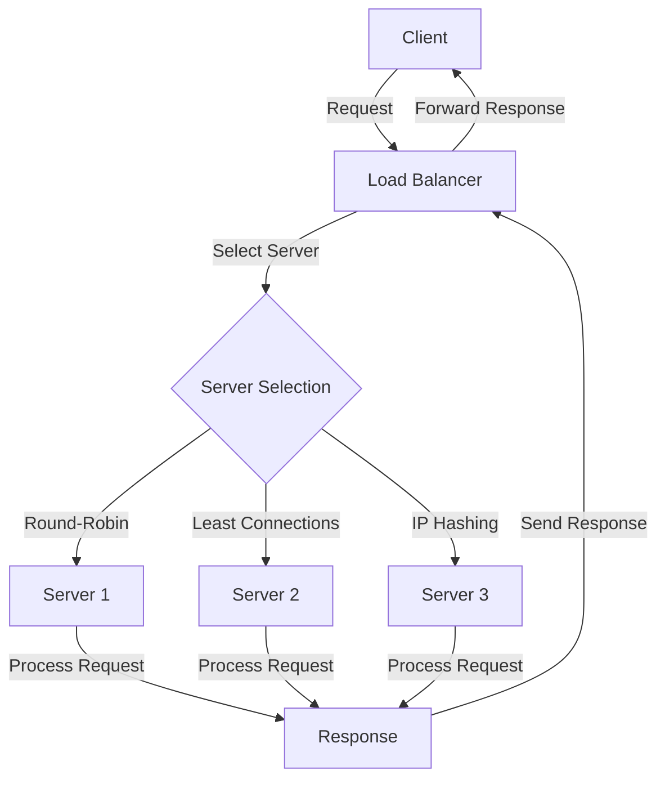

## Introduction
A **load balancer** is a crucial component in system design that distributes incoming network traffic across multiple servers to improve responsiveness, reliability, and scalability of applications. It acts as a reverse proxy, sitting between clients and servers, and directs incoming requests to the most suitable server based on various criteria such as server availability, load, and proximity. Load balancers can be categorized into two main types: **L4 (Layer 4)** and **L7 (Layer 7)**, each with its own strengths and weaknesses.

## Core Concepts
To understand load balancers, it's essential to grasp the concepts of **OSI model layers**. The OSI model is a 7-layered framework that standardizes communication between devices over a network. L4 load balancers operate at the **transport layer**, which is responsible for reliable data transfer between devices. They make decisions based on **IP addresses** and **ports**. On the other hand, L7 load balancers operate at the **application layer**, which is responsible for providing services to end-user applications. They make decisions based on **HTTP headers**, **cookies**, and other application-specific data.

> **Note:** L4 load balancers are also known as **transport-layer load balancers**, while L7 load balancers are known as **application-layer load balancers**.

## How It Works Internally
Here's a step-by-step breakdown of how a load balancer works:
1. **Client Request**: A client sends a request to the load balancer's IP address.
2. **Load Balancer Receipt**: The load balancer receives the request and analyzes it to determine which server to forward it to.
3. **Server Selection**: The load balancer selects a server based on its **load balancing algorithm**, such as **round-robin**, **least connections**, or **IP hashing**.
4. **Request Forwarding**: The load balancer forwards the request to the selected server.
5. **Server Response**: The server processes the request and sends a response back to the load balancer.
6. **Load Balancer Receipt**: The load balancer receives the response from the server and forwards it to the client.

## Code Examples
### Example 1: Basic L4 Load Balancer (Python)
```python
import socket
import threading

class LoadBalancer:
    def __init__(self, servers):
        self.servers = servers
        self.current_server = 0

    def handle_request(self, client_socket):
        # Select the next server in the list
        server = self.servers[self.current_server]
        self.current_server = (self.current_server + 1) % len(self.servers)

        # Forward the request to the selected server
        server_socket = socket.socket(socket.AF_INET, socket.SOCK_STREAM)
        server_socket.connect(server)
        server_socket.sendall(client_socket.recv(1024))
        response = server_socket.recv(1024)
        client_socket.sendall(response)

# Create a list of servers
servers = [("server1", 8080), ("server2", 8080), ("server3", 8080)]

# Create a load balancer
load_balancer = LoadBalancer(servers)

# Create a socket to listen for incoming requests
socket = socket.socket(socket.AF_INET, socket.SOCK_STREAM)
socket.bind(("localhost", 8080))
socket.listen(5)

while True:
    client_socket, address = socket.accept()
    threading.Thread(target=load_balancer.handle_request, args=(client_socket,)).start()
```

### Example 2: L7 Load Balancer with HTTP Header Parsing (Node.js)
```javascript
const http = require("http");
const httpProxy = require("http-proxy");

// Create a list of servers
const servers = [
    { host: "server1", port: 8080 },
    { host: "server2", port: 8080 },
    { host: "server3", port: 8080 },
];

// Create a load balancer
const loadBalancer = httpProxy.createProxyServer({
    target: {
        host: servers[0].host,
        port: servers[0].port,
    },
});

// Create an HTTP server to listen for incoming requests
const server = http.createServer((req, res) => {
    // Parse the HTTP headers to determine which server to forward the request to
    const headers = req.headers;
    const serverIndex = headers["x-server-index"];
    if (serverIndex) {
        const server = servers[serverIndex];
        loadBalancer.target = {
            host: server.host,
            port: server.port,
        };
    }

    // Forward the request to the selected server
    loadBalancer.web(req, res);
});

server.listen(8080, () => {
    console.log("Load balancer listening on port 8080");
});
```

### Example 3: Advanced Load Balancer with Session Persistence (Go)
```go
package main

import (
    "fmt"
    "net/http"
    "net/http/httputil"
    "net/url"
)

// Create a list of servers
var servers = []*url.URL{
    {Scheme: "http", Host: "server1:8080"},
    {Scheme: "http", Host: "server2:8080"},
    {Scheme: "http", Host: "server3:8080"},
}

// Create a load balancer
var loadBalancer = &httputil.ReverseProxy{
    Director: func(req *http.Request) {
        // Parse the HTTP headers to determine which server to forward the request to
        sessionID := req.Header.Get("X-Session-ID")
        if sessionID != "" {
            // Select the server based on the session ID
            serverIndex := 0 // Calculate the server index based on the session ID
            req.URL.Host = servers[serverIndex].Host
            req.URL.Scheme = servers[serverIndex].Scheme
        }
    },
}

func main() {
    http.Handle("/", loadBalancer)
    http.ListenAndServe(":8080", nil)
}
```

## Visual Diagram

This diagram illustrates the load balancing process, including server selection and request forwarding.

## Comparison
| Approach | Time Complexity | Space Complexity | Pros | Cons | Best For |
| --- | --- | --- | --- | --- | --- |
| Round-Robin | O(1) | O(1) | Simple to implement, efficient for homogeneous servers | May not perform well with heterogeneous servers | Small-scale applications with homogeneous servers |
| Least Connections | O(log n) | O(n) | Efficient for heterogeneous servers, reduces server overload | May lead to server overload if not implemented correctly | Large-scale applications with heterogeneous servers |
| IP Hashing | O(1) | O(1) | Simple to implement, efficient for caching | May lead to server overload if not implemented correctly | Applications with high cache hit rates |

> **Warning:** When implementing load balancing algorithms, it's essential to consider the time and space complexity to ensure efficient and scalable performance.

## Real-world Use Cases
1. **Google**: Google uses a combination of L4 and L7 load balancers to distribute traffic across its data centers. Google's load balancing system is designed to handle massive amounts of traffic and provide high availability and scalability.
2. **Amazon Web Services (AWS)**: AWS provides a load balancing service called **Elastic Load Balancer (ELB)**, which supports both L4 and L7 load balancing. ELB is designed to handle large amounts of traffic and provide high availability and scalability.
3. **Netflix**: Netflix uses a custom-built load balancing system that supports both L4 and L7 load balancing. Netflix's load balancing system is designed to handle massive amounts of traffic and provide high availability and scalability.

## Common Pitfalls
1. **Incorrect Server Selection**: Incorrect server selection can lead to server overload and decreased performance. To avoid this, it's essential to implement a robust server selection algorithm that considers factors such as server load, response time, and availability.
2. **Insufficient Session Persistence**: Insufficient session persistence can lead to session loss and decreased user experience. To avoid this, it's essential to implement a robust session persistence mechanism that ensures session continuity across server requests.
3. **Inadequate Load Balancing Algorithm**: Inadequate load balancing algorithms can lead to server overload and decreased performance. To avoid this, it's essential to implement a robust load balancing algorithm that considers factors such as server load, response time, and availability.
4. **Lack of Monitoring and Maintenance**: Lack of monitoring and maintenance can lead to decreased performance and availability. To avoid this, it's essential to implement a robust monitoring and maintenance system that ensures timely detection and resolution of issues.

> **Tip:** To avoid common pitfalls, it's essential to implement a robust load balancing system that considers factors such as server selection, session persistence, load balancing algorithms, and monitoring and maintenance.

## Interview Tips
1. **What is the difference between L4 and L7 load balancing?**: A good answer should explain the difference between L4 and L7 load balancing, including the OSI model layers and the types of decisions made by each type of load balancer.
2. **How do you implement session persistence in a load balancing system?**: A good answer should explain the different types of session persistence mechanisms, including cookie-based, token-based, and IP-based persistence.
3. **What are some common load balancing algorithms, and how do they work?**: A good answer should explain the different types of load balancing algorithms, including round-robin, least connections, and IP hashing, and how they work.

> **Interview:** When answering interview questions, it's essential to provide clear and concise explanations that demonstrate a deep understanding of load balancing concepts and technologies.

## Key Takeaways
* Load balancing is a critical component in system design that distributes incoming network traffic across multiple servers to improve responsiveness, reliability, and scalability of applications.
* L4 load balancers operate at the transport layer, while L7 load balancers operate at the application layer.
* Load balancing algorithms include round-robin, least connections, and IP hashing.
* Session persistence is critical in load balancing systems to ensure session continuity across server requests.
* Monitoring and maintenance are essential to ensure timely detection and resolution of issues in load balancing systems.
* Load balancing systems should be designed to handle massive amounts of traffic and provide high availability and scalability.
* Incorrect server selection, insufficient session persistence, inadequate load balancing algorithms, and lack of monitoring and maintenance are common pitfalls in load balancing systems.
* Implementing a robust load balancing system requires careful consideration of factors such as server selection, session persistence, load balancing algorithms, and monitoring and maintenance.