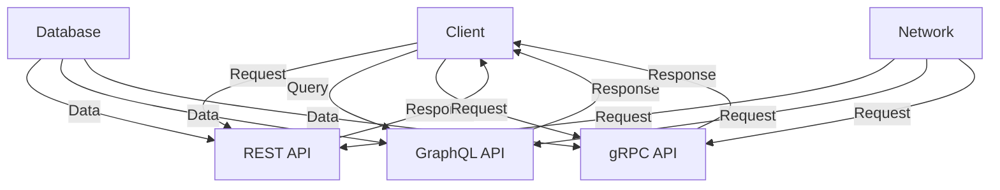

## Introduction
**REST (Representational State of Resource)**, **GraphQL**, and **gRPC** are three popular API design architectures used for building scalable and maintainable systems. Each has its strengths and weaknesses, and choosing the right one is crucial for a project's success. In this article, we will delve into the world of these three architectures, exploring their core concepts, internal workings, and real-world use cases. We will also compare them, discuss common pitfalls, and provide interview tips.

> **Note:** Understanding the differences between REST, GraphQL, and gRPC is essential for any software engineer, as it can significantly impact the performance, scalability, and maintainability of a system.

## Core Concepts
- **REST**: REST is an architectural style for designing networked applications. It is based on the idea of resources, which are identified by URIs, and can be manipulated using a fixed set of operations.
- **GraphQL**: GraphQL is a query language for APIs that allows clients to specify exactly what data they need, reducing the amount of data transferred over the network.
- **gRPC**: gRPC is a high-performance RPC framework that allows developers to define service interfaces using Protocol Buffers.

> **Tip:** When choosing an API design architecture, consider the trade-offs between simplicity, flexibility, and performance.

## How It Works Internally
- **REST**: When a client sends a request to a RESTful API, the server processes the request, retrieves the required data, and returns a response in a format such as JSON or XML. The client can then parse the response and use the data as needed.
- **GraphQL**: When a client sends a query to a GraphQL API, the server processes the query, retrieves the required data, and returns a response in a format such as JSON. The client can then parse the response and use the data as needed.
- **gRPC**: When a client sends a request to a gRPC API, the server processes the request, retrieves the required data, and returns a response in a binary format. The client can then parse the response and use the data as needed.

> **Warning:** gRPC uses a binary format, which can be more efficient than text-based formats like JSON, but can also be more difficult to debug.

## Code Examples
### Example 1: Basic REST API
```python
from flask import Flask, jsonify

app = Flask(__name__)

# Sample in-memory data store
data = {
    "1": {"name": "John Doe", "age": 30},
    "2": {"name": "Jane Doe", "age": 25}
}

@app.route("/users/<user_id>", methods=["GET"])
def get_user(user_id):
    user = data.get(user_id)
    if user:
        return jsonify(user)
    else:
        return jsonify({"error": "User not found"}), 404

if __name__ == "__main__":
    app.run(debug=True)
```
### Example 2: GraphQL API using Apollo Server
```javascript
const { ApolloServer, gql } = require("apollo-server");

// Sample schema
const typeDefs = gql`
  type User {
    id: ID!
    name: String!
    age: Int!
  }

  type Query {
    user(id: ID!): User
  }
`;

// Sample resolvers
const resolvers = {
  Query: {
    user: (parent, { id }) => {
      // Sample data
      const users = [
        { id: "1", name: "John Doe", age: 30 },
        { id: "2", name: "Jane Doe", age: 25 }
      ];

      return users.find((user) => user.id === id);
    }
  }
};

// Create the Apollo Server
const server = new ApolloServer({ typeDefs, resolvers });

// Start the server
server.listen().then(({ url }) => {
  console.log(`Server listening on ${url}`);
});
```
### Example 3: gRPC API using Python
```python
from concurrent import futures

import grpc

import user_service_pb2
import user_service_pb2_grpc

# Sample data
users = [
    {"id": "1", "name": "John Doe", "age": 30},
    {"id": "2", "name": "Jane Doe", "age": 25}
]

class UserService(user_service_pb2_grpc.UserServiceServicer):
    def GetUser(self, request, context):
        user_id = request.id
        user = next((user for user in users if user["id"] == user_id), None)
        if user:
            return user_service_pb2.User(id=user["id"], name=user["name"], age=user["age"])
        else:
            context.set_code(grpc.StatusCode.NOT_FOUND)
            context.set_details("User not found")
            return user_service_pb2.User()

def serve():
    server = grpc.server(futures.ThreadPoolExecutor(max_workers=10))
    user_service_pb2_grpc.add_UserServiceServicer_to_server(UserService(), server)
    server.add_insecure_port("[::]:50051")
    server.start()
    print("Server started. Listening on port 50051.")
    server.wait_for_termination()

if __name__ == "__main__":
    serve()
```
> **Interview:** Can you explain the difference between REST, GraphQL, and gRPC? How would you choose between them for a given project?

## Visual Diagram

The diagram illustrates the basic flow of data between a client, API, and database. The client sends a request to the API, which retrieves data from the database and returns a response to the client.

> **Tip:** When designing an API, consider the trade-offs between simplicity, flexibility, and performance.

## Comparison
| Approach | Time Complexity | Space Complexity | Pros | Cons | Best For |
|----------|----------------|-----------------|------|------|----------|
| REST | O(1) | O(n) | Simple, flexible, widely adopted | Limited support for complex queries, verbose | Simple CRUD operations |
| GraphQL | O(n) | O(n) | Flexible, efficient, supports complex queries | Steeper learning curve, requires schema definition | Complex queries, real-time updates |
| gRPC | O(1) | O(n) | High-performance, efficient, supports streaming | Limited support for complex queries, requires schema definition | High-performance, low-latency applications |

> **Warning:** gRPC requires a schema definition, which can be time-consuming to create and maintain.

## Real-world Use Cases
- **REST**: Twitter's API uses REST to provide access to user data and tweets.
- **GraphQL**: GitHub's API uses GraphQL to provide access to user data, repositories, and issues.
- **gRPC**: Google's Cloud APIs use gRPC to provide access to cloud services such as storage and computing.

> **Note:** When choosing an API design architecture, consider the specific needs of your project and the trade-offs between simplicity, flexibility, and performance.

## Common Pitfalls
- **Over-fetching**: Retrieving more data than necessary, which can lead to slower performance and increased latency.
- **Under-fetching**: Retrieving less data than necessary, which can lead to additional requests and increased latency.
- **Incorrect schema definition**: Defining a schema that is inconsistent or incomplete, which can lead to errors and inconsistencies in the data.
- **Insufficient error handling**: Failing to handle errors properly, which can lead to crashes and unexpected behavior.

> **Tip:** Use tools such as Postman or GraphQL Playground to test and debug your API.

## Interview Tips
- **What is the difference between REST, GraphQL, and gRPC?**: Explain the differences in terms of architecture, performance, and use cases.
- **How would you choose between REST, GraphQL, and gRPC for a given project?**: Consider the specific needs of the project, including the type of data, the complexity of the queries, and the performance requirements.
- **What are some common pitfalls to avoid when designing an API?**: Discuss over-fetching, under-fetching, incorrect schema definition, and insufficient error handling.

> **Interview:** Can you explain the concept of a schema in GraphQL? How would you define a schema for a given project?

## Key Takeaways
* REST is a simple, flexible, and widely adopted API design architecture.
* GraphQL is a flexible, efficient, and powerful API design architecture that supports complex queries.
* gRPC is a high-performance, efficient, and scalable API design architecture that supports streaming.
* Choosing the right API design architecture depends on the specific needs of the project.
* Over-fetching, under-fetching, incorrect schema definition, and insufficient error handling are common pitfalls to avoid.
* Testing and debugging tools such as Postman or GraphQL Playground can help ensure the quality and reliability of the API.
* Understanding the trade-offs between simplicity, flexibility, and performance is crucial when designing an API.
* Real-world use cases such as Twitter, GitHub, and Google Cloud APIs demonstrate the effectiveness of different API design architectures.
* Time complexity and space complexity are important considerations when evaluating the performance of an API.
* Error handling and schema definition are critical components of a well-designed API.