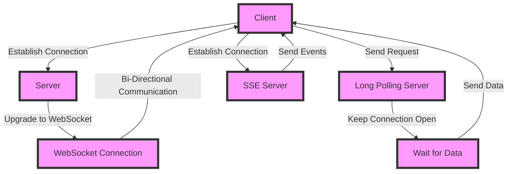

## Introduction
In the realm of real-time web development, three technologies have emerged as leading contenders for enabling efficient, bi-directional communication between clients and servers: **WebSockets**, **Long Polling**, and **Server-Sent Events (SSE)**. Each has its strengths and weaknesses, and understanding their differences is crucial for designing scalable, high-performance systems. In this article, we'll delve into the world of these technologies, exploring their core concepts, internal mechanics, and practical applications. > **Note:** Real-time web development is a critical aspect of modern web applications, enabling features like live updates, collaborative editing, and real-time gaming.

## Core Concepts
Let's start by defining each technology:
* **WebSockets**: A protocol that enables bi-directional, real-time communication between a client (usually a web browser) and a server over the web. It allows for the establishment of a persistent, low-latency connection, enabling efficient data exchange.
* **Long Polling**: A technique where a client sends a request to a server, which keeps the connection open until it has data to send back to the client. If no data is available, the server closes the connection, and the client immediately sends a new request.
* **Server-Sent Events (SSE)**: A unidirectional protocol that allows a server to push events to a client. It's built on top of the HTTP protocol and enables servers to send multiple events to a client over a single, long-lived connection.

> **Warning:** Long Polling can lead to increased server load and latency due to the frequent opening and closing of connections.

## How It Works Internally
Here's a step-by-step breakdown of each technology:
* **WebSockets**:
	1. A client initiates a connection to a server by sending an HTTP request with a `Connection: Upgrade` header.
	2. The server responds with a `101 Switching Protocols` status code, indicating that the connection will be upgraded to a WebSocket connection.
	3. The client and server establish a persistent, bi-directional connection, allowing for efficient data exchange.
* **Long Polling**:
	1. A client sends an HTTP request to a server, which keeps the connection open until it has data to send back to the client.
	2. If no data is available, the server closes the connection, and the client immediately sends a new request.
	3. This process continues, with the client repeatedly sending requests to the server, which keeps the connections open until data is available.
* **Server-Sent Events (SSE)**:
	1. A client establishes a connection to a server by sending an HTTP request with an `Accept: text/event-stream` header.
	2. The server responds with a `200 OK` status code and a `Content-Type: text/event-stream` header, indicating that the connection will be used for SSE.
	3. The server sends events to the client over the established connection, which the client can process in real-time.

> **Tip:** WebSockets are ideal for applications that require bi-directional, real-time communication, while SSE is better suited for applications that only require server-to-client communication.

## Code Examples
Here are three complete, runnable examples:
### Example 1: Basic WebSocket Connection (Client-Side)
```javascript
const socket = new WebSocket('ws://localhost:8080');

socket.onmessage = (event) => {
  console.log(`Received message: ${event.data}`);
};

socket.onopen = () => {
  console.log('Connected to the server');
  socket.send('Hello, server!');
};

socket.onclose = () => {
  console.log('Disconnected from the server');
};

socket.onerror = (error) => {
  console.log(`Error occurred: ${error}`);
};
```
### Example 2: Long Polling with Node.js (Server-Side)
```javascript
const http = require('http');

http.createServer((req, res) => {
  if (req.url === '/poll') {
    const timeout = 30000; // 30 seconds
    const interval = setInterval(() => {
      // Check if data is available
      const data = getData();
      if (data) {
        res.writeHead(200, { 'Content-Type': 'text/plain' });
        res.end(data);
        clearInterval(interval);
      }
    }, 1000); // Check every 1 second

    req.setTimeout(timeout, () => {
      res.writeHead(408, { 'Content-Type': 'text/plain' });
      res.end('Timeout');
      clearInterval(interval);
    });
  }
}).listen(8080, () => {
  console.log('Server listening on port 8080');
});
```
### Example 3: Server-Sent Events with Node.js (Server-Side)
```javascript
const http = require('http');

http.createServer((req, res) => {
  if (req.url === '/events') {
    res.writeHead(200, {
      'Content-Type': 'text/event-stream',
      'Cache-Control': 'no-cache',
      'Connection': 'keep-alive'
    });

    // Send events to the client
    setInterval(() => {
      const data = 'Hello, client!';
      res.write(`data: ${data}\n\n`);
    }, 1000); // Send every 1 second
  }
}).listen(8080, () => {
  console.log('Server listening on port 8080');
});
```
> **Interview:** Be prepared to explain the differences between WebSockets, Long Polling, and SSE, including their use cases and performance characteristics.

## Visual Diagram

This diagram illustrates the basic flow of each technology, including the establishment of connections, communication, and data exchange.

## Comparison
| Approach | Time Complexity | Space Complexity | Pros | Cons | Best For |
| --- | --- | --- | --- | --- | --- |
| WebSockets | O(1) | O(1) | Bi-directional, real-time communication | Complex implementation, limited browser support | Real-time gaming, live updates |
| Long Polling | O(n) | O(1) | Simple implementation, wide browser support | Increased server load, latency | Simple, low-traffic applications |
| Server-Sent Events (SSE) | O(1) | O(1) | Unidirectional, real-time communication | Limited browser support, no bi-directional communication | Live updates, server-to-client communication |

> **Tip:** When choosing between WebSockets, Long Polling, and SSE, consider the specific requirements of your application, including the need for bi-directional communication, real-time updates, and browser support.

## Real-world Use Cases
Here are three production examples:
* **Facebook**: Uses WebSockets for real-time updates and live notifications.
* **Twitter**: Employs Long Polling for updating timelines and notifications.
* **GitHub**: Utilizes Server-Sent Events (SSE) for live updates and real-time notifications.

## Common Pitfalls
Here are four specific mistakes to avoid:
* **Insufficient error handling**: Failing to handle errors and disconnections can lead to application crashes and data loss.
* **Inadequate connection management**: Poorly managing connections can result in increased server load, latency, and resource waste.
* **Inefficient data exchange**: Failing to optimize data exchange can lead to performance issues, increased latency, and decreased user experience.
* **Incompatible browser support**: Failing to consider browser support can result in application incompatibility, errors, and decreased user experience.

## Interview Tips
Here are three common interview questions:
* **What is the difference between WebSockets and Long Polling?**: A weak answer might focus solely on the technical differences, while a strong answer would also discuss the use cases, performance characteristics, and trade-offs.
* **How do you implement Server-Sent Events (SSE) in a Node.js application?**: A weak answer might provide a basic example, while a strong answer would discuss the implementation details, error handling, and performance considerations.
* **What are the advantages and disadvantages of using WebSockets in a real-time web application?**: A weak answer might focus solely on the advantages, while a strong answer would discuss the trade-offs, including the potential disadvantages and limitations.

## Key Takeaways
Here are ten must-remember facts:
* **WebSockets enable bi-directional, real-time communication**: Ideal for applications that require efficient, low-latency data exchange.
* **Long Polling is a simple, widely-supported technique**: Suitable for simple, low-traffic applications, but can lead to increased server load and latency.
* **Server-Sent Events (SSE) enable unidirectional, real-time communication**: Ideal for applications that require server-to-client communication, but limited by browser support and lack of bi-directional communication.
* **Error handling and connection management are crucial**: Insufficient error handling and inadequate connection management can lead to application crashes, data loss, and decreased user experience.
* **Data exchange optimization is essential**: Inefficient data exchange can result in performance issues, increased latency, and decreased user experience.
* **Browser support is a critical consideration**: Failing to consider browser support can result in application incompatibility, errors, and decreased user experience.
* **WebSockets have a time complexity of O(1)**: Ideal for applications that require efficient, low-latency data exchange.
* **Long Polling has a time complexity of O(n)**: Can lead to increased server load and latency, especially in high-traffic applications.
* **Server-Sent Events (SSE) have a time complexity of O(1)**: Ideal for applications that require efficient, low-latency server-to-client communication.
* **Real-time web development requires careful consideration of performance, scalability, and user experience**: A well-designed real-time web application can provide a seamless, engaging user experience, while a poorly designed application can lead to frustration, errors, and decreased user adoption.