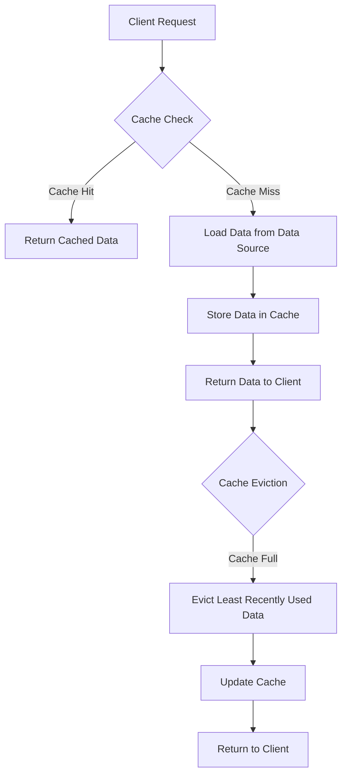

## Introduction
The **Cache-aside (Lazy Loading) Pattern** is a design pattern used to improve the performance of a system by reducing the number of requests made to a data source. It works by storing frequently accessed data in a cache, and only updating the cache when the data is requested. This pattern is particularly useful in systems where data is expensive to retrieve or compute, and can be used to improve the scalability and responsiveness of a system. Every engineer should understand this pattern because it is a fundamental concept in system design, and is widely used in many different types of systems, including web applications, databases, and file systems.

## Core Concepts
The Cache-aside pattern consists of three main components:
* **Cache**: a store of data that is retrieved from a data source
* **Data Source**: the original source of the data
* **Cache Manager**: a component that manages the cache and updates it when necessary
The key terminology used in this pattern includes:
* **Cache Hit**: when the requested data is found in the cache
* **Cache Miss**: when the requested data is not found in the cache
* **Cache Eviction**: when the cache is full and needs to be updated to make room for new data

> **Note:** The Cache-aside pattern is also known as the Lazy Loading pattern, because it only loads data into the cache when it is requested.

## How It Works Internally
Here is a step-by-step explanation of how the Cache-aside pattern works:
1. The client requests data from the system
2. The system checks if the requested data is in the cache
3. If the data is in the cache (cache hit), the system returns the cached data to the client
4. If the data is not in the cache (cache miss), the system retrieves the data from the data source
5. The system stores the retrieved data in the cache
6. The system returns the retrieved data to the client
The Cache-aside pattern uses a **Least Recently Used (LRU)** cache eviction policy, which means that the least recently accessed data is evicted from the cache when it is full.

> **Warning:** If the cache is too small, it can lead to a high cache miss rate, which can negatively impact system performance.

## Code Examples
### Example 1: Basic Cache-aside Pattern
```python
import time

class Cache:
    def __init__(self):
        self.cache = {}
        self.max_size = 10

    def get(self, key):
        if key in self.cache:
            return self.cache[key]
        else:
            # Simulate a cache miss
            time.sleep(1)
            value = self.load_data(key)
            self.cache[key] = value
            if len(self.cache) > self.max_size:
                self.evict_cache()
            return value

    def load_data(self, key):
        # Simulate loading data from a data source
        return f"Data for {key}"

    def evict_cache(self):
        # Simulate evicting the least recently used data from the cache
        self.cache.pop(next(iter(self.cache)))

cache = Cache()
print(cache.get("key1"))  # Cache miss
print(cache.get("key1"))  # Cache hit
print(cache.get("key2"))  # Cache miss
```
### Example 2: Real-world Cache-aside Pattern
```java
import java.util.concurrent.ConcurrentHashMap;
import java.util.concurrent.TimeUnit;

public class CacheAsidePattern {
    private ConcurrentHashMap<String, String> cache;
    private final int maxSize;

    public CacheAsidePattern(int maxSize) {
        this.cache = new ConcurrentHashMap<>();
        this.maxSize = maxSize;
    }

    public String get(String key) {
        if (cache.containsKey(key)) {
            return cache.get(key);
        } else {
            // Simulate a cache miss
            String value = loadData(key);
            cache.put(key, value);
            if (cache.size() > maxSize) {
                evictCache();
            }
            return value;
        }
    }

    private String loadData(String key) {
        // Simulate loading data from a data source
        try {
            TimeUnit.SECONDS.sleep(1);
        } catch (InterruptedException e) {
            Thread.currentThread().interrupt();
        }
        return "Data for " + key;
    }

    private void evictCache() {
        // Simulate evicting the least recently used data from the cache
        cache.remove(cache.keySet().iterator().next());
    }

    public static void main(String[] args) {
        CacheAsidePattern cache = new CacheAsidePattern(10);
        System.out.println(cache.get("key1"));  // Cache miss
        System.out.println(cache.get("key1"));  // Cache hit
        System.out.println(cache.get("key2"));  // Cache miss
    }
}
```
### Example 3: Advanced Cache-aside Pattern with Distributed Cache
```python
import redis

class DistributedCache:
    def __init__(self, host, port):
        self.redis_client = redis.Redis(host=host, port=port)

    def get(self, key):
        if self.redis_client.exists(key):
            return self.redis_client.get(key)
        else:
            # Simulate a cache miss
            value = self.load_data(key)
            self.redis_client.set(key, value)
            return value

    def load_data(self, key):
        # Simulate loading data from a data source
        return f"Data for {key}"

    def evict_cache(self, key):
        # Simulate evicting the least recently used data from the cache
        self.redis_client.delete(key)

distributed_cache = DistributedCache("localhost", 6379)
print(distributed_cache.get("key1"))  # Cache miss
print(distributed_cache.get("key1"))  # Cache hit
print(distributed_cache.get("key2"))  # Cache miss
```
> **Tip:** The Cache-aside pattern can be used with a distributed cache to improve the scalability and availability of a system.

## Visual Diagram

This diagram illustrates the Cache-aside pattern, including the cache check, cache hit, cache miss, loading data from the data source, storing data in the cache, and cache eviction.

> **Interview:** Can you explain how the Cache-aside pattern works, and how it can be used to improve the performance of a system?

## Comparison
| Approach | Time Complexity | Space Complexity | Pros | Cons | Best For |
| --- | --- | --- | --- | --- | --- |
| Cache-aside Pattern | O(1) | O(n) | Improves system performance, reduces cache misses | Can lead to cache thrashing, requires cache eviction policy | Systems with expensive data retrieval or computation |
| Read-through Pattern | O(n) | O(n) | Simplifies cache management, reduces cache misses | Can lead to cache thrashing, requires cache eviction policy | Systems with frequent cache updates |
| Write-through Pattern | O(1) | O(n) | Ensures data consistency, reduces cache misses | Can lead to cache thrashing, requires cache eviction policy | Systems with critical data consistency requirements |
| Write-behind Pattern | O(1) | O(n) | Improves system performance, reduces cache misses | Can lead to data loss, requires cache eviction policy | Systems with non-critical data consistency requirements |

## Real-world Use Cases
* **Google**: uses the Cache-aside pattern to improve the performance of its search engine, by storing frequently accessed data in a cache and only updating the cache when necessary.
* **Amazon**: uses the Cache-aside pattern to improve the performance of its e-commerce platform, by storing frequently accessed data in a cache and only updating the cache when necessary.
* **Facebook**: uses the Cache-aside pattern to improve the performance of its social media platform, by storing frequently accessed data in a cache and only updating the cache when necessary.

> **Note:** The Cache-aside pattern is widely used in many different types of systems, including web applications, databases, and file systems.

## Common Pitfalls
* **Cache thrashing**: occurs when the cache is too small, leading to a high cache miss rate and negatively impacting system performance.
* **Cache eviction**: occurs when the cache is full, and the least recently used data is evicted from the cache.
* **Data consistency**: occurs when the cache is not updated correctly, leading to data inconsistency and errors.
* **Cache invalidation**: occurs when the cache is not updated correctly, leading to cache misses and errors.

> **Warning:** Cache thrashing, cache eviction, data consistency, and cache invalidation can all negatively impact system performance and should be avoided.

## Interview Tips
* **What is the Cache-aside pattern, and how does it work?**: The Cache-aside pattern is a design pattern used to improve system performance by reducing cache misses. It works by storing frequently accessed data in a cache and only updating the cache when necessary.
* **What are the benefits and drawbacks of the Cache-aside pattern?**: The benefits of the Cache-aside pattern include improved system performance, reduced cache misses, and simplified cache management. The drawbacks include cache thrashing, cache eviction, data consistency, and cache invalidation.
* **How would you implement the Cache-aside pattern in a system?**: To implement the Cache-aside pattern in a system, you would need to design a cache that stores frequently accessed data, and update the cache when necessary. You would also need to implement a cache eviction policy to evict the least recently used data from the cache when it is full.

> **Tip:** When implementing the Cache-aside pattern, it is essential to consider the cache size, cache eviction policy, and data consistency to ensure optimal system performance.

## Key Takeaways
* The Cache-aside pattern is a design pattern used to improve system performance by reducing cache misses.
* The Cache-aside pattern works by storing frequently accessed data in a cache and only updating the cache when necessary.
* The Cache-aside pattern has benefits, including improved system performance, reduced cache misses, and simplified cache management.
* The Cache-aside pattern has drawbacks, including cache thrashing, cache eviction, data consistency, and cache invalidation.
* The Cache-aside pattern can be used in many different types of systems, including web applications, databases, and file systems.
* The Cache-aside pattern requires careful consideration of cache size, cache eviction policy, and data consistency to ensure optimal system performance.
* The Cache-aside pattern is widely used in many different types of systems, including Google, Amazon, and Facebook.
* The Cache-aside pattern has a time complexity of O(1) and a space complexity of O(n).
* The Cache-aside pattern requires a cache eviction policy to evict the least recently used data from the cache when it is full.