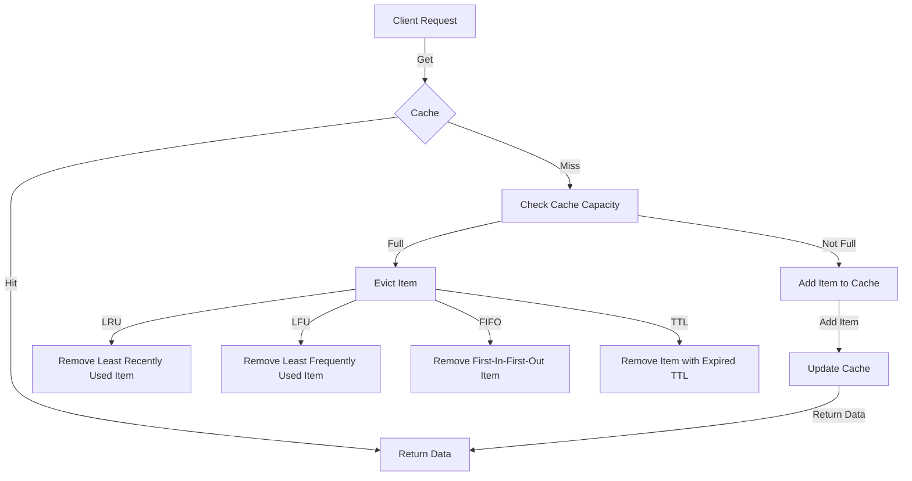

## Introduction
**Cache eviction policies** are a crucial aspect of system design, particularly when dealing with caching mechanisms. A cache is a small, fast memory that stores frequently accessed data to reduce the time it takes to retrieve or compute the data. However, caches have limited capacity, and when the cache is full, the system must decide which items to remove to make room for new ones. This decision is made based on a cache eviction policy. In this section, we will explore the importance of cache eviction policies and their real-world relevance.

Cache eviction policies are essential because they help optimize the performance of a system by ensuring that the most valuable data is retained in the cache. A well-designed cache eviction policy can significantly improve the system's response time, reduce the number of requests made to the underlying storage, and increase the overall efficiency of the system. Real-world examples of cache eviction policies can be seen in web browsers, databases, and operating systems, where caches are used to store frequently accessed data.

> **Note:** Cache eviction policies are not limited to caching mechanisms; they can also be applied to other areas, such as memory management and resource allocation.

## Core Concepts
To understand cache eviction policies, it is essential to grasp the following core concepts:

* **Cache hit**: When the requested data is found in the cache.
* **Cache miss**: When the requested data is not found in the cache.
* **Cache eviction**: The process of removing an item from the cache to make room for a new one.
* **Cache replacement policy**: The algorithm used to decide which item to remove from the cache when it is full.

Some common cache eviction policies include:

* **LRU (Least Recently Used)**: Removes the item that has not been accessed for the longest time.
* **LFU (Least Frequently Used)**: Removes the item that has been accessed the least number of times.
* **FIFO (First-In-First-Out)**: Removes the item that has been in the cache for the longest time.
* **TTL (Time-To-Live)**: Removes the item when its time-to-live expires.

## How It Works Internally
To understand how cache eviction policies work internally, let's consider the LRU policy as an example. The LRU policy uses a combination of a hash map and a doubly linked list to store the cached items. Each item in the cache is represented by a node in the linked list, and the hash map is used to quickly locate the node corresponding to a given key.

When a request is made to the cache, the system checks if the requested item is in the cache (cache hit). If it is, the system updates the access time of the item and moves it to the front of the linked list. If the item is not in the cache (cache miss), the system adds the item to the cache and moves it to the front of the linked list. If the cache is full, the system removes the item at the back of the linked list (the least recently used item).

> **Warning:** A poorly designed cache eviction policy can lead to a high cache miss rate, which can significantly degrade the performance of the system.

## Code Examples
Here are three complete and runnable code examples that demonstrate the implementation of different cache eviction policies:

### Example 1: Basic LRU Cache
```python
from collections import OrderedDict

class LRUCache:
    def __init__(self, capacity):
        self.capacity = capacity
        self.cache = OrderedDict()

    def get(self, key):
        if key in self.cache:
            value = self.cache.pop(key)
            self.cache[key] = value
            return value
        return -1

    def put(self, key, value):
        if key in self.cache:
            self.cache.pop(key)
        elif len(self.cache) >= self.capacity:
            self.cache.popitem(last=False)
        self.cache[key] = value

# Create an LRU cache with a capacity of 2
cache = LRUCache(2)

# Add items to the cache
cache.put(1, 1)
cache.put(2, 2)

# Get items from the cache
print(cache.get(1))  # returns 1
print(cache.get(2))  # returns 2

# Add another item to the cache
cache.put(3, 3)

# Get an item from the cache
print(cache.get(2))  # returns -1 (because 2 was removed from the cache)
```

### Example 2: Real-World LRU Cache Implementation
```java
import java.util.HashMap;
import java.util.Map;

public class LRUCache {
    private final int capacity;
    private final Map<Integer, Node> cache;
    private final Node head;
    private final Node tail;

    public LRUCache(int capacity) {
        this.capacity = capacity;
        this.cache = new HashMap<>();
        this.head = new Node(0, 0);
        this.tail = new Node(0, 0);
        head.next = tail;
        tail.prev = head;
    }

    public int get(int key) {
        if (cache.containsKey(key)) {
            Node node = cache.get(key);
            removeNode(node);
            addNodeToHead(node);
            return node.value;
        }
        return -1;
    }

    public void put(int key, int value) {
        if (cache.containsKey(key)) {
            Node node = cache.get(key);
            node.value = value;
            removeNode(node);
            addNodeToHead(node);
        } else {
            Node node = new Node(key, value);
            if (cache.size() >= capacity) {
                Node lru = tail.prev;
                removeNode(lru);
                cache.remove(lru.key);
            }
            addNodeToHead(node);
            cache.put(key, node);
        }
    }

    private void removeNode(Node node) {
        Node prev = node.prev;
        Node next = node.next;
        prev.next = next;
        next.prev = prev;
    }

    private void addNodeToHead(Node node) {
        Node headNext = head.next;
        head.next = node;
        node.prev = head;
        node.next = headNext;
        headNext.prev = node;
    }

    private class Node {
        int key;
        int value;
        Node prev;
        Node next;

        Node(int key, int value) {
            this.key = key;
            this.value = value;
        }
    }
}
```

### Example 3: Advanced Cache Eviction Policy (LFU)
```typescript
class Node {
    key: number;
    value: number;
    frequency: number;
    prev: Node | null;
    next: Node | null;

    constructor(key: number, value: number) {
        this.key = key;
        this.value = value;
        this.frequency = 1;
        this.prev = null;
        this.next = null;
    }
}

class LFUCache {
    private capacity: number;
    private cache: Map<number, Node>;
    private frequencyMap: Map<number, Node[]>;
    private minFrequency: number;

    constructor(capacity: number) {
        this.capacity = capacity;
        this.cache = new Map();
        this.frequencyMap = new Map();
        this.minFrequency = 0;
    }

    get(key: number): number {
        if (this.cache.has(key)) {
            const node = this.cache.get(key);
            if (node) {
                this.frequencyMap.get(node.frequency)?.splice(this.frequencyMap.get(node.frequency)?.indexOf(node), 1);
                node.frequency++;
                if (!this.frequencyMap.has(node.frequency)) {
                    this.frequencyMap.set(node.frequency, []);
                }
                this.frequencyMap.get(node.frequency)?.push(node);
                if (this.frequencyMap.get(this.minFrequency)?.length === 0) {
                    this.minFrequency++;
                }
                return node.value;
            }
        }
        return -1;
    }

    put(key: number, value: number): void {
        if (this.capacity === 0) return;
        if (this.cache.has(key)) {
            const node = this.cache.get(key);
            if (node) {
                node.value = value;
                this.get(key);
                return;
            }
        }
        if (this.cache.size() === this.capacity) {
            const node = this.frequencyMap.get(this.minFrequency)?.shift();
            if (node) {
                this.cache.delete(node.key);
            }
        }
        const newNode = new Node(key, value);
        this.cache.set(key, newNode);
        if (!this.frequencyMap.has(1)) {
            this.frequencyMap.set(1, []);
        }
        this.frequencyMap.get(1)?.push(newNode);
        this.minFrequency = 1;
    }
}
```

## Visual Diagram

The diagram illustrates the cache eviction process, including the different policies (LRU, LFU, FIFO, TTL) and the steps involved in evicting an item from the cache.

> **Tip:** When designing a cache eviction policy, consider the specific use case and the characteristics of the data being cached.

## Comparison
| Approach | Time Complexity | Space Complexity | Pros | Cons | Best For |
| --- | --- | --- | --- | --- | --- |
| LRU | O(1) | O(n) | Simple to implement, good for temporal locality | May not perform well for non-temporal locality | Web browsers, databases |
| LFU | O(1) | O(n) | Good for frequency-based access patterns | Can be complex to implement, may require additional data structures | File systems, network caches |
| FIFO | O(1) | O(n) | Simple to implement, good for sequential access patterns | May not perform well for random access patterns | Network protocols, log files |
| TTL | O(1) | O(n) | Good for data with a limited lifetime, simple to implement | May require additional data structures to track TTLs | Real-time systems, caching APIs |

> **Interview:** When asked about cache eviction policies in an interview, be prepared to discuss the trade-offs between different policies and the scenarios in which they are most suitable.

## Real-world Use Cases
Here are three real-world examples of cache eviction policies in production systems:

* **Google's PageRank algorithm**: Uses a variant of the LRU policy to cache web pages and improve search engine performance.
* **Amazon's DynamoDB**: Uses a combination of LRU and TTL policies to cache frequently accessed data and improve database performance.
* **Facebook's Memcached**: Uses a variant of the LFU policy to cache frequently accessed data and improve web application performance.

## Common Pitfalls
Here are four common mistakes to avoid when implementing cache eviction policies:

* **Incorrect cache sizing**: Failing to properly size the cache can lead to poor performance and increased latency.
* **Insufficient cache invalidation**: Failing to properly invalidate cache entries can lead to stale data and inconsistencies.
* **Poor cache eviction policy**: Choosing the wrong cache eviction policy can lead to poor performance and increased latency.
* **Inadequate cache monitoring**: Failing to properly monitor cache performance can lead to issues and poor decision-making.

> **Warning:** Cache eviction policies can have a significant impact on system performance, so it's essential to carefully evaluate and test different policies before implementing them in production.

## Interview Tips
Here are three common interview questions related to cache eviction policies, along with sample answers:

* **What is the difference between LRU and LFU cache eviction policies?**: LRU (Least Recently Used) evicts the item that has not been accessed for the longest time, while LFU (Least Frequently Used) evicts the item that has been accessed the least number of times.
* **How would you implement a cache eviction policy in a web application?**: I would use a combination of LRU and TTL policies, with a cache size that is adjusted based on the application's workload and performance requirements.
* **What are some common use cases for cache eviction policies?**: Cache eviction policies are commonly used in web browsers, databases, and file systems to improve performance and reduce latency.

## Key Takeaways
Here are ten key takeaways to remember when working with cache eviction policies:

* **Cache eviction policies are critical for system performance**: Choosing the right policy can significantly impact system performance and latency.
* **LRU is a simple and effective policy**: LRU is easy to implement and works well for many use cases, but may not perform well for non-temporal locality.
* **LFU is good for frequency-based access patterns**: LFU is well-suited for systems with frequency-based access patterns, but can be complex to implement.
* **FIFO is simple but may not perform well**: FIFO is easy to implement but may not perform well for random access patterns.
* **TTL is good for data with a limited lifetime**: TTL is well-suited for systems with data that has a limited lifetime, but may require additional data structures to track TTLs.
* **Cache sizing is critical**: Properly sizing the cache is essential for good performance and low latency.
* **Cache invalidation is essential**: Properly invalidating cache entries is essential for maintaining data consistency and avoiding stale data.
* **Monitoring cache performance is essential**: Monitoring cache performance is essential for identifying issues and making informed decisions.
* **Cache eviction policies can be combined**: Cache eviction policies can be combined to achieve better performance and adapt to changing workloads.
* **Cache eviction policies require careful evaluation and testing**: Cache eviction policies require careful evaluation and testing to ensure they meet the system's performance and latency requirements.