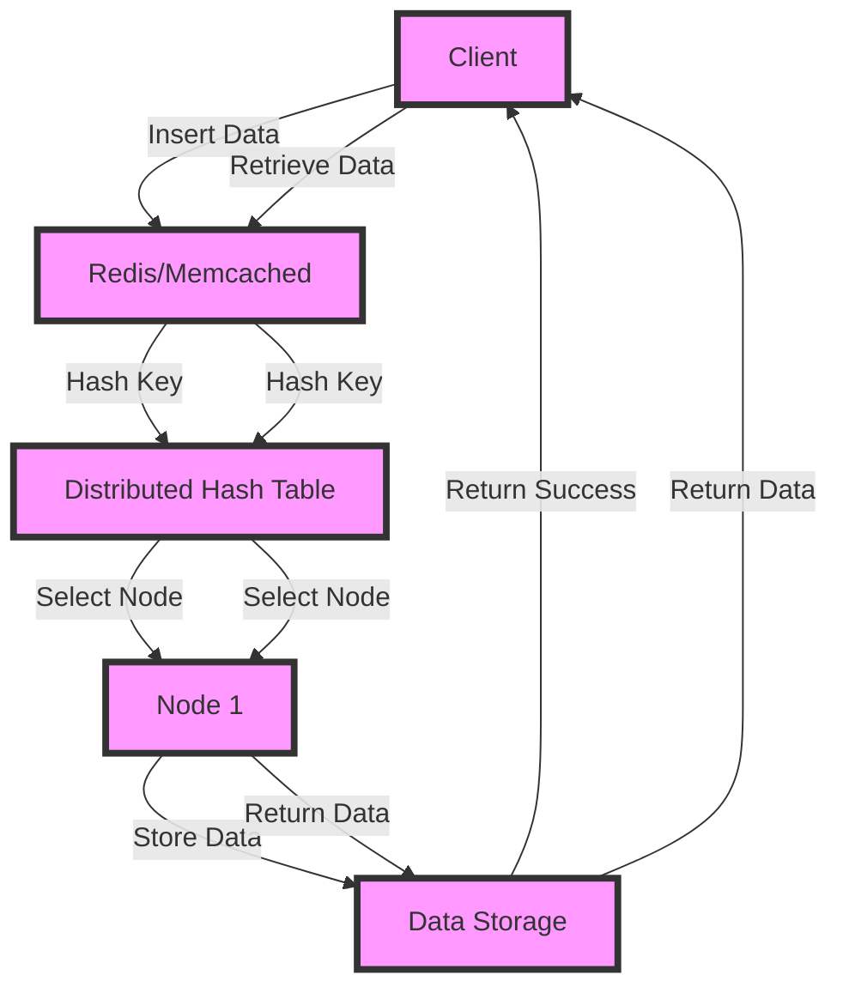

## Introduction
Distributed caching is a critical component in modern distributed systems, enabling applications to store and retrieve data efficiently across multiple nodes. **Redis** and **Memcached** are two popular distributed caching solutions that have gained widespread adoption in the industry. In this section, we will explore the importance of distributed caching, its real-world relevance, and why every engineer needs to understand this concept.

Distributed caching is essential in modern applications because it helps to:
* Reduce the load on databases and improve query performance
* Improve application responsiveness by providing fast access to frequently accessed data
* Enhance scalability by allowing applications to handle increased traffic and user growth

> **Note:** Distributed caching is not a replacement for traditional caching mechanisms, but rather a complementary solution that enables caching across multiple nodes in a distributed system.

## Core Concepts
To understand distributed caching with Redis and Memcached, it's essential to grasp the following core concepts:

* **Cache**: A cache is a temporary storage area that stores frequently accessed data to reduce the time it takes to retrieve the data from the underlying storage system.
* **Key-Value Store**: A key-value store is a data storage system that stores data as a collection of key-value pairs, where each key is unique and maps to a specific value.
* **Distributed Hash Table (DHT)**: A DHT is a data structure that distributes key-value pairs across multiple nodes in a distributed system, enabling efficient lookup and retrieval of data.

> **Warning:** One common mistake when implementing distributed caching is to use a single cache instance, which can lead to performance bottlenecks and scalability issues.

## How It Works Internally
Redis and Memcached are both key-value stores that use a distributed hash table to store and retrieve data. Here's a step-by-step overview of how they work internally:

1. **Data Insertion**: When a client inserts data into the cache, the data is first hashed using a hash function to generate a unique key.
2. **Key Distribution**: The hashed key is then distributed across multiple nodes in the distributed system using a DHT algorithm.
3. **Node Selection**: The client selects a node to store the data based on the hashed key and the node's ID.
4. **Data Storage**: The data is stored on the selected node, and the node returns a success response to the client.
5. **Data Retrieval**: When a client requests data from the cache, the client uses the same hash function to generate the key and selects the node that stores the data.
6. **Data Return**: The node returns the data to the client, and the client uses the data as needed.

> **Tip:** To improve the performance of distributed caching, use a consistent hashing algorithm to distribute keys across nodes, and consider using a load balancer to distribute traffic across multiple nodes.

## Code Examples
Here are three complete and runnable code examples that demonstrate basic usage, real-world patterns, and advanced usage of Redis and Memcached:

### Example 1: Basic Usage with Redis (Python)
```python
import redis

# Create a Redis client
client = redis.Redis(host='localhost', port=6379, db=0)

# Set a value in the cache
client.set('key', 'value')

# Get the value from the cache
value = client.get('key')
print(value.decode('utf-8'))  # Output: value
```

### Example 2: Real-World Pattern with Memcached (Java)
```java
import net.spy.memcached.MemcachedClient;

// Create a Memcached client
MemcachedClient client = new MemcachedClient(new BinaryConnectionFactory(), 
        AddrUtil.getAddresses("localhost:11211"));

// Set a value in the cache
client.set("key", 3600, "value");

// Get the value from the cache
String value = (String) client.get("key");
System.out.println(value);  // Output: value
```

### Example 3: Advanced Usage with Redis (Node.js)
```javascript
const redis = require('redis');

// Create a Redis client
const client = redis.createClient({ host: 'localhost', port: 6379, db: 0 });

// Use Redis transactions to ensure atomicity
client.multi()
  .set('key1', 'value1')
  .set('key2', 'value2')
  .exec((err, replies) => {
    if (err) {
      console.error(err);
    } else {
      console.log(replies);  // Output: [ 'OK', 'OK' ]
    }
  });
```

## Visual Diagram

The diagram illustrates the basic workflow of distributed caching with Redis and Memcached, including data insertion, key distribution, node selection, data storage, and data retrieval.

## Comparison
Here's a comparison of Redis and Memcached, including their time and space complexity, pros, and cons:

| Approach | Time Complexity | Space Complexity | Pros | Cons | Best For |
| --- | --- | --- | --- | --- | --- |
| Redis | O(1) for get/set | O(n) for storage | Supports multiple data structures, persistent storage, and clustering | More complex to set up and manage | Real-time analytics, social media platforms |
| Memcached | O(1) for get/set | O(n) for storage | Simple to set up and manage, high performance | Limited data structures, no persistent storage | High-traffic web applications, caching layers |
| In-Memory Data Grids | O(1) for get/set | O(n) for storage | Supports multiple data structures, persistent storage, and clustering | More complex to set up and manage, resource-intensive | Real-time analytics, financial applications |
| Disk-Based Caching | O(log n) for get/set | O(n) for storage | Supports large datasets, persistent storage | Slower performance, disk I/O overhead | Data warehousing, batch processing |

> **Interview:** When asked about the differences between Redis and Memcached, be sure to highlight the key differences in data structures, persistence, and clustering, and explain how these differences impact the choice of caching solution for a given use case.

## Real-world Use Cases
Here are three real-world use cases for distributed caching with Redis and Memcached:

1. **Twitter**: Twitter uses Redis to cache user data, tweets, and other metadata to improve the performance of its social media platform.
2. **Instagram**: Instagram uses Memcached to cache user data, images, and other metadata to improve the performance of its photo-sharing platform.
3. **Pinterest**: Pinterest uses a combination of Redis and Memcached to cache user data, images, and other metadata to improve the performance of its social media platform.

## Common Pitfalls
Here are four common pitfalls to watch out for when implementing distributed caching with Redis and Memcached:

1. **Inconsistent Hashing**: Using an inconsistent hashing algorithm can lead to uneven key distribution and reduced cache performance.
2. **Insufficient Node Configuration**: Failing to configure nodes correctly can lead to reduced cache performance, increased latency, and decreased availability.
3. **Inadequate Monitoring**: Failing to monitor cache performance, latency, and availability can lead to reduced system reliability and increased downtime.
4. **Incorrect Data Serialization**: Using incorrect data serialization can lead to data corruption, reduced cache performance, and increased latency.

> **Warning:** When using distributed caching, be sure to monitor cache performance, latency, and availability closely to ensure optimal system reliability and uptime.

## Interview Tips
Here are three common interview questions related to distributed caching with Redis and Memcached, along with weak and strong answers:

1. **What is the difference between Redis and Memcached?**
	* Weak answer: "Redis is a key-value store, and Memcached is a caching layer."
	* Strong answer: "Redis is a key-value store that supports multiple data structures, persistent storage, and clustering, while Memcached is a caching layer that supports simple key-value pairs, no persistence, and no clustering."
2. **How do you handle cache expiration and eviction?**
	* Weak answer: "I use a simple time-to-live (TTL) mechanism to expire cache entries."
	* Strong answer: "I use a combination of TTL, least recently used (LRU) eviction, and cache invalidation to ensure optimal cache performance and data freshness."
3. **What are some common use cases for distributed caching?**
	* Weak answer: "Distributed caching is used for social media platforms and real-time analytics."
	* Strong answer: "Distributed caching is used for a wide range of use cases, including social media platforms, real-time analytics, financial applications, and data warehousing, to improve system performance, reduce latency, and increase availability."

## Key Takeaways
Here are ten key takeaways to remember when implementing distributed caching with Redis and Memcached:

* **Use consistent hashing** to ensure even key distribution and optimal cache performance.
* **Configure nodes correctly** to ensure optimal cache performance, reduced latency, and increased availability.
* **Monitor cache performance** closely to ensure optimal system reliability and uptime.
* **Use data serialization** correctly to prevent data corruption and reduce latency.
* **Choose the right caching solution** based on the specific use case and requirements.
* **Implement cache expiration and eviction** mechanisms to ensure optimal cache performance and data freshness.
* **Use clustering** to improve cache availability and reduce latency.
* **Support multiple data structures** to improve cache flexibility and usability.
* **Use persistent storage** to ensure data durability and reduce data loss.
* **Test and validate** caching solutions thoroughly to ensure optimal system performance and reliability.