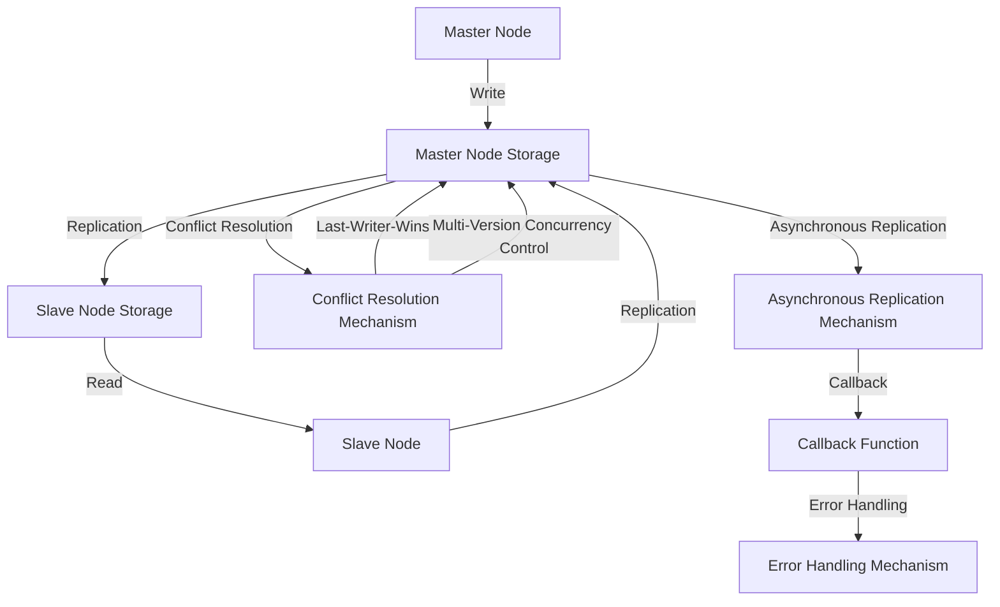

## Introduction
Database replication is a technique used to maintain multiple copies of a database, ensuring that data is available and consistent across all nodes. This is crucial in distributed systems, where data is scattered across multiple machines, and a single point of failure can lead to significant downtime. **Database replication** is a fundamental concept in system design, and every engineer should understand its importance. In this article, we will delve into the world of database replication, exploring its core concepts, internal mechanics, and real-world applications.

> **Note:** Database replication is not just about having multiple copies of data; it's also about ensuring that these copies are consistent and up-to-date.

## Core Concepts
Database replication involves maintaining multiple copies of a database, known as **replicas** or **nodes**. There are two primary types of replication: **Master-Slave** and **Master-Master**.

*   **Master-Slave Replication**: In this setup, one node is designated as the **master**, and all writes are directed to this node. The master node is then responsible for replicating the data to one or more **slave** nodes. Slaves can be used for read-only operations, reducing the load on the master node.
*   **Master-Master Replication**: In this setup, all nodes are considered equal, and each node can accept writes. Each node is responsible for replicating its data to all other nodes, ensuring that all nodes have a consistent view of the data.

> **Warning:** Master-Master replication can lead to conflicts if not implemented correctly, as multiple nodes can accept writes simultaneously.

## How It Works Internally
Let's take a closer look at the internal mechanics of database replication.

1.  **Write Operation**: When a write operation is performed on the master node, the data is written to the node's storage.
2.  **Replication**: The master node then replicates the data to the slave nodes. This can be done using various replication protocols, such as **asynchronous** or **synchronous** replication.
3.  **Conflict Resolution**: In Master-Master replication, conflicts can arise when multiple nodes accept writes simultaneously. To resolve these conflicts, nodes can use **last-writer-wins** or **multi-version concurrency control**.

> **Tip:** Asynchronous replication can lead to temporary inconsistencies between nodes, but it provides better performance. Synchronous replication ensures consistency but can impact performance.

## Code Examples
Here are three complete and runnable code examples demonstrating database replication.

### Example 1: Basic Master-Slave Replication
```python
import threading
import time

class Node:
    def __init__(self, name):
        self.name = name
        self.data = {}

    def write(self, key, value):
        self.data[key] = value
        print(f"{self.name} wrote {key} = {value}")

    def replicate(self, other_node):
        for key, value in self.data.items():
            if key not in other_node.data or other_node.data[key] != value:
                other_node.data[key] = value
                print(f"{other_node.name} replicated {key} = {value}")

# Create master and slave nodes
master = Node("Master")
slave = Node("Slave")

# Perform write operation on master node
master.write("key1", "value1")

# Replicate data to slave node
master.replicate(slave)

print("Master Data:", master.data)
print("Slave Data:", slave.data)
```

### Example 2: Master-Master Replication with Conflict Resolution
```java
import java.util.HashMap;
import java.util.Map;

class Node {
    private String name;
    private Map<String, String> data;
    private Node otherNode;

    public Node(String name) {
        this.name = name;
        this.data = new HashMap<>();
    }

    public void write(String key, String value) {
        data.put(key, value);
        System.out.println(name + " wrote " + key + " = " + value);
    }

    public void replicate(Node otherNode) {
        this.otherNode = otherNode;
        for (Map.Entry<String, String> entry : data.entrySet()) {
            if (!otherNode.data.containsKey(entry.getKey()) || !otherNode.data.get(entry.getKey()).equals(entry.getValue())) {
                otherNode.data.put(entry.getKey(), entry.getValue());
                System.out.println(otherNode.name + " replicated " + entry.getKey() + " = " + entry.getValue());
            }
        }
    }

    public void resolveConflict(String key, String value) {
        if (data.containsKey(key) && !data.get(key).equals(value)) {
            System.out.println("Conflict detected for key " + key);
            // Resolve conflict using last-writer-wins strategy
            data.put(key, value);
        }
    }
}

public class Main {
    public static void main(String[] args) {
        Node node1 = new Node("Node1");
        Node node2 = new Node("Node2");

        node1.write("key1", "value1");
        node2.write("key1", "value2");

        node1.replicate(node2);
        node2.replicate(node1);

        node1.resolveConflict("key1", "value2");
        node2.resolveConflict("key1", "value1");

        System.out.println("Node1 Data: " + node1.data);
        System.out.println("Node2 Data: " + node2.data);
    }
}
```

### Example 3: Asynchronous Replication with Callbacks
```javascript
const fs = require('fs');
const { promisify } = require('util');

const writeFileAsync = promisify(fs.writeFile);
const readFileAsync = promisify(fs.readFile);

class Node {
    constructor(name) {
        this.name = name;
        this.data = {};
    }

    async write(key, value) {
        this.data[key] = value;
        console.log(`${this.name} wrote ${key} = ${value}`);
        await writeFileAsync(`data-${this.name}.json`, JSON.stringify(this.data));
    }

    async replicate(otherNode) {
        const data = await readFileAsync(`data-${otherNode.name}.json`, 'utf8');
        const otherNodeData = JSON.parse(data);
        for (const key in otherNodeData) {
            if (!this.data[key] || this.data[key] !== otherNodeData[key]) {
                this.data[key] = otherNodeData[key];
                console.log(`${this.name} replicated ${key} = ${otherNodeData[key]}`);
            }
        }
        await writeFileAsync(`data-${this.name}.json`, JSON.stringify(this.data));
    }
}

async function main() {
    const node1 = new Node("Node1");
    const node2 = new Node("Node2");

    await node1.write("key1", "value1");
    await node2.write("key1", "value2");

    await node1.replicate(node2);
    await node2.replicate(node1);

    console.log("Node1 Data:", node1.data);
    console.log("Node2 Data:", node2.data);
}

main();
```

## Visual Diagram

This diagram illustrates the master-slave replication process, including write operations, replication, conflict resolution, and asynchronous replication with callbacks.

> **Interview:** Can you explain the differences between Master-Slave and Master-Master replication? How do you handle conflicts in Master-Master replication?

## Comparison
| Approach | Time Complexity | Space Complexity | Pros | Cons | Best For |
| --- | --- | --- | --- | --- | --- |
| Master-Slave Replication | O(1) write, O(n) read | O(n) | Simple to implement, high read throughput | Single point of failure, data inconsistency | Small-scale applications, read-heavy workloads |
| Master-Master Replication | O(1) write, O(1) read | O(n) | High availability, high read and write throughput | Conflict resolution complexity, data inconsistency | Large-scale applications, write-heavy workloads |
| Asynchronous Replication | O(1) write, O(n) read | O(n) | High write throughput, low latency | Data inconsistency, conflict resolution complexity | Real-time analytics, IoT applications |
| Synchronous Replication | O(n) write, O(1) read | O(n) | Data consistency, high read throughput | Low write throughput, high latency | Financial transactions, critical systems |

## Real-world Use Cases
Here are three production examples of database replication:

*   **Pinterest**: Pinterest uses a combination of Master-Slave and Master-Master replication to ensure high availability and scalability of their database.
*   **Instagram**: Instagram uses a Master-Slave replication setup to handle their massive read traffic, with multiple slave nodes for each master node.
*   **Google Cloud SQL**: Google Cloud SQL provides a fully managed database service with automatic replication, allowing users to focus on their application development.

> **Tip:** When designing a database replication strategy, consider the trade-offs between consistency, availability, and performance.

## Common Pitfalls
Here are four common mistakes to avoid when implementing database replication:

*   **Inconsistent Data**: Failing to implement conflict resolution mechanisms can lead to inconsistent data across nodes.
*   **Single Point of Failure**: Not having a redundant master node can cause downtime in case of a failure.
*   **Incorrect Replication Configuration**: Misconfiguring replication settings can lead to data loss or inconsistencies.
*   **Inadequate Monitoring**: Not monitoring replication health and performance can cause issues to go unnoticed.

> **Warning:** Database replication is a complex topic, and incorrect implementation can lead to data loss or inconsistencies.

## Interview Tips
Here are three common interview questions related to database replication:

*   **What is the difference between Master-Slave and Master-Master replication?**: A weak answer would focus on the basic definitions, while a strong answer would discuss the trade-offs between consistency, availability, and performance.
*   **How do you handle conflicts in Master-Master replication?**: A weak answer would mention only one conflict resolution strategy, while a strong answer would discuss multiple strategies and their pros and cons.
*   **What are the benefits and drawbacks of asynchronous replication?**: A weak answer would focus on only one aspect, while a strong answer would discuss the trade-offs between consistency, availability, and performance.

> **Interview:** Can you explain the concept of eventual consistency in distributed systems? How does it relate to database replication?

## Key Takeaways
Here are ten key takeaways to remember:

*   **Database replication is crucial for high availability and scalability**.
*   **Master-Slave replication is simple to implement but has a single point of failure**.
*   **Master-Master replication provides high availability but requires conflict resolution mechanisms**.
*   **Asynchronous replication provides high write throughput but can lead to data inconsistency**.
*   **Synchronous replication ensures data consistency but can impact performance**.
*   **Conflict resolution mechanisms are essential in Master-Master replication**.
*   **Monitoring replication health and performance is crucial**.
*   **Database replication is a complex topic that requires careful consideration of trade-offs**.
*   **Eventual consistency is a key concept in distributed systems and database replication**.
*   **Database replication strategies should be designed with the specific use case in mind**.

> **Note:** Database replication is a critical aspect of system design, and every engineer should understand its importance and complexity.