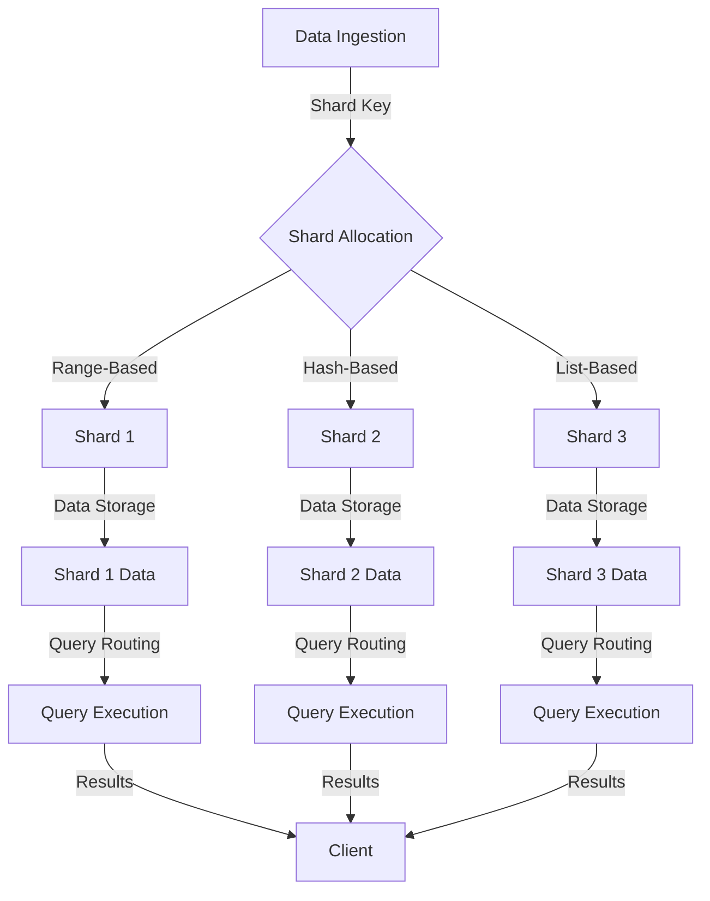

## Introduction
Database sharding, also known as horizontal partitioning, is a technique used to distribute large amounts of data across multiple servers to improve scalability, availability, and performance. It's a crucial concept in system design, especially when dealing with large-scale databases. In this section, we'll explore what database sharding is, why it matters, and its real-world relevance.

Database sharding is essential in today's data-driven world, where the amount of data being generated is increasing exponentially. As the data grows, it becomes challenging to manage and scale a single database to handle the load. This is where sharding comes in – by breaking down the data into smaller, more manageable pieces, called shards, and distributing them across multiple servers.

> **Note:** Database sharding is not the same as replication, which involves duplicating data across multiple servers for high availability and disaster recovery. Sharding is about distributing data across multiple servers to improve performance and scalability.

## Core Concepts
To understand database sharding, it's essential to grasp some key concepts:

* **Shard**: A shard is a subset of the overall data, stored on a separate server or node.
* **Shard key**: A shard key is a column or set of columns used to determine which shard a particular piece of data belongs to.
* **Sharding strategy**: A sharding strategy is the approach used to distribute data across shards. Common strategies include range-based sharding, hash-based sharding, and list-based sharding.
* **Shard management**: Shard management refers to the process of managing and maintaining the shards, including adding or removing shards, and rebalancing data across shards.

> **Tip:** When designing a sharding strategy, it's essential to consider the data distribution and access patterns to ensure that the shards are balanced and efficient.

## How It Works Internally
Here's a step-by-step breakdown of how database sharding works internally:

1. **Data ingestion**: Data is ingested into the system, and the shard key is used to determine which shard the data belongs to.
2. **Shard allocation**: The data is allocated to the corresponding shard, based on the sharding strategy.
3. **Data storage**: The data is stored on the allocated shard, and the shard metadata is updated to reflect the new data.
4. **Query routing**: When a query is received, the shard key is used to determine which shard the query should be routed to.
5. **Query execution**: The query is executed on the corresponding shard, and the results are returned to the client.

> **Warning:** Poorly designed sharding strategies can lead to hotspots, where a single shard becomes overwhelmed with traffic, leading to performance issues and downtime.

## Code Examples
Here are three complete and runnable code examples that demonstrate database sharding:

### Example 1: Basic Sharding
```python
import hashlib

# Define a simple sharding strategy
def shard_key(data):
    return hashlib.md5(data.encode()).hexdigest()[:8]

# Define a shard allocation function
def allocate_shard(shard_key):
    shards = ["shard1", "shard2", "shard3"]
    return shards[int(shard_key, 16) % len(shards)]

# Allocate data to a shard
data = "example_data"
shard_key_value = shard_key(data)
shard = allocate_shard(shard_key_value)
print(f"Data {data} allocated to shard {shard}")
```

### Example 2: Range-Based Sharding
```java
public class RangeSharder {
    private static final int NUM_SHARDS = 10;

    public static String allocateShard(int id) {
        return "shard" + (id % NUM_SHARDS);
    }

    public static void main(String[] args) {
        int id = 123;
        String shard = allocateShard(id);
        System.out.println("ID " + id + " allocated to shard " + shard);
    }
}
```

### Example 3: Hash-Based Sharding with Rebalancing
```javascript
const crypto = require('crypto');

class HashSharder {
    constructor(numShards) {
        this.numShards = numShards;
        this.shards = Array.from({ length: numShards }, () => []);
    }

    allocateShard(data) {
        const hash = crypto.createHash('md5');
        hash.update(data);
        const shardIndex = parseInt(hash.digest('hex').slice(0, 8), 16) % this.numShards;
        return shardIndex;
    }

    rebalance() {
        const newShards = Array.from({ length: this.numShards }, () => []);
        this.shards.forEach((shard, index) => {
            shard.forEach((data) => {
                const newShardIndex = this.allocateShard(data);
                newShards[newShardIndex].push(data);
            });
        });
        this.shards = newShards;
    }

    printShards() {
        console.log(this.shards);
    }
}

const sharder = new HashSharder(5);
sharder.shards[0].push("data1");
sharder.shards[1].push("data2");
sharder.printShards();
sharder.rebalance();
sharder.printShards();
```

## Visual Diagram

This diagram illustrates the overall process of database sharding, from data ingestion to query execution.

## Comparison
Here's a comparison of different sharding strategies:

| Approach | Time Complexity | Space Complexity | Pros | Cons | Best For |
| --- | --- | --- | --- | --- | --- |
| Range-Based Sharding | O(1) | O(n) | Easy to implement, efficient for sequential data | Can lead to hotspots, inflexible | Sequential data, small datasets |
| Hash-Based Sharding | O(1) | O(n) | Flexible, efficient for random data | Can lead to uneven distribution, complex to implement | Random data, large datasets |
| List-Based Sharding | O(n) | O(n) | Flexible, efficient for small datasets | Can lead to hotspots, complex to implement | Small datasets, simple sharding requirements |

## Real-world Use Cases
Here are three real-world examples of database sharding:

* **Pinterest**: Pinterest uses a combination of range-based and hash-based sharding to distribute their massive dataset of images and user data across multiple servers.
* **Twitter**: Twitter uses a hash-based sharding strategy to distribute their tweet data across multiple servers, allowing them to handle high volumes of traffic and data.
* **Amazon**: Amazon uses a range-based sharding strategy to distribute their product catalog data across multiple servers, allowing them to handle large volumes of traffic and data.

## Common Pitfalls
Here are four common pitfalls to watch out for when implementing database sharding:

* **Inconsistent shard keys**: Using inconsistent shard keys can lead to data being allocated to the wrong shard, resulting in data loss or corruption.
* **Poorly designed sharding strategies**: Poorly designed sharding strategies can lead to hotspots, where a single shard becomes overwhelmed with traffic, leading to performance issues and downtime.
* **Inadequate shard management**: Inadequate shard management can lead to shards becoming unbalanced, resulting in poor performance and data loss.
* **Insufficient testing**: Insufficient testing can lead to sharding issues going undetected, resulting in data loss or corruption.

> **Interview:** When asked about database sharding in an interview, be sure to discuss the different sharding strategies, the importance of shard key consistency, and the need for adequate shard management and testing.

## Interview Tips
Here are three common interview questions related to database sharding, along with weak and strong answers:

* **What is database sharding, and how does it work?**
	+ Weak answer: "Database sharding is a way to split data across multiple servers. I'm not sure how it works, but I think it's like replication or something."
	+ Strong answer: "Database sharding is a technique used to distribute large amounts of data across multiple servers to improve scalability, availability, and performance. It works by breaking down the data into smaller, more manageable pieces, called shards, and distributing them across multiple servers based on a shard key."
* **How do you determine the optimal number of shards for a dataset?**
	+ Weak answer: "I'm not sure, but I think it depends on the size of the dataset and the number of servers available."
	+ Strong answer: "To determine the optimal number of shards, you need to consider the size of the dataset, the expected traffic and query patterns, and the available resources such as server capacity and network bandwidth. A good starting point is to use a range-based or hash-based sharding strategy and adjust the number of shards based on performance metrics and data distribution."
* **How do you handle shard key inconsistencies in a sharded database?**
	+ Weak answer: "I'm not sure, but I think you just need to make sure the shard key is consistent across all shards."
	+ Strong answer: "To handle shard key inconsistencies, you need to implement a robust shard key validation mechanism to ensure that the shard key is consistent across all shards. This can be done by using a centralized shard key management system or by implementing a distributed shard key validation protocol. Additionally, you should regularly monitor and audit the shard keys to detect and correct any inconsistencies."

## Key Takeaways
Here are 10 key takeaways to remember about database sharding:

* Database sharding is a technique used to distribute large amounts of data across multiple servers to improve scalability, availability, and performance.
* Shard keys are used to determine which shard a particular piece of data belongs to.
* Range-based, hash-based, and list-based sharding strategies are common approaches to distribute data across shards.
* Shard management and testing are crucial to ensure that the shards are balanced and efficient.
* Inconsistent shard keys can lead to data loss or corruption.
* Poorly designed sharding strategies can lead to hotspots and performance issues.
* Adequate shard management and testing are essential to prevent data loss or corruption.
* Database sharding is not the same as replication, which involves duplicating data across multiple servers for high availability and disaster recovery.
* Shard keys should be consistent across all shards to ensure data integrity and consistency.
* Regular monitoring and auditing of shard keys and data distribution are essential to ensure that the shards are balanced and efficient.