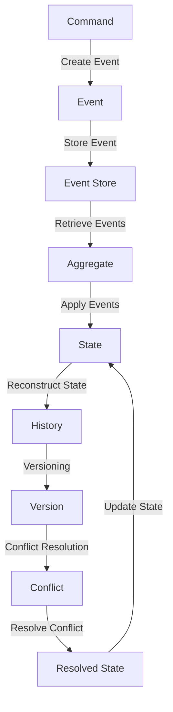

## Introduction
The **Event Sourcing Pattern** is a software design pattern that involves storing the history of an application's state as a sequence of events. This approach provides a robust and scalable way to manage complex, distributed systems. By storing events rather than just the current state, the Event Sourcing Pattern enables the reconstruction of the application's state at any point in time. This is particularly useful in systems that require auditing, debugging, or versioning. In this section, we will explore the basics of the Event Sourcing Pattern and its relevance in real-world systems.

> **Note:** The Event Sourcing Pattern is often used in conjunction with other design patterns, such as **Command Query Responsibility Segregation (CQRS)** and **Domain-Driven Design (DDD)**, to create robust and scalable systems.

The Event Sourcing Pattern is used in various industries, including finance, healthcare, and e-commerce. For example, a banking system might use the Event Sourcing Pattern to store transactions as events, allowing for the reconstruction of a customer's account balance at any point in time. Similarly, a healthcare system might use the Event Sourcing Pattern to store medical records as events, enabling the tracking of a patient's medical history.

## Core Concepts
The Event Sourcing Pattern involves several key concepts:

* **Events**: These are the basic building blocks of the Event Sourcing Pattern. Events represent changes to the application's state and are stored in a database or event store.
* **Event Store**: This is the database or storage system that holds the events. The event store is responsible for storing and retrieving events.
* **Aggregate**: This is the entity that represents the application's state. Aggregates are composed of events and are responsible for applying events to their state.
* **Command**: This is a request to perform an action on an aggregate. Commands are processed by the aggregate, which applies the corresponding events to its state.

> **Warning:** One common mistake when implementing the Event Sourcing Pattern is to store events in a relational database. While this may seem like a convenient option, it can lead to performance issues and make it difficult to scale the system.

## How It Works Internally
The Event Sourcing Pattern works as follows:

1. An application receives a command to perform an action on an aggregate.
2. The aggregate processes the command and applies the corresponding events to its state.
3. The events are stored in the event store.
4. The aggregate's state is updated based on the events.
5. The application can reconstruct the aggregate's state at any point in time by replaying the events from the event store.

The Event Sourcing Pattern involves several key steps:

* **Event creation**: The application creates events in response to commands.
* **Event storage**: The events are stored in the event store.
* **Event retrieval**: The events are retrieved from the event store and applied to the aggregate's state.
* **State reconstruction**: The aggregate's state is reconstructed by replaying the events from the event store.

> **Tip:** When implementing the Event Sourcing Pattern, it's essential to consider the performance implications of storing and retrieving events. Using an optimized event store, such as a NoSQL database or a message queue, can help improve performance.

## Code Examples
Here are three complete and runnable code examples that demonstrate the Event Sourcing Pattern:

### Example 1: Basic Event Sourcing
```java
// Event.java
public class Event {
    private String type;
    private String data;

    public Event(String type, String data) {
        this.type = type;
        this.data = data;
    }

    public String getType() {
        return type;
    }

    public String getData() {
        return data;
    }
}

// Aggregate.java
public class Aggregate {
    private List<Event> events;

    public Aggregate() {
        events = new ArrayList<>();
    }

    public void applyEvent(Event event) {
        events.add(event);
    }

    public List<Event> getEvents() {
        return events;
    }
}

// EventStore.java
public class EventStore {
    private Map<String, List<Event>> events;

    public EventStore() {
        events = new HashMap<>();
    }

    public void storeEvent(Event event) {
        String aggregateId = event.getType();
        if (!events.containsKey(aggregateId)) {
            events.put(aggregateId, new ArrayList<>());
        }
        events.get(aggregateId).add(event);
    }

    public List<Event> getEvents(String aggregateId) {
        return events.get(aggregateId);
    }
}

public class Main {
    public static void main(String[] args) {
        EventStore eventStore = new EventStore();
        Aggregate aggregate = new Aggregate();

        Event event1 = new Event("CREATE", "Data 1");
        Event event2 = new Event("UPDATE", "Data 2");

        aggregate.applyEvent(event1);
        aggregate.applyEvent(event2);

        eventStore.storeEvent(event1);
        eventStore.storeEvent(event2);

        List<Event> events = eventStore.getEvents("CREATE");
        for (Event event : events) {
            System.out.println(event.getType() + ": " + event.getData());
        }
    }
}
```

### Example 2: Event Sourcing with CQRS
```java
// Command.java
public class Command {
    private String type;
    private String data;

    public Command(String type, String data) {
        this.type = type;
        this.data = data;
    }

    public String getType() {
        return type;
    }

    public String getData() {
        return data;
    }
}

// Query.java
public class Query {
    private String type;
    private String data;

    public Query(String type, String data) {
        this.type = type;
        this.data = data;
    }

    public String getType() {
        return type;
    }

    public String getData() {
        return data;
    }
}

// Aggregate.java
public class Aggregate {
    private List<Event> events;

    public Aggregate() {
        events = new ArrayList<>();
    }

    public void applyEvent(Event event) {
        events.add(event);
    }

    public List<Event> getEvents() {
        return events;
    }
}

// CommandHandler.java
public class CommandHandler {
    public void handleCommand(Command command) {
        // Process the command and apply the corresponding events
    }
}

// QueryHandler.java
public class QueryHandler {
    public void handleQuery(Query query) {
        // Process the query and retrieve the corresponding data
    }
}

public class Main {
    public static void main(String[] args) {
        Command command = new Command("CREATE", "Data 1");
        Query query = new Query("READ", "Data 1");

        CommandHandler commandHandler = new CommandHandler();
        QueryHandler queryHandler = new QueryHandler();

        commandHandler.handleCommand(command);
        queryHandler.handleQuery(query);
    }
}
```

### Example 3: Advanced Event Sourcing with Versioning
```java
// Event.java
public class Event {
    private String type;
    private String data;
    private int version;

    public Event(String type, String data, int version) {
        this.type = type;
        this.data = data;
        this.version = version;
    }

    public String getType() {
        return type;
    }

    public String getData() {
        return data;
    }

    public int getVersion() {
        return version;
    }
}

// Aggregate.java
public class Aggregate {
    private List<Event> events;
    private int version;

    public Aggregate() {
        events = new ArrayList<>();
        version = 0;
    }

    public void applyEvent(Event event) {
        events.add(event);
        version = event.getVersion();
    }

    public List<Event> getEvents() {
        return events;
    }

    public int getVersion() {
        return version;
    }
}

// EventStore.java
public class EventStore {
    private Map<String, List<Event>> events;

    public EventStore() {
        events = new HashMap<>();
    }

    public void storeEvent(Event event) {
        String aggregateId = event.getType();
        if (!events.containsKey(aggregateId)) {
            events.put(aggregateId, new ArrayList<>());
        }
        events.get(aggregateId).add(event);
    }

    public List<Event> getEvents(String aggregateId) {
        return events.get(aggregateId);
    }
}

public class Main {
    public static void main(String[] args) {
        EventStore eventStore = new EventStore();
        Aggregate aggregate = new Aggregate();

        Event event1 = new Event("CREATE", "Data 1", 1);
        Event event2 = new Event("UPDATE", "Data 2", 2);

        aggregate.applyEvent(event1);
        aggregate.applyEvent(event2);

        eventStore.storeEvent(event1);
        eventStore.storeEvent(event2);

        List<Event> events = eventStore.getEvents("CREATE");
        for (Event event : events) {
            System.out.println(event.getType() + ": " + event.getData() + " (Version " + event.getVersion() + ")");
        }
    }
}
```

## Visual Diagram

The diagram illustrates the Event Sourcing Pattern, including the creation of events, storage in an event store, retrieval of events, application of events to an aggregate, and reconstruction of the state. The diagram also shows the versioning and conflict resolution mechanisms.

> **Interview:** Can you explain the difference between the Event Sourcing Pattern and the Command Query Responsibility Segregation (CQRS) pattern?

## Comparison
| Approach | Time Complexity | Space Complexity | Pros | Cons | Best For |
| --- | --- | --- | --- | --- | --- |
| Event Sourcing | O(n) | O(n) | Robust, scalable, and flexible | Complex, requires careful implementation | Systems that require auditing, debugging, or versioning |
| CQRS | O(n) | O(n) | Separates commands and queries, improves performance | Requires careful implementation, can be complex | Systems that require high performance and scalability |
| Domain-Driven Design (DDD) | O(n) | O(n) | Focuses on the business domain, improves understanding | Can be complex, requires careful implementation | Systems that require a deep understanding of the business domain |
| Relational Database | O(1) | O(1) | Simple, easy to implement | Limited scalability, can be inflexible | Systems that require simple data storage and retrieval |

## Real-world Use Cases
The Event Sourcing Pattern is used in various industries, including:

* Finance: Banking systems use the Event Sourcing Pattern to store transactions as events, allowing for the reconstruction of a customer's account balance at any point in time.
* Healthcare: Healthcare systems use the Event Sourcing Pattern to store medical records as events, enabling the tracking of a patient's medical history.
* E-commerce: E-commerce systems use the Event Sourcing Pattern to store orders as events, allowing for the reconstruction of a customer's order history at any point in time.

Companies that use the Event Sourcing Pattern include:

* Amazon: Amazon uses the Event Sourcing Pattern to store orders and customer interactions as events, enabling the reconstruction of a customer's order history and improving customer service.
* Microsoft: Microsoft uses the Event Sourcing Pattern to store Azure service requests as events, enabling the reconstruction of a customer's service request history and improving customer support.
* Google: Google uses the Event Sourcing Pattern to store Google Cloud service requests as events, enabling the reconstruction of a customer's service request history and improving customer support.

## Common Pitfalls
When implementing the Event Sourcing Pattern, several common pitfalls can occur:

* **Incorrect event versioning**: Failing to properly version events can lead to conflicts and inconsistencies in the system.
* **Insufficient event storage**: Failing to store events properly can lead to data loss and inconsistencies in the system.
* **Inadequate conflict resolution**: Failing to properly resolve conflicts can lead to inconsistencies in the system.
* **Overly complex event handling**: Failing to properly handle events can lead to performance issues and complexity in the system.

> **Warning:** When implementing the Event Sourcing Pattern, it's essential to carefully consider the trade-offs between complexity, scalability, and performance.

## Interview Tips
When interviewing for a position that involves the Event Sourcing Pattern, several common questions may arise:

* **What is the Event Sourcing Pattern?**: A weak answer might focus on the technical implementation, while a strong answer would explain the pattern's purpose, benefits, and trade-offs.
* **How does the Event Sourcing Pattern differ from CQRS?**: A weak answer might confuse the two patterns, while a strong answer would clearly explain the differences and similarities between the two.
* **What are the benefits and trade-offs of using the Event Sourcing Pattern?**: A weak answer might focus on a single benefit or trade-off, while a strong answer would discuss the various benefits and trade-offs, including complexity, scalability, and performance.

> **Tip:** When answering questions about the Event Sourcing Pattern, it's essential to demonstrate a deep understanding of the pattern's purpose, benefits, and trade-offs.

## Key Takeaways
The following are key takeaways when implementing the Event Sourcing Pattern:

* **Events are the core of the pattern**: Events represent changes to the application's state and are stored in an event store.
* **Versioning is crucial**: Proper versioning of events is essential to avoid conflicts and inconsistencies in the system.
* **Conflict resolution is necessary**: Conflict resolution mechanisms are necessary to handle conflicts that may arise during event handling.
* **Performance and scalability are critical**: The Event Sourcing Pattern can be complex and require careful implementation to ensure performance and scalability.
* **The pattern requires careful consideration of trade-offs**: The Event Sourcing Pattern involves trade-offs between complexity, scalability, and performance, and careful consideration is necessary to ensure the pattern is implemented correctly.
* **The pattern is not a silver bullet**: The Event Sourcing Pattern is not a solution to all problems and should be used judiciously and with careful consideration of the trade-offs involved.