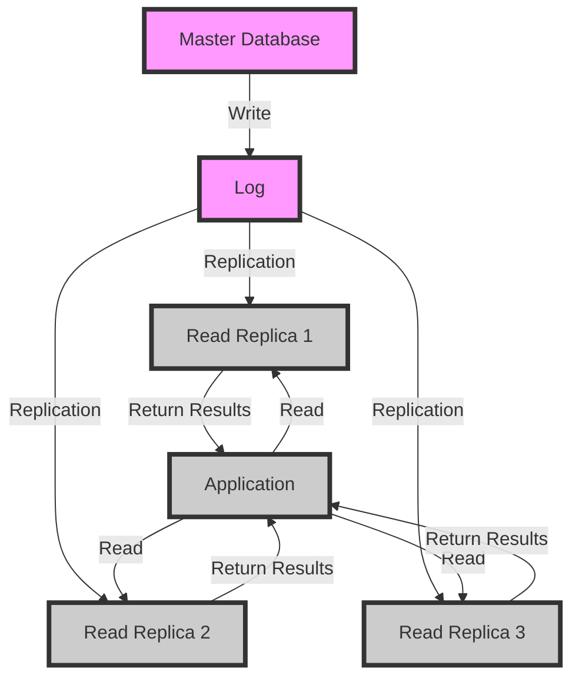

## Introduction
Read replicas are a crucial component in designing scalable database systems. A read replica is a copy of a database that is used to offload read traffic from the primary database, allowing it to focus on handling writes. This approach is essential in systems where reads far outnumber writes, such as in social media platforms, e-commerce websites, and content delivery networks. By using read replicas, developers can significantly improve the performance and availability of their applications. In this section, we will explore the concept of read replicas, their importance, and how they are used in real-world applications.

> **Note:** Read replicas are particularly useful in systems where data is mostly read and rarely updated, such as in reporting databases or data warehouses.

## Core Concepts
To understand read replicas, it's essential to grasp some key concepts:

* **Master-slave replication**: This is a replication strategy where one database (the master) is designated as the primary database, and one or more databases (the slaves) replicate the data from the master. The master database handles all writes, while the slaves handle reads.
* **Asynchronous replication**: This is a replication strategy where the master database writes data to its log, and the slaves periodically fetch the log and apply the changes to their local copy of the data. This approach can lead to temporary inconsistencies between the master and slaves.
* **Synchronous replication**: This is a replication strategy where the master database writes data to its log, and the slaves immediately apply the changes to their local copy of the data. This approach ensures that the master and slaves are always consistent, but can lead to increased latency.

> **Warning:** Asynchronous replication can lead to temporary inconsistencies between the master and slaves, which can cause issues in applications that require strong consistency.

## How It Works Internally
Here's a step-by-step breakdown of how read replicas work:

1. The primary database (master) receives writes from the application.
2. The master database writes the changes to its log.
3. The read replicas (slaves) periodically fetch the log from the master and apply the changes to their local copy of the data.
4. The application directs read requests to the read replicas.
5. The read replicas handle the read requests and return the results to the application.

> **Tip:** To improve performance, read replicas can be located in different geographic regions, allowing applications to direct read requests to the closest replica.

## Code Examples
### Example 1: Basic Read Replica Setup
```python
import mysql.connector

# Master database connection
master_config = {
    'user': 'root',
    'password': 'password',
    'host': 'master-db',
    'database': 'mydb'
}

# Read replica connection
replica_config = {
    'user': 'root',
    'password': 'password',
    'host': 'read-replica',
    'database': 'mydb'
}

# Create a connection to the master database
master_conn = mysql.connector.connect(**master_config)

# Create a connection to the read replica
replica_conn = mysql.connector.connect(**replica_config)

# Perform a write operation on the master database
cursor = master_conn.cursor()
cursor.execute("INSERT INTO mytable (name, email) VALUES ('John Doe', 'johndoe@example.com')")
master_conn.commit()

# Perform a read operation on the read replica
cursor = replica_conn.cursor()
cursor.execute("SELECT * FROM mytable")
results = cursor.fetchall()
print(results)
```

### Example 2: Load Balancing with Read Replicas
```python
import mysql.connector
import random

# List of read replicas
replicas = [
    {'host': 'read-replica-1', 'port': 3306},
    {'host': 'read-replica-2', 'port': 3306},
    {'host': 'read-replica-3', 'port': 3306}
]

# Master database connection
master_config = {
    'user': 'root',
    'password': 'password',
    'host': 'master-db',
    'database': 'mydb'
}

# Create a connection to the master database
master_conn = mysql.connector.connect(**master_config)

# Perform a write operation on the master database
cursor = master_conn.cursor()
cursor.execute("INSERT INTO mytable (name, email) VALUES ('John Doe', 'johndoe@example.com')")
master_conn.commit()

# Load balance read requests across read replicas
def get_read_replica():
    return random.choice(replicas)

# Perform a read operation on a read replica
replica = get_read_replica()
replica_config = {
    'user': 'root',
    'password': 'password',
    'host': replica['host'],
    'port': replica['port'],
    'database': 'mydb'
}
replica_conn = mysql.connector.connect(**replica_config)
cursor = replica_conn.cursor()
cursor.execute("SELECT * FROM mytable")
results = cursor.fetchall()
print(results)
```

### Example 3: Handling Failover with Read Replicas
```python
import mysql.connector
import time

# List of read replicas
replicas = [
    {'host': 'read-replica-1', 'port': 3306},
    {'host': 'read-replica-2', 'port': 3306},
    {'host': 'read-replica-3', 'port': 3306}
]

# Master database connection
master_config = {
    'user': 'root',
    'password': 'password',
    'host': 'master-db',
    'database': 'mydb'
}

# Create a connection to the master database
master_conn = mysql.connector.connect(**master_config)

# Perform a write operation on the master database
cursor = master_conn.cursor()
cursor.execute("INSERT INTO mytable (name, email) VALUES ('John Doe', 'johndoe@example.com')")
master_conn.commit()

# Handle failover to a read replica
def get_read_replica():
    for replica in replicas:
        try:
            replica_config = {
                'user': 'root',
                'password': 'password',
                'host': replica['host'],
                'port': replica['port'],
                'database': 'mydb'
            }
            replica_conn = mysql.connector.connect(**replica_config)
            cursor = replica_conn.cursor()
            cursor.execute("SELECT * FROM mytable")
            results = cursor.fetchall()
            return replica_conn
        except mysql.connector.Error as err:
            print(f"Error connecting to {replica['host']}: {err}")
            time.sleep(1)
    return None

# Perform a read operation on a read replica
replica_conn = get_read_replica()
if replica_conn:
    cursor = replica_conn.cursor()
    cursor.execute("SELECT * FROM mytable")
    results = cursor.fetchall()
    print(results)
else:
    print("Failed to connect to any read replica")
```

## Visual Diagram

This diagram illustrates the basic architecture of a master-slave replication setup with multiple read replicas.

> **Note:** The master database writes to its log, which is then replicated to the read replicas. The application directs read requests to the read replicas, which return the results.

## Comparison
| Approach | Time Complexity | Space Complexity | Pros | Cons | Best For |
| --- | --- | --- | --- | --- | --- |
| Master-Slave Replication | O(1) | O(n) | Easy to implement, high availability | Can lead to temporary inconsistencies | Simple applications with low consistency requirements |
| Multi-Master Replication | O(n) | O(n) | High availability, strong consistency | Complex to implement, high latency | Applications with high consistency requirements |
| Load Balancing with Read Replicas | O(1) | O(n) | High availability, improved performance | Can lead to temporary inconsistencies | Applications with high read traffic |
| Failover to Read Replica | O(1) | O(n) | High availability, improved performance | Can lead to temporary inconsistencies | Applications with high read traffic and failover requirements |

> **Interview:** Can you explain the difference between master-slave replication and multi-master replication? How would you choose between these approaches for a given application?

## Real-world Use Cases
1. **Netflix**: Netflix uses a combination of master-slave replication and load balancing with read replicas to handle their high traffic and availability requirements.
2. **Facebook**: Facebook uses a multi-master replication approach to ensure strong consistency across their distributed database.
3. **Amazon**: Amazon uses a combination of master-slave replication and load balancing with read replicas to handle their high traffic and availability requirements.

> **Tip:** When designing a database system, it's essential to consider the trade-offs between consistency, availability, and performance.

## Common Pitfalls
1. **Inconsistent Data**: Failing to implement proper replication and consistency mechanisms can lead to inconsistent data across the system.
2. **High Latency**: Failing to optimize database performance and replication can lead to high latency and poor user experience.
3. **Incorrect Load Balancing**: Failing to properly load balance read traffic across read replicas can lead to uneven performance and poor user experience.
4. **Inadequate Failover**: Failing to implement proper failover mechanisms can lead to downtime and poor user experience.

> **Warning:** Inconsistent data can lead to serious issues, such as incorrect financial transactions or compromised user data.

## Interview Tips
1. **Be prepared to explain the trade-offs between consistency, availability, and performance**. The interviewer wants to know that you understand the complexities of designing a database system and can make informed decisions.
2. **Be prepared to describe a scenario where you would use master-slave replication vs multi-master replication**. The interviewer wants to know that you can apply theoretical concepts to real-world scenarios.
3. **Be prepared to explain how you would handle failover and load balancing in a database system**. The interviewer wants to know that you can design a robust and highly available system.

> **Note:** The key to acing a database system design interview is to be prepared to discuss the trade-offs and complexities of different approaches.

## Key Takeaways
* **Read replicas are essential for scaling reads in a database system**.
* **Master-slave replication is a simple and effective approach for high availability**.
* **Multi-master replication is a complex approach that provides strong consistency**.
* **Load balancing with read replicas can improve performance and availability**.
* **Failover to a read replica can improve availability and performance**.
* **Inconsistent data can lead to serious issues**.
* **High latency can lead to poor user experience**.
* **Incorrect load balancing can lead to uneven performance**.
* **Inadequate failover can lead to downtime**.

> **Tip:** When designing a database system, it's essential to consider the trade-offs between consistency, availability, and performance, and to be prepared to discuss these trade-offs in an interview.