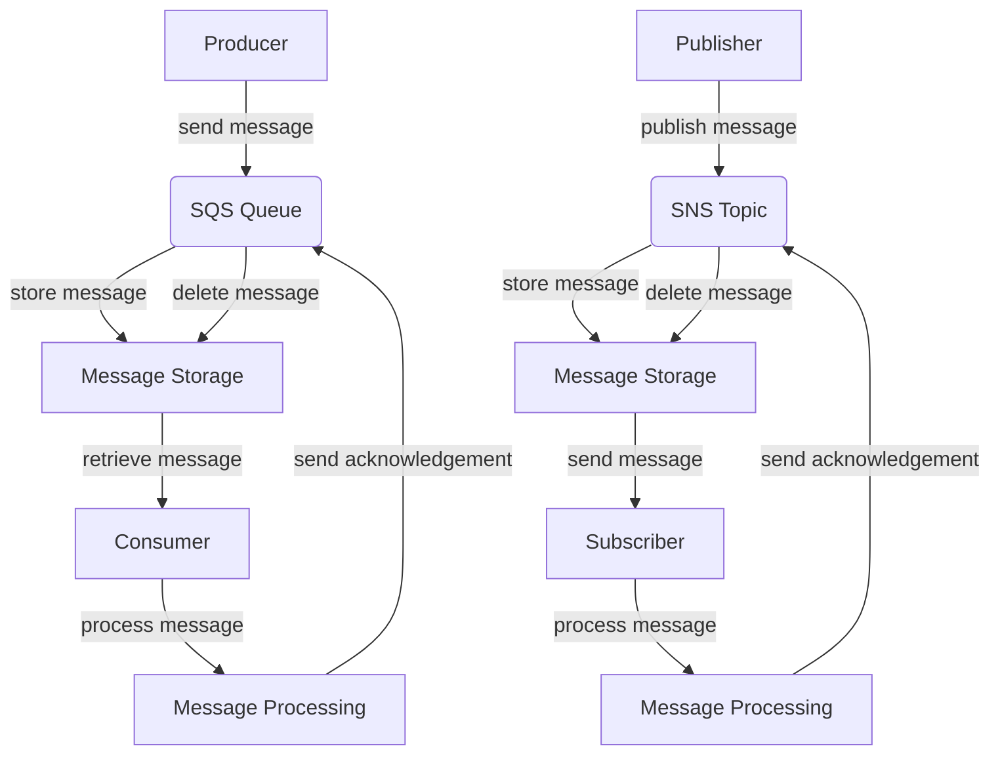

## Introduction
**Amazon Simple Queue Service (SQS)** and **Amazon Simple Notification Service (SNS)** are two popular messaging services provided by Amazon Web Services (AWS). These services enable decoupling of applications, allowing them to communicate with each other asynchronously. SQS is a message queue service that allows messages to be stored in a queue, while SNS is a notification service that allows messages to be published to multiple subscribers. Both services are essential components of a scalable and fault-tolerant architecture. In this section, we will explore the importance of SQS and SNS, their real-world relevance, and why every engineer needs to know about them.

> **Note:** SQS and SNS are designed to provide a scalable and fault-tolerant messaging system, allowing developers to focus on writing application code rather than building and maintaining messaging infrastructure.

## Core Concepts
To understand SQS and SNS, it is essential to grasp the following core concepts:
* **Message**: A message is a piece of data that is sent from a producer to a consumer. In SQS, a message is stored in a queue, while in SNS, a message is published to multiple subscribers.
* **Queue**: A queue is a buffer that stores messages until they are processed by a consumer. SQS provides two types of queues: **Standard Queue** and **FIFO Queue**.
* **Topic**: A topic is a logical access point that allows publishers to send messages to multiple subscribers. SNS provides topics that can be used to publish messages to multiple subscribers.
* **Subscriber**: A subscriber is an endpoint that receives messages from a topic. SNS supports multiple types of subscribers, including **SQS queues**, **Lambda functions**, and **HTTP endpoints**.

> **Warning:** SQS and SNS have different use cases and should not be used interchangeably. SQS is designed for point-to-point messaging, while SNS is designed for publish-subscribe messaging.

## How It Works Internally
Here is a high-level overview of how SQS and SNS work internally:
1. **Message Production**: A producer sends a message to an SQS queue or an SNS topic.
2. **Message Storage**: SQS stores the message in a queue, while SNS stores the message in a topic.
3. **Message Consumption**: A consumer retrieves the message from an SQS queue or an SNS topic.
4. **Message Processing**: The consumer processes the message and sends an acknowledgement to SQS or SNS.

> **Tip:** To improve the performance of SQS and SNS, use **batching** and **asynchronous** processing. Batching allows multiple messages to be processed together, reducing the number of requests made to SQS and SNS. Asynchronous processing allows messages to be processed in the background, reducing the latency of message processing.

## Code Examples
Here are three complete and runnable code examples that demonstrate the use of SQS and SNS:

### Example 1: Basic SQS Producer and Consumer
```java
import software.amazon.awssdk.services.sqs.SqsClient;
import software.amazon.awssdk.services.sqs.model.Message;
import software.amazon.awssdk.services.sqs.model.ReceiveMessageRequest;
import software.amazon.awssdk.services.sqs.model.SendMessageRequest;

public class SQSExample {
    public static void main(String[] args) {
        // Create an SQS client
        SqsClient sqsClient = SqsClient.create();

        // Create a queue
        String queueUrl = "https://sqs.us-east-1.amazonaws.com/123456789012/my-queue";

        // Send a message to the queue
        SendMessageRequest sendMessageRequest = SendMessageRequest.builder()
                .queueUrl(queueUrl)
                .messageBody("Hello, World!")
                .build();
        sqsClient.sendMessage(sendMessageRequest);

        // Receive a message from the queue
        ReceiveMessageRequest receiveMessageRequest = ReceiveMessageRequest.builder()
                .queueUrl(queueUrl)
                .build();
        List<Message> messages = sqsClient.receiveMessage(receiveMessageRequest).messages();
        for (Message message : messages) {
            System.out.println(message.body());
        }
    }
}
```

### Example 2: SNS Publisher and Subscriber
```python
import boto3

# Create an SNS client
sns = boto3.client('sns')

# Create a topic
topic_arn = sns.create_topic(Name='my-topic')['TopicArn']

# Publish a message to the topic
sns.publish(TopicArn=topic_arn, Message='Hello, World!')

# Subscribe to the topic
subscription_arn = sns.subscribe(TopicArn=topic_arn, Protocol='sqs', Endpoint='https://sqs.us-east-1.amazonaws.com/123456789012/my-queue')['SubscriptionArn']

# Receive a message from the subscription
sqs = boto3.client('sqs')
queue_url = 'https://sqs.us-east-1.amazonaws.com/123456789012/my-queue'
response = sqs.receive_message(QueueUrl=queue_url, MaxNumberOfMessages=10)
for message in response['Messages']:
    print(message['Body'])
```

### Example 3: Advanced SQS and SNS Integration
```typescript
import * as AWS from 'aws-sdk';

// Create an SQS client
const sqs = new AWS.SQS({ region: 'us-east-1' });

// Create an SNS client
const sns = new AWS.SNS({ region: 'us-east-1' });

// Create a queue
const queueUrl = 'https://sqs.us-east-1.amazonaws.com/123456789012/my-queue';

// Create a topic
const topicArn = 'arn:aws:sns:us-east-1:123456789012:my-topic';

// Send a message to the queue
sqs.sendMessage({ QueueUrl: queueUrl, MessageBody: 'Hello, World!' }, (err, data) => {
    if (err) {
        console.log(err);
    } else {
        console.log(data);
    }
});

// Publish a message to the topic
sns.publish({ TopicArn: topicArn, Message: 'Hello, World!' }, (err, data) => {
    if (err) {
        console.log(err);
    } else {
        console.log(data);
    }
});

// Receive a message from the queue
sqs.receiveMessage({ QueueUrl: queueUrl, MaxNumberOfMessages: 10 }, (err, data) => {
    if (err) {
        console.log(err);
    } else {
        console.log(data.Messages);
    }
});
```

## Visual Diagram

This diagram illustrates the flow of messages between producers, consumers, and messaging services.

> **Interview:** Can you explain the difference between SQS and SNS? How would you use these services in a real-world application?

## Comparison
| Service | Time Complexity | Space Complexity | Pros | Cons | Best For |
| --- | --- | --- | --- | --- | --- |
| SQS | O(1) | O(n) | Decoupling, fault tolerance, scalability | Limited to 120,000 in-flight messages | Point-to-point messaging |
| SNS | O(1) | O(n) | Decoupling, fault tolerance, scalability | Limited to 100,000 subscribers | Publish-subscribe messaging |
| RabbitMQ | O(log n) | O(n) | Decoupling, fault tolerance, scalability | Steeper learning curve | Complex messaging scenarios |
| Apache Kafka | O(log n) | O(n) | Decoupling, fault tolerance, scalability | Steeper learning curve | High-throughput messaging scenarios |

## Real-world Use Cases
Here are three real-world use cases for SQS and SNS:
1. **Order Processing**: An e-commerce company uses SQS to process orders. When a customer places an order, the order is sent to an SQS queue, where it is processed by a worker node.
2. **Notification System**: A social media company uses SNS to send notifications to users. When a user posts an update, the update is published to an SNS topic, where it is sent to multiple subscribers.
3. **Log Processing**: A company uses SQS and SNS to process logs. When a log is generated, it is sent to an SQS queue, where it is processed by a worker node. The processed log is then published to an SNS topic, where it is sent to multiple subscribers.

## Common Pitfalls
Here are four common pitfalls to avoid when using SQS and SNS:
1. **Not handling message failures**: Failing to handle message failures can cause messages to be lost or processed multiple times.
2. **Not using batching**: Failing to use batching can cause performance issues and increase the number of requests made to SQS and SNS.
3. **Not using asynchronous processing**: Failing to use asynchronous processing can cause performance issues and increase the latency of message processing.
4. **Not monitoring queue and topic metrics**: Failing to monitor queue and topic metrics can cause performance issues and make it difficult to debug problems.

> **Warning:** Not handling message failures can cause data loss and corruption.

## Interview Tips
Here are three common interview questions related to SQS and SNS:
1. **What is the difference between SQS and SNS?**: A weak answer would focus on the similarities between SQS and SNS, while a strong answer would highlight the differences and explain when to use each service.
2. **How would you use SQS and SNS in a real-world application?**: A weak answer would focus on a simple use case, while a strong answer would explain a complex use case and highlight the benefits of using SQS and SNS.
3. **What are some common pitfalls to avoid when using SQS and SNS?**: A weak answer would focus on a single pitfall, while a strong answer would explain multiple pitfalls and provide strategies for avoiding them.

> **Tip:** To answer interview questions related to SQS and SNS, focus on the differences between the services, explain complex use cases, and highlight common pitfalls and strategies for avoiding them.

## Key Takeaways
Here are ten key takeaways to remember:
* SQS and SNS are designed for decoupling and fault tolerance.
* SQS is designed for point-to-point messaging, while SNS is designed for publish-subscribe messaging.
* SQS has a time complexity of O(1) and a space complexity of O(n).
* SNS has a time complexity of O(1) and a space complexity of O(n).
* Batching and asynchronous processing can improve performance.
* Monitoring queue and topic metrics is essential for debugging and performance optimization.
* Not handling message failures can cause data loss and corruption.
* Using SQS and SNS can improve scalability and fault tolerance.
* Common pitfalls include not handling message failures, not using batching, and not using asynchronous processing.
* Real-world use cases include order processing, notification systems, and log processing.