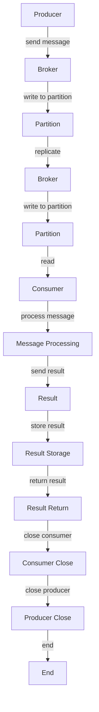

## Introduction
Apache Kafka is a **distributed streaming platform** designed to handle high-throughput and provides low-latency, fault-tolerant, and scalable data processing. It was originally developed by LinkedIn and is now maintained by the Apache Software Foundation. Kafka is used for building real-time data pipelines and streaming apps, and it's a crucial component in many big data architectures. Every engineer should know how to work with Kafka because it's a fundamental tool in the data engineering and system design ecosystem.

> **Note:** Kafka is often used in conjunction with other big data technologies like Apache Hadoop, Apache Spark, and Apache Flink.

## Core Concepts
Let's define the core concepts of Apache Kafka:

* **Topic**: A topic is a stream of related messages. Producers write data to topics, and consumers read data from topics.
* **Partition**: A partition is a way to split a topic into smaller, more manageable pieces. Each partition is an ordered, immutable log that can be hosted on multiple brokers.
* **Broker**: A broker is a server that runs Kafka and maintains a set of partitions.
* **Producer**: A producer is an application that writes data to a Kafka topic.
* **Consumer**: A consumer is an application that reads data from a Kafka topic.

> **Tip:** Think of a topic as a table in a database, and partitions as shards of that table.

## How It Works Internally
Here's a step-by-step breakdown of how Kafka works internally:

1. **Producer writes to topic**: A producer sends a message to a Kafka topic.
2. **Broker receives message**: The message is received by a Kafka broker, which is responsible for hosting the topic's partition.
3. **Broker writes to partition**: The broker writes the message to the partition's log.
4. **Partition is replicated**: The partition is replicated across multiple brokers to ensure fault tolerance.
5. **Consumer reads from topic**: A consumer reads messages from the topic by reading from one or more partitions.

> **Warning:** If a broker goes down, the partition it's hosting will be unavailable until the broker is restarted or the partition is reassigned to another broker.

## Code Examples
Here are three complete, runnable code examples:

### Example 1: Basic Producer (Java)
```java
import org.apache.kafka.clients.producer.KafkaProducer;
import org.apache.kafka.clients.producer.ProducerConfig;
import org.apache.kafka.clients.producer.ProducerRecord;
import org.apache.kafka.common.serialization.StringSerializer;

import java.util.Properties;

public class BasicProducer {
    public static void main(String[] args) {
        // Create a producer
        Properties props = new Properties();
        props.put(ProducerConfig.BOOTSTRAP_SERVERS_CONFIG, "localhost:9092");
        props.put(ProducerConfig.KEY_SERIALIZER_CLASS_CONFIG, StringSerializer.class.getName());
        props.put(ProducerConfig.VALUE_SERIALIZER_CLASS_CONFIG, StringSerializer.class.getName());
        KafkaProducer<String, String> producer = new KafkaProducer<>(props);

        // Send a message to the topic
        ProducerRecord<String, String> record = new ProducerRecord<>("my-topic", "Hello, World!");
        producer.send(record);

        // Close the producer
        producer.close();
    }
}
```

### Example 2: Real-world Consumer (Python)
```python
from kafka import KafkaConsumer
from json import loads

# Create a consumer
consumer = KafkaConsumer('my-topic',
                         bootstrap_servers=['localhost:9092'],
                         auto_offset_reset='earliest',
                         enable_auto_commit=True,
                         group_id='my-group',
                         value_deserializer=lambda x: loads(x.decode('utf-8')))

# Read messages from the topic
for message in consumer:
    print(message.value)

# Close the consumer
consumer.close()
```

### Example 3: Advanced Producer with Error Handling (Go)
```go
package main

import (
    "context"
    "fmt"
    "log"

    "github.com/segmentio/kafka-go"
)

func main() {
    // Create a producer
    producer := kafka.NewProducer(&kafka.ConfigMap{
        "bootstrap.servers": "localhost:9092",
    })

    // Send a message to the topic
    ctx := context.Background()
    msg := kafka.Message{
        Value: []byte("Hello, World!"),
    }
    err := producer.Produce(&msg, "my-topic")
    if err != nil {
        log.Fatal(err)
    }

    // Close the producer
    if err := producer.Close(); err != nil {
        log.Fatal(err)
    }
}
```

## Visual Diagram

This diagram illustrates the flow of messages through a Kafka system.

> **Note:** The diagram shows a simple producer-broker-consumer workflow, but in a real-world system, there may be multiple producers, brokers, and consumers.

## Comparison
Here's a comparison of different message queues and streaming platforms:

| Approach | Time Complexity | Space Complexity | Pros | Cons | Best For |
| --- | --- | --- | --- | --- | --- |
| Apache Kafka | O(1) | O(n) | High-throughput, fault-tolerant, scalable | Complex setup, resource-intensive | Real-time data pipelines, streaming apps |
| RabbitMQ | O(log n) | O(n) | Easy to use, flexible, reliable | Lower throughput, less scalable | Message queues, task queues |
| Apache Pulsar | O(1) | O(n) | High-throughput, scalable, modular | Complex setup, limited community support | Real-time data pipelines, streaming apps |
| Amazon SQS | O(log n) | O(n) | Easy to use, highly available, scalable | Limited control, additional costs | Message queues, task queues |

## Real-world Use Cases
Here are three real-world use cases for Apache Kafka:

1. **LinkedIn's real-time analytics platform**: LinkedIn uses Kafka to collect and process log data from its website and mobile app. The data is then used to generate real-time analytics and insights.
2. **Uber's event-driven architecture**: Uber uses Kafka to handle events such as ride requests, driver availability, and payment processing. The events are processed in real-time to provide a seamless user experience.
3. **Twitter's streaming data pipeline**: Twitter uses Kafka to collect and process tweets in real-time. The data is then used to generate trending topics, hashtags, and user recommendations.

## Common Pitfalls
Here are four common pitfalls when working with Apache Kafka:

1. **Incorrect partitioning**: If partitions are not properly configured, it can lead to performance issues and data loss.
2. **Insufficient broker resources**: If brokers are not properly configured with sufficient resources, it can lead to performance issues and data loss.
3. **Incorrect consumer configuration**: If consumers are not properly configured, it can lead to data loss or duplication.
4. **Lack of monitoring and logging**: If Kafka clusters are not properly monitored and logged, it can lead to issues being undetected and unresolved.

> **Tip:** Always monitor and log your Kafka cluster to ensure issues are detected and resolved promptly.

## Interview Tips
Here are three common interview questions related to Apache Kafka:

1. **What is the difference between a topic and a partition in Kafka?**
	* Weak answer: "A topic is a stream of messages, and a partition is a way to split a topic."
	* Strong answer: "A topic is a stream of related messages, and a partition is a way to split a topic into smaller, more manageable pieces. Each partition is an ordered, immutable log that can be hosted on multiple brokers."
2. **How does Kafka handle failures and ensure data consistency?**
	* Weak answer: "Kafka uses replication to ensure data consistency."
	* Strong answer: "Kafka uses a combination of replication, leader election, and follower synchronization to ensure data consistency and handle failures. Each partition is replicated across multiple brokers to ensure that data is available even in the event of a failure."
3. **What are some common use cases for Kafka?**
	* Weak answer: "Kafka is used for message queues and streaming apps."
	* Strong answer: "Kafka is used for a variety of use cases, including real-time data pipelines, streaming apps, and event-driven architectures. It's particularly well-suited for applications that require high-throughput, low-latency, and fault-tolerant data processing."

## Key Takeaways
Here are ten key takeaways for working with Apache Kafka:

* **Kafka is a distributed streaming platform** designed to handle high-throughput and provide low-latency, fault-tolerant, and scalable data processing.
* **Topics are streams of related messages**, and partitions are ways to split topics into smaller, more manageable pieces.
* **Brokers are servers that run Kafka** and maintain a set of partitions.
* **Producers write data to topics**, and consumers read data from topics.
* **Kafka uses replication to ensure data consistency** and handle failures.
* **Kafka is particularly well-suited for applications** that require high-throughput, low-latency, and fault-tolerant data processing.
* **Kafka has a complex setup and requires significant resources**, but provides high-throughput and scalability.
* **Kafka is used in a variety of industries**, including finance, healthcare, and technology.
* **Kafka has a large and active community**, with many resources available for learning and troubleshooting.
* **Kafka is constantly evolving**, with new features and improvements being added regularly.