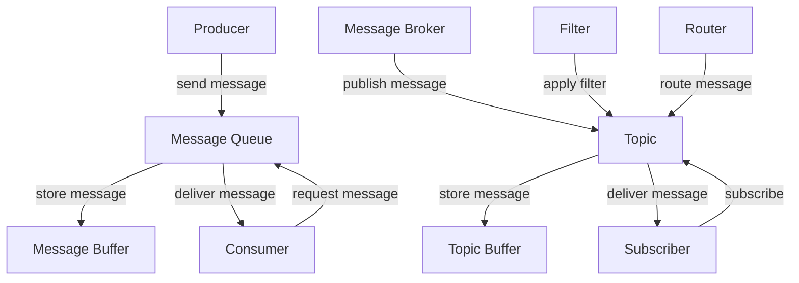

## Introduction
A **Message Queue** and a **Message Broker** are two fundamental components in distributed systems, enabling asynchronous communication between microservices, applications, or systems. In essence, they facilitate the exchange of messages between producers and consumers, allowing for loose coupling, scalability, and fault tolerance. Understanding the differences between these two concepts is crucial for designing and implementing robust, efficient, and scalable systems. In this study, we'll delve into the world of message queues and brokers, exploring their core concepts, internal mechanics, and real-world applications.

## Core Concepts
To grasp the nuances of message queues and brokers, it's essential to define these terms precisely:
- A **Message Queue** is a data structure that stores messages in a First-In-First-Out (FIFO) order, allowing producers to send messages and consumers to receive them. Message queues are typically used for point-to-point communication.
- A **Message Broker**, on the other hand, is a more advanced component that enables publish-subscribe messaging patterns, allowing multiple producers to send messages to multiple consumers. Message brokers provide features like message filtering, routing, and transformation.

> **Note:** While message queues are primarily used for point-to-point communication, message brokers support more complex messaging patterns, making them a popular choice for large-scale distributed systems.

## How It Works Internally
Let's dive into the internal mechanics of message queues and brokers:
1. **Message Queue**:
	* A producer sends a message to the queue.
	* The message is stored in the queue's data structure (e.g., a linked list or array).
	* A consumer requests a message from the queue.
	* The message is removed from the queue and delivered to the consumer.
2. **Message Broker**:
	* A producer publishes a message to a specific topic or channel.
	* The message broker receives the message and stores it in a topic-specific buffer.
	* Multiple consumers subscribe to the same topic, and the broker delivers the message to each subscriber.
	* The broker may apply filtering, routing, or transformation rules to the message before delivery.

> **Warning:** When designing a message queue or broker system, it's crucial to consider factors like message persistence, durability, and delivery guarantees to ensure reliable communication.

## Code Examples
Here are three complete, runnable code examples demonstrating basic and advanced usage of message queues and brokers:

### Example 1: Basic Message Queue (RabbitMQ)
```python
import pika

# Create a connection to the RabbitMQ server
connection = pika.BlockingConnection(pika.ConnectionParameters('localhost'))
channel = connection.channel()

# Declare a queue
channel.queue_declare(queue='hello')

# Send a message to the queue
channel.basic_publish(exchange='',
                      routing_key='hello',
                      body='Hello, world!')

# Close the connection
connection.close()
```

### Example 2: Publish-Subscribe Message Broker (Apache Kafka)
```java
import org.apache.kafka.clients.producer.KafkaProducer;
import org.apache.kafka.clients.producer.ProducerConfig;
import org.apache.kafka.clients.producer.ProducerRecord;
import org.apache.kafka.common.serialization.StringSerializer;

import java.util.Properties;

public class KafkaProducerExample {
    public static void main(String[] args) {
        // Create a Kafka producer
        Properties props = new Properties();
        props.put(ProducerConfig.BOOTSTRAP_SERVERS_CONFIG, "localhost:9092");
        props.put(ProducerConfig.KEY_SERIALIZER_CLASS_CONFIG, StringSerializer.class.getName());
        props.put(ProducerConfig.VALUE_SERIALIZER_CLASS_CONFIG, StringSerializer.class.getName());
        KafkaProducer<String, String> producer = new KafkaProducer<>(props);

        // Publish a message to a topic
        ProducerRecord<String, String> record = new ProducerRecord<>("my-topic", "Hello, world!");
        producer.send(record);
    }
}
```

### Example 3: Advanced Message Broker (Apache ActiveMQ)
```typescript
import { ActiveMQClient } from 'activemq-client';

// Create an ActiveMQ client
const client = new ActiveMQClient('tcp://localhost:61616');

// Create a producer and send a message to a queue
client.createProducer('my-queue', (err, producer) => {
    if (err) {
        console.error(err);
    } else {
        producer.send({ body: 'Hello, world!' });
    }
});

// Create a consumer and receive messages from the queue
client.createConsumer('my-queue', (err, consumer) => {
    if (err) {
        console.error(err);
    } else {
        consumer.on('message', (msg) => {
            console.log(`Received message: ${msg.body}`);
        });
    }
});
```

## Visual Diagram

This diagram illustrates the basic components and flow of message queues and brokers. The producer sends a message to the message queue, which stores the message in a buffer. The consumer requests a message from the queue, and the message is delivered. The message broker publishes a message to a topic, which stores the message in a buffer. Subscribers receive the message from the topic.

> **Tip:** When designing a message queue or broker system, consider using a combination of both to achieve optimal performance and flexibility.

## Comparison
| Approach | Time Complexity | Space Complexity | Pros | Cons | Best For |
| --- | --- | --- | --- | --- | --- |
| Message Queue | O(1) | O(n) | Simple, efficient, and scalable | Limited to point-to-point communication | Small-scale systems, real-time applications |
| Message Broker | O(n) | O(n^2) | Flexible, scalable, and supports complex messaging patterns | More complex and resource-intensive | Large-scale distributed systems, event-driven architectures |
| Publish-Subscribe | O(1) | O(n) | Scalable, efficient, and supports multiple subscribers | May require additional infrastructure | Real-time applications, live updates |
| Request-Response | O(1) | O(1) | Simple, efficient, and supports synchronous communication | Limited to synchronous communication | Small-scale systems, request-response patterns |

## Real-world Use Cases
1. **Apache Kafka** is used by companies like LinkedIn, Twitter, and Netflix to handle large volumes of data and provide real-time analytics.
2. **RabbitMQ** is used by companies like Uber, Instagram, and Pinterest to manage message queues and provide scalable, fault-tolerant communication.
3. **Apache ActiveMQ** is used by companies like Amazon, Google, and Microsoft to provide robust, scalable messaging solutions for distributed systems.

## Common Pitfalls
1. **Incorrect queue configuration**: Failing to configure the queue correctly can lead to performance issues, message loss, or incorrect delivery.
2. **Insufficient error handling**: Not handling errors properly can cause message loss, system crashes, or unexpected behavior.
3. **Inadequate testing**: Failing to test the messaging system thoroughly can lead to bugs, performance issues, or incorrect behavior.
4. **Over-reliance on a single messaging system**: Relying too heavily on a single messaging system can lead to vendor lock-in, limited scalability, or reduced flexibility.

> **Warning:** When designing a messaging system, it's essential to consider factors like message persistence, delivery guarantees, and error handling to ensure reliable communication.

## Interview Tips
1. **What is the difference between a message queue and a message broker?**: A strong answer should explain the basic concepts, internal mechanics, and use cases for both message queues and brokers.
2. **How do you handle message persistence and delivery guarantees?**: A strong answer should discuss strategies for ensuring message persistence, delivery guarantees, and error handling in a messaging system.
3. **What are some common pitfalls when designing a messaging system?**: A strong answer should identify common mistakes, such as incorrect queue configuration, insufficient error handling, or inadequate testing.

## Key Takeaways
* **Message queues** are data structures that store messages in a First-In-First-Out (FIFO) order, allowing for point-to-point communication.
* **Message brokers** enable publish-subscribe messaging patterns, allowing multiple producers to send messages to multiple consumers.
* **Time complexity** and **space complexity** are critical factors when designing a messaging system, as they impact performance and scalability.
* **Error handling** and **message persistence** are essential for ensuring reliable communication in a messaging system.
* **Testing** and **configuration** are crucial for ensuring the correct behavior and performance of a messaging system.
* **Scalability** and **flexibility** are key considerations when designing a messaging system, as they impact the system's ability to handle increasing loads and adapt to changing requirements.