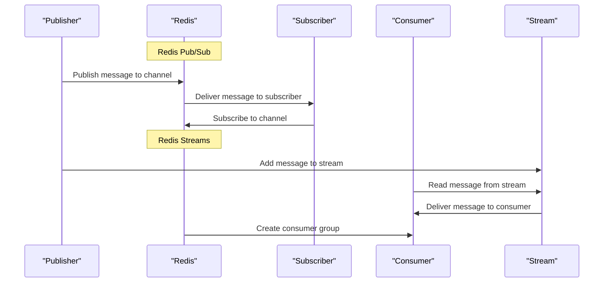

## Introduction
**Redis Pub/Sub and Redis Streams** are two powerful messaging patterns offered by Redis, a popular in-memory data store. These patterns enable efficient and scalable communication between different components of a distributed system. In this section, we will delve into the world of Redis Pub/Sub and Streams, exploring their inner workings, use cases, and best practices.

Redis Pub/Sub is a messaging paradigm that allows publishers to send messages to channels, which are then received by subscribers. This pattern is useful for broadcasting messages to multiple recipients, such as notifications or updates. On the other hand, Redis Streams is a more recent addition to the Redis ecosystem, providing a log-based messaging system. Streams allow for more complex messaging scenarios, including message queuing, event sourcing, and data integration.

> **Note:** Redis Pub/Sub and Streams are designed to work together seamlessly, enabling developers to build robust and scalable messaging systems.

## Core Concepts
To fully understand Redis Pub/Sub and Streams, it's essential to grasp the following core concepts:

* **Channels**: In Redis Pub/Sub, channels are the destinations for published messages. Subscribers can listen to one or more channels to receive messages.
* **Messages**: Messages are the payloads sent by publishers to channels. They can be strings, hashes, or other data types.
* **Subscribers**: Subscribers are the recipients of messages published to channels. They can be other Redis clients or applications.
* **Streams**: In Redis Streams, a stream is a log-based data structure that stores messages in a sequential manner. Streams are identified by a unique name and can have multiple consumers.
* **Consumers**: Consumers are the recipients of messages from streams. They can be other Redis clients or applications.

> **Warning:** When using Redis Pub/Sub, be aware that messages are not persisted and will be lost if no subscribers are listening to a channel.

## How It Works Internally
Let's dive into the internal mechanics of Redis Pub/Sub and Streams:

1. **Publishing**: When a publisher sends a message to a channel, Redis stores the message in memory and notifies all subscribers listening to that channel.
2. **Subscribing**: Subscribers can listen to one or more channels using the `SUBSCRIBE` command. Redis maintains a list of subscribed channels for each client.
3. **Message Delivery**: When a message is published to a channel, Redis delivers the message to all subscribed clients.
4. **Streams**: When a message is added to a stream, Redis stores the message in a log-based data structure. Consumers can then read messages from the stream using the `XREAD` command.

> **Tip:** To improve performance, use Redis Cluster to distribute the load across multiple nodes.

## Code Examples
Here are three complete and runnable code examples demonstrating Redis Pub/Sub and Streams:

### Example 1: Basic Pub/Sub
```python
import redis

# Create a Redis client
redis_client = redis.Redis(host='localhost', port=6379, db=0)

# Subscribe to a channel
redis_client.subscribe('my_channel')

# Publish a message to the channel
redis_client.publish('my_channel', 'Hello, world!')

# Receive messages from the channel
for message in redis_client.listen():
    print(message)
```

### Example 2: Streaming with Consumers
```java
import redis.clients.jedis.Jedis;
import redis.clients.jedis.StreamEntry;
import redis.clients.jedis.StreamEntryID;

// Create a Redis client
Jedis jedis = new Jedis("localhost", 6379);

// Create a stream
jedis.xadd("my_stream", new StreamEntry("field1", "value1").entry("field2", "value2"));

// Create a consumer group
jedis.xgroupCreate("my_stream", "my_group", "$", true);

// Read messages from the stream
StreamEntryID lastId = new StreamEntryID("0-0");
while (true) {
    Map<String, StreamEntry> messages = jedis.xreadGroup("my_group", "my_consumer", 1, 1000, false, lastId);
    for (Map.Entry<String, StreamEntry> entry : messages.entrySet()) {
        System.out.println(entry.getValue());
        lastId = entry.getValue().getID();
    }
}
```

### Example 3: Advanced Pub/Sub with Pattern Matching
```typescript
import * as redis from 'redis';

// Create a Redis client
const client = redis.createClient({ host: 'localhost', port: 6379, db: 0 });

// Subscribe to multiple channels using pattern matching
client.psubscribe('my_channel:*', (err, count) => {
    console.log(`Subscribed to ${count} channels`);
});

// Publish messages to multiple channels
client.publish('my_channel:1', 'Message 1');
client.publish('my_channel:2', 'Message 2');

// Receive messages from multiple channels
client.on('pmessage', (pattern, channel, message) => {
    console.log(`Received message from channel ${channel}: ${message}`);
});
```

## Visual Diagram

The diagram illustrates the basic flow of Redis Pub/Sub and Streams. Publishers send messages to channels or streams, which are then delivered to subscribers or consumers.

## Comparison
| Approach | Time Complexity | Space Complexity | Pros | Cons | Best For |
| --- | --- | --- | --- | --- | --- |
| Redis Pub/Sub | O(1) | O(n) | Simple, fast, and scalable | No message persistence, limited features | Real-time notifications, broadcasting |
| Redis Streams | O(log n) | O(n) | Log-based, supports message queuing and event sourcing | More complex, requires consumer groups | Message queuing, event sourcing, data integration |
| RabbitMQ | O(1) | O(n) | Feature-rich, supports multiple messaging patterns | More complex, requires separate infrastructure | Enterprise messaging, microservices architecture |
| Apache Kafka | O(log n) | O(n) | Distributed, scalable, and fault-tolerant | More complex, requires separate infrastructure | Big data processing, real-time analytics |

## Real-world Use Cases
Here are three real-world examples of Redis Pub/Sub and Streams in production:

1. **Twitter**: Twitter uses Redis Pub/Sub to broadcast tweets to followers in real-time.
2. **Pinterest**: Pinterest uses Redis Streams to process and analyze user interactions with pins, such as likes and comments.
3. **Uber**: Uber uses Redis Pub/Sub and Streams to manage the flow of requests and responses between drivers, riders, and the platform.

## Common Pitfalls
Here are four common mistakes to avoid when using Redis Pub/Sub and Streams:

1. **Not handling message losses**: Redis Pub/Sub does not persist messages, so if a subscriber is offline, it will miss messages.
2. **Not using consumer groups**: Redis Streams requires consumer groups to manage message delivery to multiple consumers.
3. **Not monitoring stream length**: Redis Streams can grow indefinitely, leading to performance issues if not monitored and trimmed.
4. **Not handling duplicate messages**: Redis Pub/Sub and Streams do not guarantee message uniqueness, so duplicates must be handled by the application.

> **Interview:** When asked about Redis Pub/Sub and Streams, be prepared to discuss the differences between the two, their use cases, and how to handle common pitfalls.

## Interview Tips
Here are three common interview questions related to Redis Pub/Sub and Streams, along with weak and strong answers:

1. **What is the difference between Redis Pub/Sub and Redis Streams?**
	* Weak answer: "Redis Pub/Sub is for broadcasting messages, while Redis Streams is for message queuing."
	* Strong answer: "Redis Pub/Sub is a simple, fast, and scalable messaging paradigm for broadcasting messages to multiple recipients, while Redis Streams is a log-based messaging system that supports message queuing, event sourcing, and data integration."
2. **How do you handle message losses in Redis Pub/Sub?**
	* Weak answer: "I would use Redis Pub/Sub with a message queue to guarantee message delivery."
	* Strong answer: "To handle message losses in Redis Pub/Sub, I would implement a message acknowledgement mechanism, where subscribers acknowledge received messages, and publishers retransmit unacknowledged messages."
3. **What are the benefits of using Redis Streams over Redis Pub/Sub?**
	* Weak answer: "Redis Streams is more complex and feature-rich than Redis Pub/Sub."
	* Strong answer: "Redis Streams provides a log-based messaging system that supports message queuing, event sourcing, and data integration, making it a better choice for complex messaging scenarios, while Redis Pub/Sub is better suited for simple broadcasting use cases."

## Key Takeaways
Here are six key takeaways to remember when working with Redis Pub/Sub and Streams:

* Redis Pub/Sub is a simple, fast, and scalable messaging paradigm for broadcasting messages to multiple recipients.
* Redis Streams is a log-based messaging system that supports message queuing, event sourcing, and data integration.
* Use Redis Pub/Sub for real-time notifications, broadcasting, and simple messaging scenarios.
* Use Redis Streams for complex messaging scenarios, such as message queuing, event sourcing, and data integration.
* Always handle message losses and duplicates in Redis Pub/Sub and Streams.
* Monitor and trim Redis Streams to prevent performance issues.

> **Tip:** When designing a messaging system, consider the trade-offs between Redis Pub/Sub and Redis Streams, and choose the approach that best fits your use case.