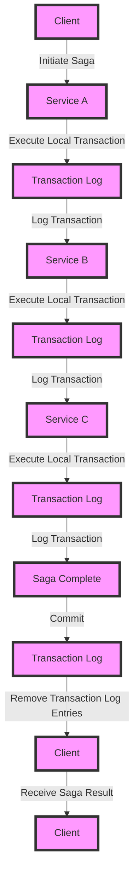

## Introduction
The **Saga Pattern** is a design pattern used to manage distributed transactions across multiple services in a microservices architecture. It allows for the coordination of multiple services to achieve a single, consistent outcome, even in the presence of failures. In a distributed system, it's common for multiple services to be involved in a single transaction, and the Saga Pattern provides a way to ensure that either all services complete successfully or none do. This pattern is particularly useful in systems where data consistency is critical, such as in financial transactions or e-commerce platforms.

> **Note:** The Saga Pattern is not a replacement for traditional transactions, but rather a way to manage distributed transactions in a microservices architecture.

## Core Concepts
The Saga Pattern involves the following key concepts:

* **Saga**: A saga is a sequence of local transactions that are executed in a specific order to achieve a single, consistent outcome.
* **Local Transaction**: A local transaction is a transaction that is executed within a single service.
* **Compensating Transaction**: A compensating transaction is a transaction that is executed to undo the effects of a previous transaction.
* **Transaction Log**: A transaction log is a record of all transactions that have been executed as part of a saga.

> **Warning:** The Saga Pattern can be complex to implement, and it's essential to carefully consider the trade-offs before using it in a production system.

## How It Works Internally
The Saga Pattern works as follows:

1. A client initiates a saga by sending a request to the first service in the sequence.
2. Each service executes its local transaction and logs the transaction in a transaction log.
3. If any service fails to execute its local transaction, the saga is rolled back by executing compensating transactions for each service that has already executed its local transaction.
4. If all services complete their local transactions successfully, the saga is committed by removing the transaction log entries.

Here's a step-by-step example of how the Saga Pattern works:

* Service A executes its local transaction and logs the transaction in a transaction log.
* Service B executes its local transaction and logs the transaction in a transaction log.
* Service C fails to execute its local transaction, so the saga is rolled back.
* Service B executes a compensating transaction to undo the effects of its previous local transaction.
* Service A executes a compensating transaction to undo the effects of its previous local transaction.

## Code Examples
### Example 1: Basic Saga Pattern
```java
// Define a saga interface
public interface Saga {
    void execute();
    void compensate();
}

// Define a local transaction interface
public interface LocalTransaction {
    void execute();
    void compensate();
}

// Define a transaction log interface
public interface TransactionLog {
    void log(Transaction transaction);
    void remove(Transaction transaction);
}

// Implement a saga
public class MySaga implements Saga {
    private List<LocalTransaction> localTransactions;
    private TransactionLog transactionLog;

    public MySaga(List<LocalTransaction> localTransactions, TransactionLog transactionLog) {
        this.localTransactions = localTransactions;
        this.transactionLog = transactionLog;
    }

    @Override
    public void execute() {
        for (LocalTransaction localTransaction : localTransactions) {
            localTransaction.execute();
            transactionLog.log(localTransaction);
        }
    }

    @Override
    public void compensate() {
        for (LocalTransaction localTransaction : localTransactions) {
            localTransaction.compensate();
            transactionLog.remove(localTransaction);
        }
    }
}
```

### Example 2: Real-World Saga Pattern
```python
import logging

# Define a saga class
class Saga:
    def __init__(self, local_transactions):
        self.local_transactions = local_transactions
        self.transaction_log = []

    def execute(self):
        for local_transaction in self.local_transactions:
            try:
                local_transaction.execute()
                self.transaction_log.append(local_transaction)
            except Exception as e:
                logging.error(f"Error executing local transaction: {e}")
                self.compensate()
                break

    def compensate(self):
        for local_transaction in reversed(self.transaction_log):
            try:
                local_transaction.compensate()
            except Exception as e:
                logging.error(f"Error compensating local transaction: {e}")

# Define a local transaction class
class LocalTransaction:
    def execute(self):
        # Execute the local transaction
        pass

    def compensate(self):
        # Compensate the local transaction
        pass

# Implement a saga
saga = Saga([LocalTransaction(), LocalTransaction()])
saga.execute()
```

### Example 3: Advanced Saga Pattern with Compensating Transactions
```typescript
// Define a saga interface
interface Saga {
    execute(): Promise<void>;
    compensate(): Promise<void>;
}

// Define a local transaction interface
interface LocalTransaction {
    execute(): Promise<void>;
    compensate(): Promise<void>;
}

// Define a transaction log interface
interface TransactionLog {
    log(transaction: Transaction): Promise<void>;
    remove(transaction: Transaction): Promise<void>;
}

// Implement a saga
class MySaga implements Saga {
    private localTransactions: LocalTransaction[];
    private transactionLog: TransactionLog;

    constructor(localTransactions: LocalTransaction[], transactionLog: TransactionLog) {
        this.localTransactions = localTransactions;
        this.transactionLog = transactionLog;
    }

    async execute(): Promise<void> {
        for (const localTransaction of this.localTransactions) {
            try {
                await localTransaction.execute();
                await this.transactionLog.log(localTransaction);
            } catch (error) {
                await this.compensate();
                break;
            }
        }
    }

    async compensate(): Promise<void> {
        for (const localTransaction of this.localTransactions) {
            try {
                await localTransaction.compensate();
                await this.transactionLog.remove(localTransaction);
            } catch (error) {
                console.error(`Error compensating local transaction: ${error}`);
            }
        }
    }
}
```

## Visual Diagram

This diagram illustrates the basic flow of a saga, including the initiation of the saga, the execution of local transactions, and the logging of transactions.

## Comparison
| Approach | Time Complexity | Space Complexity | Pros | Cons | Best For |
| --- | --- | --- | --- | --- | --- |
| Saga Pattern | O(n) | O(n) | Allows for distributed transactions, provides a clear audit trail | Can be complex to implement, requires careful consideration of compensating transactions | Distributed systems with high data consistency requirements |
| Two-Phase Commit | O(n) | O(n) | Provides a simple and well-understood protocol for distributed transactions | Can be slow and may require additional resources for the prepare phase | Distributed systems with low data consistency requirements |
| Event Sourcing | O(n) | O(n) | Provides a clear audit trail and allows for distributed transactions | Can be complex to implement, requires careful consideration of event ordering | Distributed systems with high data consistency requirements and a need for event sourcing |

## Real-world Use Cases
1. **E-commerce platforms**: The Saga Pattern is often used in e-commerce platforms to manage distributed transactions, such as ordering and payment processing.
2. **Financial systems**: The Saga Pattern is used in financial systems to manage distributed transactions, such as stock trades and wire transfers.
3. **Travel booking systems**: The Saga Pattern is used in travel booking systems to manage distributed transactions, such as booking flights and hotels.

> **Tip:** When implementing the Saga Pattern, consider using a message queue or event bus to handle the communication between services.

## Common Pitfalls
1. **Inconsistent data**: One of the most common pitfalls of the Saga Pattern is inconsistent data. If the services involved in the saga do not have a consistent view of the data, the saga may not complete correctly.
2. **Compensating transactions**: Compensating transactions can be complex to implement, and it's essential to carefully consider the trade-offs before using them.
3. **Timeouts**: Timeouts can occur if a service takes too long to execute its local transaction or if the compensating transaction takes too long to complete.
4. **Deadlocks**: Deadlocks can occur if two or more services are waiting for each other to complete their local transactions.

## Interview Tips
1. **What is the Saga Pattern?**: The Saga Pattern is a design pattern used to manage distributed transactions across multiple services in a microservices architecture.
2. **How does the Saga Pattern work?**: The Saga Pattern works by executing a sequence of local transactions and logging the transactions in a transaction log. If any service fails to execute its local transaction, the saga is rolled back by executing compensating transactions.
3. **What are the benefits of the Saga Pattern?**: The Saga Pattern provides a way to manage distributed transactions and ensures that either all services complete successfully or none do.

> **Interview:** When interviewing for a position that involves distributed systems, be prepared to answer questions about the Saga Pattern and how it is used to manage distributed transactions.

## Key Takeaways
* The Saga Pattern is a design pattern used to manage distributed transactions across multiple services in a microservices architecture.
* The Saga Pattern provides a way to ensure that either all services complete successfully or none do.
* The Saga Pattern involves executing a sequence of local transactions and logging the transactions in a transaction log.
* Compensating transactions are used to undo the effects of a previous local transaction.
* The Saga Pattern can be complex to implement, and it's essential to carefully consider the trade-offs before using it in a production system.
* The Saga Pattern is often used in e-commerce platforms, financial systems, and travel booking systems.
* Inconsistent data, compensating transactions, timeouts, and deadlocks are common pitfalls of the Saga Pattern.
* The Saga Pattern provides a clear audit trail and allows for distributed transactions.