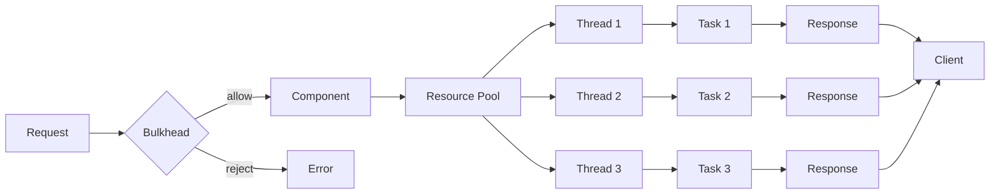

## Introduction
The **Bulkhead Pattern** is a design pattern used in software architecture to prevent cascading failures in distributed systems. It is inspired by the concept of bulkheads in ships, which are designed to prevent water from flooding the entire vessel in case of a breach. In software systems, the Bulkhead Pattern helps to isolate components or services from each other, preventing a failure in one component from bringing down the entire system. This pattern is particularly relevant in microservices architecture, where multiple services are interconnected and a failure in one service can have a ripple effect on the entire system.

> **Note:** The Bulkhead Pattern is often used in conjunction with other patterns, such as the **Circuit Breaker Pattern**, to provide a robust and resilient system.

## Core Concepts
The Bulkhead Pattern is based on the following core concepts:

* **Isolation**: Each component or service is isolated from the others, preventing a failure in one component from affecting the others.
* **Resource pooling**: Each component or service has its own pool of resources, such as threads, connections, or memory, which are not shared with other components.
* **Limitation**: Each component or service has a limited capacity, preventing it from consuming all available resources in case of a failure.

> **Warning:** Without proper isolation and limitation, a failure in one component can cause a cascade of failures throughout the system, leading to a complete system failure.

## How It Works Internally
The Bulkhead Pattern works by creating a separate pool of resources for each component or service. When a request is made to a component, it is routed through a bulkhead, which checks if the component has available resources to handle the request. If the component has available resources, the request is allowed to proceed. If the component does not have available resources, the request is rejected, preventing the component from becoming overwhelmed and failing.

Here is a step-by-step breakdown of how the Bulkhead Pattern works:

1. A request is made to a component or service.
2. The request is routed through a bulkhead, which checks if the component has available resources to handle the request.
3. If the component has available resources, the request is allowed to proceed.
4. If the component does not have available resources, the request is rejected.
5. The bulkhead monitors the component's resources and adjusts the available resources as needed.

## Code Examples
Here are three complete and runnable code examples that demonstrate the Bulkhead Pattern:

### Example 1: Basic Bulkhead Implementation
```java
public class Bulkhead {
    private int maxConcurrency;
    private int currentConcurrency;

    public Bulkhead(int maxConcurrency) {
        this.maxConcurrency = maxConcurrency;
        this.currentConcurrency = 0;
    }

    public boolean tryExecute(Runnable task) {
        if (currentConcurrency < maxConcurrency) {
            currentConcurrency++;
            task.run();
            currentConcurrency--;
            return true;
        } else {
            return false;
        }
    }

    public static void main(String[] args) {
        Bulkhead bulkhead = new Bulkhead(5);
        for (int i = 0; i < 10; i++) {
            if (bulkhead.tryExecute(() -> System.out.println("Task executed"))) {
                System.out.println("Task accepted");
            } else {
                System.out.println("Task rejected");
            }
        }
    }
}
```
This example demonstrates a basic bulkhead implementation that limits the concurrency of a task.

### Example 2: Bulkhead with Resource Pooling
```python
import threading

class Bulkhead:
    def __init__(self, max_threads):
        self.max_threads = max_threads
        self.thread_pool = []

    def try_execute(self, task):
        if len(self.thread_pool) < self.max_threads:
            thread = threading.Thread(target=task)
            self.thread_pool.append(thread)
            thread.start()
            return True
        else:
            return False

    def wait_for_completion(self):
        for thread in self.thread_pool:
            thread.join()

def task():
    print("Task executed")

bulkhead = Bulkhead(5)
for i in range(10):
    if bulkhead.try_execute(task):
        print("Task accepted")
    else:
        print("Task rejected")

bulkhead.wait_for_completion()
```
This example demonstrates a bulkhead implementation with resource pooling using threads.

### Example 3: Bulkhead with Circuit Breaker
```typescript
class Bulkhead {
    private maxConcurrency: number;
    private currentConcurrency: number;
    private circuitBreaker: CircuitBreaker;

    constructor(maxConcurrency: number, circuitBreaker: CircuitBreaker) {
        this.maxConcurrency = maxConcurrency;
        this.currentConcurrency = 0;
        this.circuitBreaker = circuitBreaker;
    }

    tryExecute(task: () => void): boolean {
        if (this.currentConcurrency < this.maxConcurrency) {
            this.currentConcurrency++;
            this.circuitBreaker.execute(() => {
                task();
                this.currentConcurrency--;
            });
            return true;
        } else {
            return false;
        }
    }
}

class CircuitBreaker {
    private timeout: number;
    private failureCount: number;

    constructor(timeout: number) {
        this.timeout = timeout;
        this.failureCount = 0;
    }

    execute(task: () => void): void {
        if (this.failureCount < 3) {
            task();
            this.failureCount = 0;
        } else {
            console.log("Circuit breaker triggered");
        }
    }
}

const bulkhead = new Bulkhead(5, new CircuitBreaker(1000));
for (let i = 0; i < 10; i++) {
    if (bulkhead.tryExecute(() => console.log("Task executed"))) {
        console.log("Task accepted");
    } else {
        console.log("Task rejected");
    }
}
```
This example demonstrates a bulkhead implementation with a circuit breaker that prevents a component from becoming overwhelmed and failing.

## Visual Diagram

This diagram illustrates the Bulkhead Pattern, showing how requests are routed through a bulkhead, which checks if a component has available resources to handle the request.

> **Tip:** The Bulkhead Pattern can be used in conjunction with other patterns, such as the Circuit Breaker Pattern, to provide a robust and resilient system.

## Comparison
Here is a comparison of the Bulkhead Pattern with other patterns:

| Approach | Time Complexity | Space Complexity | Pros | Cons | Best For |
| --- | --- | --- | --- | --- | --- |
| Bulkhead Pattern | O(1) | O(n) | Prevents cascading failures, improves system resilience | Can be complex to implement, requires careful tuning of bulkhead parameters | Distributed systems, microservices architecture |
| Circuit Breaker Pattern | O(1) | O(1) | Prevents a component from becoming overwhelmed and failing | Can introduce additional latency, requires careful tuning of circuit breaker parameters | Distributed systems, microservices architecture |
| Load Balancing Pattern | O(n) | O(n) | Distributes load across multiple components, improves system scalability | Can be complex to implement, requires careful tuning of load balancing parameters | Distributed systems, microservices architecture |
| Retry Pattern | O(1) | O(1) | Improves system reliability by retrying failed requests | Can introduce additional latency, requires careful tuning of retry parameters | Distributed systems, microservices architecture |

## Real-world Use Cases
Here are three real-world use cases for the Bulkhead Pattern:

1. **Netflix**: Netflix uses the Bulkhead Pattern to prevent cascading failures in its distributed system. Each service is isolated from the others, and requests are routed through a bulkhead that checks if the service has available resources to handle the request.
2. **Amazon**: Amazon uses the Bulkhead Pattern to improve the resilience of its e-commerce platform. Each component is isolated from the others, and requests are routed through a bulkhead that checks if the component has available resources to handle the request.
3. **Google**: Google uses the Bulkhead Pattern to prevent cascading failures in its distributed system. Each service is isolated from the others, and requests are routed through a bulkhead that checks if the service has available resources to handle the request.

## Common Pitfalls
Here are four common pitfalls to watch out for when implementing the Bulkhead Pattern:

1. **Insufficient isolation**: If components are not properly isolated from each other, a failure in one component can still cause a cascade of failures throughout the system.
2. **Inadequate resource pooling**: If resources are not properly pooled, a component can still become overwhelmed and fail, even with a bulkhead in place.
3. **Incorrect bulkhead configuration**: If the bulkhead is not properly configured, it can either allow too many requests to pass through, causing a component to become overwhelmed, or block too many requests, causing the system to become unresponsive.
4. **Lack of monitoring and feedback**: If the system is not properly monitored and feedback is not provided to the bulkhead, it can be difficult to detect and respond to failures in a timely manner.

> **Interview:** When asked about the Bulkhead Pattern in an interview, be sure to explain the concept of isolation and resource pooling, and how the pattern prevents cascading failures in distributed systems. Also, be prepared to discuss common pitfalls and how to avoid them.

## Key Takeaways
Here are ten key takeaways to remember when implementing the Bulkhead Pattern:

* The Bulkhead Pattern is used to prevent cascading failures in distributed systems.
* Isolation and resource pooling are key concepts in the Bulkhead Pattern.
* The pattern can be used in conjunction with other patterns, such as the Circuit Breaker Pattern.
* Careful tuning of bulkhead parameters is required to ensure proper functioning.
* Monitoring and feedback are essential to detect and respond to failures in a timely manner.
* The pattern can be complex to implement, but it provides a robust and resilient system.
* The Bulkhead Pattern is suitable for distributed systems and microservices architecture.
* The pattern can introduce additional latency, but it improves system reliability.
* The pattern requires careful consideration of trade-offs between reliability, scalability, and performance.
* The Bulkhead Pattern is a useful tool in the design of resilient and scalable systems.

> **Warning:** Without proper implementation and tuning, the Bulkhead Pattern can introduce additional complexity and latency, and can even make the system more prone to failures.