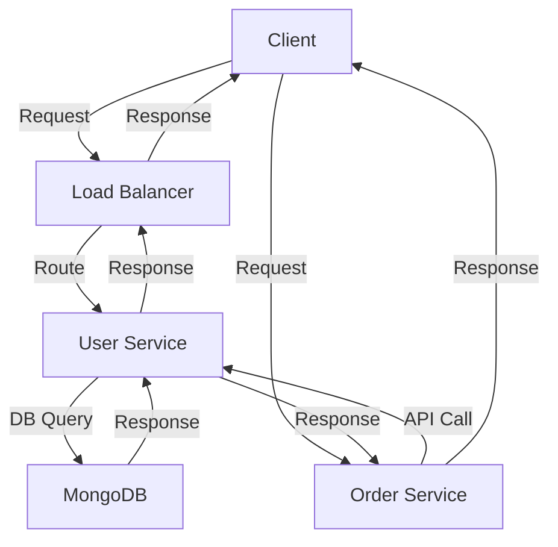

## Introduction
The debate between **monolithic architecture** and **microservices architecture** has been ongoing in the software development community for years. A monolithic architecture is a traditional, self-contained system where all components are part of a single, unified unit. On the other hand, microservices architecture is a design approach that structures an application as a collection of small, independent services. In this section, we will explore the reasons behind the existence of these two architectures, their real-world relevance, and why every engineer needs to understand the trade-offs between them.

> **Note:** A monolithic architecture is not inherently bad, and microservices architecture is not a silver bullet. The choice between the two ultimately depends on the specific needs and goals of the project.

## Core Concepts
To understand the trade-offs between monolithic and microservices architectures, it's essential to define these terms precisely.

* **Monolithic Architecture:** A monolithic architecture is a design pattern where an application is built as a single, self-contained unit. All components, including the user interface, business logic, and database, are part of the same codebase.
* **Microservices Architecture:** A microservices architecture is a design approach that structures an application as a collection of small, independent services. Each service is responsible for a specific business capability and can be developed, deployed, and scaled independently.

> **Tip:** When designing a system, consider the **domain-driven design** (DDD) approach, which emphasizes understanding the core business domain and modeling it in code.

## How It Works Internally
Let's dive into the under-the-hood mechanics of both architectures.

In a monolithic architecture, all components are tightly coupled, and changes to one component can affect the entire system. This can lead to a **rigid** and **fragile** system that is difficult to maintain and scale.

In a microservices architecture, each service is designed to be **loosely coupled**, allowing for greater flexibility and scalability. However, this also introduces additional complexity, such as service discovery, communication, and fault tolerance.

> **Warning:** A common mistake when adopting microservices is to underestimate the complexity of service communication and fault tolerance.

## Code Examples
Here are three complete and runnable code examples to illustrate the differences between monolithic and microservices architectures.

### Example 1: Monolithic Architecture (Basic)
```python
# monolithic.py
class User:
    def __init__(self, name, email):
        self.name = name
        self.email = email

class UserService:
    def __init__(self):
        self.users = []

    def create_user(self, name, email):
        user = User(name, email)
        self.users.append(user)
        return user

    def get_user(self, email):
        for user in self.users:
            if user.email == email:
                return user
        return None

# usage
user_service = UserService()
user = user_service.create_user("John Doe", "john@example.com")
print(user.name)  # John Doe
```
This example demonstrates a simple monolithic architecture where the `User` and `UserService` classes are part of the same codebase.

### Example 2: Microservices Architecture (Real-World Pattern)
```python
# user_service.py
from flask import Flask, request, jsonify
from pymongo import MongoClient

app = Flask(__name__)
client = MongoClient("mongodb://localhost:27017/")
db = client["users"]

@app.route("/users", methods=["POST"])
def create_user():
    data = request.get_json()
    user = db.users.insert_one({"name": data["name"], "email": data["email"]})
    return jsonify({"id": user.inserted_id})

@app.route("/users/<email>", methods=["GET"])
def get_user(email):
    user = db.users.find_one({"email": email})
    if user:
        return jsonify({"name": user["name"]})
    return jsonify({}), 404

if __name__ == "__main__":
    app.run(debug=True)
```

```python
# order_service.py
from flask import Flask, request, jsonify
import requests

app = Flask(__name__)

@app.route("/orders", methods=["POST"])
def create_order():
    data = request.get_json()
    user_response = requests.get(f"http://user-service:5000/users/{data['email']}")
    if user_response.status_code == 200:
        user_name = user_response.json()["name"]
        # create order logic
        return jsonify({"id": 1})
    return jsonify({}), 404

if __name__ == "__main__":
    app.run(debug=True, port=5001)
```
This example demonstrates a microservices architecture where the `user_service` and `order_service` are separate services that communicate with each other using RESTful APIs.

### Example 3: Microservices Architecture (Advanced)
```python
# user_service.py (with circuit breaker)
from flask import Flask, request, jsonify
from pymongo import MongoClient
import requests
from circuitbreaker import CircuitBreaker

app = Flask(__name__)
client = MongoClient("mongodb://localhost:27017/")
db = client["users"]

circuit_breaker = CircuitBreaker(fail_max=5, reset_timeout=30)

@app.route("/users", methods=["POST"])
def create_user():
    data = request.get_json()
    user = db.users.insert_one({"name": data["name"], "email": data["email"]})
    return jsonify({"id": user.inserted_id})

@app.route("/users/<email>", methods=["GET"])
def get_user(email):
    @circuit_breaker
    def get_user_from_db():
        user = db.users.find_one({"email": email})
        if user:
            return jsonify({"name": user["name"]})
        return jsonify({}), 404

    return get_user_from_db()

if __name__ == "__main__":
    app.run(debug=True)
```
This example demonstrates a microservices architecture with a **circuit breaker** pattern to handle failures and prevent cascading errors.

## Visual Diagram

This diagram illustrates the communication flow between the client, load balancer, user service, and order service in a microservices architecture.

> **Interview:** Can you explain the difference between a monolithic architecture and a microservices architecture? How would you design a system to handle a large volume of requests?

## Comparison
| Approach | Time Complexity | Space Complexity | Pros | Cons | Best For |
| --- | --- | --- | --- | --- | --- |
| Monolithic | O(1) | O(1) | Simple, easy to develop and test | Rigid, fragile, difficult to scale | Small, simple applications |
| Microservices | O(n) | O(n) | Flexible, scalable, resilient | Complex, difficult to communicate and manage | Large, complex applications |
| Service-Oriented Architecture (SOA) | O(n) | O(n) | Flexible, scalable, reusable | Complex, difficult to manage | Enterprise-level applications |
| Event-Driven Architecture (EDA) | O(n) | O(n) | Flexible, scalable, decoupled | Complex, difficult to manage | Real-time, event-driven applications |

## Real-world Use Cases
* **Netflix:** Uses a microservices architecture to handle a large volume of requests and provide a scalable, resilient service.
* **Amazon:** Uses a service-oriented architecture (SOA) to provide a flexible, scalable, and reusable platform for its e-commerce platform.
* **Uber:** Uses an event-driven architecture (EDA) to handle real-time requests and provide a decoupled, scalable service.

## Common Pitfalls
* **Tight Coupling:** A common mistake in monolithic architectures is to tightly couple components, making it difficult to maintain and scale the system.
* **Over-Engineering:** A common mistake in microservices architectures is to over-engineer the system, introducing unnecessary complexity and overhead.
* **Lack of Communication:** A common mistake in microservices architectures is to neglect communication between services, leading to errors and inconsistencies.
* **Inadequate Testing:** A common mistake in both monolithic and microservices architectures is to neglect testing, leading to bugs and errors.

> **Tip:** Use **domain-driven design** (DDD) to model the business domain and ensure that the system is aligned with the business goals.

## Interview Tips
* **What is the difference between a monolithic architecture and a microservices architecture?** A strong answer should explain the trade-offs between the two architectures and provide examples of when to use each.
* **How would you design a system to handle a large volume of requests?** A strong answer should explain the use of load balancers, caching, and distributed databases to handle high traffic.
* **What are some common pitfalls in microservices architectures?** A strong answer should explain the importance of communication, testing, and monitoring in microservices architectures.

## Key Takeaways
* **Monolithic architectures are simple and easy to develop, but rigid and fragile.**
* **Microservices architectures are flexible and scalable, but complex and difficult to manage.**
* **Service-oriented architectures (SOA) are flexible and scalable, but complex and difficult to manage.**
* **Event-driven architectures (EDA) are flexible and scalable, but complex and difficult to manage.**
* **Domain-driven design (DDD) is essential for modeling the business domain and ensuring that the system is aligned with the business goals.**
* **Communication, testing, and monitoring are crucial in microservices architectures.**
* **Load balancers, caching, and distributed databases are essential for handling high traffic.**
* **Circuit breakers and bulkheads are essential for handling failures and preventing cascading errors.**