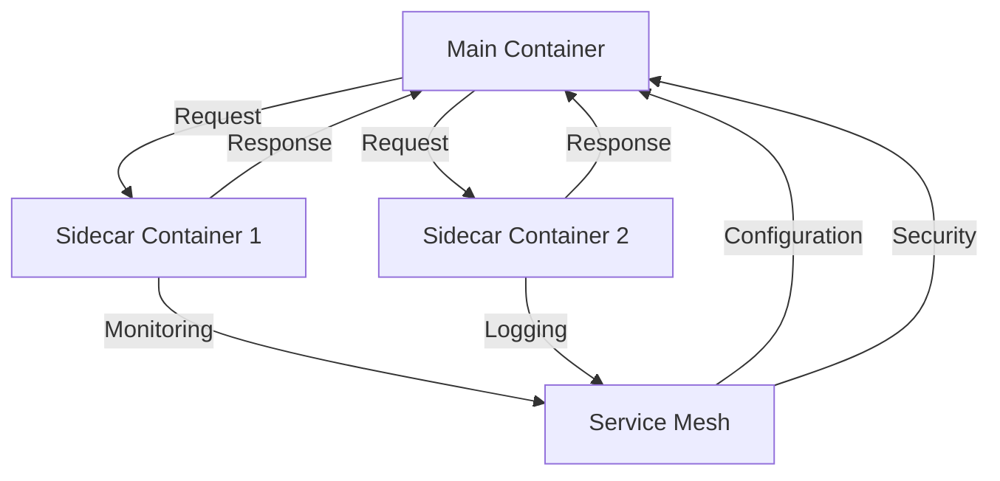

## Introduction
The **Sidecar Pattern** is a design pattern used in microservices architecture to deploy multiple containers as a single logical unit. It allows for the deployment of a main container and a sidecar container that provides additional functionality, such as monitoring, logging, or configuration management. This pattern is particularly useful in cloud-native applications, where multiple containers need to work together to provide a specific service.

> **Note:** The Sidecar Pattern is often used in conjunction with other design patterns, such as the **Service Mesh Pattern**, to provide a more comprehensive set of features for microservices architecture.

In real-world scenarios, the Sidecar Pattern is used by companies like Netflix, Amazon, and Google to deploy and manage their microservices-based applications. For example, Netflix uses the Sidecar Pattern to deploy its video streaming service, which consists of multiple containers that work together to provide a seamless viewing experience.

## Core Concepts
The Sidecar Pattern consists of two main components:

* **Main Container**: This is the primary container that provides the core functionality of the service.
* **Sidecar Container**: This is a secondary container that provides additional functionality, such as monitoring, logging, or configuration management.

The main container and the sidecar container are deployed together as a single logical unit, and they communicate with each other through a shared network interface.

> **Warning:** One of the common mistakes made when implementing the Sidecar Pattern is to over-engineer the sidecar container, which can lead to increased complexity and decreased performance.

Key terminology used in the Sidecar Pattern includes:

* **Pod**: A logical unit that consists of one or more containers that are deployed together.
* **Container**: A lightweight and standalone executable package that contains an application and its dependencies.
* **Service Mesh**: A configurable infrastructure layer that provides features such as service discovery, traffic management, and security.

## How It Works Internally
The Sidecar Pattern works by deploying a main container and a sidecar container as a single logical unit. The main container provides the core functionality of the service, while the sidecar container provides additional functionality, such as monitoring, logging, or configuration management.

Here is a step-by-step breakdown of how the Sidecar Pattern works:

1. The main container and the sidecar container are deployed together as a single logical unit.
2. The main container provides the core functionality of the service, such as handling requests and sending responses.
3. The sidecar container provides additional functionality, such as monitoring, logging, or configuration management.
4. The main container and the sidecar container communicate with each other through a shared network interface.
5. The sidecar container can also communicate with other sidecar containers or services to provide additional functionality.

> **Tip:** One of the benefits of the Sidecar Pattern is that it allows for the deployment of multiple containers as a single logical unit, which can simplify the deployment and management of microservices-based applications.

## Code Examples
Here are three code examples that demonstrate the Sidecar Pattern:

### Example 1: Basic Sidecar Pattern
```python
# main_container.py
import logging

def main():
    logging.info("Main container started")
    # Provide core functionality of the service
    logging.info("Main container finished")

if __name__ == "__main__":
    main()
```

```python
# sidecar_container.py
import logging

def main():
    logging.info("Sidecar container started")
    # Provide additional functionality, such as monitoring or logging
    logging.info("Sidecar container finished")

if __name__ == "__main__":
    main()
```

### Example 2: Sidecar Pattern with Service Mesh
```python
# main_container.py
import logging
import requests

def main():
    logging.info("Main container started")
    # Provide core functionality of the service
    response = requests.get("http://sidecar-container:8080")
    logging.info("Response from sidecar container: %s", response.text)
    logging.info("Main container finished")

if __name__ == "__main__":
    main()
```

```python
# sidecar_container.py
import logging
from flask import Flask, request

app = Flask(__name__)

@app.route("/monitoring", methods=["GET"])
def monitoring():
    logging.info("Sidecar container monitoring endpoint called")
    return "Sidecar container is healthy"

if __name__ == "__main__":
    app.run(host="0.0.0.0", port=8080)
```

### Example 3: Advanced Sidecar Pattern with Multiple Sidecars
```python
# main_container.py
import logging
import requests

def main():
    logging.info("Main container started")
    # Provide core functionality of the service
    response = requests.get("http://sidecar-container-1:8080")
    logging.info("Response from sidecar container 1: %s", response.text)
    response = requests.get("http://sidecar-container-2:8081")
    logging.info("Response from sidecar container 2: %s", response.text)
    logging.info("Main container finished")

if __name__ == "__main__":
    main()
```

```python
# sidecar_container_1.py
import logging
from flask import Flask, request

app = Flask(__name__)

@app.route("/monitoring", methods=["GET"])
def monitoring():
    logging.info("Sidecar container 1 monitoring endpoint called")
    return "Sidecar container 1 is healthy"

if __name__ == "__main__":
    app.run(host="0.0.0.0", port=8080)
```

```python
# sidecar_container_2.py
import logging
from flask import Flask, request

app = Flask(__name__)

@app.route("/logging", methods=["GET"])
def logging():
    logging.info("Sidecar container 2 logging endpoint called")
    return "Sidecar container 2 is logging"

if __name__ == "__main__":
    app.run(host="0.0.0.0", port=8081)
```

## Visual Diagram


The diagram illustrates the Sidecar Pattern with multiple sidecar containers and a service mesh.

> **Interview:** Can you explain the benefits and trade-offs of using the Sidecar Pattern in a microservices-based application?

## Comparison
| Approach | Time Complexity | Space Complexity | Pros | Cons | Best For |
| --- | --- | --- | --- | --- | --- |
| Sidecar Pattern | O(1) | O(1) | Simplifies deployment and management of microservices, provides additional functionality | Increased complexity, potential for over-engineering | Microservices-based applications with multiple containers |
| Service Mesh Pattern | O(n) | O(n) | Provides comprehensive set of features for microservices, including service discovery and traffic management | Increased complexity, potential for performance overhead | Large-scale microservices-based applications |
| Monolithic Architecture | O(1) | O(1) | Simple to deploy and manage, easy to debug | Limited scalability, tight coupling between components | Small-scale applications with simple requirements |
| Event-Driven Architecture | O(n) | O(n) | Provides loose coupling between components, enables event-driven programming | Increased complexity, potential for performance overhead | Large-scale applications with complex requirements |

## Real-world Use Cases
Here are three real-world use cases for the Sidecar Pattern:

1. **Netflix**: Netflix uses the Sidecar Pattern to deploy its video streaming service, which consists of multiple containers that work together to provide a seamless viewing experience.
2. **Amazon**: Amazon uses the Sidecar Pattern to deploy its e-commerce platform, which consists of multiple containers that work together to provide a scalable and secure shopping experience.
3. **Google**: Google uses the Sidecar Pattern to deploy its search engine, which consists of multiple containers that work together to provide a fast and accurate search experience.

## Common Pitfalls
Here are four common pitfalls to avoid when implementing the Sidecar Pattern:

1. **Over-engineering the sidecar container**: This can lead to increased complexity and decreased performance.
2. **Insufficient monitoring and logging**: This can make it difficult to debug and troubleshoot issues with the sidecar container.
3. **Inadequate security**: This can expose the sidecar container to security risks and vulnerabilities.
4. **Poor communication between containers**: This can lead to errors and inconsistencies between the main container and the sidecar container.

> **Warning:** One of the common mistakes made when implementing the Sidecar Pattern is to over-engineer the sidecar container, which can lead to increased complexity and decreased performance.

## Interview Tips
Here are three common interview questions related to the Sidecar Pattern, along with weak and strong answers:

1. **What are the benefits and trade-offs of using the Sidecar Pattern?**
	* Weak answer: "The Sidecar Pattern is a design pattern that allows for the deployment of multiple containers as a single logical unit. It provides additional functionality, such as monitoring and logging."
	* Strong answer: "The Sidecar Pattern provides several benefits, including simplified deployment and management of microservices, and additional functionality, such as monitoring and logging. However, it also introduces increased complexity and potential for over-engineering. To avoid this, it's essential to carefully design and implement the sidecar container, and to monitor and log its activity closely."
2. **How does the Sidecar Pattern differ from the Service Mesh Pattern?**
	* Weak answer: "The Sidecar Pattern is a design pattern that allows for the deployment of multiple containers as a single logical unit, while the Service Mesh Pattern is a comprehensive set of features for microservices."
	* Strong answer: "The Sidecar Pattern and the Service Mesh Pattern are both design patterns used in microservices architecture, but they serve different purposes. The Sidecar Pattern provides additional functionality, such as monitoring and logging, while the Service Mesh Pattern provides a comprehensive set of features, including service discovery, traffic management, and security. While both patterns can be used together, they are distinct and serve different purposes."
3. **What are some common pitfalls to avoid when implementing the Sidecar Pattern?**
	* Weak answer: "One common pitfall is to over-engineer the sidecar container, which can lead to increased complexity and decreased performance."
	* Strong answer: "There are several common pitfalls to avoid when implementing the Sidecar Pattern, including over-engineering the sidecar container, insufficient monitoring and logging, inadequate security, and poor communication between containers. To avoid these pitfalls, it's essential to carefully design and implement the sidecar container, and to monitor and log its activity closely. Additionally, it's essential to ensure that the sidecar container is properly secured and that communication between containers is clear and consistent."

## Key Takeaways
Here are ten key takeaways to remember about the Sidecar Pattern:

* The Sidecar Pattern is a design pattern used in microservices architecture to deploy multiple containers as a single logical unit.
* The Sidecar Pattern provides additional functionality, such as monitoring and logging.
* The Sidecar Pattern introduces increased complexity and potential for over-engineering.
* To avoid over-engineering, it's essential to carefully design and implement the sidecar container.
* The Sidecar Pattern is commonly used in conjunction with other design patterns, such as the Service Mesh Pattern.
* The Sidecar Pattern is used in real-world applications, such as Netflix, Amazon, and Google.
* Common pitfalls to avoid include over-engineering the sidecar container, insufficient monitoring and logging, inadequate security, and poor communication between containers.
* The Sidecar Pattern provides several benefits, including simplified deployment and management of microservices.
* The Sidecar Pattern is distinct from the Service Mesh Pattern, which provides a comprehensive set of features for microservices.
* The Sidecar Pattern is a useful tool for developers and architects looking to build scalable and secure microservices-based applications.