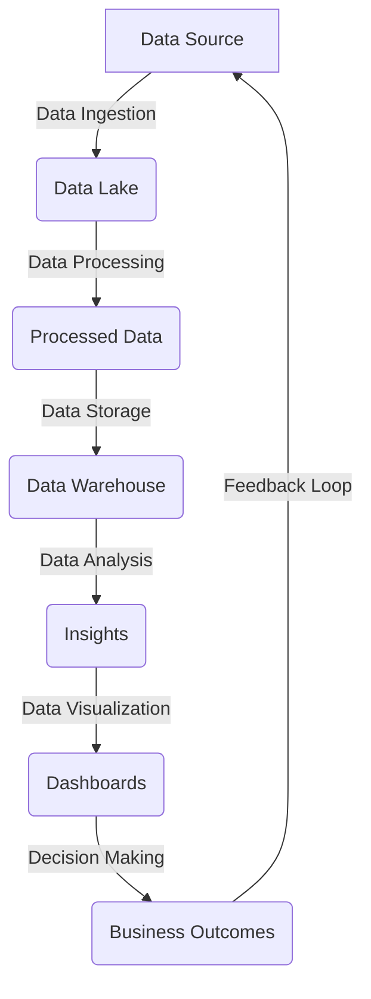

## Introduction
A **Data Lake** is a centralized repository that stores all types of data in its raw, unprocessed form. It is a key component of a data-driven organization, allowing for the storage, processing, and analysis of large amounts of data. Data Lakes have become increasingly popular in recent years due to their ability to handle the vast amounts of data generated by modern applications and systems. In this section, we will explore the concept of Data Lakes, their importance, and real-world relevance.

Data Lakes are designed to handle the **variety**, **velocity**, and **volume** of data, making them an essential tool for organizations that need to process and analyze large amounts of data. They provide a single, unified view of all data, making it easier to access, manage, and analyze. > **Note:** Data Lakes are often compared to Data Warehouses, but they serve different purposes. Data Warehouses are designed for structured data and are optimized for querying and analysis, whereas Data Lakes are designed for raw, unprocessed data and are optimized for storage and processing.

## Core Concepts
To understand Data Lakes, it is essential to familiarize yourself with the following core concepts:

* **Data Ingestion**: The process of collecting and loading data into the Data Lake.
* **Data Processing**: The process of transforming, aggregating, and analyzing the data in the Data Lake.
* **Data Storage**: The process of storing the data in the Data Lake.
* **Data Governance**: The process of managing and regulating the data in the Data Lake.
* **Data Quality**: The process of ensuring the accuracy, completeness, and consistency of the data in the Data Lake.

> **Tip:** When designing a Data Lake, it is essential to consider the **5 Vs of Big Data**: **Volume**, **Velocity**, **Variety**, **Veracity**, and **Value**.

## How It Works Internally
A typical Data Lake architecture consists of the following components:

1. **Data Ingestion Layer**: This layer is responsible for collecting and loading data into the Data Lake.
2. **Data Processing Layer**: This layer is responsible for transforming, aggregating, and analyzing the data in the Data Lake.
3. **Data Storage Layer**: This layer is responsible for storing the data in the Data Lake.
4. **Data Governance Layer**: This layer is responsible for managing and regulating the data in the Data Lake.

The Data Lake architecture can be implemented using a variety of technologies, including **Hadoop**, **Spark**, **NoSQL databases**, and **Cloud Storage**. > **Warning:** One common mistake when designing a Data Lake is to underestimate the importance of data governance and data quality. This can lead to a **Data Swamp**, where the data is poorly organized, and it is difficult to find and use the data.

## Code Examples
Here are three complete and runnable code examples that demonstrate the basics of Data Lakes:

### Example 1: Data Ingestion using Apache NiFi
```java
import org.apache.nifi.components.PropertyDescriptor;
import org.apache.nifi.flowfile.FlowFile;
import org.apache.nifi.processor.AbstractProcessor;
import org.apache.nifi.processor.ProcessContext;
import org.apache.nifi.processor.ProcessSession;

public class DataIngestionProcessor extends AbstractProcessor {
    @Override
    public void onTrigger(ProcessContext context, ProcessSession session) {
        // Read data from a file
        FlowFile flowFile = session.get();
        // Write data to a Data Lake
        session.write(flowFile, "Data Lake");
    }
}
```
### Example 2: Data Processing using Apache Spark
```python
from pyspark.sql import SparkSession

spark = SparkSession.builder.appName("Data Processing").getOrCreate()

# Read data from a Data Lake
data = spark.read.csv("Data Lake/data.csv", header=True, inferSchema=True)

# Process data
processedData = data.filter(data["age"] > 18)

# Write processed data to a Data Warehouse
processedData.write.parquet("Data Warehouse/processed_data")
```
### Example 3: Data Storage using Amazon S3
```python
import boto3

s3 = boto3.client("s3")

# Create a bucket
s3.create_bucket(Bucket="my-bucket")

# Upload data to the bucket
s3.upload_file("data.csv", "my-bucket", "data.csv")
```
## Visual Diagram

This diagram illustrates the Data Lake architecture and the flow of data from the data source to the business outcomes.

## Comparison
| Approach | Time Complexity | Space Complexity | Pros | Cons | Best For |
| --- | --- | --- | --- | --- | --- |
| Data Lake | O(1) | O(n) | Scalable, flexible, and cost-effective | Can be complex to manage and govern | Large-scale data processing and analysis |
| Data Warehouse | O(n) | O(1) | Fast query performance, easy to manage | Limited scalability and flexibility | Small-scale data analysis and reporting |
| NoSQL Database | O(1) | O(n) | Flexible schema, high performance | Limited support for transactions and ACID compliance | Real-time web applications and big data processing |
| Cloud Storage | O(1) | O(n) | Scalable, durable, and secure | Can be expensive and have limited querying capabilities | Data archiving and disaster recovery |

## Real-world Use Cases
Here are three real-world examples of Data Lakes in production:

1. **Netflix**: Netflix uses a Data Lake to store and process large amounts of user data, including viewing history, ratings, and search queries. This data is used to personalize recommendations and improve the overall user experience.
2. **Amazon**: Amazon uses a Data Lake to store and process large amounts of customer data, including order history, browsing history, and search queries. This data is used to personalize recommendations, improve customer service, and optimize marketing campaigns.
3. **Walmart**: Walmart uses a Data Lake to store and process large amounts of customer data, including purchase history, browsing history, and search queries. This data is used to personalize recommendations, improve customer service, and optimize marketing campaigns.

## Common Pitfalls
Here are four common mistakes to avoid when designing a Data Lake:

1. **Poor Data Governance**: Failing to establish clear data governance policies and procedures can lead to a Data Swamp, where the data is poorly organized, and it is difficult to find and use the data.
2. **Inadequate Data Quality**: Failing to ensure the accuracy, completeness, and consistency of the data can lead to incorrect insights and poor decision-making.
3. **Insufficient Scalability**: Failing to design the Data Lake to scale with the growing amount of data can lead to performance issues and data loss.
4. **Inadequate Security**: Failing to implement adequate security measures can lead to data breaches and unauthorized access to sensitive data.

> **Warning:** One common mistake is to underestimate the importance of data governance and data quality. This can lead to a Data Swamp, where the data is poorly organized, and it is difficult to find and use the data.

## Interview Tips
Here are three common interview questions related to Data Lakes, along with weak and strong answers:

1. **What is a Data Lake, and how does it differ from a Data Warehouse?**
	* Weak answer: A Data Lake is a repository that stores all types of data, and it is similar to a Data Warehouse.
	* Strong answer: A Data Lake is a centralized repository that stores all types of data in its raw, unprocessed form, whereas a Data Warehouse is a repository that stores structured data that has been processed and transformed for analysis.
2. **How do you ensure data quality in a Data Lake?**
	* Weak answer: I would use a data validation tool to check for errors and inconsistencies.
	* Strong answer: I would implement a data quality framework that includes data validation, data cleansing, and data normalization, as well as ongoing monitoring and reporting to ensure the accuracy, completeness, and consistency of the data.
3. **How do you design a Data Lake to scale with growing amounts of data?**
	* Weak answer: I would use a distributed file system and a scalable processing framework.
	* Strong answer: I would design the Data Lake to use a distributed file system, such as HDFS or S3, and a scalable processing framework, such as Spark or Hadoop, and implement a data partitioning strategy to optimize data storage and processing.

## Key Takeaways
Here are ten key takeaways to remember when designing a Data Lake:

* **Data Lakes are designed to handle the variety, velocity, and volume of data**.
* **Data Lakes are optimized for storage and processing, whereas Data Warehouses are optimized for querying and analysis**.
* **Data governance and data quality are critical components of a successful Data Lake**.
* **Scalability and flexibility are essential for a Data Lake to handle growing amounts of data**.
* **Data Lakes can be implemented using a variety of technologies, including Hadoop, Spark, NoSQL databases, and Cloud Storage**.
* **Data Lakes require ongoing monitoring and maintenance to ensure data quality and performance**.
* **Data Lakes can be used for a variety of use cases, including data processing, data analysis, and data visualization**.
* **Data Lakes require a data quality framework that includes data validation, data cleansing, and data normalization**.
* **Data Lakes require a data governance framework that includes data access controls, data encryption, and data auditing**.
* **Data Lakes can be used to support real-time analytics and decision-making**.