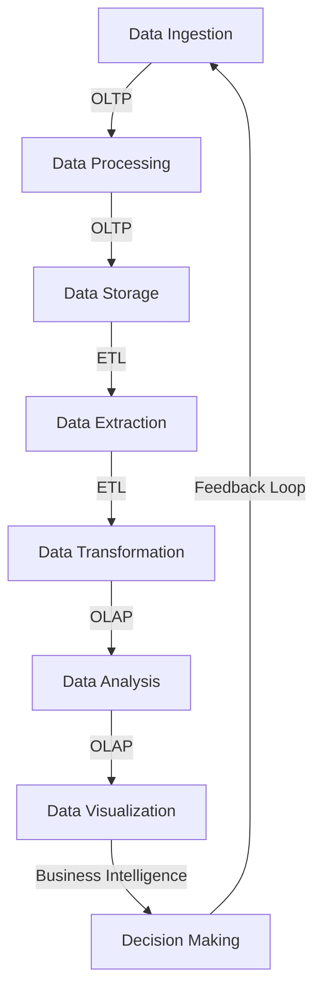

## Introduction
**Online Transactional Processing (OLTP)** and **Online Analytical Processing (OLAP)** are two fundamental concepts in the field of databases and data storage. OLTP systems are designed to handle a large number of transactions, such as inserting, updating, and deleting data, in a short amount of time. On the other hand, OLAP systems are designed to analyze and process large amounts of data to provide insights and support business decisions. In this study guide, we will delve into the core concepts, internal mechanics, and real-world applications of OLTP and OLAP systems.

> **Note:** Understanding the differences between OLTP and OLAP is crucial for designing and implementing efficient database systems that meet the needs of various applications.

## Core Concepts
* **OLTP**: OLTP systems are optimized for transactional workloads, such as processing payments, managing inventory, and tracking customer interactions. They typically use relational databases, such as MySQL or PostgreSQL, and are designed to handle a high volume of short, simple transactions.
* **OLAP**: OLAP systems are optimized for analytical workloads, such as data mining, reporting, and business intelligence. They typically use column-store databases, such as Apache Cassandra or Amazon Redshift, and are designed to handle complex queries and large amounts of data.
* **Data Warehousing**: A data warehouse is a centralized repository that stores data from various sources, such as OLTP systems, and provides a single source of truth for analytical purposes.

> **Tip:** When designing a database system, it's essential to consider the type of workload and the required performance characteristics to choose the right database management system.

## How It Works Internally
OLTP systems typically use a **row-store** architecture, where each row represents a single record, and data is stored in a contiguous block. This allows for fast insertion, update, and deletion operations. On the other hand, OLAP systems use a **column-store** architecture, where each column represents a single attribute, and data is stored in a contiguous block. This allows for fast querying and aggregation operations.

Here's a step-by-step breakdown of how OLTP and OLAP systems work:

1. **Data Ingestion**: Data is ingested into the OLTP system through various sources, such as user interactions, sensors, or other systems.
2. **Data Processing**: The OLTP system processes the data, performing operations such as validation, transformation, and aggregation.
3. **Data Storage**: The processed data is stored in the OLTP system's database.
4. **Data Extraction**: The data is extracted from the OLTP system and loaded into the OLAP system.
5. **Data Transformation**: The data is transformed and aggregated in the OLAP system to support analytical queries.

> **Warning:** Failing to design a scalable and efficient data pipeline can lead to performance issues and data loss.

## Code Examples
### Example 1: Basic OLTP System
```python
import sqlite3

# Create a connection to the database
conn = sqlite3.connect("oltp.db")

# Create a cursor object
cursor = conn.cursor()

# Create a table
cursor.execute("""
    CREATE TABLE customers (
        id INTEGER PRIMARY KEY,
        name TEXT NOT NULL,
        email TEXT NOT NULL
    );
""")

# Insert a record
cursor.execute("INSERT INTO customers (name, email) VALUES ('John Doe', 'john.doe@example.com');")

# Commit the transaction
conn.commit()

# Close the connection
conn.close()
```

### Example 2: Real-World OLTP Pattern
```java
import java.sql.Connection;
import java.sql.DriverManager;
import java.sql.PreparedStatement;
import java.sql.SQLException;

public class OLTPExample {
    public static void main(String[] args) {
        // Create a connection to the database
        try (Connection conn = DriverManager.getConnection("jdbc:mysql://localhost:3306/oltp", "username", "password")) {
            // Create a prepared statement
            PreparedStatement stmt = conn.prepareStatement("INSERT INTO customers (name, email) VALUES (?, ?);");

            // Set the parameters
            stmt.setString(1, "Jane Doe");
            stmt.setString(2, "jane.doe@example.com");

            // Execute the statement
            stmt.executeUpdate();
        } catch (SQLException e) {
            // Handle the exception
        }
    }
}
```

### Example 3: Advanced OLAP System
```sql
-- Create a table
CREATE TABLE sales (
    id INTEGER PRIMARY KEY,
    product_id INTEGER NOT NULL,
    customer_id INTEGER NOT NULL,
    sale_date DATE NOT NULL,
    amount DECIMAL(10, 2) NOT NULL
);

-- Insert data
INSERT INTO sales (product_id, customer_id, sale_date, amount) VALUES
    (1, 1, '2022-01-01', 100.00),
    (2, 2, '2022-01-02', 200.00),
    (3, 3, '2022-01-03', 300.00);

-- Create an index
CREATE INDEX idx_sales_product_id ON sales (product_id);

-- Query the data
SELECT product_id, SUM(amount) AS total_sales
FROM sales
GROUP BY product_id;
```

## Visual Diagram


> **Note:** The diagram illustrates the flow of data from ingestion to decision-making, highlighting the roles of OLTP and OLAP systems.

## Comparison
| Approach | Time Complexity | Space Complexity | Pros | Cons | Best For |
|----------|----------------|-----------------|------|------|----------|
| OLTP | O(1) | O(n) | Fast transaction processing, high concurrency | Limited analytical capabilities | Transactional workloads |
| OLAP | O(n) | O(n) | Fast querying and aggregation, supports complex analytics | Limited transactional capabilities | Analytical workloads |
| Data Warehousing | O(n) | O(n) | Centralized repository, supports both OLTP and OLAP | High maintenance costs, complex ETL processes | Enterprise data management |
| NoSQL | O(1) | O(n) | Flexible schema, high scalability | Limited transactional support, inconsistent data | Real-time web applications |

> **Tip:** When choosing a database management system, consider the trade-offs between OLTP and OLAP capabilities, as well as the specific requirements of your application.

## Real-world Use Cases
* **Amazon**: Amazon uses a combination of OLTP and OLAP systems to manage its e-commerce platform. The OLTP system handles transactions, such as processing payments and updating inventory, while the OLAP system analyzes customer behavior and provides insights for marketing and sales.
* **Facebook**: Facebook uses a graph database, such as Apache Giraph, to store and analyze social network data. The graph database is optimized for OLAP workloads, allowing Facebook to quickly query and analyze large amounts of data.
* **Walmart**: Walmart uses a data warehouse, such as Apache Hadoop, to store and analyze sales data from its retail stores. The data warehouse provides a centralized repository for sales data, allowing Walmart to analyze sales trends and optimize its supply chain.

## Common Pitfalls
* **Insufficient indexing**: Failing to create indexes on frequently queried columns can lead to slow query performance.
* **Inadequate data partitioning**: Failing to partition data effectively can lead to slow query performance and increased storage costs.
* **Poor data modeling**: Failing to design a data model that supports both OLTP and OLAP workloads can lead to performance issues and data inconsistencies.
* **Inadequate ETL processes**: Failing to design efficient ETL processes can lead to data loss, corruption, and inconsistent data.

> **Warning:** Failing to address these common pitfalls can lead to significant performance issues, data loss, and decreased system reliability.

## Interview Tips
* **What is the difference between OLTP and OLAP?**: A strong answer should highlight the differences in workload, data structure, and performance characteristics between OLTP and OLAP systems.
* **How do you design a database system for OLTP workloads?**: A strong answer should discuss the importance of indexing, data partitioning, and transactional support in OLTP systems.
* **What are the benefits and drawbacks of using a data warehouse?**: A strong answer should discuss the benefits of centralized data management, support for both OLTP and OLAP workloads, and the potential drawbacks of high maintenance costs and complex ETL processes.

> **Interview:** Be prepared to discuss the trade-offs between OLTP and OLAP systems, as well as the design considerations for building a scalable and efficient database system.

## Key Takeaways
* **OLTP systems are optimized for transactional workloads**, with a focus on fast insertion, update, and deletion operations.
* **OLAP systems are optimized for analytical workloads**, with a focus on fast querying and aggregation operations.
* **Data warehousing provides a centralized repository** for storing and analyzing data from various sources.
* **Indexing and data partitioning are critical** for optimizing query performance in OLTP and OLAP systems.
* **ETL processes must be designed efficiently** to ensure data consistency and reliability.
* **Scalability and performance** are critical considerations when designing a database system for OLTP or OLAP workloads.
* **Data modeling and data governance** are essential for ensuring data consistency and reliability across the organization.
* **Business intelligence and data visualization** are critical components of a data-driven organization, relying on OLAP systems to provide insights and support decision-making.