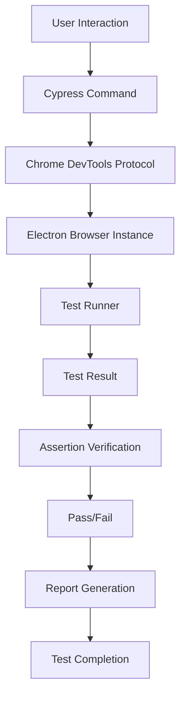

## Introduction
Automated E2E (End-to-End) testing is a crucial aspect of software development, ensuring that applications function as expected from a user's perspective. **Cypress** is a popular framework for automating E2E tests, providing a robust and efficient way to validate web applications. In this guide, we'll delve into the world of automated E2E Cypress flows, exploring the core concepts, internal mechanics, and best practices for implementing robust tests.

> **Note:** E2E testing is essential for catching bugs that may have been missed during unit testing or integration testing, as it simulates real-user interactions with the application.

Real-world relevance is evident in companies like **Google**, **Amazon**, and **Microsoft**, which heavily rely on automated E2E testing to ensure the quality of their web applications. Every engineer should understand the importance of automated E2E testing, as it enables teams to:

* Reduce manual testing efforts
* Increase test coverage
* Improve test reliability
* Enhance overall application quality

## Core Concepts
To grasp automated E2E Cypress flows, it's essential to understand the following core concepts:

* **Test automation framework**: Cypress provides a framework for writing and executing automated tests.
* **E2E testing**: Simulates real-user interactions with the application, covering multiple features and user journeys.
* **Test runner**: Cypress Test Runner is responsible for executing tests, providing a user-friendly interface for test management.
* **Assertions**: Verifications that ensure the application behaves as expected, using libraries like Chai or Sinon.

> **Tip:** When writing automated E2E tests, focus on simulating real-user interactions, rather than testing individual components in isolation.

Key terminology includes:

* **Spec**: A test file containing a set of related tests.
* **Command**: A Cypress command, such as `cy.visit()` or `cy.click()`.
* **Alias**: A shortcut for referencing elements or commands, making tests more readable and maintainable.

## How It Works Internally
Under the hood, Cypress uses a combination of technologies to enable automated E2E testing:

1. **Electron**: A framework for building cross-platform desktop applications, used by Cypress to launch a browser instance.
2. **Chrome DevTools Protocol**: A protocol allowing Cypress to interact with the browser, executing commands and retrieving results.
3. **WebKit**: A web engine used by Cypress to render web pages and execute tests.

Here's a step-by-step breakdown of the test execution process:

1. **Test runner initialization**: The Cypress Test Runner is launched, and the test file is loaded.
2. **Browser instance creation**: A new browser instance is created using Electron, and the test page is loaded.
3. **Command execution**: Cypress commands are executed, interacting with the application and verifying assertions.
4. **Result processing**: Test results are processed, and any failures or errors are reported.

> **Warning:** Be cautious when using `cy.wait()` or `cy.timeout()` commands, as they can introduce flakiness into your tests if not used correctly.

## Code Examples
### Example 1: Basic Cypress Test
```javascript
// cypress/integration/basic.spec.js
describe('Basic Cypress Test', () => {
  it('visits the homepage', () => {
    // Visit the homepage
    cy.visit('https://example.com')

    // Verify the page title
    cy.title().should('contain', 'Example Domain')
  })
})
```
### Example 2: Real-World Cypress Test
```javascript
// cypress/integration/login.spec.js
describe('Login Feature', () => {
  it('logs in successfully', () => {
    // Visit the login page
    cy.visit('https://example.com/login')

    // Fill in the login form
    cy.get('input[name="username"]').type('username')
    cy.get('input[name="password"]').type('password')

    // Submit the form
    cy.get('button[type="submit"]').click()

    // Verify the user is logged in
    cy.get('div.logged-in').should('be.visible')
  })
})
```
### Example 3: Advanced Cypress Test with Aliases
```javascript
// cypress/integration/advanced.spec.js
describe('Advanced Cypress Test', () => {
  it('uses aliases for improved readability', () => {
    // Visit the homepage
    cy.visit('https://example.com')

    // Create an alias for the navigation menu
    cy.get('nav').as('nav')

    // Click on the navigation menu
    cy.get('@nav').find('a[href="#about"]').click()

    // Verify the about page is displayed
    cy.get('div.about').should('be.visible')
  })
})
```
## Visual Diagram

This diagram illustrates the core components involved in automated E2E Cypress flows, from user interaction to test completion.

## Comparison
| Approach | Time Complexity | Space Complexity | Pros | Cons | Best For |
| --- | --- | --- | --- | --- | --- |
| Cypress | O(n) | O(n) | Fast, reliable, and easy to use | Limited support for non-web applications | Web applications, e2e testing |
| Selenium | O(n) | O(n) | Supports multiple browsers and platforms | Slow, resource-intensive, and prone to flakiness | Non-web applications, cross-browser testing |
| Playwright | O(n) | O(n) | Fast, reliable, and supports multiple browsers | Limited support for non-web applications | Web applications, e2e testing |
| Puppeteer | O(n) | O(n) | Fast, reliable, and supports Chrome DevTools Protocol | Limited support for non-Chrome browsers | Web applications, e2e testing |

## Real-world Use Cases
1. **Google**: Uses Cypress for automated E2E testing of their web applications, ensuring a seamless user experience.
2. **Amazon**: Employs Cypress for testing their e-commerce platform, verifying that features like payment processing and order management work correctly.
3. **Microsoft**: Utilizes Cypress for automated E2E testing of their web applications, including Office Online and Azure services.

## Common Pitfalls
1. **Flaky tests**: Tests that fail intermittently due to issues like network connectivity or browser rendering.
	* Wrong: `cy.wait(1000)` // using arbitrary timeouts
	* Right: `cy.get('div.loaded').should('be.visible')` // using explicit waits
2. **Over-reliance on `cy.wait()`**: Using `cy.wait()` excessively, leading to slow and unreliable tests.
	* Wrong: `cy.wait(5000)` // using long, arbitrary timeouts
	* Right: `cy.get('div.loaded').should('be.visible')` // using explicit waits
3. **Insufficient test coverage**: Failing to cover critical features or user journeys, leading to undetected bugs.
	* Wrong: `it('tests only one feature')` // testing only a single feature
	* Right: `describe('feature suite', () => { it('tests feature 1')(); it('tests feature 2')(); })` // testing multiple features
4. **Poor test maintenance**: Failing to update tests when application code changes, leading to test failures and maintenance issues.
	* Wrong: `// outdated test code` // not updating tests
	* Right: `// updated test code` // regularly updating tests

## Interview Tips
1. **What is Cypress, and how does it work?**: Be prepared to explain the core concepts, internal mechanics, and benefits of using Cypress.
	* Weak answer: "Cypress is a testing framework... I think."
	* Strong answer: "Cypress is an automated E2E testing framework that uses Electron and Chrome DevTools Protocol to simulate user interactions and verify application behavior."
2. **How do you handle flaky tests in Cypress?**: Discuss strategies for reducing flakiness, such as using explicit waits and avoiding arbitrary timeouts.
	* Weak answer: "I just add more timeouts..."
	* Strong answer: "I use explicit waits and verify the expected behavior, rather than relying on arbitrary timeouts."
3. **What are some best practices for writing Cypress tests?**: Share tips on writing maintainable, efficient, and reliable tests, such as using aliases and testing multiple features.
	* Weak answer: "I just write tests as I go..."
	* Strong answer: "I follow best practices like using aliases, testing multiple features, and maintaining a consistent test structure."

## Key Takeaways
* **Automated E2E testing is crucial** for ensuring application quality and reliability.
* **Cypress is a powerful framework** for automating E2E tests, offering a robust and efficient way to validate web applications.
* **Understand the core concepts**, including test automation frameworks, E2E testing, and test runners.
* **Use explicit waits** and avoid arbitrary timeouts to reduce flakiness.
* **Maintain test coverage** by testing multiple features and user journeys.
* **Regularly update tests** to ensure they remain relevant and effective.
* **Follow best practices** for writing maintainable, efficient, and reliable tests.
* **Be prepared to discuss** Cypress, automated E2E testing, and test maintenance during interviews.