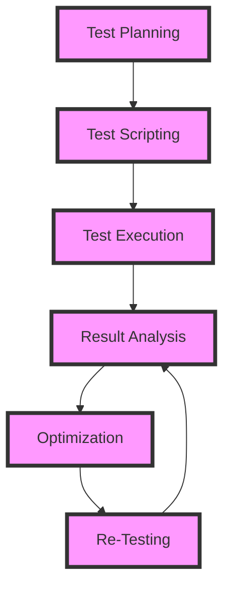

## Introduction
Automated load testing is a crucial aspect of software development that ensures a system's performance, scalability, and reliability under a large number of concurrent users. It involves simulating a high volume of traffic to identify bottlenecks, measure response times, and determine the system's breaking point. **Load testing** is essential in today's digital landscape, where a slow or unresponsive application can lead to a significant loss of customers and revenue. Every engineer needs to understand the principles of load testing to design and develop efficient, scalable systems that can handle a large number of concurrent users.

## Core Concepts
To understand automated load testing, we need to grasp some key concepts:
* **Concurrency**: The ability of a system to handle multiple requests simultaneously.
* **Throughput**: The rate at which a system can process requests.
* **Response Time**: The time it takes for a system to respond to a request.
* **Load**: The amount of traffic a system is subjected to.
* **Stress Testing**: A type of load testing that pushes a system to its limits to identify its breaking point.
> **Note:** Load testing is not the same as unit testing or integration testing. It focuses on the overall performance of a system under a high load.

## How It Works Internally
Automated load testing involves simulating a large number of concurrent users interacting with a system. This is typically done using specialized tools that can generate a high volume of traffic. The process involves:
1. **Test Planning**: Identifying the test objectives, scope, and requirements.
2. **Test Scripting**: Creating scripts that simulate user interactions.
3. **Test Execution**: Running the scripts to generate traffic.
4. **Result Analysis**: Analyzing the results to identify performance bottlenecks.
> **Tip:** Use a combination of open-source and commercial tools to get the best results.

## Code Examples
Here are three examples of automated load testing using different tools:
### Example 1: Basic Load Testing using Apache JMeter
```java
// Import necessary libraries
import org.apache.jmeter.control.LoopController;
import org.apache.jmeter.control.gui.TestPlanGui;
import org.apache.jmeter.engine.StandardJMeterEngine;
import org.apache.jmeter.protocol.http.control.Header;
import org.apache.jmeter.protocol.http.control.HeaderManager;
import org.apache.jmeter.protocol.http.gui.HeaderPanel;
import org.apache.jmeter.protocol.http.sampler.HTTPSamplerProxy;

// Create a new JMeter test plan
StandardJMeterEngine jmeter = new StandardJMeterEngine();

// Add a thread group
ThreadGroup threadGroup = new ThreadGroup();
threadGroup.setNumThreads(10);
threadGroup.setRampUp(1);
threadGroup.setDuration(60);

// Add an HTTP sampler
HTTPSamplerProxy httpSampler = new HTTPSamplerProxy();
httpSampler.setMethod("GET");
httpSampler.setPath("/");

// Add a header manager
HeaderManager headerManager = new HeaderManager();
headerManager.addHeader(new Header("Content-Type", "application/json"));

// Run the test
jmeter.configure(threadGroup);
jmeter.run();
```
### Example 2: Load Testing using Python and Locust
```python
# Import necessary libraries
from locust import HttpLocust, TaskSet, task

# Define a task set
class UserBehavior(TaskSet):
    @task
    def index(self):
        self.client.get("/")

# Define a locust class
class WebsiteUser(HttpLocust):
    task_set = UserBehavior
    min_wait = 5000
    max_wait = 9000
```
### Example 3: Advanced Load Testing using Gatling
```scala
// Import necessary libraries
import io.gatling.core.Predef._
import io.gatling.http.Predef._

// Define a simulation
class LoadTest extends Simulation {
  val httpProtocol = http
    .baseUrl("https://example.com")
    .inferHtmlResources(BlackList(), WhiteList())

  val scn = scenario("Load Test")
    .exec(http("index")
      .get("/"))

  setUp(
    scn.inject(rampUsers(10) over 10)
  ).protocols(httpProtocol)
}
```
> **Warning:** Be cautious when running load tests, as they can put a significant strain on your system.

## Visual Diagram

The diagram illustrates the load testing process, from planning to re-testing.

## Comparison
| Tool | Time Complexity | Space Complexity | Pros | Cons | Best For |
| --- | --- | --- | --- | --- | --- |
| Apache JMeter | O(n) | O(n) | Free, open-source, widely used | Steep learning curve, resource-intensive | Large-scale load testing |
| Locust | O(n) | O(n) | Easy to use, flexible, scalable | Limited features, not suitable for complex tests | Small-scale load testing |
| Gatling | O(n) | O(n) | Commercial support, high-performance, easy to use | Expensive, limited free version | Enterprise-level load testing |
> **Interview:** What is the difference between load testing and stress testing? (Answer: Load testing is used to measure the performance of a system under a normal load, while stress testing is used to push a system to its limits.)

## Real-world Use Cases
* **Netflix**: Uses load testing to ensure its streaming service can handle a large number of concurrent users.
* **Amazon**: Uses load testing to optimize its e-commerce platform for peak shopping seasons.
* **Google**: Uses load testing to ensure its search engine can handle a high volume of search queries.

## Common Pitfalls
* **Insufficient Test Data**: Using inadequate test data can lead to inaccurate results.
* **Inadequate Hardware**: Running load tests on underpowered hardware can lead to inaccurate results.
* **Incorrect Test Scenarios**: Using incorrect test scenarios can lead to inaccurate results.
* **Not Monitoring System Resources**: Failing to monitor system resources during load testing can lead to inaccurate results.
> **Tip:** Use a combination of open-source and commercial tools to get the best results.

## Interview Tips
* **What is load testing?**: Define load testing and its importance in software development.
* **How do you perform load testing?**: Explain the steps involved in performing load testing, from planning to result analysis.
* **What are some common load testing tools?**: List some popular load testing tools, including Apache JMeter, Locust, and Gatling.
> **Warning:** Be prepared to answer questions about your experience with load testing and your knowledge of different tools.

## Key Takeaways
* **Load testing is crucial for ensuring system performance and scalability**.
* **Use a combination of open-source and commercial tools for load testing**.
* **Monitor system resources during load testing**.
* **Use realistic test data and scenarios**.
* **Load testing is not a one-time task, but an ongoing process**.
* **Optimize your system based on load testing results**.
* **Use load testing to identify performance bottlenecks**.
* **Load testing can help reduce the risk of system failures**.
* **Load testing can improve user experience**.
> **Note:** Load testing is an essential part of software development, and every engineer should have a good understanding of its principles and practices.