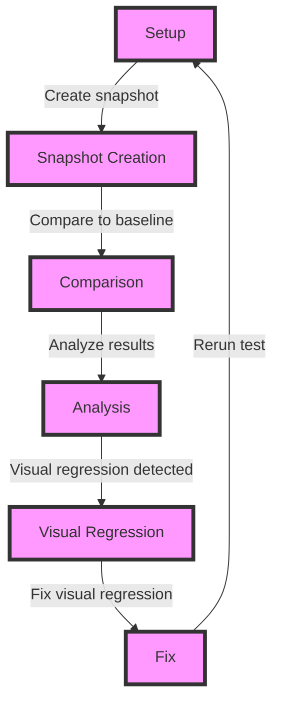

## Introduction
**Visual Regression Testing** is a crucial aspect of ensuring the quality and integrity of web applications. It involves comparing the visual appearance of a webpage or application before and after changes, to detect any unintended visual regressions. **Mocked Visual Regression snapshots** take this concept a step further by allowing developers to test visual regressions in a controlled environment, using mocked data and services. In this section, we will explore the importance of testing mocked visual regression snapshots in production, and why it matters for ensuring the quality of web applications.

> **Note:** Visual Regression Testing is not just about catching visual bugs, but also about ensuring that changes to the application do not introduce unexpected behavior or side effects.

Real-world relevance: Companies like **Airbnb**, **Dropbox**, and **GitHub** use visual regression testing to ensure the quality of their web applications. By testing mocked visual regression snapshots, developers can catch visual regressions early in the development cycle, reducing the likelihood of downstream errors and improving overall application quality.

## Core Concepts
**Visual Regression Testing** involves comparing the visual appearance of a webpage or application before and after changes. **Mocked Visual Regression snapshots** use mocked data and services to test visual regressions in a controlled environment. Key terminology includes:

* **Visual Regression**: a change in the visual appearance of a webpage or application that was not intended by the developer.
* **Mocked Data**: fake data used to simulate real-world scenarios, allowing developers to test visual regressions in a controlled environment.
* **Snapshot**: a saved image of a webpage or application, used as a baseline for comparison.

Mental models: Think of visual regression testing as a way to ensure that changes to the application do not introduce unintended visual side effects. Mocked visual regression snapshots are like a safety net, allowing developers to catch visual regressions early and prevent downstream errors.

## How It Works Internally
When testing mocked visual regression snapshots, the following steps occur:

1. **Setup**: The developer sets up a test environment, using mocked data and services to simulate real-world scenarios.
2. **Snapshot Creation**: The developer creates a snapshot of the webpage or application, using a tool like **Puppeteer** or **Selenium**.
3. **Comparison**: The developer compares the snapshot to a baseline image, using a tool like **ResembleJS** or **ImageMagick**.
4. **Analysis**: The developer analyzes the comparison results, looking for any visual regressions or differences.

Under-the-hood mechanics: When comparing snapshots, the tool uses algorithms like **Mean Squared Error (MSE)** or **Peak Signal-to-Noise Ratio (PSNR)** to calculate the difference between the two images. The tool then uses this information to determine if a visual regression has occurred.

> **Warning:** Using the wrong algorithm or tool can lead to false positives or false negatives, so it's essential to choose the right tool for the job.

## Code Examples
### Example 1: Basic Snapshot Creation
```javascript
// Import required libraries
const puppeteer = require('puppeteer');

// Launch a new browser instance
(async () => {
  const browser = await puppeteer.launch();
  const page = await browser.newPage();

  // Navigate to the webpage
  await page.goto('https://example.com');

  // Create a snapshot
  const snapshot = await page.screenshot({ path: 'snapshot.png' });

  // Close the browser instance
  await browser.close();
})();
```
### Example 2: Comparing Snapshots
```javascript
// Import required libraries
const fs = require('fs');
const resemble = require('resemblejs');

// Load the baseline and snapshot images
const baseline = fs.readFileSync('baseline.png');
const snapshot = fs.readFileSync('snapshot.png');

// Compare the images
const comparison = resemble(baseline).compareTo(snapshot);

// Analyze the comparison results
const diff = comparison.diff;
const misMatchPercentage = comparison.misMatchPercentage;

// Log the results
console.log(`Difference: ${diff}`);
console.log(`Mismatch percentage: ${misMatchPercentage}%`);
```
### Example 3: Advanced Snapshot Comparison
```javascript
// Import required libraries
const puppeteer = require('puppeteer');
const resemble = require('resemblejs');

// Launch a new browser instance
(async () => {
  const browser = await puppeteer.launch();
  const page = await browser.newPage();

  // Navigate to the webpage
  await page.goto('https://example.com');

  // Create a snapshot
  const snapshot = await page.screenshot({ path: 'snapshot.png' });

  // Compare the snapshot to a baseline image
  const comparison = resemble('baseline.png').compareTo('snapshot.png');

  // Analyze the comparison results
  const diff = comparison.diff;
  const misMatchPercentage = comparison.misMatchPercentage;

  // Log the results
  console.log(`Difference: ${diff}`);
  console.log(`Mismatch percentage: ${misMatchPercentage}%`);

  // Close the browser instance
  await browser.close();
})();
```
> **Tip:** Use a combination of tools and libraries to create a robust visual regression testing pipeline.

## Visual Diagram

The diagram illustrates the visual regression testing pipeline, from setup to analysis and fix.

## Comparison
| Approach | Time Complexity | Space Complexity | Pros | Cons | Best For |
| --- | --- | --- | --- | --- | --- |
| **Puppeteer** | O(n) | O(n) | Fast, accurate | Resource-intensive | Web applications |
| **Selenium** | O(n) | O(n) | Cross-browser compatibility | Slow, resource-intensive | Cross-browser testing |
| **ResembleJS** | O(1) | O(1) | Fast, lightweight | Limited features | Image comparison |
| **ImageMagick** | O(1) | O(1) | Feature-rich, fast | Steep learning curve | Image processing |

> **Interview:** What are the trade-offs between using Puppeteer and Selenium for visual regression testing?

## Real-world Use Cases
1. **Airbnb**: Uses visual regression testing to ensure the quality of their web application, with a focus on user experience and visual consistency.
2. **Dropbox**: Employs visual regression testing to catch visual regressions in their web application, using a combination of Puppeteer and ResembleJS.
3. **GitHub**: Uses visual regression testing to ensure the quality of their web application, with a focus on visual consistency and user experience.

## Common Pitfalls
1. **Using the wrong algorithm**: Using an algorithm that is not suitable for the specific use case can lead to false positives or false negatives.
2. **Not accounting for browser differences**: Failing to account for browser differences can lead to visual regressions that are not caught by the testing pipeline.
3. **Not using a baseline image**: Not using a baseline image can make it difficult to determine if a visual regression has occurred.
4. **Not analyzing results**: Not analyzing the results of the comparison can lead to missed visual regressions.

> **Warning:** Failing to account for browser differences can lead to visual regressions that are not caught by the testing pipeline.

## Interview Tips
1. **What are the benefits of using visual regression testing?**: The benefits of using visual regression testing include catching visual regressions early, improving user experience, and reducing downstream errors.
2. **How do you handle browser differences in visual regression testing?**: You can handle browser differences by using a combination of tools and libraries, such as Puppeteer and Selenium, and by accounting for browser-specific differences in the testing pipeline.
3. **What are some common pitfalls in visual regression testing?**: Common pitfalls include using the wrong algorithm, not accounting for browser differences, not using a baseline image, and not analyzing results.

> **Tip:** Use a combination of tools and libraries to create a robust visual regression testing pipeline.

## Key Takeaways
* Visual regression testing is essential for ensuring the quality of web applications.
* Mocked visual regression snapshots allow developers to test visual regressions in a controlled environment.
* Puppeteer and Selenium are popular tools for visual regression testing.
* ResembleJS and ImageMagick are popular libraries for image comparison.
* Browser differences must be accounted for in the testing pipeline.
* A baseline image is essential for determining if a visual regression has occurred.
* Analyzing results is crucial for catching visual regressions.
* Visual regression testing can be used to improve user experience and reduce downstream errors.
* A combination of tools and libraries can be used to create a robust visual regression testing pipeline.