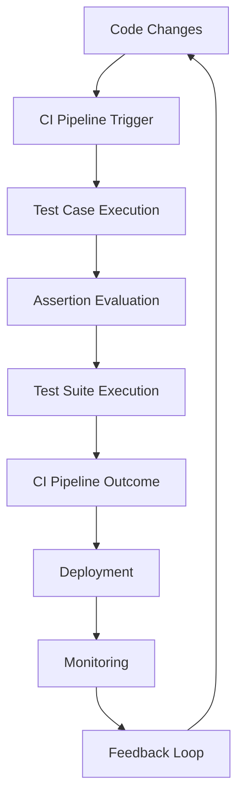

## Introduction
Continuous Integration (CI) is a crucial aspect of modern software development, ensuring that code changes are thoroughly tested and validated before being merged into the main codebase. One critical component of CI is the use of assertions to verify the correctness of code behavior. However, auditing CI check assertions can be a complex and error-prone process, especially for large and complex systems. In this section, we will delve into the world of CI check assertions, exploring what they are, why they matter, and their real-world relevance.

CI check assertions are statements that verify the expected behavior of code, ensuring that it conforms to the desired specifications. These assertions can be used to validate various aspects of code, including functionality, performance, and security. By auditing CI check assertions, developers can ensure that their code is reliable, stable, and meets the required standards.

> **Note:** Auditing CI check assertions is an essential step in the software development process, as it helps to identify and fix issues early on, reducing the likelihood of downstream problems and improving overall code quality.

## Core Concepts
To understand CI check assertions, it's essential to grasp some core concepts, including:

* **Assertions**: Statements that verify the expected behavior of code.
* **Test cases**: Scenarios that test specific aspects of code behavior.
* **Test suites**: Collections of test cases that validate various aspects of code functionality.
* **CI pipelines**: Automated workflows that integrate code changes, build, test, and deploy software applications.

Mental models and analogies can help make these concepts more accessible. For example, think of assertions as "guards" that ensure code behavior conforms to expected standards. Test cases can be seen as "scenarios" that exercise specific aspects of code functionality, while test suites are like "playbooks" that orchestrate multiple test cases to validate overall code behavior.

> **Tip:** When working with CI check assertions, it's essential to consider the concept of "test coverage," which refers to the percentage of code that is exercised by test cases. Aim for high test coverage to ensure that your code is thoroughly validated.

## How It Works Internally
Under the hood, CI check assertions rely on a combination of programming languages, testing frameworks, and CI tools. Here's a step-by-step breakdown of how it works:

1. **Code changes**: Developers make changes to the codebase, which are then committed to version control.
2. **CI pipeline trigger**: The CI pipeline is triggered, which initiates the build, test, and deployment process.
3. **Test case execution**: Test cases are executed, which include assertions that verify expected code behavior.
4. **Assertion evaluation**: Assertions are evaluated, and if any fail, the test case fails, and the CI pipeline is halted.
5. **Test suite execution**: Test suites are executed, which aggregate the results of multiple test cases.
6. **CI pipeline outcome**: The CI pipeline outcome is determined, which can be either success or failure, depending on the test results.

> **Warning:** One common pitfall when working with CI check assertions is to assume that a passing test suite means that the code is correct. However, this is not always the case, as test suites can have gaps in coverage or flawed assertions.

## Code Examples
Here are three complete and runnable code examples that demonstrate CI check assertions in action:

### Example 1: Basic Assertion
```python
import unittest

def add(a, b):
    return a + b

class TestAddFunction(unittest.TestCase):
    def test_add(self):
        self.assertEqual(add(2, 3), 5)

if __name__ == '__main__':
    unittest.main()
```
This example demonstrates a basic assertion that verifies the correctness of the `add` function.

### Example 2: Real-World Pattern
```java
import org.junit.Test;
import static org.junit.Assert.assertEquals;

public class Calculator {
    public int add(int a, int b) {
        return a + b;
    }
}

public class CalculatorTest {
    @Test
    public void testAdd() {
        Calculator calculator = new Calculator();
        int result = calculator.add(2, 3);
        assertEquals(5, result);
    }
}
```
This example demonstrates a real-world pattern of using assertions to verify the correctness of a `Calculator` class.

### Example 3: Advanced Assertion
```typescript
import { expect } from '@jest/globals';

function fibonacci(n: number): number {
    if (n <= 1) {
        return n;
    }
    return fibonacci(n - 1) + fibonacci(n - 2);
}

describe('fibonacci', () => {
    it('should return the correct fibonacci number', () => {
        expect(fibonacci(10)).toBe(55);
    });
});
```
This example demonstrates an advanced assertion that verifies the correctness of a recursive `fibonacci` function.

## Visual Diagram

This diagram illustrates the CI pipeline workflow, including code changes, test case execution, assertion evaluation, and deployment.

> **Note:** The feedback loop is an essential component of the CI pipeline, as it allows developers to refine their code and improve test coverage based on test results.

## Comparison
Here's a comparison of different assertion frameworks and their characteristics:

| Framework | Time Complexity | Space Complexity | Pros | Cons | Best For |
| --- | --- | --- | --- | --- | --- |
| JUnit | O(1) | O(1) | Easy to use, widely adopted | Limited functionality | Small to medium-sized projects |
| TestNG | O(n) | O(n) | More features than JUnit, better support for parallel testing | Steeper learning curve | Large-scale projects, parallel testing |
| Jest | O(1) | O(1) | Fast, easy to use, great for JavaScript projects | Limited support for other languages | JavaScript projects, front-end development |
| Pytest | O(n) | O(n) | Flexible, customizable, great for Python projects | Can be slower than other frameworks | Python projects, data science, scientific computing |

## Real-world Use Cases
Here are three real-world use cases for CI check assertions:

1. **Google**: Google uses a combination of JUnit and TestNG for their Android testing framework.
2. **Amazon**: Amazon uses a custom testing framework that integrates with their CI pipeline to validate the correctness of their e-commerce platform.
3. **Microsoft**: Microsoft uses a combination of Jest and Pytest for their front-end and back-end testing, respectively.

> **Tip:** When implementing CI check assertions, it's essential to consider the specific needs of your project and choose the right framework for the job.

## Common Pitfalls
Here are four common pitfalls to watch out for when working with CI check assertions:

1. **Insufficient test coverage**: Failing to test all aspects of code behavior can lead to downstream problems.
2. **Flawed assertions**: Writing assertions that are too broad or too narrow can lead to false positives or false negatives.
3. **Test suite maintenance**: Failing to maintain test suites can lead to outdated or broken tests.
4. **Over-reliance on CI**: Relying too heavily on CI can lead to complacency and a lack of manual testing.

> **Warning:** One common mistake is to assume that CI check assertions can replace manual testing entirely. However, this is not the case, as manual testing is still essential for ensuring that code meets the required standards.

## Interview Tips
Here are three common interview questions related to CI check assertions, along with weak and strong answers:

1. **What is the purpose of CI check assertions?**
	* Weak answer: "CI check assertions are used to test code."
	* Strong answer: "CI check assertions are used to verify the correctness of code behavior, ensuring that it conforms to expected standards and meets the required specifications."
2. **How do you ensure sufficient test coverage?**
	* Weak answer: "I write a lot of tests."
	* Strong answer: "I use a combination of code review, test metrics, and manual testing to ensure that all aspects of code behavior are thoroughly tested and validated."
3. **What is the difference between JUnit and TestNG?**
	* Weak answer: "JUnit is for small projects, and TestNG is for large projects."
	* Strong answer: "JUnit is a widely adopted framework that is easy to use, but limited in its functionality. TestNG is a more feature-rich framework that is better suited for large-scale projects and parallel testing."

> **Interview:** When answering questions about CI check assertions, be sure to emphasize your understanding of the underlying concepts, your experience with different frameworks, and your ability to apply best practices to real-world scenarios.

## Key Takeaways
Here are ten key takeaways to remember when working with CI check assertions:

* **CI check assertions are essential for ensuring code quality and reliability**.
* **Assertions should be specific, clear, and well-documented**.
* **Test coverage is critical for ensuring that all aspects of code behavior are thoroughly tested**.
* **CI pipelines should be automated, efficient, and scalable**.
* **Test suites should be maintained regularly to ensure they remain relevant and effective**.
* **Manual testing is still essential for ensuring that code meets the required standards**.
* **CI check assertions should be used in conjunction with other testing techniques, such as unit testing and integration testing**.
* **Test metrics, such as code coverage and test execution time, should be monitored and optimized**.
* **CI check assertions should be integrated with other development tools, such as version control and project management**.
* **Best practices, such as continuous integration and continuous deployment, should be adopted to ensure that CI check assertions are effective and efficient**.

> **Note:** By following these key takeaways, you can ensure that your CI check assertions are effective, efficient, and reliable, and that your code is of the highest quality and reliability.