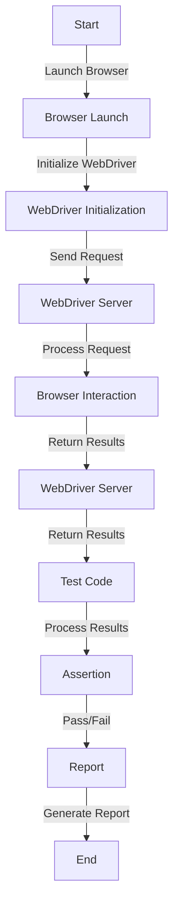

## Introduction
Automating Selenium WebDriver scripts is crucial for ensuring the quality and reliability of high-performance applications. Selenium WebDriver is an open-source tool that enables developers to automate web browsers for testing purposes. By automating Selenium WebDriver scripts, developers can simulate user interactions, verify application functionality, and identify bugs more efficiently. In real-world scenarios, companies like Google, Amazon, and Facebook rely heavily on automated testing to ensure their applications meet the highest standards of quality and performance. Every engineer should understand the importance of automating Selenium WebDriver scripts to stay competitive in the industry.

> **Note:** Automated testing is not a replacement for manual testing, but rather a complementary approach to ensure thorough coverage of application functionality.

## Core Concepts
To understand how to automate Selenium WebDriver scripts, it's essential to grasp the following core concepts:
* **Selenium WebDriver**: an open-source tool that enables developers to automate web browsers for testing purposes.
* **WebDriver API**: a programming interface that allows developers to interact with the browser and perform actions like clicking, typing, and navigating.
* **Test Automation Framework**: a set of tools and libraries that simplify the process of creating and executing automated tests.
* **Page Object Model**: a design pattern that separates the presentation layer from the business logic, making it easier to maintain and update test code.

> **Tip:** Use a Page Object Model to organize your test code and reduce maintenance overhead.

## How It Works Internally
When you run a Selenium WebDriver script, the following steps occur:
1. The WebDriver API sends a request to the browser to launch a new instance.
2. The browser launches and initializes the WebDriver executable.
3. The WebDriver executable establishes a connection with the Selenium WebDriver server.
4. The Selenium WebDriver server sends commands to the browser to perform actions like clicking and typing.
5. The browser executes the commands and returns the results to the Selenium WebDriver server.
6. The Selenium WebDriver server sends the results back to the WebDriver API.
7. The WebDriver API processes the results and returns them to the test code.

> **Warning:** Be cautious when using Selenium WebDriver with headless browsers, as they can be slower and more resource-intensive than traditional browsers.

## Code Examples
### Example 1: Basic Usage
```java
import org.openqa.selenium.By;
import org.openqa.selenium.WebDriver;
import org.openqa.selenium.WebElement;
import org.openqa.selenium.chrome.ChromeDriver;

public class BasicUsage {
    public static void main(String[] args) {
        // Set up the ChromeDriver
        System.setProperty("webdriver.chrome.driver", "/path/to/chromedriver");
        WebDriver driver = new ChromeDriver();

        // Navigate to the website
        driver.get("https://www.example.com");

        // Find an element by ID
        WebElement element = driver.findElement(By.id("myElement"));

        // Click the element
        element.click();

        // Close the browser
        driver.quit();
    }
}
```
### Example 2: Real-World Pattern
```python
from selenium import webdriver
from selenium.webdriver.common.by import By
from selenium.webdriver.support.ui import WebDriverWait
from selenium.webdriver.support import expected_conditions as EC

def login(driver, username, password):
    # Navigate to the login page
    driver.get("https://www.example.com/login")

    # Find the username and password fields
    username_field = WebDriverWait(driver, 10).until(
        EC.presence_of_element_located((By.ID, "username"))
    )
    password_field = driver.find_element(By.ID, "password")

    # Enter the username and password
    username_field.send_keys(username)
    password_field.send_keys(password)

    # Click the login button
    driver.find_element(By.ID, "login_button").click()

# Set up the ChromeDriver
driver = webdriver.Chrome()

# Login to the website
login(driver, "username", "password")

# Close the browser
driver.quit()
```
### Example 3: Advanced Usage
```javascript
const { Builder, By, until } = require('selenium-webdriver');

(async function example() {
    // Set up the ChromeDriver
    let driver = await new Builder().forBrowser('chrome').build();

    // Navigate to the website
    await driver.get("https://www.example.com");

    // Find an element by CSS selector
    let element = await driver.findElement(By.css('#myElement'));

    // Wait for the element to be visible
    await driver.wait(until.elementIsVisible(element), 10000);

    // Click the element
    await element.click();

    // Close the browser
    await driver.quit();
})();
```
> **Interview:** Can you explain the difference between Selenium WebDriver and Selenium IDE? How would you use each tool in your testing workflow?

## Visual Diagram

The diagram illustrates the workflow of automating Selenium WebDriver scripts, from launching the browser to generating a report.

## Comparison
| Approach | Time Complexity | Space Complexity | Pros | Cons | Best For |
| --- | --- | --- | --- | --- | --- |
| Selenium WebDriver | O(n) | O(1) | Flexible, supports multiple browsers | Steep learning curve, resource-intensive | Complex web applications |
| Selenium IDE | O(1) | O(1) | Easy to use, record-and-playback functionality | Limited flexibility, only supports Firefox | Simple web applications |
| Cypress | O(n) | O(1) | Fast, supports multiple browsers | Limited support for older browsers | Modern web applications |
| Playwright | O(n) | O(1) | Fast, supports multiple browsers | Limited support for older browsers | Modern web applications |

## Real-world Use Cases
* Google uses Selenium WebDriver to automate testing of their web applications, ensuring high-quality and reliability.
* Amazon uses Selenium WebDriver to test their e-commerce platform, ensuring a seamless user experience.
* Facebook uses Selenium WebDriver to test their social media platform, ensuring high-quality and reliability.

> **Tip:** Use a combination of Selenium WebDriver and other testing tools to ensure comprehensive coverage of your application.

## Common Pitfalls
* **Incorrect locator strategy**: Using an incorrect locator strategy can lead to flaky tests. Instead, use a combination of locator strategies to ensure robust tests.
* **Insufficient wait times**: Insufficient wait times can lead to tests failing due to timing issues. Instead, use explicit waits to ensure that elements are visible and interactable.
* **Inadequate error handling**: Inadequate error handling can lead to tests failing due to unexpected errors. Instead, use try-catch blocks to handle unexpected errors and ensure that tests continue to run.
* **Inconsistent test data**: Inconsistent test data can lead to tests failing due to data inconsistencies. Instead, use a data-driven approach to ensure that tests use consistent data.

## Interview Tips
* **What is the difference between Selenium WebDriver and Selenium IDE?**: Selenium WebDriver is a programming interface for automating web browsers, while Selenium IDE is a record-and-playback tool for automating web browsers.
* **How do you handle flaky tests?**: Use a combination of locator strategies, explicit waits, and retry mechanisms to handle flaky tests.
* **What is the best approach for automating testing of a complex web application?**: Use a combination of Selenium WebDriver, Cypress, and Playwright to ensure comprehensive coverage of the application.

## Key Takeaways
* **Selenium WebDriver is a powerful tool for automating web browsers**: Use Selenium WebDriver to automate testing of complex web applications.
* **Use a combination of locator strategies to ensure robust tests**: Use a combination of locator strategies, such as ID, CSS, and XPath, to ensure that tests are robust and reliable.
* **Explicit waits are essential for ensuring test reliability**: Use explicit waits to ensure that elements are visible and interactable before interacting with them.
* **Data-driven testing is essential for ensuring test consistency**: Use a data-driven approach to ensure that tests use consistent data and reduce the risk of test failures due to data inconsistencies.
* **Error handling is crucial for ensuring test reliability**: Use try-catch blocks to handle unexpected errors and ensure that tests continue to run.
* **Continuous integration and continuous deployment (CI/CD) pipelines are essential for ensuring test automation**: Use CI/CD pipelines to automate testing and ensure that tests are run consistently and reliably.