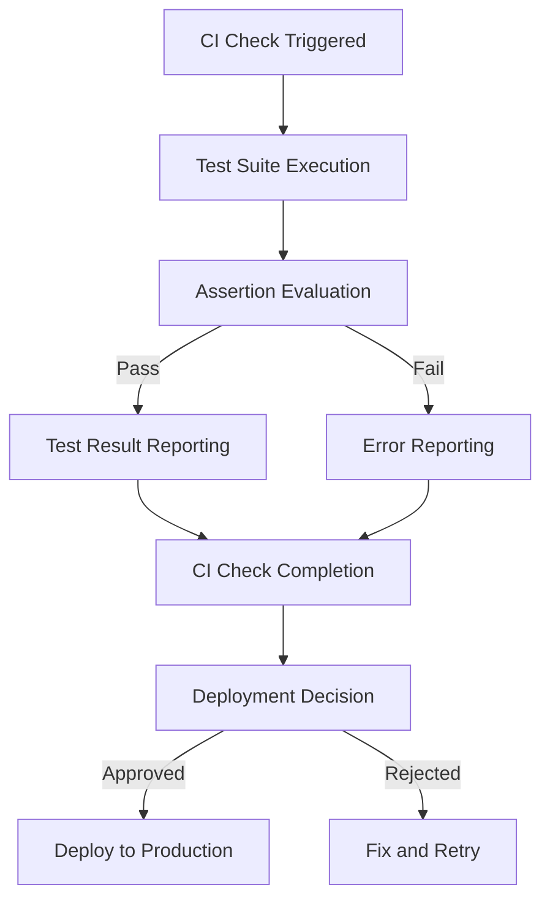

## Introduction
Automated Continuous Integration (CI) checks are a crucial part of ensuring the quality and reliability of software applications. One of the key components of CI checks is assertions, which verify that the code behaves as expected. In this article, we will explore the best practices for asserting automated CI check assertions in production. We will cover the core concepts, internal mechanics, and provide code examples to demonstrate how to implement these best practices. **Every engineer needs to know this** because it directly impacts the quality and reliability of the software they develop.

## Core Concepts
To understand the best practices for asserting automated CI check assertions, we need to first define some key terms:
* **Assertion**: A statement that verifies a specific condition or behavior in the code.
* **Test**: A piece of code that exercises a specific part of the application and verifies its behavior using assertions.
* **CI Check**: A automated process that runs tests and other checks to ensure the quality and reliability of the code.
* **Production**: The environment where the application is deployed and runs in production.

> **Note:** Assertions are not just limited to testing, they can also be used in production code to ensure that the application behaves as expected.

## How It Works Internally
When a CI check is triggered, the following steps occur:
1. **Test Suite Execution**: The test suite is executed, which includes running all the tests and assertions.
2. **Assertion Evaluation**: Each assertion is evaluated, and if it fails, an error is reported.
3. **Test Result Reporting**: The test results are reported, including any errors or failures.
4. **CI Check Completion**: The CI check is completed, and the results are used to determine whether the code is ready for deployment.

```java
// Example of a simple assertion in Java
public class AssertionErrorExample {
    public static void main(String[] args) {
        assert 1 == 2 : "Assertion failed";
    }
}
```

## Code Examples
Here are three complete and runnable code examples that demonstrate how to assert automated CI check assertions in production:
### Example 1: Basic Assertion
```java
// Basic assertion example in Java
public class BasicAssertionExample {
    public static void main(String[] args) {
        int actual = 1;
        int expected = 1;
        if (actual != expected) {
            throw new AssertionError("Assertion failed: expected " + expected + " but got " + actual);
        }
    }
}
```

### Example 2: Advanced Assertion with Test Framework
```python
# Advanced assertion example using Pytest
import pytest

def add(a, b):
    return a + b

def test_add():
    assert add(1, 2) == 3
    assert add(-1, 1) == 0
    assert add(-1, -1) == -2
```

### Example 3: Edge Case Handling
```javascript
// Edge case handling example in JavaScript
function divide(a, b) {
    if (b === 0) {
        throw new AssertionError("Cannot divide by zero");
    }
    return a / b;
}

function testDivide() {
    try {
        divide(1, 0);
        throw new AssertionError("Expected divide by zero error");
    } catch (error) {
        if (error instanceof AssertionError) {
            console.log("Caught expected error");
        } else {
            throw error;
        }
    }
}
```

## Visual Diagram

This diagram shows the flow of a CI check, including test suite execution, assertion evaluation, test result reporting, and deployment decision.

## Comparison
Here is a comparison of different assertion frameworks and their characteristics:
| Framework | Time Complexity | Space Complexity | Pros | Cons | Best For |
| --- | --- | --- | --- | --- | --- |
| JUnit | O(n) | O(1) | Easy to use, large community | Limited features | Small to medium-sized projects |
| Pytest | O(n) | O(1) | Flexible, customizable | Steeper learning curve | Large and complex projects |
| Jest | O(n) | O(1) | Fast, easy to use | Limited support for non-JS languages | JavaScript and React projects |
| Cucumber | O(n) | O(1) | Behavior-driven development | Limited support for unit testing | Large and complex projects with multiple stakeholders |

> **Warning:** Choosing the wrong assertion framework can lead to increased development time and decreased test effectiveness.

## Real-world Use Cases
Here are three production examples of companies that use automated CI check assertions:
* **Google**: Uses a combination of JUnit and Pytest to ensure the quality and reliability of its software applications.
* **Amazon**: Uses a custom-built assertion framework to ensure the quality and reliability of its e-commerce platform.
* **Microsoft**: Uses a combination of Jest and Cucumber to ensure the quality and reliability of its software applications, including Windows and Office.

## Common Pitfalls
Here are four common mistakes that engineers make when asserting automated CI check assertions:
* **Insufficient Test Coverage**: Not writing enough tests to cover all the scenarios and edge cases.
* **Incorrect Assertion Statements**: Writing assertion statements that are not accurate or complete.
* **Not Handling Errors**: Not handling errors and exceptions properly, leading to test failures and decreased reliability.
* **Not Reviewing Test Results**: Not reviewing test results regularly, leading to decreased test effectiveness and reliability.

```java
// Example of incorrect assertion statement
public class IncorrectAssertionExample {
    public static void main(String[] args) {
        int actual = 1;
        int expected = 2;
        if (actual == expected) {
            throw new AssertionError("Assertion failed");
        }
    }
}
```

> **Tip:** Use a code review process to ensure that tests and assertions are accurate and complete.

## Interview Tips
Here are three common interview questions related to asserting automated CI check assertions:
* **What is the purpose of assertions in automated testing?**
	+ Weak answer: "Assertions are used to verify that the code works."
	+ Strong answer: "Assertions are used to verify that the code behaves as expected and meets the requirements. They help ensure the quality and reliability of the software application."
* **How do you handle errors and exceptions in automated testing?**
	+ Weak answer: "I use try-catch blocks to handle errors and exceptions."
	+ Strong answer: "I use a combination of try-catch blocks and error handling mechanisms to handle errors and exceptions. I also review test results regularly to ensure that tests are effective and reliable."
* **What is the difference between a unit test and an integration test?**
	+ Weak answer: "A unit test is a test that tests a single unit of code, while an integration test is a test that tests multiple units of code."
	+ Strong answer: "A unit test is a test that tests a single unit of code in isolation, while an integration test is a test that tests multiple units of code together. Integration tests help ensure that the code works as expected in a real-world scenario."

> **Interview:** Be prepared to explain the purpose and benefits of assertions in automated testing, as well as how to handle errors and exceptions.

## Key Takeaways
Here are six key takeaways to remember:
* **Assertions are essential for ensuring the quality and reliability of software applications**.
* **Use a combination of unit tests and integration tests to ensure that the code works as expected**.
* **Handle errors and exceptions properly to ensure that tests are effective and reliable**.
* **Review test results regularly to ensure that tests are effective and reliable**.
* **Use a code review process to ensure that tests and assertions are accurate and complete**.
* **Choose the right assertion framework for your project to ensure that tests are effective and reliable**.