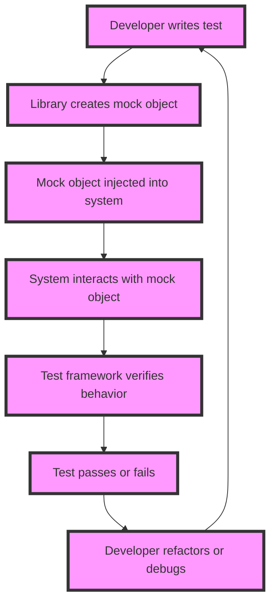

## Introduction
**Mocking** and **stubbing** are essential techniques in software testing, particularly when dealing with external API responses. These techniques allow developers to isolate dependencies and ensure that their code behaves as expected, even when the external APIs are not available or are unreliable. In this section, we will delve into the world of mocking and stubbing API responses, exploring why they matter, their real-world relevance, and the common pitfalls that engineers face when implementing these techniques.

Mocking and stubbing are crucial in ensuring the reliability and maintainability of software systems. By decoupling the system from external dependencies, developers can write more efficient and effective tests, reducing the likelihood of test failures and improving overall system stability. Moreover, mocking and stubbing enable developers to test their code in isolation, allowing them to identify and fix issues more quickly.

> **Note:** Mocking and stubbing are not the same thing, although they are often used interchangeably. **Mocking** refers to the process of creating a fake object that mimics the behavior of a real object, while **stubbing** refers to the process of replacing a real object with a fake one that returns pre-defined responses.

## Core Concepts
To understand mocking and stubbing, it's essential to grasp some key concepts:

* **Dependency injection**: This is a design pattern that allows components to be loosely coupled, making it easier to replace dependencies with mock or stub objects.
* **Mock objects**: These are fake objects that mimic the behavior of real objects, allowing developers to test their code in isolation.
* **Stub objects**: These are fake objects that return pre-defined responses, allowing developers to test their code with specific input scenarios.
* **Test doubles**: This is a general term that refers to mock or stub objects used in testing.

> **Warning:** Overusing mock objects can lead to **mockitis**, a condition where the test suite becomes overly complex and difficult to maintain.

## How It Works Internally
When a developer uses a mocking or stubbing library, the following steps occur:

1. The library creates a fake object that mimics the behavior of the real object.
2. The fake object is injected into the system, replacing the real object.
3. The system interacts with the fake object, which returns pre-defined responses or behaves according to the mock object's configuration.
4. The test framework verifies that the system behaves as expected, using assertions or other verification mechanisms.

The internal mechanics of mocking and stubbing libraries vary depending on the specific library and programming language. However, most libraries use a combination of **reflection**, **proxying**, and **interception** to create and manage fake objects.

## Code Examples
Here are three complete and runnable code examples that demonstrate basic, real-world, and advanced usage of mocking and stubbing:

### Example 1: Basic Mocking with Jest
```javascript
// user.js
class User {
  constructor(name) {
    this.name = name;
  }

  greet() {
    return `Hello, ${this.name}!`;
  }
}

// user.test.js
const User = require('./user');
const mockUser = jest.fn(() => ({ name: 'John Doe' }));

test('User greet', () => {
  const user = new User(mockUser());
  expect(user.greet()).toBe('Hello, John Doe!');
});
```

### Example 2: Real-World Stubbing with Pytest
```python
# user.py
class User:
    def __init__(self, name):
        self.name = name

    def greet(self):
        return f"Hello, {self.name}!"

# user_test.py
import pytest
from user import User

@pytest.fixture
def mock_user():
    return User(name="John Doe")

def test_user_greet(mock_user):
    assert mock_user.greet() == "Hello, John Doe!"
```

### Example 3: Advanced Mocking with Mockito
```java
// UserService.java
public class UserService {
    private final UserRepository userRepository;

    public UserService(UserRepository userRepository) {
        this.userRepository = userRepository;
    }

    public User getUser(Long id) {
        return userRepository.findById(id);
    }
}

// UserServiceTest.java
import org.junit.Test;
import org.junit.runner.RunWith;
import org.mockito.InjectMocks;
import org.mockito.Mock;
import org.mockito.junit.MockitoJUnitRunner;

import static org.junit.Assert.assertEquals;
import static org.mockito.Mockito.when;

@RunWith(MockitoJUnitRunner.class)
public class UserServiceTest {
    @Mock
    private UserRepository userRepository;

    @InjectMocks
    private UserService userService;

    @Test
    public void testGetUser() {
        // Arrange
        User user = new User(1L, "John Doe");
        when(userRepository.findById(1L)).thenReturn(user);

        // Act
        User result = userService.getUser(1L);

        // Assert
        assertEquals(user, result);
    }
}
```

## Visual Diagram

This diagram illustrates the process of mocking and stubbing, from the developer writing the test to the test framework verifying the behavior.

## Comparison
The following table compares different mocking and stubbing libraries:

| Library | Language | Time Complexity | Space Complexity | Pros | Cons |
| --- | --- | --- | --- | --- | --- |
| Jest | JavaScript | O(1) | O(n) | Easy to use, fast, and efficient | Limited support for advanced mocking scenarios |
| Pytest | Python | O(1) | O(n) | Flexible and customizable, supports advanced mocking scenarios | Steeper learning curve |
| Mockito | Java | O(1) | O(n) | Powerful and feature-rich, supports advanced mocking scenarios | Complex and verbose |

> **Tip:** When choosing a mocking and stubbing library, consider the language, time complexity, and space complexity, as well as the pros and cons of each library.

## Real-world Use Cases
Here are three real-world examples of mocking and stubbing:

1. **Netflix**: Netflix uses mocking and stubbing to test its microservices architecture, ensuring that each service behaves correctly in isolation and when interacting with other services.
2. **Amazon**: Amazon uses mocking and stubbing to test its e-commerce platform, simulating user interactions and testing the platform's behavior under various scenarios.
3. **Google**: Google uses mocking and stubbing to test its search engine, simulating user queries and testing the engine's behavior under various scenarios.

## Common Pitfalls
Here are four common pitfalls that engineers face when mocking and stubbing:

1. **Overusing mock objects**: This can lead to **mockitis**, making the test suite overly complex and difficult to maintain.
2. **Underusing mock objects**: This can lead to **integration testitis**, making the test suite overly dependent on external dependencies.
3. **Incorrectly configuring mock objects**: This can lead to **test flakiness**, making the test suite unreliable and prone to false positives.
4. **Not testing the mock objects**: This can lead to **mock object rot**, making the mock objects outdated and no longer representative of the real objects.

> **Warning:** Avoid these common pitfalls by using mock objects judiciously, configuring them correctly, and testing them thoroughly.

## Interview Tips
Here are three common interview questions related to mocking and stubbing, along with weak and strong answers:

1. **What is the difference between mocking and stubbing?**
	* Weak answer: "Mocking and stubbing are the same thing."
	* Strong answer: "Mocking refers to the process of creating a fake object that mimics the behavior of a real object, while stubbing refers to the process of replacing a real object with a fake one that returns pre-defined responses."
2. **How do you choose a mocking and stubbing library?**
	* Weak answer: "I choose the library that is most popular."
	* Strong answer: "I choose the library that best fits the needs of the project, considering factors such as language, time complexity, and space complexity, as well as the pros and cons of each library."
3. **How do you avoid common pitfalls when mocking and stubbing?**
	* Weak answer: "I just use mock objects and hope for the best."
	* Strong answer: "I use mock objects judiciously, configuring them correctly, and testing them thoroughly, avoiding common pitfalls such as overusing mock objects, underusing mock objects, incorrectly configuring mock objects, and not testing the mock objects."

## Key Takeaways
Here are ten key takeaways related to mocking and stubbing:

* **Mocking** refers to the process of creating a fake object that mimics the behavior of a real object.
* **Stubbing** refers to the process of replacing a real object with a fake one that returns pre-defined responses.
* **Test doubles** is a general term that refers to mock or stub objects used in testing.
* **Dependency injection** is a design pattern that allows components to be loosely coupled, making it easier to replace dependencies with mock or stub objects.
* **Mock objects** should be used judiciously, configuring them correctly, and testing them thoroughly.
* **Stub objects** should be used to test specific input scenarios.
* **Overusing mock objects** can lead to **mockitis**, making the test suite overly complex and difficult to maintain.
* **Underusing mock objects** can lead to **integration testitis**, making the test suite overly dependent on external dependencies.
* **Incorrectly configuring mock objects** can lead to **test flakiness**, making the test suite unreliable and prone to false positives.
* **Not testing the mock objects** can lead to **mock object rot**, making the mock objects outdated and no longer representative of the real objects.