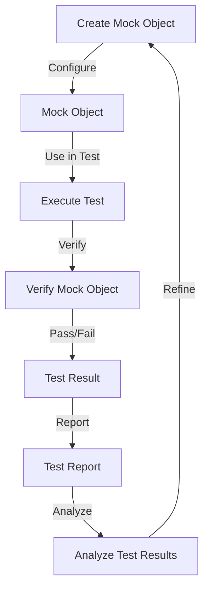

## Introduction
**Unit testing** is a crucial part of software development that ensures individual units of code, such as functions or methods, behave as expected. However, when testing complex systems, **mocking** is often necessary to isolate dependencies and make tests more efficient. Verifying unit test mocking is essential to ensure that the mock objects behave as expected and do not introduce false positives or negatives. In this section, we will discuss the importance of verifying unit test mocking, its real-world relevance, and why every engineer needs to know this.

> **Note:** Verifying unit test mocking is a critical step in ensuring the reliability and accuracy of unit tests. Without proper verification, mock objects can lead to false test results, making it challenging to identify and fix issues in the codebase.

## Core Concepts
To understand the concept of verifying unit test mocking, it is essential to grasp the following key terms:

* **Mock object**: A mock object is a simulated object that mimics the behavior of a real object, allowing developers to test the interactions between objects in isolation.
* **Mocking framework**: A mocking framework is a library or tool that provides a way to create and manage mock objects.
* **Verification**: Verification is the process of ensuring that the mock objects behave as expected and do not introduce false positives or negatives.

> **Tip:** When working with mock objects, it is essential to use a mocking framework to manage the creation and verification of mock objects. This helps to ensure that the mock objects are properly configured and behave as expected.

## How It Works Internally
When verifying unit test mocking, the following steps occur:

1. **Mock object creation**: The mocking framework creates a mock object that mimics the behavior of the real object.
2. **Mock object configuration**: The developer configures the mock object to behave as expected, such as specifying the return values or exceptions to throw.
3. **Test execution**: The test is executed, and the mock object is used in place of the real object.
4. **Verification**: The mocking framework verifies that the mock object was used as expected, such as checking the number of times a method was called or the arguments passed to a method.

> **Warning:** If the mock object is not properly configured or verified, it can lead to false test results, making it challenging to identify and fix issues in the codebase.

## Code Examples
Here are three complete and runnable code examples that demonstrate the verification of unit test mocking:

### Example 1: Basic Mocking
```java
import org.junit.Test;
import org.junit.runner.RunWith;
import org.mockito.InjectMocks;
import org.mockito.Mock;
import org.mockito.junit.MockitoJUnitRunner;

import static org.mockito.Mockito.verify;
import static org.mockito.Mockito.when;

@RunWith(MockitoJUnitRunner.class)
public class UserServiceTest {

    @Mock
    private UserRepository userRepository;

    @InjectMocks
    private UserService userService;

    @Test
    public void testGetUser() {
        // Configure the mock object
        when(userRepository.findById(1)).thenReturn(new User(1, "John Doe"));

        // Execute the test
        User user = userService.getUser(1);

        // Verify the mock object
        verify(userRepository).findById(1);
    }
}
```

### Example 2: Advanced Mocking
```python
import unittest
from unittest.mock import Mock

class UserService:
    def __init__(self, user_repository):
        self.user_repository = user_repository

    def get_user(self, user_id):
        return self.user_repository.find_by_id(user_id)

class TestUserService(unittest.TestCase):
    def test_get_user(self):
        # Create a mock object
        user_repository = Mock()

        # Configure the mock object
        user_repository.find_by_id.return_value = User(1, "John Doe")

        # Create the service
        user_service = UserService(user_repository)

        # Execute the test
        user = user_service.get_user(1)

        # Verify the mock object
        user_repository.find_by_id.assert_called_once_with(1)
```

### Example 3: Mocking with Multiple Dependencies
```typescript
import { TestBed } from '@angular/core/testing';
import { HttpClientTestingModule } from '@angular/common/http/testing';

import { UserService } from './user.service';
import { UserRepository } from './user.repository';

describe('UserService', () => {
    let userService: UserService;
    let userRepository: UserRepository;

    beforeEach(async () => {
        await TestBed.configureTestingModule({
            imports: [HttpClientTestingModule],
            providers: [UserService, UserRepository]
        });

        userService = TestBed.inject(UserService);
        userRepository = TestBed.inject(UserRepository);
    });

    it('should get user', () => {
        // Configure the mock object
        spyOn(userRepository, 'findById').and.returnValue(Promise.resolve(new User(1, 'John Doe')));

        // Execute the test
        userService.getUser(1).then(user => {
            expect(user).toEqual(new User(1, 'John Doe'));
        });

        // Verify the mock object
        expect(userRepository.findById).toHaveBeenCalledTimes(1);
        expect(userRepository.findById).toHaveBeenCalledWith(1);
    });
});
```

## Visual Diagram

The diagram above illustrates the process of verifying unit test mocking. It starts with creating a mock object, configuring it, using it in the test, verifying its behavior, and finally reporting and analyzing the test results.

> **Interview:** Can you explain the process of verifying unit test mocking and its importance in software development?

## Comparison
| Approach | Time Complexity | Space Complexity | Pros | Cons | Best For |
| --- | --- | --- | --- | --- | --- |
| Manual Mocking | O(n) | O(1) | Simple, flexible | Error-prone, time-consuming | Small projects, prototyping |
| Mocking Framework | O(1) | O(n) | Efficient, scalable | Steep learning curve, overhead | Large projects, enterprise applications |
| Service Virtualization | O(n) | O(n) | Realistic, accurate | Complex, expensive | Critical systems, high-stakes testing |
| Test-Driven Development | O(1) | O(1) | Fast, reliable | Difficult to adopt, requires discipline | Agile development, continuous integration |

## Real-world Use Cases
Here are three real-world use cases of verifying unit test mocking:

1. **Google**: Google uses mocking frameworks to verify the behavior of their APIs and services. By using mocking, they can ensure that their services are properly integrated and work as expected.
2. **Amazon**: Amazon uses service virtualization to test their critical systems. By simulating the behavior of their services, they can ensure that their systems are reliable and accurate.
3. **Microsoft**: Microsoft uses test-driven development to ensure that their software is reliable and works as expected. By writing tests before writing code, they can ensure that their software meets the required standards.

## Common Pitfalls
Here are four common pitfalls to avoid when verifying unit test mocking:

1. **Insufficient Configuration**: Failing to properly configure the mock object can lead to false test results.
```java
// Wrong
when(userRepository.findById(1)).thenReturn(null);

// Right
when(userRepository.findById(1)).thenReturn(new User(1, "John Doe"));
```
2. **Over-Mocking**: Over-mocking can lead to test fragility and make it challenging to maintain the tests.
```java
// Wrong
when(userRepository.findById(1)).thenReturn(new User(1, "John Doe"));
when(userRepository.findById(2)).thenReturn(new User(2, "Jane Doe"));

// Right
when(userRepository.findById(anyInt())).thenReturn(new User(anyInt(), anyString()));
```
3. **Under-Verification**: Failing to verify the mock object's behavior can lead to false test results.
```java
// Wrong
verify(userRepository).findById(1);

// Right
verify(userRepository, times(1)).findById(1);
```
4. **Mocking the Wrong Dependency**: Mocking the wrong dependency can lead to false test results and make it challenging to identify the issue.
```java
// Wrong
@Mock
private UserRepository userRepository;

// Right
@Mock
private UserService userService;
```

## Interview Tips
Here are three common interview questions related to verifying unit test mocking:

1. **What is the purpose of verifying unit test mocking?**
	* Weak answer: To ensure that the test passes.
	* Strong answer: To ensure that the mock object behaves as expected and does not introduce false positives or negatives.
2. **How do you verify the behavior of a mock object?**
	* Weak answer: By checking if the test passes.
	* Strong answer: By using a mocking framework to verify that the mock object was used as expected.
3. **What are some common pitfalls to avoid when verifying unit test mocking?**
	* Weak answer: Insufficient configuration, over-mocking.
	* Strong answer: Insufficient configuration, over-mocking, under-verification, mocking the wrong dependency.

## Key Takeaways
Here are ten key takeaways to remember when verifying unit test mocking:

* **Use a mocking framework** to manage the creation and verification of mock objects.
* **Configure the mock object** to behave as expected.
* **Verify the mock object's behavior** to ensure that it does not introduce false positives or negatives.
* **Avoid over-mocking** to prevent test fragility.
* **Avoid under-verification** to ensure that the mock object's behavior is properly verified.
* **Mock the correct dependency** to ensure that the test is accurate.
* **Use test-driven development** to ensure that the software is reliable and works as expected.
* **Use service virtualization** to test critical systems and ensure that they are reliable and accurate.
* **Continuously integrate and test** to ensure that the software is reliable and works as expected.
* **Monitor and analyze test results** to identify and fix issues in the codebase.