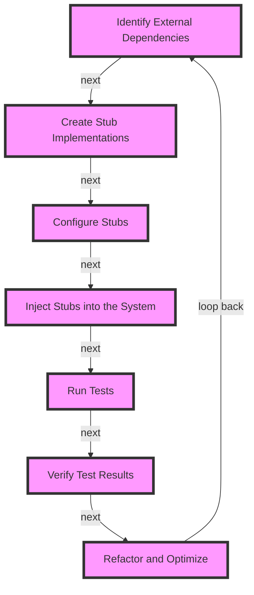

## Introduction
**Stubbing API responses** is a crucial technique in software testing, particularly for high-performance applications. It involves replacing external dependencies, such as API calls, with mock implementations to isolate the system under test. This approach enables developers to write efficient, reliable, and scalable tests, ensuring their application behaves as expected in various scenarios. In this section, we will delve into the world of stubbing API responses, exploring its importance, real-world relevance, and the benefits it brings to the testing process.

> **Note:** Stubbing API responses is essential for testing high-performance applications, as it allows developers to control the input and output of external dependencies, reducing the risk of flaky tests and improving overall test reliability.

In real-world scenarios, stubbing API responses is used by companies like **Netflix**, **Amazon**, and **Google** to test their complex systems. For instance, Netflix uses stubbing to test its content delivery network, ensuring that it can handle a large volume of requests without compromising performance.

## Core Concepts
To understand stubbing API responses, it's essential to grasp the following core concepts:

* **Stub**: A mock implementation of an external dependency, such as an API call.
* **Mock**: A fake object that mimics the behavior of a real object, used to isolate dependencies.
* **Test double**: A generic term for stubs, mocks, and other test substitutes.
* **Dependency injection**: A design pattern that allows components to be loosely coupled, making it easier to substitute dependencies with stubs or mocks.

> **Tip:** When using stubbing, it's crucial to keep the stubs simple and focused on the specific test scenario, avoiding over-engineering or introducing unnecessary complexity.

## How It Works Internally
Stubbing API responses involves several steps:

1. **Identify external dependencies**: Determine which API calls or external services need to be stubbed.
2. **Create stub implementations**: Write mock implementations for the identified dependencies, using a stubbing library or framework.
3. **Configure stubs**: Set up the stubs to return predefined responses, based on the test scenario.
4. **Inject stubs into the system**: Use dependency injection to replace the real dependencies with the stubs.
5. **Run tests**: Execute the tests, using the stubbed API responses to verify the system's behavior.

> **Warning:** When stubbing API responses, be cautious not to over-stub, as this can lead to tests that are too isolated and don't accurately reflect real-world behavior.

## Code Examples
Here are three complete, runnable examples of stubbing API responses:

### Example 1: Basic Stubbing with Jest
```javascript
// users.js
import axios from 'axios';

const getUsers = async () => {
  const response = await axios.get('https://api.example.com/users');
  return response.data;
};

export default getUsers;
```

```javascript
// users.test.js
import axios from 'axios';
import getUsers from './users';

jest.mock('axios');

describe('getUsers', () => {
  it('should return a list of users', async () => {
    const users = [{ id: 1, name: 'John Doe' }, { id: 2, name: 'Jane Doe' }];
    axios.get.mockResolvedValue({ data: users });

    const result = await getUsers();
    expect(result).toEqual(users);
  });
});
```

### Example 2: Stubbing with a Library (Sinon.js)
```javascript
// users.js
import axios from 'axios';

const getUsers = async () => {
  const response = await axios.get('https://api.example.com/users');
  return response.data;
};

export default getUsers;
```

```javascript
// users.test.js
import sinon from 'sinon';
import axios from 'axios';
import getUsers from './users';

describe('getUsers', () => {
  it('should return a list of users', async () => {
    const users = [{ id: 1, name: 'John Doe' }, { id: 2, name: 'Jane Doe' }];
    const stub = sinon.stub(axios, 'get').resolves({ data: users });

    const result = await getUsers();
    expect(result).toEqual(users);
    stub.restore();
  });
});
```

### Example 3: Advanced Stubbing with Multiple Scenarios
```javascript
// users.js
import axios from 'axios';

const getUsers = async () => {
  const response = await axios.get('https://api.example.com/users');
  return response.data;
};

const getUserById = async (id) => {
  const response = await axios.get(`https://api.example.com/users/${id}`);
  return response.data;
};

export { getUsers, getUserById };
```

```javascript
// users.test.js
import axios from 'axios';
import { getUsers, getUserById } from './users';

jest.mock('axios');

describe('users', () => {
  it('should return a list of users', async () => {
    const users = [{ id: 1, name: 'John Doe' }, { id: 2, name: 'Jane Doe' }];
    axios.get.mockResolvedValue({ data: users });

    const result = await getUsers();
    expect(result).toEqual(users);
  });

  it('should return a user by id', async () => {
    const user = { id: 1, name: 'John Doe' };
    axios.get.mockResolvedValue({ data: user });

    const result = await getUserById(1);
    expect(result).toEqual(user);
  });

  it('should handle errors', async () => {
    axios.get.mockRejectedValue(new Error('Network error'));

    await expect(getUsers()).rejects.toThrowError('Network error');
  });
});
```

## Visual Diagram

This diagram illustrates the process of stubbing API responses, from identifying external dependencies to verifying test results and refactoring the system.

## Comparison
| Approach | Time Complexity | Space Complexity | Pros | Cons | Best For |
| --- | --- | --- | --- | --- | --- |
| Manual Stubbing | O(1) | O(1) | Simple, flexible | Error-prone, time-consuming | Small-scale testing |
| Library-based Stubbing (e.g., Sinon.js) | O(n) | O(n) | Efficient, scalable | Steeper learning curve | Large-scale testing |
| Framework-based Stubbing (e.g., Jest) | O(n) | O(n) | Integrated, convenient | Limited flexibility | Integrated testing |
| Mocking Libraries (e.g., Mockk) | O(n) | O(n) | Powerful, feature-rich | Complex, verbose | Advanced testing |

## Real-world Use Cases
Here are three real-world examples of stubbing API responses:

1. **Netflix**: Netflix uses stubbing to test its content delivery network, ensuring that it can handle a large volume of requests without compromising performance.
2. **Amazon**: Amazon uses stubbing to test its e-commerce platform, simulating various scenarios, such as high traffic and network failures, to ensure the system's reliability and scalability.
3. **Google**: Google uses stubbing to test its search engine, simulating user queries and indexing processes to ensure the system's accuracy and performance.

## Common Pitfalls
Here are four common mistakes to avoid when stubbing API responses:

1. **Over-stubbing**: Stubbing too many dependencies can lead to tests that are too isolated and don't accurately reflect real-world behavior.
2. **Under-stubbing**: Failing to stub critical dependencies can lead to flaky tests and decreased test reliability.
3. **Incorrect stubbing**: Stubbing dependencies with incorrect or incomplete data can lead to false positives or false negatives.
4. **Stubbing dependencies with side effects**: Stubbing dependencies with side effects, such as database writes or network requests, can lead to unintended consequences and decreased test reliability.

> **Interview:** When asked about stubbing API responses in an interview, be prepared to discuss the benefits and challenges of stubbing, as well as your experience with different stubbing libraries and frameworks.

## Interview Tips
Here are three common interview questions related to stubbing API responses, along with weak and strong answer examples:

1. **What is stubbing, and how does it work?**
	* Weak answer: "Stubbing is a way to mock out dependencies, but I'm not sure how it works."
	* Strong answer: "Stubbing is a technique used to replace external dependencies with mock implementations, allowing us to isolate the system under test and ensure reliable and efficient testing. It works by creating stubs that mimic the behavior of the real dependencies, and then injecting those stubs into the system."
2. **How do you decide which dependencies to stub?**
	* Weak answer: "I stub all dependencies, just to be sure."
	* Strong answer: "I identify the critical dependencies that have a significant impact on the system's behavior and performance, and then stub those dependencies to ensure reliable and efficient testing. I also consider the trade-offs between stubbing and not stubbing, such as test complexity and maintainability."
3. **What are some common pitfalls to avoid when stubbing API responses?**
	* Weak answer: "I'm not sure, but I try to avoid stubbing too much."
	* Strong answer: "Some common pitfalls to avoid when stubbing API responses include over-stubbing, under-stubbing, incorrect stubbing, and stubbing dependencies with side effects. To avoid these pitfalls, I carefully consider the dependencies to stub, ensure accurate and complete stubbing data, and regularly review and refine my stubbing strategy."

## Key Takeaways
Here are ten key takeaways to remember when stubbing API responses:

* Stubbing is a technique used to replace external dependencies with mock implementations.
* Stubbing allows for reliable and efficient testing, reducing the risk of flaky tests and improving test reliability.
* Identify critical dependencies to stub, considering the trade-offs between stubbing and not stubbing.
* Use stubbing libraries and frameworks to simplify and streamline the stubbing process.
* Avoid over-stubbing, under-stubbing, incorrect stubbing, and stubbing dependencies with side effects.
* Regularly review and refine your stubbing strategy to ensure accurate and complete stubbing data.
* Consider the time and space complexity of stubbing, as well as the performance implications.
* Use mocking libraries and frameworks to create powerful and feature-rich stubs.
* Document your stubbing strategy and approach to ensure maintainability and scalability.
* Continuously monitor and evaluate the effectiveness of your stubbing approach, making adjustments as needed to ensure optimal testing outcomes.